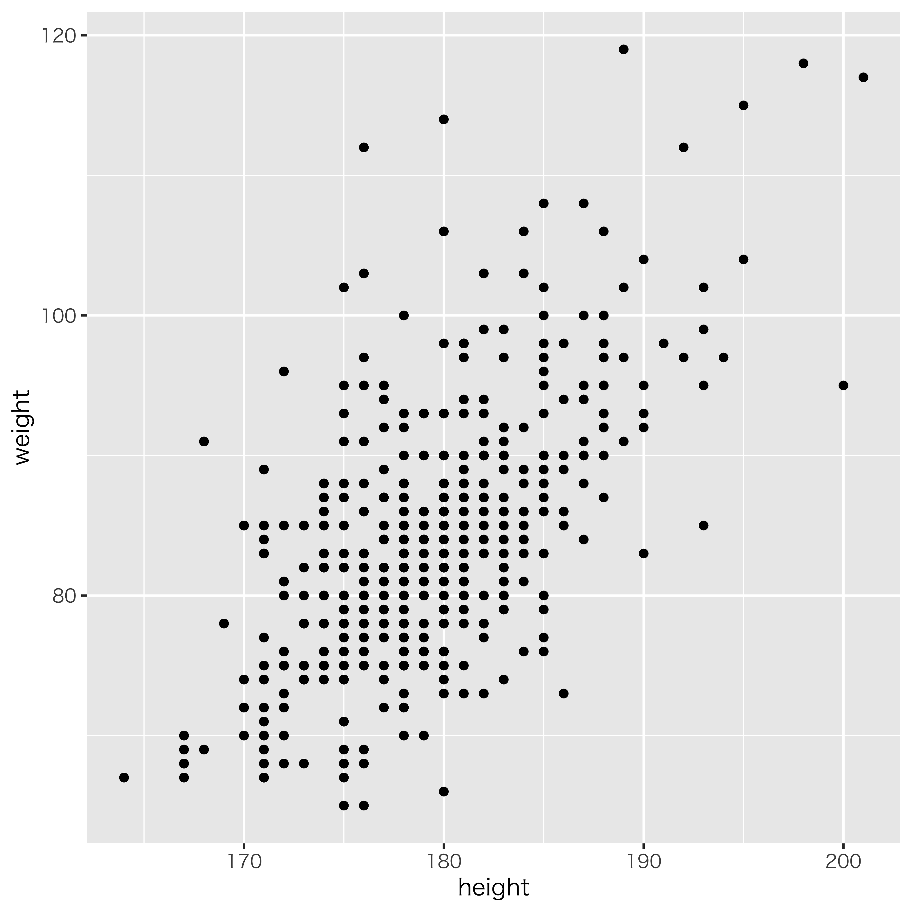
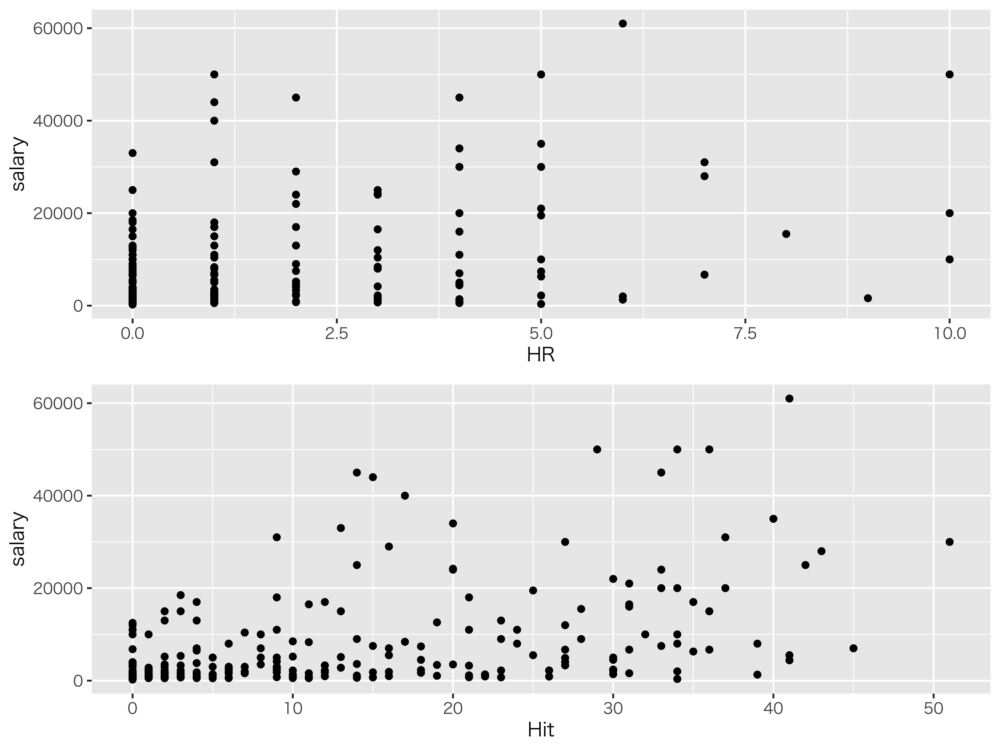

# Rをつかった回帰分析 {#chapter11}

さてここまでは，回帰分析や重回帰分析の仕組みを言葉で説明してきましたが，自分で計算できなければ絵に描いた餅です。重回帰分析の回帰係数を求める方法については特に説明してきませんでしたが，Rで計算する時は単回帰・重回帰の区別なく表現できるので，ここで一気に習得してしまいましょう。

## Rの環境再確認

第[\[chapter5\]](#chapter5){reference-type="ref"
reference="chapter5"}章でRの使い方について解説してきました。思い出しながら進めていきましょう。

### 環境の準備(確認)

まずは環境の準備です。既にRやRStudioのインストールは終わっているものとして話を進めます[^1]。

次の3つのステップをたどって，実行の準備をしてください。

##### RStudioの起動

RStudioを起動してください。パッケージのインストールをするときなど，管理人権限が必要になるケースがありますので，Windowsユーザは管理人として実行するようにしたほうが良いかもしれません。

##### プロジェクトを開く

プロジェクトは前回作成したもので結構です。前回と同じフォルダの中で，新しくスクリプトファイルを作っていくことにしましょう。メニューからプロジェクトを開くを選び(FIle$\to$Open
Project)，目的のフォルダのにある`.Rproj`ファイルを選択してください。それがプロジェクト情報を持っているファイルで，それを選択することでワーキングディレクトリが当該フォルダにセットされます。プロジェクトが開いたかどうかはRStudioの右上やメニューバーなどで，確認できます。

##### Rスクリプトを開く

今日のコードを書くためのRスクリプトファイルを準備します。File \> NewFile
\> R
Scriptと進み，何も書いてないRスクリプトの画面を表示させてください。真っ白いファイルが開いたら問題ありません。Rmdファイルで書き進めてもらっても結構です。

これでスクリプトのところにコードを書いていく準備ができました。

統計に関するデータは，手入力するのが嫌になる程度にはたくさんのデータがあるはずです。今回もデータをファイルから読み込んで使うことにします。ファイルから読み込むときに注意が必要なのが，テキストエンコードです。ASCIIデータを読み込みますが，エンコードが違うと文字化けが生じてしまいます[^2]。OSがWindowsで世界非標準のエンコードShift-JIS(CP-932)を使っている人は，世界標準のUTF-8を指定して読み込む必要があるかもしれません。

今回，第[\[chapter5\]](#chapter5){reference-type="ref"
reference="chapter5"}章の課題と同じ野球選手のデータを読み込んでみましょう。次の3行を実行してください。

``` {#code::11_01 .c++ language="c++" label="code::11_01" caption="環境の初期化とパッケージ，ファイルの読み込み"}
rm(list=ls())
    library(tidyverse)
    dat <- read_csv("baseball2020.csv",na="NA")
    summary(dat)
```

##### コード解説

1行目

:   環境Environmentを初期化するコードです。Rmd形式で書いている人はこの行は書かないようにしてください[^3]。

2行目

:   `tidyverse`パッケージを読み込んでいます。このパッケージはファイルの読み込みや並べ替え操作など，便利な機能がまとめられたものです。

3行目

:   `baseball2020.csv`というファイルを読み込んでいます。このファイルがプロジェクトフォルダ内にあることを確認してから実行してください。文字化けが生じるようでしたら，`locale=locale(encoding=”utf8")`をオプションとして追加すると良いでしょう。

4行目

:   読み込んだデータの記述統計量など，基本的な要約を行っています。

### 散布図の描画

データが手に入ったとき，最初にすることは可視化です。**データは図にする**という約束は忘れないでくださいね。
今回は様々な変数があるのですが，ここで打者の身長と体重のデータだけ抜き出して図にしてみたいと思います。

``` {#code::11_02 .c++ language="c++" label="code::11_02" caption="環境の初期化とパッケージ，ファイルの読み込み"}
batter <- dat %>%
  dplyr::filter(position != "投手") %>%
  dplyr::select(height, weight)
g <- ggplot(batter, aes(x = height, y = weight))
g <-  g + geom_point()
g
```

##### コード解説

1-3行目

:   `batter`というオブジェクトを作っています。これは`dat`オブジェクトを加工して作るのですが，詳しくはこの後で説明します。

4行目

:   `batter`オブジェクトを使って，x軸を`height`変数，y軸を`weight`変数をするキャンパスを指定します。

5行目

:   キャンパスに点を打つように`geom_point`します。

6行目

:   描画オブジェクト`g`を表示します。

結果的に図[1.1](#fig::11_01){reference-type="ref"
reference="fig::11_01"}のような図ができていればOKです。

{#fig::11_01
width="8cm"}

さて1-3行目の操作ですが，ここでやりたかったことは`dat`オブジェクトの中から打者のデータに限って，身長と体重の変数を抜き出すことでした。
これらの操作は`tidyverse`パッケージに含まれる`dplyr`パッケージの`filter`関数と`select`関数で実装されます。この両者の違いは，抜き出す方向の違いです。
`filter`関数は，データ全体にフィルタをかけて，該当するレコード(オブザベーション，ケース，個人)を抜き出します。言い換えれば行の選択なのです。
ある変数について条件に該当すれば，そのデータは抜き出すというのがこの関数の仕事であり，今回は`position!="投手"`という条件で抜き出しています。ここで`!=`という記号が出てきましたが，これは$\neq$の意味です。$\neq$が入力できないので，`!`で否定を表すようになっているのですね。逆にこの条件に合致していれば，という場合は`==`とイコールを重ねて使います。イコールが1つしかなければ，Rは代入せよという意味，すなわち`<-`と同じ意味に解釈してしまうのです[^4]ちなみに，このデータは投手のデータと野手のデータが含まれており，`position`は守備位置を表しますから，野手のデータは捕手か内野手か外野手ということになります。あるいは投手でないのが野手です。後者の条件のほうが簡単なのでこのようにしています。

`select`関数は，該当する変数だけ抜き出したいときに使います。今回は身長`height`と体重`weight`が欲しかったのでその2つを書いています。
この関数の抜き出し方は，言い換えれば列方向の抜き出しです。`filter`と`select`の違いをしっかり理解しておいてください(図[1.2](#fig::11_02){reference-type="ref"
reference="fig::11_02"})

{#fig::11_02
width="12cm"}

このコードにはさらに重要なポイントがあります。ひとつはパイプ演算子`%>%`です。これは前のオブジェクトを後の関数の第一引数に渡す，という意味があります。例えば，$y=f(x)$という変換をし，さらに$z=g(y)$という変換をしたい場合，頭の中では$x\to y \to z$と考えていると思いますが，コードで書くと$y \leftarrow x$で$z \leftarrow y$という逆の向きで考えなければなりません。あるいは$z=g(f(x))$と内側にくり入れていくので，見た目にわかりにくくなります。この思考の流れに沿った変換にするようにつなげるのが
`%>%`
です。ここでは`dat`オブジェクトを`filter`に渡し，行を選択したものをさらに渡して`select`で列選択，という処理をしています。それを最後に`batter`に代入する(`<-`)わけですね。

また，`filter`や`select`には`dplyr::`という記号が前についています。これは`dplyr`パッケージの`filter`関数，`select`関数を使ってくださいね，というパッケージ名の指定を行っているところです。`filter`や`select`といった関数名は非常に一般的ですから，他のパッケージが使っていて関数名が重複してしまう可能性があります。実際`select`関数はよく重複するのです。それを避けるための措置だと思ってください。

前置きが長くなりました。ともかくこれで欲しいデータの散布図が書け，どうやら正の相関がありそうだということがわかりました。
直線関係を仮定しても良さそうです。ちなみに次のコードを書くと`ggplot`で直線を書くことができますよ。

``` {#code::11_03 .c++ language="c++" label="code::11_03" caption="回帰線を引く"}
g <- g + geom_smooth(method = "lm", se = FALSE)
g
```

##### コード解説

1行目

:   散布図を書いているオブジェクト`g`にスムージング関数`geom_smooth`でデータにスムーズな線を引く。線の引き方は`lm`すなわち。

2行目

:   オブジェクト`g`の描画

## 線形回帰の実行

それではここから回帰分析を行います。回帰分析は線形関数を当てはめるのでと呼ばれますが，これの頭文字をとった`lm`関数が線形回帰モデルです。次の`code::[code::11_04]`を実行してみましょう。

``` {#code::11_04 .c++ language="c++" label="code::11_04" caption="回帰分析の実行"}
result <- lm(weight ~ height, data= batter)
    summary(result)
```

##### コード解説

1行目

:   `lm`関数に回帰式とデータを入れて分析を実行し，その結果を`result`オブジェクトに代入する。ちなみに`~`はチルダといいます[^5]。

2行目

:   分析結果の要約を出力させる。

ここで重要なのは，1行目の回帰式の表現です。Rでは$y\sim x$という書き方で，$y=f(x)$を表現します。これは回帰式に限らず，一般的に従属変数$y$と独立変数$x$の関係を$\sim$でつなげる，というの書き方なのです。今回は`lm`という関数を使って表現しましたが，線形モデルではない関数で独立変数，従属変数の関係を書く時も`y ~ x`で表現します。この表記に慣れると，あの分析もこの分析も，形としては$y=f(x)$なんだな，ということがわかりやすくていいですね。今回は，体重を身長で予測したということになっています。

この分析の出力結果が出力[\[RS:out11_01\]](#RS:out11_01){reference-type="ref"
reference="RS:out11_01"}の通りです。

::: Rscreen
回帰分析の出力結果out11_01

    Call:
    lm(formula = weight ~ height, data = batter)

    Residuals:
         Min       1Q   Median       3Q      Max 
    -18.7539  -4.5315  -0.6586   3.4208  31.3732 

    Coefficients:
                  Estimate Std. Error t value Pr(>|t|)    
    (Intercept) -100.96483   11.01370  -9.167   <2e-16 ***
    height         1.03177    0.06135  16.818   <2e-16 ***
    ---
    Signif. codes:  0 ‘***’ 0.001 ‘**’ 0.01 ‘*’ 0.05 ‘.’ 0.1 ‘ ’ 1

    Residual standard error: 7.214 on 453 degrees of freedom
    Multiple R-squared:  0.3844,    Adjusted R-squared:  0.383 
    F-statistic: 282.9 on 1 and 453 DF,  p-value: < 2.2e-16
:::

何やら色々出ていますが，順に確認していきましょう。まず`Residuals`とありますが，ここは残差$e_i$の記述統計情報を表しています。どれぐらい残差が大きく出るのか，確認すると良いでしょう。
次の`Coefficientes`は係数という意味です。ここに回帰係数が出ています。少しみにくいかもしれませんが，表形式になっていて，`Estimate`と書かれたところが推定値，今回知りたい回帰係数の値になっています。
回帰式は次のようになります。

$$\hat{y} = -100.96483 + 1.03177 \times height$$

どの数字が結果の何に対応しているか確認しておいてください。また，この式が得られたということは身長のところに新しい数字を入れると体重の予測ができるということもわかってもらえると思います。

その他にもいろいろな情報が出ていますが，その内容は後期でお話しする推測統計に関するところですので，今のところはまだ知らなくてOKです[^6]。
それよりも大事なのは下から二行目にある，`Multiple R-squared`というところです。これがいわゆる$R^2$値であり，モデルのを表しています。今回は$R^2=0.3844$ですから，予測値$\hat{y}$と従属変数$y$の相関係数が0.62ぐらい，分散説明率が38.4%
ぐらいだったということがわかります。悪い当てはまとしては，やや悪いといったところでしょうか。

## 残差からわかること

今回の`lm`関数から返される結果を格納したオブジェクトの中には，他にも予測値$\hat{y_i}$や残差$e_i$といった情報が含まれています。それらが架空の値ではなく，算出されたここの値であるということを確認するために，表示させてみましょう。

``` {#code::11_05 .c++ language="c++" label="code::11_05" caption="回帰分析のその他の情報"}
batter <- batter %>% 
    dplyr::mutate(residuals = result$residuals,
                    yhat = result$fitted.values) 
batter
summary(batter)
plot(batter)
cor(batter)
```

##### コード解説

1-3行目

:   `batter`オブジェクトに`batter`オブジェクトを加工したものを上書きしていきます。加工内容は，`dplyr`パッケージの`mutate`関数を使って変数を追加することです。追加する変数名は`residuals`と`yhat`で，`residuals`には`result`オブジェクトの`residuals`変数を，`yhat`には`result`オブジェクトの`fitted.values`変数をあてがっています。

4行目

:   上書きされた`batter`オブジェクトを表示させています。長くなりますので，上の方の一部分だけが表示されます。

5行目

:   上書きされた`batter`オブジェクトの要約統計量を表示させています。

6行目

:   `batter`オブジェクトのプロットを描いています。

7行目

:   `batter`オブジェクトの相関係数を計算しています。

回帰分析の結果を代入したオブジェクト`result`には，`residuals`変数として残差が含まれています。同じく`fitted.values`変数として予測値が含まれています。4行目の出力結果の一部を見てみましょう(出力[\[RS:out11_02\]](#RS:out11_02){reference-type="ref"
reference="RS:out11_02"})。

::: Rscreen
回帰分析の出力結果out11_02

    # A tibble: 455 x 4
       height weight residuals  yhat
        <dbl>  <dbl>     <dbl> <dbl>
     1    170     72     -2.44  74.4
     2    175     74     -5.60  79.6
     3    181     98     12.2   85.8
     4    171     84      8.53  75.5
:::

これを見ると，例えば1行目のデータは身長170cm体重71kgの選手であり，回帰式$-100.96483 + 1.03177\times height$を使った計算結果は74.4ということがわかります。73.5という予測値$\hat{y_1}$は，実際の値$y_1$と比べて2.44ずれていますので，$\hat{y_1}-y_1$で-2.44となっています。以下同様で，451人分のデータそれぞれについて予測値と残差が計算できました。

またプロットを見てみましょう。これは`ggplot`を使っての出力ではなくRオリジナルの出力例ですが(そのせいか少し色気のない出力ですが)，これを見て幾つか気づく点があると思います。
1つは`height`と`yhat`の組み合わせが直線になっているところですね。次の`cor`関数でも，対応するところが1.0になっています。これは当然で，身長データを伸ばしてずらしたのが予測値であり，この両者はいわば一対一対応，100%の相関関係にあることがわかります。また，説明変数`height`と残差`residuals`の組み合わせは丸に近く，相関係数はほぼ0.0です[^7]。説明変数と残差の間に相関関係があるというのは，原理的におかしなことですよね。説明変数は従属変数をできるだけ説明しようとしていて，その残りが残差なのですから，残差のところに説明変数と関係する要素があるとすれば，それは残差ではなく従属変数のまだ説明できる箇所だということになってしまうからです。

同様に，残差`residuals`と予測値`yhat`の相関関係もほぼ0.0になっています。これも原理的には$0.0$になるのです。回帰分析は説明変数によって，説明できる部分(予測値)と説明できない部分(残差)にきっちり分離するのですから，分離されたもの同士に関係が残っているはずがないのです。数理的な導出は@kosugi2018のP.127--135を見て貰えばわかりますが，データを見ることで一目瞭然だと思います。

## 重回帰分析

では続いて重回帰分析に行きましょう。Rにおいて重回帰分析を行う時は，説明項を1つ追加するだけでいいので，作業としては簡単なものです。ただし結果の解釈には注意が必要であることを忘れずに。

``` {#code::11_06 .c++ language="c++" label="code::11_06" caption="重回帰分析のデータを作って可視化"}
batter2 <- dat %>%
    dplyr::filter(position != "投手") %>%
    dplyr::select(HR, Hit, salary) %>%
    na.omit()
g1 <- ggplot(batter2, aes(x = HR, y = salary)) +
    geom_point()
g1
g2 <- ggplot(batter2, aes(x = Hit, y = salary)) +
    geom_point()
g2
cor(batter2)
```

##### コード解説

1-4行目

:   `batter2`というオブジェクトを作っています。これは`dat`オブジェクトを加工して作っており，2行目で野手(投手でない人)を選択し，3行目で変数として本塁打，安打，salaryを選択しています。4行目は欠損値を一括で取り除く処理をしています。ホームランを打っていない人などはデータに含められないからです。

5-7行目

:   x軸に本塁打の数，y軸に年俸(`salary`)をとった散布図を書いています。

8-10行目

:   x軸に安打の数，y軸に年俸(`salary`)をとった散布図を書いています。

11行目

:   データの相関関係を数字でみています。

プロットを見ると，ホームランの数や安打の数が増えるほど，年俸は上がっているようです(図[1.3](#fig::11_03){reference-type="ref"
reference="fig::11_03"})。さすがプロ野球は実力勝負の世界，グランドには銭が埋まっているというやつです。少しデータの左端の方，つまりホームランや安打を打たない人が数多くいるため，よく打つ人に引っ張られて相関係数が大きく出ている可能性はありますし，安打と本塁打の間にも相関があるので少し気になりますが，ひとまずはこれで分析することにしましょう。

{#fig::11_03
width="12cm"}

回帰分析のコード`code::[code::11_07]`と出力[\[RS:out11_03\]](#RS:out11_03){reference-type="ref"
reference="RS:out11_03"})は次の通りです。

``` {#code::11_07 .c++ language="c++" label="code::11_07" caption="重回帰分析の実行"}
result2 <- lm(salary ~ HR + Hit, data = batter2)
summary(result2)
```

::: Rscreen
回帰分析の出力結果out11_03

    Call:
    lm(formula = salary ~ HR + Hit, data = batter2)

    Residuals:
       Min     1Q Median     3Q    Max 
    -18382  -3361  -1449    919  41198 

    Coefficients:
                Estimate Std. Error t value Pr(>|t|)    
    (Intercept)   2144.8      729.5   2.940  0.00356 ** 
    HR             741.0      361.3   2.051  0.04120 *  
    Hit            300.2       57.4   5.231 3.34e-07 ***
    ---
    Signif. codes:  0 ‘***’ 0.001 ‘**’ 0.01 ‘*’ 0.05 ‘.’ 0.1 ‘ ’ 1

    Residual standard error: 8855 on 276 degrees of freedom
    Multiple R-squared:  0.2596,    Adjusted R-squared:  0.2542 
    F-statistic: 48.39 on 2 and 276 DF,  p-value: < 2.2e-16
:::

結果の読み取りはよろしいでしょうか。重回帰式は次のようになります。係数をどこから読み取るか，確認してくださいね。
$$\hat{y} = 2144.8 + 741.0 \times HR + 300.2 \times Hit$$

これをみると，安打の数が同じくらいであれば，ホームラン一本につき740万円年俸が上昇するようです。また本塁打の数が同じぐらいであれば，ヒット一本で300万円年俸が上昇します。
またこのモデルの$R^2$は$0.2596$ですから，予測モデルは全体の26%ぐらいしか説明できておらず，あまり良いモデルとは言えないということがわかりました。

ヒットも本塁打も単位は「本」ですので，解釈も同じようにできて簡単かもしれません。あるいはヒットと本塁打は意味が違う，というのであれば直接の比較はおかしいことになります。
ここでは後者の可能性を考えて，変数同士の単位が違うから標準化しよう，という方向で分析を進めたいと思います。

データセットの各変数を標準化する必要がありますが，それには`scale`関数を使います。

``` {#code::11_07 .c++ language="c++" label="code::11_07" caption="標準化したデータで重回帰分析を実行"}
batter2z <- scale(batter2) %>% as.data.frame()
summary(batter2z)
result2z <- lm(salary ~ HR + Hit, data = batter2z)
summary(result2z)
```

##### コード解説

1行目

:   `batter2z`というオブジェクトを作っています。これは`batter2`オブジェクトを`scale`関数で標準化することで作れるのですが，`scale`関数は出来上がったものがデータを表す`data.frame`型になっていませんので，`%>%`でつないで`as.data.frame`という関数でデータの形にしています。

2行目

:   出来上がった`batter2z`というオブジェクトの記述統計量をみています。平均値が0.0になっていることなどから，標準化されていることが確認できます。

3行目

:   `batter2z`オブジェクトで同じように重回帰分析をしています。

11行目

:   結果を出力させています。

::: Rscreen
回帰分析の出力結果out11_04

    Call:
    lm(formula = salary ~ HR + Hit, data = batter2z)

    Residuals:
        Min      1Q  Median      3Q     Max 
    -1.7926 -0.3278 -0.1413  0.0896  4.0177 

    Coefficients:
                 Estimate Std. Error t value Pr(>|t|)    
    (Intercept) 2.790e-17  5.170e-02   0.000   1.0000    
    HR          1.525e-01  7.435e-02   2.051   0.0412 *  
    Hit         3.889e-01  7.435e-02   5.231 3.34e-07 ***
    ---
    Signif. codes:  0 ‘***’ 0.001 ‘**’ 0.01 ‘*’ 0.05 ‘.’ 0.1 ‘ ’ 1

    Residual standard error: 0.8636 on 276 degrees of freedom
    Multiple R-squared:  0.2596,    Adjusted R-squared:  0.2542 
    F-statistic: 48.39 on 2 and 276 DF,  p-value: < 2.2e-16
:::

結果を見てみましょう(出力[\[RS:out11_04\]](#RS:out11_04){reference-type="ref"
reference="RS:out11_04"}))。推定値の読み方，わかるでしょうか。ここにも$e-01$なんて表示があるのですが，これは$10^{-1}=\frac{1}{10}=0.1$と同じ意味です。標準化した回帰分析の結果は次の通りです。

$$\hat{y} = 0.1525 HR + 0.3889 Hit$$

これを見比べると，ホームランよりもヒットのほうが年俸の上昇には強い影響を与えているようですね。
ここでの回帰式では切片を記入しませんでした。推定値は$2.790e-17$であり，これは$e-17=10^{-17}$がかけられていますからほぼゼロになっています。原理的にも$0$であるはずなので，ここでは書きませんでした。
また$R^2$が標準化しなかったときと変わっていないことも確認できますね。相対的な関係には影響しないので，このようになります。

計算自体は一瞬でできることがわかりましたね。でも計算ができた時に，何をやっていたのかわからないとか，何のためにやっていたのかわからない，ということでは意味がありません。またもちろん，結果の読み取り方が間違っていてもいけませんし，この結果から何が言えるだろうか，と考えることで初めて研究が始まるのです。「やった，できた」だけではなく，「なぜ，どうやって，どういう意味か」と考えを深めるためのツールとして，統計技術を使い倒してみてください。

## 課題

課題はRmdファイルで提出していただきます。提出するファイル名には学籍番号を含めてください。

Rチャンクの中に，必要な計算式を記入してください。
Rチャンクの外に，結果の読み取りや解釈を，言葉で記述してください。

### 課題

次のデータ(表[1.1](#tbl::ex11_01){reference-type="ref"
reference="tbl::ex11_01"})は，向ヶ丘駅周辺の家賃について調べたもので，部屋の広さ(`heibei`，単位$m^2$)と，築年数(`chiku`)，駅から徒歩何分かかるか(`ekitoho`)，家賃(`yachin`)からなるものです[^8]。
なおこのデータは`yachin.csv`として配布しています。

::: {#tbl::ex11_01}
    heibei   chiku   ekitoho   yachin
  -------- ------- --------- --------
     41.40      14        10     8.60
     20.28      16         9     6.10
     18.20      28        10     4.20
     19.87      16        13     5.70
     20.28      19         7     6.30
     23.18      20        14     5.40
     19.87      17        12     6.25
     19.87      20        17     5.80

  : 家賃相場
:::

[\[tbl::ex11_01\]]{#tbl::ex11_01 label="tbl::ex11_01"}

##### 課題

家賃を従属変数，平米を説明変数とした回帰分析を行い，回帰式を求めてください。

##### 課題

15平米で家賃6万円の物件を新たに見つけました。この物件はこのデータに照らし合わせて，お得な物件だと言えるでしょうか。データに基づいて判断してください。

##### 課題

家賃を従属変数，平米と築年数を説明変数とした重回帰分析を行い，回帰式を求めてください。

##### 課題

家賃を従属変数，平米と築年数と駅からの距離を説明変数とした重回帰分析を行い，回帰式を求めてください。

##### 課題

ある従属変数に対して，説明変数Aだけの単回帰分析をした時(これをmodel1とします)，説明変数AとBを用いた重回帰分析を行なった時(これをmodel2とします)，説明変数A,B,Cを用いた重回帰分析を行なった時(model3)をそれぞれ比べると，モデルの適合度が一番良いのはどのモデルになるでしょうか。またそれはなぜそうなるのか，考察してください。

[^1]: まだだよー！という人は[\[chapter5\]](#chapter5){reference-type="ref"
    reference="chapter5"}章に戻って追いついてきてください。ネットでRStudio
    インストールといったキーワードで検索すると，親切にも案内してくれているサイトに色々出会えるでしょう。

[^2]: なんのことかわからない，という人は第[\[chapter2\]](#chapter2){reference-type="ref"
    reference="chapter2"}章を参照してください。

[^3]: Rmdファイルはそのまま使うのではなく，出力ファイル形式に`knit`して使います。
    その際必ず環境情報は初期化されるので書く必要がなく，むしろ書いてあると
    `knit` するファイルの情報なども消してしまうので `knit`
    できなくなるのです。

[^4]: 実は普段から，`dat=read_csv(***)`のように書いても良かったのですが，いわゆる等式を表す記号と混乱するのでここでは`<-`にしていました。

[^5]: 日本語キー配列の場合，「ほ」の右，アットマークの上にある「へ」のキーをShiftを押しながら押すと出ます。USキー配列の場合はtabキーの上にあります。

[^6]: それでも少し解説しておきます。まず推定値というのは今回のデータから得られる値ではなく，このデータが大きな母集団から撮られた標本だと考えたときに，標本のデータから母集団の関係を推測するならこの値になる，という意味があるからです。今回のデータについての最小二乗法での答えが欲しいのですから，標本から推定するのではなく，標本の特徴を考えてればいいじゃない，と思うかもしれません。いやほんとその通りなので，今はまだ説明しないのです。幸い，最小二乗法で求めた回帰係数の値と，推定法(ここでは最尤法という方法を使っていますが)による答えが一致しますから，悩まなくてもいいのですが。また，今回の標本ではなく別の標本だった場合，この推定値がどれぐらい違う値になる可能性があったかを計算して出しています。それが`Std.Error`のところです。それを踏まえて考えると，回帰係数が0，すなわち説明変数が全く予測しないという状態になる可能性がどれぐらいあるか，というのを検証しているのが`t value`や`Pr(>|t|)`のところで，これをみながら今回の分析から何が言えるかを結論づけたりするわけです。

[^7]: いやいや，何か数字があるよとツッコミが入りそうですね。計算結果のところには$6.578896e-16$という表示があるかと思います。この表現は，桁数があまりにも大きいので普通の十進法で表現できなかった場合に出てくるもので，$e+$のところが10の累乗を表しています。今回は$e-16$ですから，$10^{-16}=0.00000000000000001$というごく小さな値を，$6.578896$にかけた値が答えとなっています。数学的にはちょうど$0.0$になることが証明できるのですが，機械の計算は丸め誤差などがあるので少しずれが生じます。が実質的にゼロだということです。

[^8]: 2019年5月に実際に賃貸住宅サイトを利用して調べたものです。
