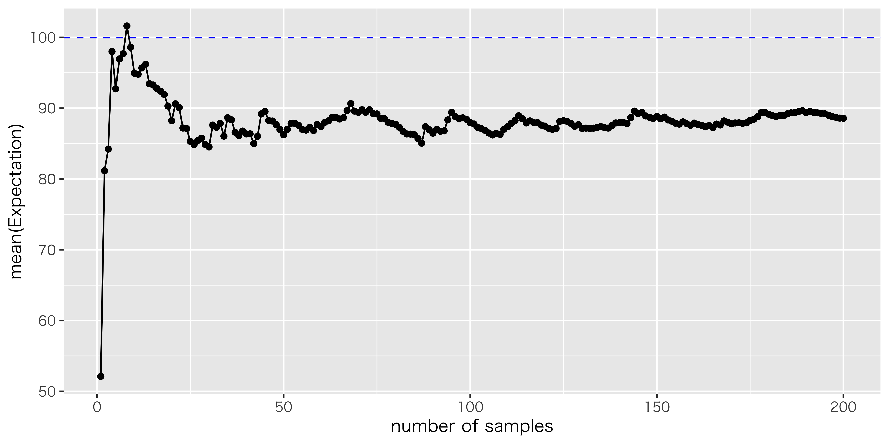
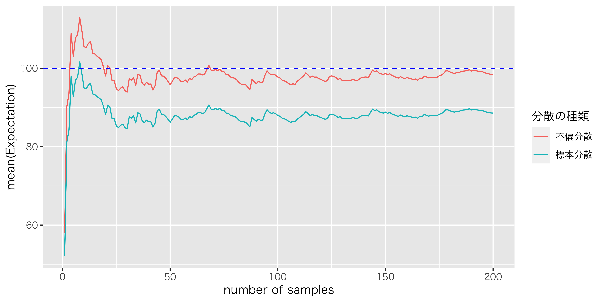
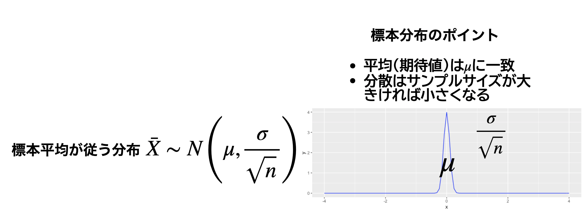
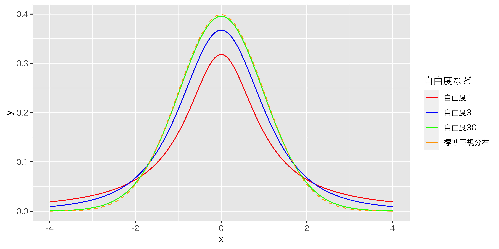
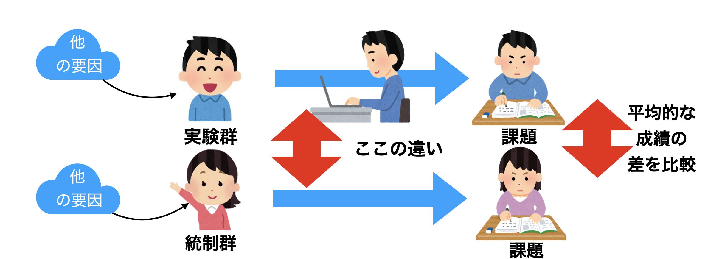
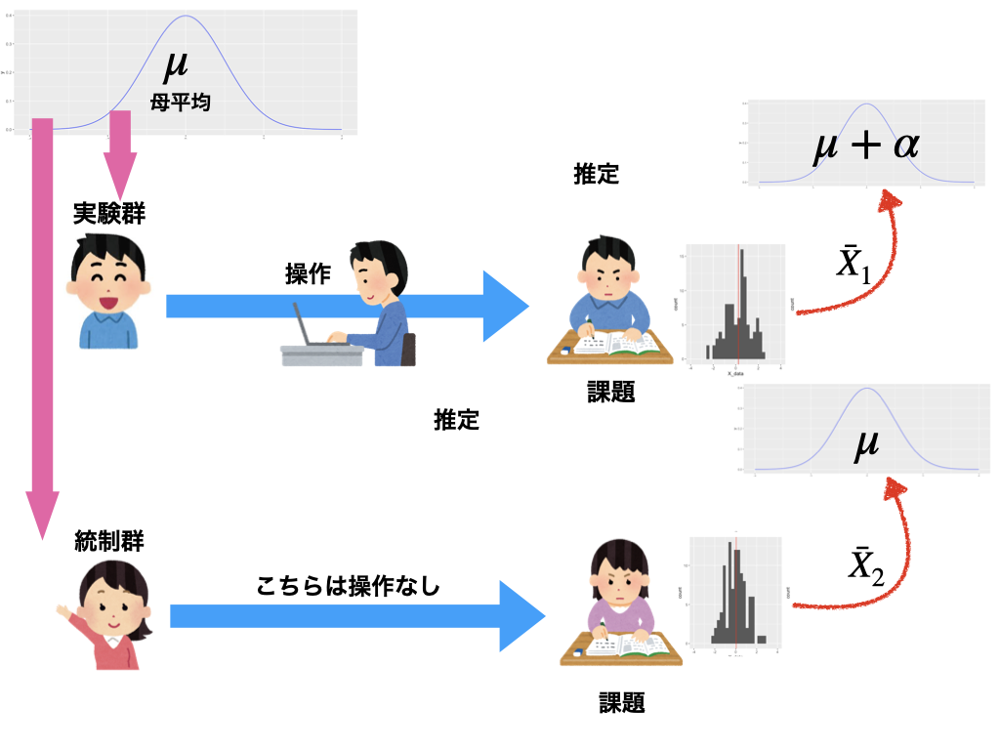
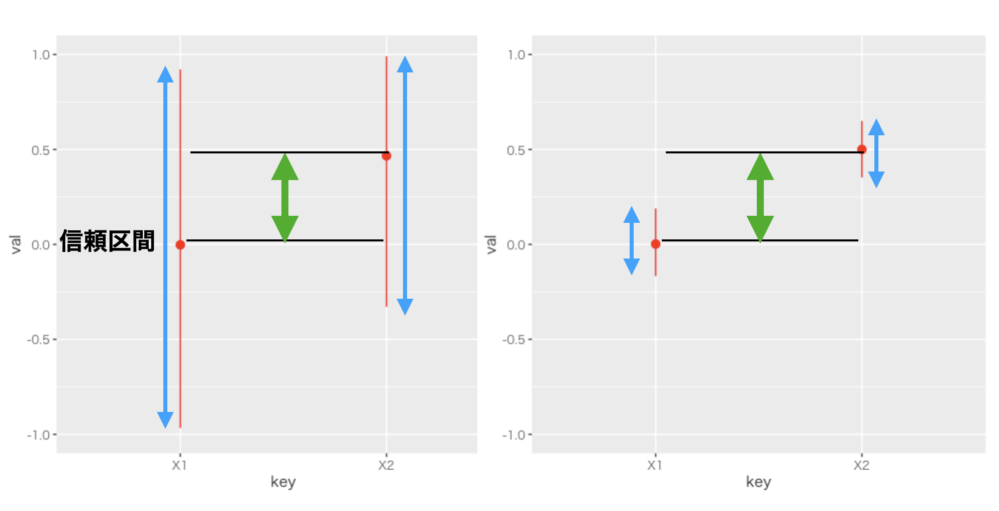

# 推論と判断 {#chapter17}

前回は「モーメント法」という，標本の記述統計量をつかって母数を推定する方法をお話ししました。
さて今回は，この話の続きをしていきましょう。どうやって母数を推定していくかについて，心理学でよく使われる正規分布を例に話を進めていきます。
また，心理学の目的としては「母数がどういう数字だったか」ということよりも，相対的な比較によって考えることがあります。この考え方は，ひいてはモデル比較という話になっていきます。

## 不偏推定量

ここまでの話で，標本平均の平均が母平均に一致し，そのばらつきもわかるのですから，標本から母集団を推測できそうだ，ということが見えてきましたかと思います。標本平均は多少のズレを含んでいるかもしれませんが，母平均の推定値として使うことができそうです。3 人学校の身長の例で言えば，母平均も 173cm ぐらいかもしれない，という予測ができそうだということですね。もちろん，サンプルサイズが小さいので，173$\pm$何センチかのズレはありそうですが。

ところで，「母平均の推定値は XXX だ！」と一点張りで推定することをといいます。ただ，これはなかなかのギャンブルで，正解(母平均)近くにはあるかもしれませんが，正解そのものにピタリと当たることはなさそうです。とくに連続変数の場合は，小数点下何桁までぴったりと当たる，というのはほぼなさそうですから。そこで，「何センチかのズレ」を予測に盛り込むことが考えられます。これがです。母平均は 173cm だ，と言い切ってしまうのではなくて，160cm から 180cm の間に入ってるんじゃないの，というような予測の仕方をするのです。こうすると，外れる可能性は低くなります。ただ，0cm 以上 500cm 未満だったら 100%当てられるぜ，という推定は何も推定していないことと実質同じですから，どれぐらいの幅で，どれぐらいの確率で・・・ということを考える必要があります。たとえば，173cm$\pm$`<!-- -->`{=html}5cm の区間に入ってる確率が 95%，といった具合に。

このように婉曲的な，少し保険をかけた推定の仕方はうまくいきそうですが，まだ問題が残っています。この幅を表現するためには，標本平均がどれぐらいブレるのか，その幅を推定しなければなりません。そう，標準誤差が必要なのです。ただこの標本平均のばらつき(標準誤差)は母分散によるので，母分散がどれぐらいになるのかを考えなければなりません。

母分散の推定値として，平均の時と同じように，標本分散をあてがうというのは 1 つのアイデアです。ですが，残念ながらこの方法だとうまく推定できません。図[1.1](#fig::16_5){reference-type="ref"
reference="fig::16_5"}をみてください。

{#fig::16_5
height="8cm"}

これは標本平均の時と同様に，サンプルサイズ 10 のサンプリングを 200 回繰り返し，標本分散の平均を順次とって行ったものです。これをみると・・・あれあれ，真値(母分散$\sigma^2$)の青いラインの，下側に収束して行ってるようですね。このズレのことをバイアスと言います。標本平均値は偏りのない推定量(不偏推定量)なのですが，分散は偏り(バイアス)があるのです。

実は，標本分散の期待値(平均を取ったもの)は,母分散に一致しないことがわかっています。ただ，このズレの加減は一定しているようですね。実際，これは計算できて(数理統計学の中身に入り込むのは避けて，答だけもらってきますが)，ズレの程度は$\frac{\sigma^2}{n}$であることがわかっています。

ズレの程度がわかっているのなら，計算が合うように最初から計算を工夫しておけばいいでしょう。標本分散の計算式を覚えているでしょうか？
こんな式でしたね。 $$s_X^2=\frac{1}{n}\sum(X_i - \bar{X})^2$$
これが標本分布の期待値[^1]になると，母分散から$\frac{\sigma^2}{n}$だけずれるのですから，母分散$\sigma^2$の推定値にするためには，事前にこのズレのことを考慮したいと思います。式を展開しましょう。

$$
\begin{aligned}
    \sigma^2 - E(s_X^2) &=& \frac{\sigma^2}{n}\\
    \sigma^2 - \frac{\sigma^2}{n} &=& E(s_X^2)\\
    n\sigma^2-\sigma^2 &=& nE(s_X^2)\\
    \sigma^2(n-1)&=& nE(s_X^2)\\
    \sigma^2 &=& \frac{n}{n-1}E(s_X^2)\end{aligned}
$$

こうなりますので，先に推定値としてこの計算を先にすることにします。
$$\hat{\sigma}^2=\frac{n}{n-1}\frac{1}{n}\sum(X_i - \bar{X})^2＝\frac{1}{n-1}\sum(X_i - \bar{X})^2$$
ということで，事前にこのずれが起きないように補正できました。

記述統計としての分散(標本分散)はサンプルサイズ$n$で割り，推測統計量としての分散推定値$\hat{\sigma^2}$はサンプルサイズより少し小さな，$n-1$で割るのだ，と考えれば良いでしょう。後者のことはバイアスのない標本統計量ということで，と呼びます。

先ほどのシミュレーションを，不偏分散の式を使って行ったのが図[1.2](#fig::16_6){reference-type="ref"
reference="fig::16_6"}です。補正してある不偏分散だと，母分散に近づいているのがわかりますね。

{#fig::16_6
height="8cm"}

## 標本平均の区間推定

以前，正規分布を利用した推定のお話しをしました(セクション[\[UsefulNormal\]](#UsefulNormal){reference-type="ref"
reference="UsefulNormal"}）。あの話をもう一度思い出してみましょう。
あるスコア$x$が正規分布に従っているとします。これは次のように表記されます[^2]。
$$x\sim N(\mu,\sigma)$$
この変数$x$を標準化しておくと，標準正規分布に従うことになります。つまり，

$$
\label{ex::SampleMean}
z = \frac{x-\mu}{\sigma}$$ $$z \sim N(0,1)$$
ですから，標準正規分布の表などを参考にすると相対的な位置が推測できる，という話でした。

これを母集団と標本という枠組みの中で考え直してみたいと思います(図[1.3](#fig::17_01){reference-type="ref"
reference="fig::17_01"})。先ほどの話は，あるスコアが平均$\mu$,標準偏差$\sigma$の正規分布に従っている，というところから始まりました。これ，ギリシア文字で書いてありますから，母数ですよね。母数がわかっていれば苦労しないのですが。

![推測統計学の枠組みで考えることに注意。以前(セクション[\[UsefulNormal\]](#UsefulNormal){reference-type="ref"
reference="UsefulNormal"})は上の図のように，推測するのではなくて母集団そのものの中に一個人のスコアを位置付けて，相対的な位置を考えよう，という話でした。今回は下のように，母集団が正規分布だと仮定して，そこから得られた標本のことについて考えています。個々のデータは標本の中にあります。また今回考えるのは標本統計量で，それが標本分布に従うのでした。](../images/text17/slide17_1.png){#fig::17_01
height="12cm"}

そこで，$\mu$の代わりに標本平均$\bar{X}$を使って--標本平均は母平均の推定値として悪くないはずですから--考えてみたいと思います。
この標本平均$\bar{X}$は標本を取る度に変わります。どの程度変わるか，つまりどの程度標本平均が散らばるかを表すのが，標本平均の分散であり，標本平均の標準偏差でした。標本平均の分散は，$\frac{\sigma^2}{n}$であり，標準偏差(標準誤差)はその平方根ですから$\frac{\sigma}{\sqrt{n}}$で表されます。つまり，
$$\bar{X} \sim N(\mu,\frac{\sigma}{\sqrt{n}})$$ より，これを標準化して，
$$Z = \frac{\bar{X}-\mu}{\frac{\sigma}{\sqrt{n}}}$$ $$Z \sim N(0,1)$$
となります。この$Z$は標準正規分布に従いますから，母平均がどのあたりにあるかを正規分布を使って推測できます(図[1.4](#fig::17_02){reference-type="ref"
reference="fig::17_02"})。

{#fig::17_02
width="12cm"}

たとえば95%の幅を持って推測するとしましょう[^3]。
標準正規分布で95%の幅を持つ区間はおおよそ$\pm1.96$ですから[^4]，
$$-1.96 < \frac{\bar{X}-\mu}{ \frac{\sigma}{\sqrt{n}} } < 1.96$$となります。
この式を変形していきます。
$$-1.96\frac{\sigma}{\sqrt{n}} < \bar{X}-\mu < 1.96\frac{\sigma}{\sqrt{n}}$$
真ん中を$\mu$だけにしますと，
$$\bar{X} - 1.96\frac{\sigma}{\sqrt{n}} < \mu < \bar{X}+1.96\frac{\sigma}{\sqrt{n}}$$
となります。

具体的な数字をあてがって考えてみましょうか。母平均が$50$，母標準偏差が$10$の母集団から，サンプルサイズ$n=9$のデータをとってきたところ，次のようになったとしましょう。

::: tcolorbox
$X = \{ 55.22, 50.10, 45.59, 61.99, 48.83, 50.38, 61.95, 53.44, 46.71\}$
:::

これの平均を考えると，$\bar{X}=52.69$となります。ただ，違う標本を取れば違う平均値になるはずなので，母平均$\mu$の推定値を52.69と一点張り(点推定)するのは外れてしまうかもしれないですね。実際，母平均$50$の設定だったので，点推定による推測は外れているわけです。ただ，標本統計量の散らばりが
$$\frac{10}{\sqrt{9}}=3.33$$ ですから，
$$52.69 - 1.96 \times 3.33 < \mu < 52.69+1.96\times 3.33$$ すなわち
$$46.1632 < \mu < 59.2168$$
となります。これを平易な言葉でいうと，「母平均は46.1632から59.2168の間に入っている確率が95%」ということになります。この区間の中には設定した母平均$\mu=50$が含まれていますから，区間推定をすることによって推測は当たった，と言えるわけです。

これがの実際です。ある値がはいる範囲を確率で表現するというのは，随分もってまわった言い回しのように思えますが，そもそも少ない標本から全体を推定しようとしている，という難しい問題をやっているのでこういう言い回しになります。少しずつ慣れて行ってください。ちなみにこの区間のことをといい，CI\[46.1632,59.2168\]と書くことがあります。

また，これには母数が定数であるという隠れた考え方があります。母集団が推測したいデータの全体であれば，母数を知ることは絶望的に難しいですが，それでもなんらかの1つの値のはずです。であれば，この95%の区間の中に「入っているか，入っていないか」の**どちらか**であり，入っている確率が95%，という言い方であることに注意してください[^5]。

## 標本だけから推測したい

さて，式[\[ex::SampleMean\]](#ex::SampleMean){reference-type="ref"
reference="ex::SampleMean"}を使って区間推定できることがわかりましたが，よく見るとまだギリシア文字＝未知数が入っていることに気づきます。母平均$\mu$は推測したいものだからいいとして，母分散$\sigma^2$がわかっていないのです。母数がわかっていれば苦労しないのですが，わからないので推測するわけで，ここは母分散の代わりに推定量$\hat{\sigma^2}$を使うことにしましょう。標準化もこのスコアを使って行うことになります。

数値例でみてみます。先ほどのこのデータから，

::: tcolorbox
$X = \{ 55.22, 50.10, 45.59, 61.99, 48.83, 50.38, 61.95, 53.44, 46.71\}$
:::

標本平均は52.69でした。不偏分散は，
$$\frac{1}{9-1}\left\{ (55.22-52.69)^2+(50.10-52.69)^2+(45.59-52.69)^2+\cdots+(46.71-52.69)^2 \right\}=36.5394$$
となります。標準偏差の不偏推定量は，不偏分散の正の平方根でいいので，
$$\hat{\sigma}=\sqrt{\hat{\sigma^2}}= \sqrt{36.5394}=6.044783$$
となります。

これを使って標準化する，つまり($\frac{\bar{X}-\mu}{\hat{\sigma}/\sqrt{n}}$)として区間推定にしたいのですが，残念ながらこれは標準正規分布に従いません。その代わりと言ってはなんですが，母分散がわからないときに不偏分散で代用した場合，$t$分布というのに従うことがわかっています。ここでは，(また)数理統計学による$t$分布の導出を回避して結果だけ使わせてもらうことにして，この$t$分布を使って推定することを考えます。

この$t$分布，標準正規分布と違ってパラメータとして自由度$\nu$(ギリシア文字で「ニュー」と読みます。[^6])というものを使います[^7]。$t$分布の形状は標準正規分布に近く，自由度が大きくなればほぼ標準正規分布と同じ形になるのがわかると思います(図[1.5](#fig::17_03){reference-type="ref"
reference="fig::17_03"})。

{#fig::17_03
width="12cm"}

この自由度とはなんでしょう？
$t$分布の使い所は，母分散がわからない時に標本から計算した不偏分散で代用するというシーンだったことを思い出してください。この分散の推定量は，当然サンプルサイズによってその精度が変わります。このサンプルサイズによって推定の精度を調節しているのが，自由度というパラメータで表されているのです。しかも，この自由度は「サンプルサイズ$-1$」で計算できるという優れものです[^8]。

さて，これを使って母平均の信頼区間を[標本だけから]{.underline}推定していきましょう。不偏分散で代用した標準化スコアは$t$分布に従う，つまり次の数字を計算することになります。
$$t = \frac{\bar{X}-\mu}{\hat{\sigma}/\sqrt{n}}$$
ここで，自由度8の$t$分布について，95%区間をRで求めると，両端は$\pm2.306004$ですから[^9]
$$-2.306 < \frac{\bar{X}-\mu}{\hat{\sigma}/\sqrt{n}} < 2.306$$
分母を両端にかけて，
$$-2.306 \times {\hat{\sigma}/\sqrt{n}} < \bar{X}-\mu < 2.306 \times{\hat{\sigma}/\sqrt{n}}$$
$\bar{X}$を移項して，
$$\bar{X}-2.306 \times {\hat{\sigma}/\sqrt{n}} < \mu < \bar{X}+2.306\times{\hat{\sigma}/\sqrt{n}}$$
これで標本統計量だけで計算できるようになりました。代入しましょう。
$$52.69 - 2.306 \times \frac{6.045}{\sqrt{9}} < \mu < 52.69 + 2.306\times \frac{6.045}{\sqrt{9}}$$
ですから， $$48.044 < \mu < 57.336$$
となります。この範囲に95%の確率で母平均がある，と推定できました。レポートなどで報告するときには，CI\[48.044,57.336\]と書くことができます。

## 推定と検定

さて，ここまでで「標本から母平均を推定する方法」を説明してきましたが，これが実際の研究シーンではどのように使われるのでしょうか。

ここで，第[\[chapter12\]](#chapter12){reference-type="ref"
reference="chapter12"}講を思い出して欲しいのですが，心理学ではランダム化比較実験とよばれる「群わけによる操作の効果」を検証するという研究スタイルについてお話ししました。人間の心の状態に影響する要因は無数に考えられ，全てを統制することはできませんが，ランダムに群わけすることで，この目に見えぬ無数の影響はどちらの群にも同じ程度に入っているだろう，と考えるのです。であれば，それらの影響は相互に相殺しあって，結局平均値としては同じになるでしょう。その後，操作によって集団の平均値が変わることがあれば，それは操作の影響と言っていいでしょう，というロジックですね(図[1.6](#fig::17_04){reference-type="ref"
reference="fig::17_04"}）。

{#fig::17_04
width="12cm"}

このように，集団の平均的な因果効果をみたい，というのがそもそものアイデアでした。これに推測統計学の話を合わせて考えてみましょう。そうです，心理学的な実験のシーンで集められた集団も，母集団からの標本だと考えるわけです。母集団の標本である以上，興味があるのはデータの平均ではなくて(標本平均ではなくて)，母集団の平均であり，標本平均(と不偏分散)から推定した母平均の比較がしたいのだ，ということになります。

このように推測統計学を使うことで，手元の標本だけではなく，結果を一般化して論じることができるようになります。推測統計学を使わずに記述統計だけで考えると，「あるデータをとったらこうなった，だからこう考えた」というだけで終わりです。これでは「あなたのデータがたまたまそういうデータだったのでしょう」と言われるかもしれません。小中学校の夏休みの自由研究であればこれでもいいのですが，専門的に科学的推論をするためにはこの謗りを排除し，手元のデータを超えて，目に見えぬ母集団の平均値で語りたいわけです(図[1.7](#fig::17_05){reference-type="ref"
reference="fig::17_05"})。

{#fig::17_05
height="12cm"}

さらに，セクション[\[HowToEvaluateTheDifference\]](#HowToEvaluateTheDifference){reference-type="ref"
reference="HowToEvaluateTheDifference"}を思い出して欲しいのですが，平均の間に差があった，というためには平均だけではなく，その散らばりも考えなければなりません。今回の区間推定はここと関係してくるのです。つまり，点推定によって母平均に違いがある，というのでは不十分で，信頼区間も考慮しておかなければなりません(図[1.8](#fig::17_06){reference-type="ref"
reference="fig::17_06"})。というのも，母平均がどのあたりにあるのか，標本平均に基づく点推定では，ほぼ確実に差がある[^10]のですが，母平均を当てているとも思えないわけです。なので，測定精度を利用して「この範囲であれば入ってそう」と考えるのですが，その幅が非常に広かったり，他方の群の領域と重複しているようであれば，断言はできないですね。

{#fig::17_06
width="12cm"}

点推定だけ考えて，「差があるのかないのか」「違うのか，同じなのか」といった結論を急ぐと，誤った判断をしてしまいかねません。たとえば性差を考えてみます。性差はあちこちで見受けられ，男女は見るからに違うし，得意なこともいろいろ違いそうです。皆さんもこれまでの経験で，男性と女性は違うな，というシーンをいろいろみてきたことと思います。しかし，人間は多様です。その分散は非常に大きく，力強い女性もいれば，少食の男性もいます。外向的な男性も内向的な女性もいますし，几帳面な男性もそうでない女性も。とにかく様々です。母分散が大きいと標本平均のゆらぎも大きくなります(標準誤差は$\frac{\sigma}{\sqrt{n}}$であることを思い出してください)。標準誤差の分子が大きいので，分母も相当たくさんとらないと，その差があるかどうか断言するのは難しいですね。

また，信頼区間は確率を含んだ表現ですから，解釈に注意が必要です。95%信頼区間は，この区間の中に母平均が[入っている]{.underline}はずだ，という幅です。これは区間で表しているものの，分布の情報を持った表現ではありません。確率変数のように，この区間の中の面積が95%というのではなく，「95%の確率で当たるくじ」のようなもので，当たるか外れるかは，常にどちらか1つです[^11]。この確率の言葉を使った表現は，平易な表現からはかけ離れていますし，「確率で母平均に差があるということは95%の確率で間違っている」と言われてもピンとこないかもしれません。

そこで区間推定に加えて「差があるのかないのか」という判断をする方法が求められます。推測統計学の中で，これはと呼ばれます。次回はこの検定の進め方について，具体的に解説していきたいと思います。

## 課題

##### 復習；標準正規分布の区間を求める

Rを使って，次の値を求めましょう。

1.  標準正規分布において，平均を挟んで95%
    が含まれる領域はどこからどこまでですか。

2.  標準正規分布において，平均を挟んで90%
    が含まれる領域はどこからどこまでですか。

3.  標準正規分布において，平均を挟んで50%
    が含まれる領域はどこからどこまでですか。

4.  平均$\mu=50$，標準偏差$\sigma = 10$の正規分布において，平均を挟んで95%
    が含まれる領域はどこからどこまでですか。

5.  自由度2のt分布において，平均を挟んで95%
    が含まれる領域はどこからどこまでですか。なお，t分布は`pnorm`や`qnorm`の代わりに，`pt`や`qt`といった関数を使い，引数に自由度$df$を指定してください。

##### 標準正規分布を使った区間推定

母SDが10の母集団分布から，サンプルサイズ$n=16$の標本を取ったときの標本平均値が$\bar{X}=30$でした。このとき，次の値を求めましょう。

1.  点推定値

2.  95 %信頼区間

3.  90 %信頼区間

##### t分布を使った区間推定

サンプルサイズ$n=16$の標本を取ったときの標本平均値が$\bar{X}=30$，標本の不偏SDが$\hat{\sigma}=9$でした。このとき，次の値を求めましょう。

1.  点推定値

2.  95 %信頼区間

3.  90 %信頼区間

[^1]: 確率変数の平均値のことを期待値というのでした。忘れてた人はセクション[\[expectation\]](#expectation){reference-type="ref"
    reference="expectation"}を参照してください。

[^2]: 確率変数の表記の仕方については，第[\[chapter7\]](#chapter7){reference-type="ref"
    reference="chapter7"}講を参照。正規分布はNormal
    Curveなので，Normal,あるいは単に略してここにあるようにN，とだけかかれます。正規分布は平均と標準偏差という2つのパラメータを持ちますが，統計の本によっては，平均と分散で書いてある場合があります。分散は標準偏差の正の平方根なので($\to$第[\[chapter4\]](#chapter4){reference-type="ref"
    reference="chapter4"}講)，持っている情報としては同じですから，単に表記の問題です。本書では統計環境Rと表記を合わせるために，標準偏差で記載しています。

[^3]: 心理学を始め，推測統計の業界ではよくこの95%，あるいはその逆の5%という数字が使われます。これにはなんの根拠もありません。50%や30%の幅で考えたって，全然問題ありません。

[^4]: 以前，Rで計算した課題があったことを思い出してください。確率なので全部の面積は$1.0$，95%区間は両端2.5%=$0.025$を除いたことになりますから，`qnorm(0.975,0,1)`より，$1.959964$です。左右対象なので，下側は符号を反転させればOKです。

[^5]: 最近の統計学の動向の中には，標本が定数で母数が確率変数であり，パラメータは定数ではないという考え方や(ベイズ理論的立場)，標本は確率変数で母数も確率変数であるという考えかた(情報統計学的ベイズ理論の立場)などがあります。テキストによっては立場によって，母数の区間推定についての説明が微妙に違ったりしますが，あまり気にしなくてよろしい。

[^6]: ニューガンダムのニューです。ニューガンダムについては「逆襲のシャア」を観てください。ジークジオン。

[^7]: 正規分布のパラメータは平均$\mu$と標準偏差$\sigma$でした。$t$分布の平均は$0$で，自由度$\nu$は標準偏差に当たるような散らばりの指標だと思っていただければ結構です。

[^8]: またマイナス1がでてきたー，なんだこれ。と思う人もいるかもしれません。イメージとして，標本における分散の代わりになる指標ですから，サンプルサイズ1の時は分散の計算ができず，サンプルサイズ2から計算し始めることができる，つまりサンプルサイズ2が最初の(1番目の)$t$分布の形なので，サンプルサイズ$-1$が$t$分布のかたちなのだ，と考えてみてはいかがでしょうか。

[^9]: 標準正規分布と同じで，$t$分布もRが関数を最初から持っています。d,p,q,rなどを分布の前につけて($\to$第[\[chapter10\]](#chapter10){reference-type="ref"
    reference="chapter10"}講，`qt(0.975,df=8)`で計算します。また，$t$分布も左右対象ですので，片方が求まればもう片方はその符号反転です。

[^10]: 差がないということは等しいわけで，有効桁数にもよりますが，連続確率分布の実現値が等しい状況というのはほぼ考えられないでしょう。

[^11]: 95%の確率で成功する手術があるとしましょう。それでも手術が失敗して死んでしまうということはあり得ます。たくさん手術をこなす医師にとっては95%は成功率かもしれませんが，手術を受ける方にとっては生か死か，二択の事実があるだけです。
$$
