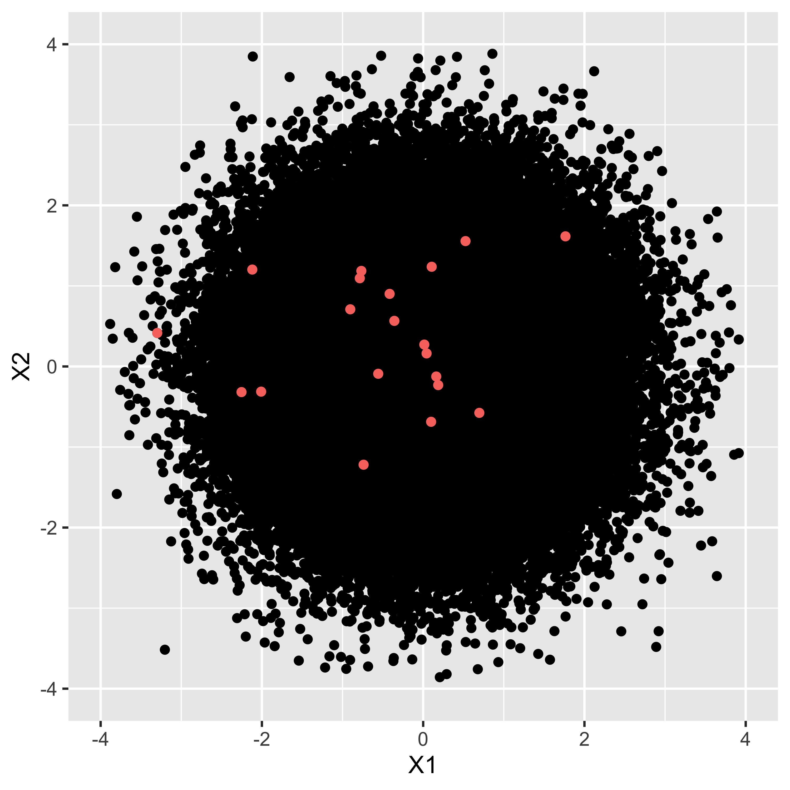

# 帰無仮説検定 {#chapter18}

前回は標本から母平均を区間推定する方法について説明しました。今回は，これを使って「差があるかないか」という判断をする方法について考えます。

母平均を区間推定することで，「このあたりにある，と予測したらXX%の確率で当たる」という範囲を定めることができました。この推定を実験群・統制群それぞれについて行うとすると，実験群の平均値はこの範囲，統制群の平均値はこの範囲にあると予測する，という言い方をすることになります。
その範囲が重複していなければ，実験群と統制群の平均値は異なると言い切れるでしょうが，信頼区間が重複することは当然起こり得ます。そのときどうやって「差がある」「差がない」という判断をするのか，ということが問題になるのです。
この判断はと呼ばれます。特にその形式から，，略して**NHST**と呼ばれます。

先に注意を促しておきたいのですが，検定は「推定」に「判断」が加わったものです。判断は，何らかの価値に基づいて，あるいは実践的な必要性に応えるためになされることです。
例えば感染症対策として新しい薬を開発し，この効果があるかどうというときに，「効果あり」とか「効果なし」という判断をするのですね。この判断が必要なのは，効果がないのに投薬をすると時間とお金の無駄，ひいては何らかの副作用で人命に影響が出るかもしれない，というシーンだからです。
幸い，心理学において人命が関わるような実験というのはほとんどあり得ませんが，実験や介入を行った効果があるのかどうかを判断するのにわかりやすいので，これまでよく使われてきました。実際とてもよく使われているのですが，同時に[多くの誤用・悪用]{.ul}を生んでしまいました。あまりにも間違った使われ方，悪い使われ方が広まっていることから，アメリカ統計学会や権威ある科学雑誌であるNatureが「間違えた使い方はダメだぞ」という声明を出しており[@wasserstein2016asa; @amrhein2019scientists]，「統計学は瀕死だ」という人もいるほどです[@豊田202003]。念のためにいっておきますが，帰無仮説検定は間違った理論だ，というわけではありません。理論的に筋は通っているのですが，理論的仮定を犯さずに実践し，正しく解釈するのに細心の注意が必要だ，ということです[^1]。

これら誤用・悪用を生み出す根本的な原因は，帰無仮説検定が「効果があった，なかった」という1bit判断[^2]を提供することにあります。判断に迷うような推定結果を，とある基準でYes/Noに振り分けますが，そうするとそのインパクトが大きくなりすぎるのです。例えばやり方によっては，二群にわけた群の平均の差が0.1点でも「差がある！」と判断することになったりします。これが二群の身長の差であれば，0.1cmは気にならないどころか実質的に意味のない差なのですが，「結果としてこの介入(投薬)をする群と，しない群を比較すると**成長に差が見られた！**」なんて伝わってしまうかもしれません。またこの0.1点の差が男女の平均獲得賃金(単位・100万円)などであれば大きく意味が違います。この場合は男女差は1円だってあるべきではないのです。つまり，本来，差があるかどうかという程度の問題はドメイン知識[^3]に照らし合わせて考えなければならないものなのです。心理学のような目に見えない対象を研究する場合は，この判断が非常に難しく，どの程度の量であれば検出することに意味があるのか，どの程度なら無視して良いのか，ということについて，統一的な見解が作りにくいのです。心理学の場合は，[判断の前の推定こそ重要]{.ul}であって，1bitに落とし込まれた派手な結果だけに目移りすることがないよう，注意する必要があります。

さて，いきなり警句から始まってしまってすみません。上に書いたことには充分注意しつつ，具体的に説明を始めていきたいと思います。

## 帰無仮説検定の手続き

統計的帰無仮説検定の手続きは一般に，次のようなステップですすみます。

1.  仮説を設定する。

2.  統計的仮説検定に用いられる検定統計量を選択する。

3.  仮説が間違っているか正しいかの判断の基準になる確率を設定する。

4.  実際のデータから検定統計量の実現値を計算する。

5.  最初に定めた仮説が間違っているか正しいかを判断する。

このステップについて，順に見ていきましょう。

### 仮説を設定する

まず最初のステップは仮説を設定するところです。帰無仮説検定では，とという2つの仮説を用意します。検定は差があるかないかの判断をすることですから，差があるとするモデル，差がないとするモデルを勝負させて，どちらに軍配が上がるかを見ようとすることです。

帰無仮説はNullという言葉があるように，空っぽ，空虚な仮説です[^4]。普通，比較するときには何らかの違いがあるとか，効果がある，というようなことをいいたいわけですが，これに対してNull，つまり違いがない，効果がないというような仮説を一方の側に用意します。帰無仮説というのは，無に帰してほしい，なくなって欲しい仮説ということで名付けられています。

これに対して，対立仮説はAlternative(別の可能性，代わりになるもの，という意味)であり，「差がある」「効果がある」という仮説になります。研究者としてはこちら側を応援したいところです。応援したい側があるのに，帰無仮説のようなものを置くのは，NHSTの判断の仕方が背理法的なものになっているからです。つまり，差がないという帰無仮説を立てて考えると，おかしな事実が生じるのであれば，帰無仮説を棄却できる。**だから**対立仮説を採択できる。これが基本的な筋道です。

### 統計的仮説検定に用いられる検定統計量を選択する

例えば平均値が違うといいたいのか，比率が違うといいたいのか，相関係数に意味があるのか，度数のばらつきが違うといいたいのか，などなど，研究のシーンに応じて考えたい標本統計量は変わります。

また，標本統計量をそのまま比較できない場合は，そこから計算して検定用の検定統計量を計算することになります。これまでの例では，例えば平均の推定をするときに$t$分布を使うという話がありました。平均の比較をする時は，この$t$分布に従う統計量，すなわち$t$値が検定統計量になります。
しかし，相関係数などは推定に使う分布が簡単なものではないものがあります。その場合でも，母数の推定や信頼区間を考えなくても，検定の判断ができる簡単に計算できる統計量に変換するという迂回路を取ることができます。

相関係数の検定はこの迂回ルートをとって，$t$分布を使った検定を行います。他にも$F$とか$\chi^2$(カイ二乗，といいます)といった統計量を計算することがあります。

どのシーンでどの統計量が必要なのか，については数理統計学の力を借りてますので，天下り式に覚えるしかないところですが，逆に言えばいくつかの典型例を知っていれば数学的な展開を必要とせずに，結果を手に入れられるのだと思って奮い立ってください。

### 仮説が間違っているか正しいかの判断の基準になる確率を設定する

検定はモデル比較の結果，優劣を定める勝負です。推定の結果を考察するにあたって，帰無仮説と対立仮説のどちらに軍配をあげるかという，「実践上での意思決定ツール」でもあるわけです。ですので，事前に「こうなったら決着したとしましょう」というルールを決めておかなければなりません。分析の前に判断ルールを決めておかないと，あとでルールの方が変わってしまうと困りますので，必ず事前に決めておく必要があります。

この確率のことを，といいます。有意significantとは，統計的に意味が有る，ということであり[^5]，これ以上の開きが出たら勝負あったと判断します，という基準です。これは確率の言葉で表現しますが，心理学では一般に5%が用いられます。なぜ5なのか。特に意味はありません。6でも4でも良かったのですが，最初に統計的検定をやった人が「根拠はないけどとりあえず5で」と始めたのが，いまだに使われています。ということで，こだわる必要はないのですが，一般的に5%，ときどき1%や0.1%，10%という数字が使われることがありますが，それも別に意味はありません。

ちなみにこの数字は，あくまでも優劣の判定基準であって，データそのものに言及する数字ではありませんし，仮説の正しさ，仮説モデルとデータの適合度を表す数字ではないことに注意が必要です。

### 実際のデータから検定統計量の実現値を計算する

実際のデータを当てはめて，検定統計量を計算します。

### 最初に定めた仮説が間違っているか正しいかを判断する

ここまではルールの設定でした。このあとは，ルールに従って2つのモデル(仮説)を戦わせていきます。

実際のデータから，検定統計量がどれぐらいの数字になるのかを計算し，それが出現する確率を計算します。この確率を特にと言います。このp値が有意水準を上(下)回ったかどうかが，勝敗の結果になります。ちなみに勝った方の仮説をし，他方をする，という言い方をします。

これが一連の流れです。このように手続きは形式的に定まっていますので，途中の計算は統計ソフトウェアが自動的にやってくれます。ですから計算の手間はほとんどないのですが，それだけに安易に使って安直に結果だけに飛びつくということがないように，注意が必要です。

## 1つの平均値の検定

具体的な例で考えていきましょう。まずは平均値の推定の時と同じく，母集団のSDがわかっている場合に標準正規分布を使っての検定を，次に母集団のSDがわからない時の，t分布を使っての検定を見ていくことにします。

### 母SDがわかっている場合

さて，話を進めるために，具体的な例をあげてみましょう。ある学校で，学力テストしたとします。その学校で無作為に49人分の記録を取り出したところ，平均が52点でした。このテスト，全国平均は50点で，SDが9の正規分布であることがわかっていたとします。これとそのまま比べると，その学校の成績が良い，ということになりますが，たった2点差でそのように結論づけて良いかどうか，というのがここでの問題です。

帰無仮説検定のステップを思い出しましょう。まずは仮説を設定します。
ここでやりたいことは，「この学校の成績が良いかどうかの判断」です。言い換えると，全国平均の分布が母集団でそれの平均やSDがわかっているのですから，この標本の平均は母平均と同じなのか，異なっているのかが知りたいのです。標本ですからたまたま高い点数が出ること(そしてその逆)もありますが，この標本平均から推測される母平均と，このテストの理論的な平均値(全国平均)の違いが**統計的に有意な差なのかどうか**が知りたいわけです。数式で表現すると，標本平均は$\bar{X}$で，$\bar{X} \sim N(\mu, \frac{\sigma}{\sqrt{n}})$ですから，この時の$\mu=50$が帰無仮説，$\mu \neq 50$が対立仮説ということになります。

次に検定統計量ですが，平均値の推定，しかも理論的に平均50，SD9の正規分布との照合ですから，推定したい対象の特徴がもうわかっている特殊なケースです。これは変換すれば標準正規分布に従うのですから($\to$第[\[chapter17\]](#chapter17){reference-type="ref"
reference="chapter17"}講)，標準化されたZ得点が検定統計量になります。

第3のステップは基準になる確率を設定する，でした。勝敗を決めるルールの決定ですね。これは特に意味もなく，慣例に従って0.05(5%)としておきましょう。

これで準備が終わりました。実際の検定統計量の計算です。平均$\mu$，分散$\sigma^2$の正規分布する母集団からの標本の場合，標本平均の標本分布も正規分布に従い，
$$\bar{X} \sim N(\mu,\frac{\sigma}{\sqrt{n}})$$
になります。今回の場合は， $$52 \sim N(50,9/\sqrt{49})$$
だと考えられます。標準化することで標準正規分布を使うことができますから，
$$(52-50)/(9/7) \sim N(0,1)$$
として，$(52-50)/(9/7) =2/1.285714=1.555...$を得ます。この1.556(下三桁までで四捨五入しました)という数字はどのあたりに位置するのでしょう？

そこで確率の計算をしてみましょう。これが次のステップの，実際のデータから検定統計量の実現値を計算する，というやつです。標準正規分布において，1.556より大きな数字が得られる確率は[^6]，$p=0.05985405$でした[^7]。5.9%なのですね。

最後に判定です。5%が判定ラインだったわけですが，今回得られた「確率変数の実現値」は5%より大きな確率です。つまり大きい＝出現する可能性が大きい，よくある話だったわけです。そんなにレアな数字じゃない。つまり，たまたま今回の標本が，平均から2点大きくなるようなことは十分あり得る話だということです。この学校の生徒は優秀だー！と言いたいところなんですが，偶然それぐらいの差がでることがあるのであれば，そこまで胸を張っていうことができません。ということで，軍配としては帰無仮説の勝ち，つまり，「その学校の成績が特段良いわけではない」「統計的には差がない」ということになります。

### 母SDがわかっていない場合

先ほどの例は，母SDがわかっているという話でした。第[\[chapter17\]](#chapter17){reference-type="ref"
reference="chapter17"}講でも同じことを言いましたが，まあ母数がわかっていれば苦労はないわけで，それが分からないから推測するのですよね。

ということで，母SDの代わりに標本SD(の正の平方根)を使って推定することとします。そのさいは(標準)正規分布が使えないので，サンプルサイズに応じた$t$分布を使うのでした。同じデータ例でやってみましょう。今度は標本の標準偏差が必要ですので，これが$\hat{\sigma}=10$だったとします。

帰無仮説・対立仮説は先程と同じく，$\mu=50$か$\mu \neq 50$です。ただし推測に使う統計量が$t$になるわけです。
判断基準も同じく慣例にならって，なんとなく5%にしておきましょう。
検定統計量$t$は$t = \frac{\bar{X}-\mu}{\hat{\sigma}/\sqrt{n}}$で求めることができますから，
$$t = (52-50)/(10/7) = 1.4$$
となります。これが自由度$n-1=48$の$t$分布に従うので，自由度48の$t$分布において1.4以上の数字が出る確率を求めますと，$p=0.08397194$となりました[^8]。8.3%なのですね。

これで判定です。5%の判定ラインより大きな確率が出ましたので，これは滅多にないことではない。なくはないのだから，よくある話。珍しいことじゃない。つまり，母平均から外れて大きい数字，とまでは言えないねということになります。

いかがでしたでしょうか。今回のデータでは(母SDがわかっていても，わかっていなくても)帰無仮説を棄却することはできませんでした。何だか持って回った言い方をしているように感じられるかもしれませんし，いまいちイメージが掴みにくいかもしれません。そこで，今度はまた別のケース，相関係数の例で考えてみたいと思います。徐々に手続きと結論の出し方に慣れていくと思います。

## 相関係数の検定

今度は相関係数の検定の話をしましょう。
心理学では，平均値を推測するだけでなく，相関係数をテーマに研究することも少なくありません。実験など，介入の前後や群間の比較であれば平均値の話になりますが，こうした因果関係が明確でなく，何らかの関係があるかもしれない，という見込みで探索的に現象を解明していくこともよくあります。例えばうつ病と起床時間に関係があるのかもしれない。自尊心の高さは学業成績と関係があるのかもしれない。恋愛に対する態度には性格が関係しているのかもしれないetc\...。何だか心理学っぽい話になってきましたね！

さて最後の例，恋愛に対する態度と性格の関係，を研究したいとしましょう。先行研究から，「恋愛についての積極性」を測定する尺度と，外向的な性格かどうかを測定する尺度があったとします[^9]。この尺度を使って，協力者を20人募って回答を求め，標本相関係数を算出したところ，$r=0.5$という数字が得られたとします(相関係数の算出については第[\[chapter4\]](#chapter4){reference-type="ref"
reference="chapter4"}講を思い出してください)[^10]。

さて，標本相関係数は$r=0.5$ですが，母相関係数はどうでしょうか。母集団でもこの2変数は関係がある，と言って良いでしょうか。標本の話を母集団に広めるには推定，そして結論づけるには検定をするのでした。検定のステップを踏んで話を進めましょう。

##### 仮説の設定：相関係数の場合

まずは仮説の設定です。帰無仮説と対立仮説が必要なのでした。帰無仮説はNullな仮説ですから，今回は「相関関係がない」というのがそれになります。
母相関はギリシア文字$\rho$(ローとよむ)で表されますから，数学的な表現をすると帰無仮説は$H_0: \rho =0$です。母相関が$0.0$と一致する，という強い主張ですね。
これに対する対立仮説は，これの否定ですから$H_1:\rho \neq 0$です。既にこの2つのモデル対決，帰無仮説はピンポイント予測ですから，かなり狭い可能性のような気もしますが，帰無仮説検定の話の上ではこうならざるを得ないのです。

というのも，帰無仮説検定は背理法のロジックを使う，というところにその話の味噌があります。まずは極端かもしれませんが，帰無仮説の世界を想定しておき，それに従っていくとおかしなことが起こるなら，帰無仮説を棄却する，という話の進め方です。母相関が0な世界を想定してみましょう--幸い，最近はコンピュータを使って簡単にシミュレーションをできます。相関係数が0の世界があり，そこから20人のサンプルをとっていくとしましょう。

{#fig::18_01
width="12cm"}

図[1.1](#fig::18_01){reference-type="ref"
reference="fig::18_01"}に示したのは，母相関$\rho=0$の世界から乱数を10万点発生させ，そこからランダムに20個の点を取り出した例です。黒い点の塊はほぼ円で，二変数に相関がないというデータを具現化したものが示されています。小さな赤い点がそこから20個取り出した場合で，今回この20個の点による標本相関係数は$r=0.143$でした。理論的には$\rho=0$の世界からのサンプルなのですから，$r$も0であって欲しいかもしれませんが，一部の標本だけ取り出すとぴったり0になることはありません。同様のサンプルを何度も繰り返すと，標本相関係数は$r_2=0.32, r_3=-0.46,r_4=-0.26....$といろいろな数字を取ります。この分布が標本分布になるのです。

このように，一旦「母相関は$\rho=0$」，としてから標本を取り出したとして，その標本分布がどうなるかを考え，たまたま今回得られた標本相関係数(今回の例では0.5でしたが)が出てくる確率はどれぐらいか，を考えます。その確率が非常に小さければ，滅多にないことが目の前のデータで生じたわけですから，これは前提である「母相関は$\rho=0$」という仮定の方がおかしい，ということで帰無仮説を捨てるわけです。ここが背理法になっているわけですね。また，帰無仮説として「母相関はありまぁす！」という仮定を置くのも難しいところなのがわかっていただけるかと思います。相関が「ある」といって，どの程度あるのかは無数に考えられるのに対し，相関が「ない」の場合は一意に定まるからです。

##### 検定統計量を定める

ここで，標本相関係数の標本分布は，自由度$n-2$の$t$分布に従うことがわかっています[^11]。ただ，そのまま相関係数を使うのではなくて，標本相関係数を次の式で変換する必要があります。

$$t = \frac{r\sqrt{n-2}}{\sqrt{1-r^2}}$$

##### 判断基準の設定

今回も慣例に倣って0.05(5%)にしましょう。

##### 検定統計量の算出

今回の例では，

$$t = \frac{0.5 \times \sqrt{18}}{\sqrt{1-0.25}} = 2.44949$$

となりました。

##### では判定を

今回得られた数字，$t=2.45$よりも大きい数字が自由度18のt分布から出てくる確率はどれぐらいでしょう？
これを計算すると[^12]その確率は$p=0.01237173$です。またここでは，$\rho=0.0$の元で標本相関係数が$0.5$より大きくなる確率を考えているのですが，この偏った相関係数の出方は$|r|>0.5$についての話ですから，左右対称の分布であることから$p=0.0124\times2=0.0248$と考えるべきです。いずれにせよ，絶対値0.5以上の標本相関係数が得られる確率は5%よりも小さい数字で，勝負の判定としては「滅多にないことが起こった」と言って良いわけですから，これは帰無仮説がおかしい。そもそも母相関が$\rho=0$であれば，たまたま標本から相関係数$r=0.5$が出てくるなんて，ありえへん，というわけです。そこで結論は，帰無仮説の棄却，対立仮説の採択となります。

いかがだったでしょうか。
区間推定とは少し違ったロジックですが，判定基準を設けて2つの仮説(モデル)を戦わせることで，判定はできるようになりました。
次回はこの判定結果の報告の仕方や，帰無仮説検定のもたらした問題点などについて感がていきたいと思います。

## 課題

##### 母SDがわかっている場合の平均値の検定をしてみる

母平均が40，母SDが10の母集団分布から，サンプルサイズ$n=16$の標本を取ったときの標本平均値が$\bar{X}=45$でした。
この標本から推測される平均値が，母集団と比べて有意に異なっているかどうかを判断したいと思います。
このとき，次の問いに答えてください。

1.  標本平均から推測した母平均の95
    %信頼区間はどのような値になりますか。標本分布に照らし合わせて考えてください。

2.  母集団に照らし合わせた時，今回の標本平均以上の数字が出てくる確率はどれぐらいですか。母集団分布に照らし合わせて考えてください。

3.  有意水準を5%として帰無仮説検定をします。この時の帰無仮説と対立仮説はそれぞれどのようになりますか。

4.  有意水準を5%として帰無仮説検定をします。結論として，どちらの仮説が採択されますか。

##### t分布を使った区間推定

母平均が40，母SDはわからないのですが，サンプルサイズ$n=16$の標本を取ったときの標本平均値が$\bar{X}=45$，標本の不偏SDが$\hat{\sigma}=9$でした。
この標本から推測される平均値が，母集団と比べて有意に異なっているかどうかを判断したいと思います。
このとき，次の問いに答えてください。

1.  標本平均から推測した母平均の95 %信頼区間はどのような値になりますか。

2.  母集団に照らし合わせた時，今回の標本平均以上の数字が出てくる確率はどれぐらいですか。

3.  有意水準を5%として帰無仮説検定をします。この時の帰無仮説と対立仮説はそれぞれどのようになりますか。

4.  有意水準を5%として帰無仮説検定をします。結論として，どちらの仮説が採択されますか。

##### t分布を使った相関係数の検定

サンプルサイズ$N=49$で標本相関係数$r = 0.3$という結果が得られたとします。この時この標本相関係数が統計的に意味があると言っていいかどうかを判断したいと思います。
このとき，次の問いに答えてください。

1.  有意水準を5%として帰無仮説検定をします。この時の帰無仮説と対立仮説はそれぞれどのようになりますか。

2.  有意水準を5%として帰無仮説検定をします。結論として，どちらの仮説が採択されますか。

[^1]: これらの声明のタイトルもよく見ると，"p-valuie"($p$値)や"statistical
    significance"(統計的有意)について注意が必要だ，ということであって，帰無仮説検定"significance
    test"そのものが間違っているというわけではないのです。

[^2]: 1bitは第[\[chapter2\]](#chapter2){reference-type="ref"
    reference="chapter2"}章で説明したように，2進数のデジタルデータの最小単位で，0/1の2つの状態しかありません。

[^3]: ドメインとはその領域のことです。生物学的な身長の話をしているのか，産業社会学的な賃金体系の話をしているのか，といった話題にまつわる領域のことだと思ってください

[^4]: ゼロとNullは違います。ゼロはゼロという数字があるといえますが，Nullはその数字すらない，虚無です。余談ですが，ネットスラングの「ぬるぽ」とはNull
    pointer
    Exceptionの意味で，ポインタが行き着かない例外（参照されたメモリ番地が存在しないエラー)という意味です。

[^5]: 優位と誤変換しないように注意してください。普通の変換では優位のほうが先に候補になりますが，心理学畑出身の人は有意のほうが先に変換候補に出るようになるでしょう。

[^6]: これまた確率の，特に連続変数のややこしいところで，1.556という数字が出てくる確率はゼロです。ユークリッド幾何学でいうところの，点は位置があって大きさがないというのと同じで，点の確率は大きさがないのです。確率は面積ですから，1.556[より大きな数字]{.ul}が得られる確率，という表現にしなければなりません。

[^7]: これはRで次のように計算しています：`1-pnorm(1.556,mean=0,sd=1)`

[^8]: これはRで次のように計算しています：`1-pt(1.4,df=48)`

[^9]: ここでは軽〜く書いていますが，心理的な状態を測定する物差しのことをといい，この尺度を作る・使い方を考えるのも心理学の重要な研究領域なのです。この領域を特に「心理測定」といいますが，テスト理論の発展系である因子分析モデルや構造方程式モデリングによって，調査項目に対する反応を細やかに検証する世界があります。それでなくても目に見えないものを測定するのですから，きちんと測定できているかどうかは大問題です。また世の中には論文化され，公開されている心理尺度はたくさんありますが，自分の研究に借用するときは「本当に自分が測りたいものと，この尺度が測ろうとするものが同じなのか」「今の，私の研究対象に同じ測定方法で測って同じ結果が得られるのか」，など常に批判的な態度を持っておく必要があります。

[^10]: ちなみに，標本相関係数の期待値(標本を何度もとったときの標本相関係数の平均値)は，母相関に**一致しません**。つまり不偏分散を計算したように，不偏相関係数を計算しなければならないのですが，簡単な式で表現できないので標本相関係数のままで推定することが慣例になっています[@南風原200206; @平川2021]。また区間推定をする場合は，標本相関係数の標準誤差を考えなければなりません。標本相関係数の標準誤差の推定値$\hat{\sigma}_r$は，次の式で与えられます。
    $$\hat{\sigma}_r= \frac{1-r^2}{\sqrt{n}}$$
    今回の場合ですと，$\hat{\sigma}_r = \frac{1-0.5^2}{\sqrt{20} }= 0.1677$となります。ただし標本相関係数の標本分布は正規分布ではありませんので，区間推定をするにはFisherのZ変換という手続きが必要です。

[^11]: ここでも数理統計学の結果だけお借りしましょう！

[^12]: Rで`1-pt(2.45,df=18)`とします。
