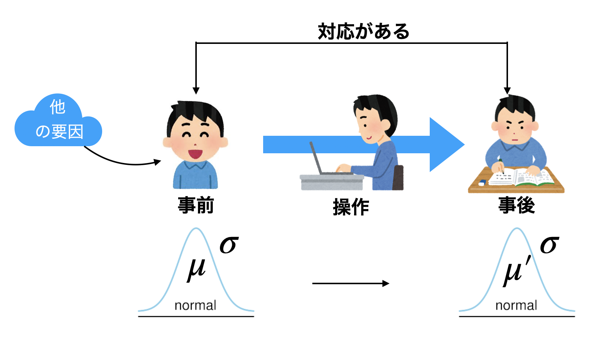
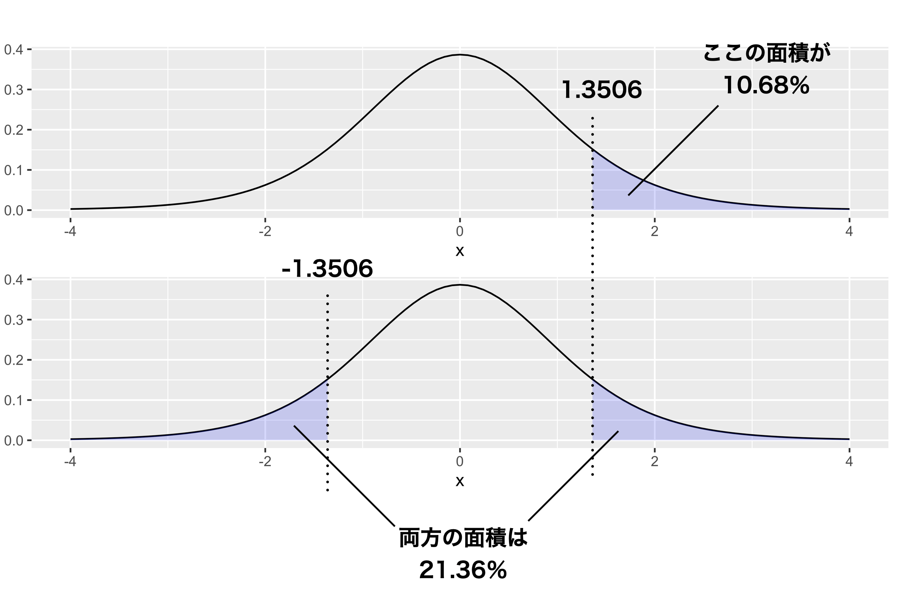

# 二群の平均値差 {#chapter20}

心理学の実践で最もよく用いられるのが，平均値差の検定です。実験計画のところで学んだように，RCTと組み合わせて使うことで，結果としてみられる群平均の差が効果の大きさと考えられるからです。
本講ではまず，二群の平均値差の検定を考えます。対応がある二群の場合は実はひとつの「差の分布」についての判断になるため，これまでと同様の議論ができるのです。
対応がない二群の場合は，線形モデルの最も単純な場合です。要因計画(線形モデル)と統計的検定の話を接続することで，複数の要因計画へと展開していくことができます。

## 一要因Withinデザイン，2水準

前回までは，帰無仮説検定の考え方とその形式化された手順を説明し，また平均値の検定や相関係数の検定を例に出して具体的な報告の仕方，結果の考え方について論じてきました。

今回は，心理学的な研究シーンで最もよく目にすることのある，2つの群の平均値差の検定についての話をします。
第[\[chapter11\]](#chapter11){reference-type="ref"
reference="chapter11"}講で触れたように，実験の基本的な枠組みは「介入した群としなかった群の違いを，群平均の差でみる」というものです。実験群と統制群という，2つの群があった時の平均値の「差」が有意であったかどうかを検討するモデルですね。

これを実験計画(design)の用語を使っていうと，一要因，間要因，2水準の計画ということができます。要因，群間/群内，水準という言葉に不安がある人は，第[\[chapter12\]](#chapter12){reference-type="ref"
reference="chapter12"}講の資料に戻って確認しておいてください。

さてこのセクションでは，まず一要因・群内(Within)の実験デザイン，中でも2水準の計画についてとりあげます。これは群内，言い換えれば反復測定で，その水準が2つしかないということは，例えば介入の前後で効果があったかなかったか，という実験デザインだということになります。細かいことを言えば，群内のデザインは反復測定だけでなく，データに対応がある場合も含まれます。双子の研究や，親密な関係の二人[^1]について研究する場合は，ペアに対応関係があり，相互に影響しあっている可能性が高いので，2つの変数の間に相関関係があると思われます。こうした状況であれば，特にその共有している背後の要因にも配慮した分析をする必要があります。群内計画は「対応のある分析」と呼ばれることもあります。

今回はプレ・ポスト(事前・事後)のデータを取った研究だとしましょう。例えば心理的な健康状態について，事前にアンケート調査をしておき，その後なんらかの臨床的介入(リラックス法のトレーニングをする，など)を行って，一定期間後に同じ人に事後のアンケートを取る，というような研究デザインです(図[1.1](#fig::19_01){reference-type="ref"
reference="fig::19_01"})。

{#fig::19_01
width="12cm"}

事前に集められた被験者は母集団から無作為に集められているとし，事前調査による健康状態のスコアが正規分布にしたがっていたとします。これと同じテストを事後に行ったとすると，個人差はあるにせよ全体的に効果があれば，この臨床的介入法は優れている，と言えそうです。個々のクライアントの変化も重要ですが，より効果を一般的に解釈するためには，推測統計学の力を借りて，母集団での変化，母平均の差を検証したいと考えるのは当然でしょう。そこで，標本平均から母平均を推定し，また母集団分布が正規分布であるという仮定をおくことで標本平均のブレ幅も想定できますから，これを使って母平均のありそうな場所を推定，それが事前・事後でどう違うかということを考えていきたいと思います。またここで，母平均はもちろん母SDもわからないので，標本から計算した不偏分散を推定値として考えます。標本統計量から推定する場合は，正規分布ではなく$t$分布に従いますので，ここでも$t$分布を使った推定をすることになります。この推定値を使った検定を考えるのですが，特にこの検定のことをといいます[^2]。

さて，事前・事後で変化があったかどうかを知りたいのですが，ありがたいことに正規分布に従う確率変数$X$と，正規分布に従う確率変数$Y$の差，$X-Y$も，正規分布に従うことがわかっています。今回はデータに対応があり，事前と事後で変化があったかどうかが知りたいわけですから，この特徴を使うことができます。

数値例として，次のような2群を考えてみましょう(表[1.1](#tbl19::01){reference-type="ref"
reference="tbl19::01"})。

::: {#tbl19::01}
    Participants    1    2    3    4    5    6    7    8    9   10
  -------------- ---- ---- ---- ---- ---- ---- ---- ---- ---- ----
             pre   34   25   13   21   13   26   19   12   19   19
            post   35   30   16   27   20   28   16   14   18   21
            diff    1    5    3    6    7    2   -3    2   -1    2

  : Pre-Post Design Data
:::

[\[tbl19::01\]]{#tbl19::01 label="tbl19::01"}

ここには10人の実験参加者（participants)がいます。表[1.1](#tbl19::01){reference-type="ref"
reference="tbl19::01"}には，それぞれの人の事前・事後のスコアと，その差分について示されています。数式で表しておきますと，まず事前のスコアを$X_1$,事後のスコアを$X_2$とします。すると差分$D$は
$$D = X_2 - X_1$$ ですが，その平均についても
$$\bar{D} = \bar{X_2} - \bar{X_1}$$
という関係が成り立ちます。そしてこの$D$が，平均$\mu_D$，標準偏差$\sigma_D$の正規分布に従いますから，
$$D \sim N(\mu_D,\sigma_D)$$ より
$$\bar{D} \sim N(\mu_D,\frac{\sigma_D}{\sqrt{n}})$$
ということになります。ここで$\sigma_D$がわかればいいのですが，わからないので$D$の不偏分散をその推定値としますと，
$$t = \frac{\bar{D}-\mu_D}{\hat{\sigma_D}/\sqrt{n}}$$
と自由度$n-1$の$t$分布に従うことになるわけです。この一連の流れ，数式で表されるとピンとこないという人がいれば，第[\[chapter17\]](#chapter17){reference-type="ref"
reference="chapter17"}講に立ち返って，確認してください。

さて，検定の前に区間推定してみましょう。自由度$n-1=10-1=9$の$t$分布の95%区間は$\pm 2.262157$ですから[^3]，今回の数字を使って考えると，
$$-2.262 < \frac{\bar{D}-\mu_D}{\hat{\sigma_D}/\sqrt{n}} < 2.262$$
から，両辺に分母をかけて
$$-2.262 \times \hat{\sigma_D}/\sqrt{n} < \bar{D}-\mu_D < 2.262 \times \hat{\sigma_D}/\sqrt{n}$$
$\bar{D}$を移項目して
$$\bar{D}-2.262 \times \hat{\sigma_D}/\sqrt{n} < \mu_D < \bar{D}+2.262\times \hat{\sigma_D}/\sqrt{n}$$
ここで$\bar{D} = 2.400,\hat{\sigma_D} = 3.062$ですから，
$$0.2097 < \mu_D < 4.590$$
ということがわかります。標本の差分は2.4点だったのですが，母平均の差は点推定で2.4，95%の区間推定で\[0.21,4.59\]ぐらいだということでした。つまり，95%の幅で低く見積もっても，0.21以上ではあるわけですから，差がないわけではない，ということがわかります。

これを検定のロジックに乗せて考えてみましょう。

##### 仮説の設定

帰無仮説と対立仮説が必要ですが，帰無仮説はないないづくし，前後の差がない，効果がないという仮説になります。記号を使っていうなら，$\mu_D=0$です。対立仮説は臨床的な効果があった，ということになりますから，従属変数の差は0プラスであるはず。つまり$\mu_D > 0$です。

##### 検定統計量を選択

平均値の推定ですので，検定統計量は$t$ですね。

##### 判断の基準になる確率を設定

有意水準$\alpha$，今回も5%で勝負を決めるとしましょう。

##### 検定統計量の実現値を計算

先ほどは区間推定をしたので$\frac{\bar{D}-\mu_D}{\hat{\sigma_D}/\sqrt{n}}$の計算はしていませんでした。しておきましょう。[帰無仮説に従うなら，$\mu_D=0$なのですから]{.underline}，
$$t= \frac{\bar{D}-\mu_D}{\hat{\sigma_D}/\sqrt{n}}  = \frac{2.4-0}{3.062/\sqrt{10}}  = 2.479$$
この$t = 2.479$は自由度$9$の$t$分布に従います。この実現値以上の$t$値が出てくる確率は，$p=0.0175$です。

##### 最初に定めた仮説が間違っているか正しいかを判断

判定基準5%より小さい数字ですので，帰無仮説の下で計算したこの$t$の値は，珍しいと言えます。こんな珍しいことが生じたのだから，仮定が何か間違っている。つまり，差がないというのがおかしい。帰無仮説を棄却して，対立仮説を採択する，と判断します。

結果の報告の仕方は，

> 対応のある$t$検定を行ったところ，$t(9)=2.479,p=0.0175$で統計的に有意である。

ということになります。ここで

ところで，先ほどの区間推定の結果を覚えているでしょうか？
95%の幅で考えると，少なく見積もっても0.21，大きく見積もると4.59も差があったかもしれません。この「少なく見積もっても」の方がゼロ(=帰無仮説)ではありませんので，この区間をみるだけでも帰無仮説を棄却することがわかります。この区間推定がゼロを挟む，つまり少なく見積もるとマイナス(逆効果！)，大きく見積もるとプラスだ，というときは検定をしても有意にはなりません。この区間推定の情報は，推定された平均値がどれほど変化しうるのか，の情報でもありますから，この大きさを一緒に報告しておくと「この実験がどれほど信用できるか」という目安にもなって良いですね。そこで先ほどの報告例を少し修正して，

> 対応のある$t$検定を行ったところ，$t(9)=2.479,p=0.0175，95\%C.I.[0.21,4.59]$で統計的に有意である。

とすると尚良いでしょう[^4]。

## Rによる実践；対応のあるt検定

さて，先にみた関数関数`t.test`は，当然$t$検定用の関数ですので，実際に検定のシーンで使ってみましょう。

対応のあるt検定，つまり一要因群内(Within)2水準の平均値差の検定をどう計算するか，です。前節では面倒な計算式がありましたが，今回その辺の計算は機械がやってくれますので，例によって出力をしっかり確認するようにしましょう。

例として，表[1.1](#fig::19_01){reference-type="ref"
reference="fig::19_01"}の10人の参加者データを使います。元になるデータをオブジェクトに格納する`code:[code::20_08]`を実行しましょう。

``` {#code::20_08 .c++ language="c++" label="code::20_08" caption="t検定を行う"}
X <- c(34, 25, 13, 21, 13, 26, 19, 12, 19, 19)
Y <- c(35, 30, 16, 27, 20, 28, 16, 14, 18, 21)
t.test(X, Y, paired = T, alternative = "less")
```

##### コード解説

1行目

:   一方のデータをオブジェクト`X`に代入しています。`c`は結合combineという関数です。

2行目

:   他方のデータをオブジェクト`Y`に代入しています。

3行目

:   t検定を行っています。引数として，データ`X,Y`を指定し，次に`paired`オプションを`T`に[^5]，対立仮説alternativeを「XがYよりも小さい」という[片側検定]{.underline}にしてあります。

さて，このスクリプトは直感的にわかりやすく書きましたが，同じことを別の表現をすることもできます(`code:[code::20_09]`)。

``` {#code::20_09 .c++ language="c++" label="code::20_09" caption="t検定その2"}
X <- c(34, 25, 13, 21, 13, 26, 19, 12, 19, 19)
Y <- c(35, 30, 16, 27, 20, 28, 16, 14, 18, 21)
dat <- data.frame(condition = c(rep(1, 10), rep(2, 10)), value = c(X, Y))
dat$condition <- factor(dat$condition, labels = c("pre", "post"))
t.test(value ~ condition, data = dat, paired = T, alternative = "less")
```

これは1，2行目は先ほどと同じですが，

3行目

:   オブジェクトからデータフレームを作成。データの値は変数`value`に，これを条件ごとに区別する条件変数`condition`と共に作ります。`condition`の中にある`rep`関数は，ある文字・数字を繰り返すもので，ここでは`rep(1,10)`で1を10個作っています。ここだけ実行するとその動作がよくわかりますよ(`console[RS:out20_02]`)。

    ::: Rscreen
    repの出力out20_02

        > rep(1,10)
        [1] 1 1 1 1 1 1 1 1 1 1
    :::

4行目

:   先ほど作った`condition`変数をファクター型(要因型，ラベル付き名義尺度水準)に置き換えています。

5行目

:   t検定ですが，書式が変わっています。チルダ`~`を使って，従属変数`~`独立変数という書き方に変えています。

こちらはデータフレームを作った書き方ですから，データフレームがどういう形なのかみておくと良いでしょう(`console[RS:out20_03]`)。

::: Rscreen
datの中身を確認out20_03

    > dat
       condition value
    1        pre    34
    2        pre    25
    3        pre    13
    (中略)
    11      post    35
    12      post    30
    13      post    16
    (後略)
:::

実際のデータ分析の時は、外部からデータファイルを読み込んだり，既にデータフレームに整形されたものを分析することが多いかと思います。このチルダを使って独立変数，従属変数の形に表すのがRでは一般的な関数関係の表現形ですから，これを機にどちらの使い方でもできるように解説しました。

さて，こうして得られる結果は`console[RS:out20_04]`の通りです。

::: Rscreen
t.testの出力out20_04

    Paired t-test
    data:  value by condition
    t = -2.4783, df = 9, p-value = 0.01754
    alternative hypothesis: true difference in means is less than 0
    95 percent confidence interval:
            -Inf -0.6248331
    sample estimates:
    mean of the differences 
                       -2.4 
:::

上から三行目に$t$値が出ていますね。帰無仮説の下での$t$統計量の実現値は$t(9)=-2.4783$であり，これが出現する確率は$p=0.01754$です。対立仮説は，平均値の差が0より小さい(true
difference in means is less than
0)という対立仮説になっています[^6]。これが片側検定になっているのは，`t.test`関数の引数に`alternative="less"`と書いたからで，これを`alternative="greater"`とすれば逆の片側検定(事前データのスコアの方が事後データのスコアより大きい)を検定することになり，特に何も書かないか`alternative="two.sided"`とすれば両側検定になります。

前の章($\to$第[\[chapter19\]](#chapter19){reference-type="ref"
reference="chapter19"}講)を参考に，このような結果をどう解釈し，どうレポートに記載するかを確認しておいてください。

## 一要因Betweenデザイン，2水準

### 区間推定でまず考えてみよう

それでは次に，対応のないバージョン，つまり群間(Between)計画の例を考えてみましょう。これは両群に対応がない，それぞれの平均値の推定をして，その上でその推定値の間に差があるかどうか，という話になります。

![図[\[fig::17_05\]](#fig::17_05){reference-type="ref"
reference="fig::17_05"}の再掲。一要因Betweenデザイン，2水準の場合。](../images/text17/slide17_4.png){#fig::19_02
width="12cm"}

具体的な数値例でみてみましょう。

::: {#tbl::19_02}
    ID condition        value
  ---- -------------- -------
     1 control             25
     2 control             15
     3 control             24
     4 control             17
     5 control             22
     6 experimental        31
     7 experimental        28
     8 experimental        30
     9 experimental        19
    10 experimental        18

  : Between Designのデータ例
:::

[\[tbl::19_02\]]{#tbl::19_02 label="tbl::19_02"}

今回は$n=5$としました。5人の実験参加者を実験群(experimental)と統制群(control)に無作為に割り付け，実験群にはある認知課題を課した後で，記憶力を測定するテストをした，と思ってください。テストのスコアがvalue列に入っている数字です。さて，認知課題をした群とそうでない群の平均値に違いはあるでしょうか？

これまた母SDがわからない中で，標本平均から母平均を推定するので$t$分布を使うことになります。実験群，統制群ともに$n=5$ですから，自由度$n-1=5-1=4$の$t$分布を使って推定すると，統制群の母平均は
$\bar{X}_{ctl} =20.60$,$\hat{\sigma_{ctl}}=4.393$より，
$$15.145 < \mu_{ctl}<26.055$$
となります。実験群は$\bar{X}_{exp} = 25.20$,
$\hat{\sigma_{exp}}=6.221$より $$17.476<\mu_{exp}< 32.924$$ となります。

差がありますか？
微妙ですね！統制群は大きく見積もるなら26.05ぐらいの標本平均が出てきたかもしれなかったし，実験群は小さく見積もるなら17.48ぐらいの標本平均だったかもしれないわけです。区間推定だけだと判断に迷うところです。

### 検定で勝負を決めようじゃないか

そこで検定の出番。先ほどの例と同じく，「正規分布と正規分布の引き算はまた，正規分布」という特徴を利用して検定を行います。正規分布である母集団$N(\mu,\sigma)$から無作為標本を取ってきたとすると，標本平均$\bar{X}$は$N(\mu,\frac{\sigma}{\sqrt{n}})$に従うのでした。ここで，2つの群の標本平均の差，$\bar{X}_1 - \bar{X}_2$を考えると，その分布は平均$\mu_1-\mu_2$，標準偏差$\sigma/\sqrt{\frac{1}{n_1}+\frac{1}{n_2}}$に従うことがわかっています。ただ，この$\sigma$がわかりませんので，不偏推定量で置き換える必要があります。今回は2つの群があって，実験群の不偏分散を使っても，統制群の不偏分散を使ってもおかしいので，両群をまとめて
$$\hat{\sigma^2}_{pooled} = \frac{(n_1-1)\hat{\sigma_1^2}+(n_2-1)\hat{\sigma_2^2}}{n_1+n_2 - 2}$$
を使います。pooledとはプールした，まとめた，という意味です。これは分散の推定量ですから，差の分布の標準偏差の推定値としてはこれの正の平方根，
$$\hat{\sigma}_{pooled} = \sqrt{\frac{(n_1-1)\hat{\sigma_1^2}+(n_2-1)\hat{\sigma_2^2}}{n_1+n_2 - 2}}$$を使えば良いことになります。

ややこしくなってきましたが，これを使って考えると統計量は次のように計算できます。

$$t = \frac{\bar{X_1}-\bar{X_2}-(\mu_1-\mu_2)}{\sqrt{\frac{(n_1-1)\hat{\sigma_1^2}+(n_2-1)\hat{\sigma_2^2}}{n_1+n_2 - 2}}\sqrt{\frac{1}{n_1}+\frac{1}{n_2}}}$$

あっ，心閉ざさないで！数式は話の筋を通すために書いているだけです。文字がいっぱい出てきて混乱したかもしれませんが，この数式，覚えておく必要はありません。ここでは，教材なので一応説明していきますが，実際には統計ソフトウェアが組み込まれた関数で一気に答えを出してくれます。大事なのは，筋道を理解することですので，初めのうちは数式のところは「なんか書いてるわ」ぐらいの理解でも構いません。それよりも，この$t$の式には標本統計量しか入っていないことに感動しましょう。

「うそつけ，$\mu_1,\mu_2$があるじゃないか」と思った人は，目の付け所がいいですね。確かにこれはわからないところ(だからギリシア文字で書いてあります)なのですが，これを使って今から検定を行うのです。検定では帰無仮説をおきます。帰無仮説はないないづくし，ですから，「2群の母平均の間に差はない」と仮定するのです。これを言葉でいうと，$\mu_1=\mu_2$，あるいは$\mu_1-\mu_2=0$です。上手くできてますよね！帰無仮説の下では，分母の$\mu_1-\mu_2$を$=0$とおくことができますので，
$$t = \frac{\bar{X_1}-\bar{X_2}}{\sqrt{\frac{(n_1-1)\hat{\sigma_1^2}+(n_2-1)\hat{\sigma_2^2}}{n_1+n_2 - 2}}\sqrt{\frac{1}{n_1}+\frac{1}{n_2}}}$$
となり，完全に標本統計量から計算できることになりました。それでは検定を進めて参りましょう。

##### 仮説の設定

帰無仮説と対立仮説が必要です。先ほども述べたように，帰無仮説は$\mu_1=\mu_2$，対立仮説はこれの否定ですので$\mu_1 \neq \mu_2$になります。

##### 検定統計量を選択

平均値の推定ですので，検定統計量は$t$ですね。

##### 判断の基準になる確率を設定

有意水準$\alpha$，今回も5%で勝負を決めるとしましょう。

##### 検定統計量の実現値を計算

これはちょっと厄介ですが，数式にしたがって，統制群を$X_1$，実験群を$X_2$とおくと，$\bar{X_1}=20.60,\hat{\sigma}_1=4.393,\bar{X_2}=25.20,\hat{\sigma}_2=6.221$です。

$$t = \frac{20.60-25.20}{\sqrt{(4.393^2+6.221^2)/5}} = -1.3506$$

となりましたので，これが自由度$(n_1-1)+(n_2-1)=n_1+n_2-2=10-2=8$の$t$分布に従うことになります。これより極端な$t$値が得られる確率は，$p=0.1068$になりました。

### 検定と方向性

ここで注意が必要です。今回の帰無仮説は，2群の母平均が等しくないというものでした。等しくないというのは，$\mu_1>\mu_2$でもいいし，$\mu_1<\mu_2$でもいいはずです。今回は検定統計量の実現値を計算するときに，分子を$\bar{X_1}-\bar{X_2}$で計算しましたが，$\bar{X_2}-\bar{X_1}$でもいいはず。そうすると，後者の場合$t$の値は1.3506になることになります。

$t$分布を見ながら，先ほどの$t$値の考え方を見てみましょう。$t$の実現値が今回は-1.3506だったわけですが，それ以上に極端な数字が出る確率を考えるときは，符号を考えずに`1-qt(1.3506,df=8)`で計算していました。このRでの計算は，図でいうなら図[1.3](#fig::19_03){reference-type="ref"
reference="fig::19_03"}の上にあるように，1.3506までの面積を100%から引き算することによって求めた，青い色付けられた領域になっています。反転の反転，で説明がややこしくなっていますが，`qt(-1.3506,df=8)`と同じことになっています。

{#fig::19_03
width="12cm"}

そしてその$t$値は，統制群の平均値から実験群のそれを引くか，実験群から統制群を引くかによって符号が変わるものであり，今回の仮説はそのどちらにするかを考えていなかったので，どちらでもあり得る，つまり面積的にはこの倍の出現の可能性がある，と考えるべきなのです(図[1.3](#fig::19_03){reference-type="ref"
reference="fig::19_03"}の下)。

これは検定の「方向性」，といわれ，「一方が他方より大きいはず」という意味があるのなら，片方の面積を考えるだけで構いません。これはと言われ，前のセクションで対応のある$t$検定をした時は，臨床的介入の「正の」効果があった，と考えた片側検定をしていたのです。もし臨床的介入が悪化させることもある，という可能性があれば，面積を倍にして考えなければなりませんでした
[^7]。

今回は，実験群と統制群の「違い」だけに興味があり，実験的な操作が成績を上げるのか下げるのかわからない，とにかく違うに違いない，と考えるのでであり，$t$の出現確率は$p=0.2136$ということになります。

まとめましょう。報告する時は次のようになります。

> 実験群と統制群の平均値の差を検定したところ，$t(8)=1.356,p=0.214$で統計的に有意であるとは言えなかった。

2群の平均値の差の検定については，このような手続きで行います。繰り返しになりますが，実際の計算は機械がやってくれるので，どのような数字がどのような意味を持っているのか，得られた結果からどのように判定するのか，という手続き的な知識をしっかりと踏まえてください。

また，ここでこのように検定の具体例をみてきたわけですから，是非この技術を身の回りでも活用してみてください。
何か2つのグループがあって，その平均値が違うのであれば，これは偶然によるものなのかそうでないのか。一般化して良いのかどうか。この推測統計学的発想は，身の回りの至る所に応用できるものです。知識と技術を手に入れたら，是非具体例を自分で考えて，試してみてください[^8]

## Rによる実践；対応のないt検定

ではRでの実践です。先程の表[1.2](#tbl::19_02){reference-type="ref"
reference="tbl::19_02"}のデータを分析することを考えます。難しい計算は抜きにして，`code:[code::20_10]`を入力し，分析を実行してください。

``` {#code::20_10 .c++ language="c++" label="code::20_10" caption="formulaで指定"}
X <- c(25, 15, 24, 17, 22)
Y <- c(31, 28, 30, 19, 18)
dat <- data.frame(condition = c(rep(1, 5), rep(2, 5)), value = c(X, Y))
dat$condition <- factor(dat$condition, labels =  c("control","experimental"))
t.test(value ~ condition, data = dat)
```

スクリプトの内容については、先ほどとほぼ同じです。大きな違いは，`t.test`関数の引数がなくなったところで，`paired`オプションもなければ，`alternative`オプションもありません。ないのは、デフォルトの状態を使っているからで，Rの`t.test`関数はデフォルトで対応のない，両側検定の$t$検定をやってくれるのです。

結果は次のように表示されるはずです(`console[RS:out20_05]`)。

::: Rscreen
Welchの補正out20_05

    Welch Two Sample t-test

    data:  value by condition
    t = -1.3506, df = 7.195, p-value = 0.2178
    alternative hypothesis: true difference in means is not equal to 0
    95 percent confidence interval:
     -12.609577   3.409577
    sample estimates:
         mean in group control mean in group experimental 
                          20.6                       25.2 
:::

前回，手計算した結果と同じになっているかどうか確認してください。

んん？ 自由度が7.195?
自由度って8になるんじゃなかったでしたっけ(実験群の自由度が$5-1=4$，統制群の自由度も$5-1=4$，足して2つで$4+4=8$)。

### Welchの補正

そうです，t検定の自由度は$8$のはずなのですが，変な数字で出ていますね。これは，検定に関わるまだ説明していない別の手続きがあったからです。

検定にはどのような仮定があったか，思い出してください。母平均の差をゼロとする，という帰無仮説をおくのも仮定ではありますが，さらにその前にあった仮定です。それは，2つの群が正規分布から得られていること，特に平均値に差はあるけれども，母標準偏差は同じところから取ってきていた，という仮定があったのです。

もしこの仮定が崩れていたら？
母集団に正規分布が仮定できなければ，$t$検定はできません。例えば年収の差とか，データが比率や角度についての数字であったりすると，正規分布を仮定できないので$t$検定はできないのです。正規分布は正規分布だったとしても，母標準偏差がちがっているなら，推定の仕方も考え直さないといけないかもしれません。

この問題は，$t$値の自由度を調整することで解決されています。前回までのいわゆる$t$検定は，等分散の仮定が満たされているケース(分散の均一性などということもあります)の計算方法であり，この仮定が満たされていない場合は(ウェルチの補正)とよばれる調整が必要です。

Rの`t.test`関数は，より仮定の緩やかな，Welchの補正をかけた結果をデフォルトで返してくれます。まず分散が等しいかどうかチェックして云々，という手続きが面倒なので，最初から補正しておこう，ということですね。結果の一行目にもWelch
Two Sample t-testと書いてあります。これを使って，結果は

> $t(7.195)=1.351,p = 0.2178$で2群の間に統計的に有意な差は認められなかった。

と報告します[^9]。差があるかどうかの判断だけでなく，差の95%信用区間にも目を向けておきましょう。結果から，差の95%信頼区間はCI\[-12.609577,3.409577\]でした。差は-12から+3までの幅があり，帰無仮説である差$=0$を含んでいるので，有意になりません。

ところで，分散が同じだ，と仮定できる場合は`t.test`関数のオプションを使います(`code:[code::20_11]`)。

``` {#code::20_11 .c++ language="c++" label="code::20_11" caption="分散のオプション指定"}
t.test(value ~ condition, data = dat,var.equal = T)
```

これで，`console[RS:out20_06]`のような結果を得ることができます。

::: Rscreen
分散が等しいという仮定を置くout20_06

        Two Sample t-test

    data:  value by condition
    t = -1.3506, df = 8, p-value = 0.2138
    alternative hypothesis: true difference in means is not equal to 0
    95 percent confidence interval:
     -12.453967   3.253967
    sample estimates:
         mean in group control mean in group experimental 
                          20.6                       25.2 
:::

このやり方ですと，自由度も整数になっていますね(判定結果は変わりませんが)。

### 事後的な効果量の検証

検定が終わった後ではありますが，このデータの実験は「勝ち目がある」ものだったのでしょうか。つまり，母集団における母平均の差が十分大きなものなのかどうかが気になります。母数は分かりませんが，これまでも分からないものは標本統計量で置き換えて推定してきたわけですから，データを取った後になって，これはどれぐらい効果量の大きなデータだったのか，を考えてみましょう。

効果量の計算についても，Rを使って簡単に行うことができます。Rではパッケージを追加することで様々な統計関数が増えますが，効果量についての[effsize]{.sans-serif}パッケージ[@effsize]を導入すれば，この計算も簡単にできます。効果量については第[\[chapter19\]](#chapter19){reference-type="ref"
reference="chapter19"}講で触れましたので確認しておいてください。ここではより推奨される，Hedgesのgの算出の仕方を紹介します(`code:[code::20_12]`)。

``` {#code::20_12 .c++ language="c++" label="code::20_12" caption="効果量を求める"}
# パッケージの読み込み
library(effsize)
cohen.d(value ~ condition, data = dat, hedges.correction = T)
```

ここではまず2行目でパッケージを読み込み[^10]，次の行でcohenのdをHedgesの補正をかけて算出せよ，としています。

結果は`console[RS:out20_07]`のように示されます。

::: Rscreen
効果量の出力out20_07

    Hedges's g

    g estimate: -0.7715342 (medium)
    95 percent confidence interval:
           lower      upper 
    -2.1369693  0.5939009 
:::

`g estimate: -0.7715342 (medium)`とあるように，推定値は0.77で，これは中ぐらい(medium)の大きさだよ，ということです。中程度の違いがありそうなのに，今回有意にならなかったのは、サンプルサイズが小さかったからかもしれません。事前にきちんと設計してやっておけば，実験手続きとしてより良くなったでしょう。

効果量の計算はこのように，事後的に行って今回の標本から標準化された平均値の差がどれぐらいありそうか，と考えることもできます。もちろん事前に平均値の差を想定して，そこから例数設計(どれぐらいのサンプルを取れば良いか考える)するのにも使います。今回ここで求めた標本効果量も，レポートに書くようにしましょう。

> $t(7.195)=1.351,p = 0.2178$で2群の間に統計的に有意な差は認められなかった。なお，Hedgesのgで効果量を求めたところ，0.77であった。

### 補遺

付録的に2点付け加えます。時間的に余裕がある・興味がある場合はご一読ください。

##### 対応のあるt検定の効果量を計算する

対応のある$t$検定をして，その効果量を求める場合は，次のようにpairedオプションをオンにしておきます(`code:[code::20_13]`)。

``` {#code::20_13 .c++ language="c++" label="code::20_13" caption="cohenのd"}
cohen.d(X,Y,paired = TRUE)
```

ただし，チルダを使った書き方をしている場合，`code:[code::20_14]`のようにすると，出力に次のような警告が付されます(`console[RS:out20_08]`)。

``` {#code::20_14 .c++ language="c++" label="code::20_14" caption="cohenのdその2"}
cohen.d(value ~ condition, data = dat, paired = TRUE)
```

::: Rscreen
rnormの出力out20_08

    Cohen's d

    d estimate: -0.344241 (small)
    95 percent confidence interval:
          lower       upper 
    -0.64457930 -0.04390272 

        警告メッセージ: 
    cohen.d.formula(value ~ condition, data = dat, paired = TRUE) で: 
    Trying to compute paired samples Cohen's d using formula input. Results may be incorrect
     if cases do not appear in the same order for both levels of the grouping factor. Use the
    format 'value ~ treatment | Subject(id)' to specify a subject id variable.
:::

この警告は，「対応のある個々人を識別する変数がデータセットに入ってないので，間違った結果になっているかもしれませんよ。次の書式を使ってください」と言ってます。これに対応するためには、`code:[code::20_15]`のようにします。

``` {#code::20_15 .c++ language="c++" label="code::20_15" caption="対応のある場合のcohen.d"}
X <- c(34, 25, 13, 21, 13, 26, 19, 12, 19, 19)
Y <- c(35, 30, 16, 27, 20, 28, 16, 14, 18, 21)
dat <- data.frame(condition = c(rep(1, 10), rep(2, 10)), value = c(X, Y))
dat$condition <- factor(dat$condition, labels = c("pre", "post"))
dat$ID <- rep(1:10,2)
cohen.d(value ~ condition | Subject(ID), data = dat, paired = TRUE)
```

ここでのポイントは5行目にIDを識別する変数を作り[^11]，効果量を計算する式を警告の提案通りのフォーマットに書き換えています。

##### 例数設計のしかた

対応のない$t$検定で，効果量が0.7あるのに有意になりませんでした。これはサンプルサイズが小かったからかも，ということでしたが，では何人分のデータがあればよかったのでしょうか。`code:[code::20_16]`ようにRに入力することで，そのヒントが得られます。

``` {#code::20_16 .c++ language="c++" label="code::20_16" caption="power.t.test関数"}
power.t.test(power = 0.8, delta = 0.7, sig.level = 0.05)
```

ここで，`delta=0.7`としたのは，標準化された平均値差が0.7あるとして，という考え方です。これは先ほどの事後的検定力分析の結果，それぐらいあったんじゃないの？
と思われたのでその値を使いました。もっと小さく見積もったり，逆にもう少し大きく見積もったりしても構いません。また，`power=0.8`としましたが，これはで，セクション[\[sec::18_05\]](#sec::18_05){reference-type="ref"
reference="sec::18_05"}で出てきたものです。Type II
Error，つまり差があるのにあると言えない間違い($\beta$)を20%ぐらいに抑え，80%の確率で当てたいとしました($1-\beta=0.8$)。また，有意水準は5%です($\alpha=0.05$,スクリプトの中では`sig.level=0.05`としています)。

さて，これの出力結果を見ると，次のように示されました(`console[RS:out20_09]`)。

::: Rscreen
rnormの出力out20_09

    Two-sample t test power calculation 

    n = 33.02467
    delta = 0.7
       sd = 1
    sig.level = 0.05
    power = 0.8
    alternative = two.sided

    NOTE: n is number in *each* group
:::

ここの$n$にあるように，効果量0.7，検定力0.8で研究するのであれば，33か34人は集めたいところ，だったわけです。逆に今回は5人しか集めていませんでしたが，これを使って，`code:[code::20_17]`とすると，`console[RS:out20_10]`のように示されます。

``` {#code::20_17 .c++ language="c++" label="code::20_17" caption="power.t.testで$n$を固定"}
power.t.test(n = 5, delta = 0.7, sig.level = 0.05)
```

::: Rscreen
検定力の出力out20_10

    Two-sample t test power calculation 

    n = 5
    delta = 0.7
    sd = 1
    sig.level = 0.05
    power = 0.16318
    alternative = two.sided

    NOTE: n is number in *each* group
:::

ここにあるように，検定力は0.16，つまりサンプルサイズ$n=5$であれば，この研究は100回やっても「有意差あり」と正しく判断できるのは16回ほどしかなかった，ということになります。分の悪い勝負に出たというところでしょうか。

## 課題

次の計算をするRコードが含まれるRmdファイルを提出してください。なお提出されたコード単体でバグがなく動くことが確認できないものは，未提出扱いになります。コードの書き方などわからないところがあれば，曜日別TAか小杉までメールで連絡し，指導を受けてください。

##### 課題1 対応のあるt検定

表[1.3](#exe:20_2){reference-type="ref"
reference="exe:20_2"}にあるように，ある介入の事前・事後の心理検査の成績が得られたとして，次の各指示に従い，結果について回答してください。

::: {#exe:20_2}
  ------ ---- ---- ---- ---- ---- ---- ---- ----
     pre   19   38   24   25   12   28   11   17
    post   31   23   28   35   14    4    4   38
  ------ ---- ---- ---- ---- ---- ---- ---- ----

  : 課題2
:::

1.  事前スコアの方が事後スコアよりも低いかどうか，5%水準で検定してください。

##### 課題2 対応のないt検定

表[1.4](#exe:20_3){reference-type="ref"
reference="exe:20_3"}にあるように，統制群と実験群の心理検査の成績が得られたとして，次の各指示に従い，結果について回答してください。

::: {#exe:20_3}
  -------------- ---- ---- ---- ---- ---- ---- ---- ---- ---- ----
         Control   20   21   21   20   21   22   22   22   20   20
    Experimental   20   18   22   20   21   18   19   21   21   21
  -------------- ---- ---- ---- ---- ---- ---- ---- ---- ---- ----

  : 課題3
:::

1.  母分散が等しいと仮定したt検定を実行してください。

2.  母分散が等しいという仮定をおかないt検定を実行してください。

3.  この検定に関して，効果量としてHedgesのgを算出してください。

##### 課題3 基礎実験1のデータを使って

基礎実験1の授業の中で，社会的影響についてのデータを取りましたね。
そこでは，「他者の存在の有無」により，「課題遂行量」に違いが出るのかどうか，を検証したとおもいます(他にも変数をとったと思いますが，ここでは課題遂行量にのみ注目します)。
そのデータを使って，次の問いに答えてください。なお，計算に使用したデータ(あるいはデータファイル)も合わせて提出してください。

1.  他者がいる群といない群，それぞれの標本平均値，標本分散，不偏分散をそれぞれ算出してください。

2.  このデータセットが正規分布に従う母集団から得られたと考えて，各群の母平均について95%の区間推定をしてください

3.  このデータセットが正規分布に従う母集団から得られたと考えて，二群の平均値の差の検定をしましょう。その際，帰無仮説と対立仮説はそれぞれどのようなものになりますか。

4.  二群の平均値の差の検定をし，検定統計量とともに判断結果を報告してください。

5.  その検定に関して，効果量としてHedgesのgを算出してください。

[^1]: 恋人同士や夫婦関係のことを，社会心理学では一般的に「親密な関係」と表現します。持って回った言い方ですが，性別に限定されない良い表現だと思います。

[^2]: $t$分布を使った検定なので，$t$検定です。実は平均の差の検定意外にも$t$分布を使った推定・検定は多くあるのですが，非常に応用例の多いパターンですので，2群の平均値差の検定のことをt検定ということがあるのです。ちなみにこの時のtは小文字であることにご注意を。大文字のTは別の検定の時に使ったりします。ややこしい。

[^3]: 念のために書いておくと，Rで`qt(0.975,df=9)`とします。

[^4]: 5%水準でカットするのも，95%水準の幅を報告するのも，同じ情報で冗長だ，と思われるかもしれません。実にその通りで，かつ，帰無仮説検定の「有意差あり」という報告は信頼区間をみればわかる一方，その逆は成立しない($p$値は分布に関する情報ではない)のですから，有意差あり/なしという言い方は必要ないのです。今でもこの表現が使われるのは，旧世紀の名残でしかありません。

[^5]: 大文字の`T`は$TRUE$，真であり，この逆は`F`とかいて$FALSE$,偽を意味する**特別な文字**です。真か偽か，本当か嘘かという2つの状態を表す論理値と呼ばれるもので，ここではスイッチオン/オフの意味です。対応スイッチ，オン！という意味ですね。大文字の$T,F$をオブジェクト名にして利用することも可能ですが，Rが専門的な意味で使う予約語なので，一般的にはそのような使用は避けた方が望ましいです。

[^6]: Rでは前の変数が後ろの変数に比べて大か，小かを表現します。

[^7]: その場合でも，$0.0175\times2=0.035$で5%水準を下回り，有意であったという結論は変わりませんが。

[^8]: 例えば「お兄ちゃんのフライドポテトの方が，いつも長いのばっかり入っていてずるい！」というような兄弟喧嘩の種も，両者のフライドポテトの長さを測り，その平均値を出して$t$検定すれば「たまたま今回のポテトの問題だった」のか，いつもそうなる現象なのか検定で決着をつけることができます。実際に筆者が居酒屋のフライドポテトでこれの検証をした時，テーブルごとのポテトの長さに平均的な差はありませんでした。くわえて，フライドポテトの長さが非常に正規分布に近かったのを知って，感心したことがあります。

[^9]: $t$の値は，両側検定の場合符号に意味がないのでマイナスを取って記載します。

[^10]: このパッケージを持っていない場合は，当然インターネットからダウンロードしてローカル(手元のPC)に保存しておく必要があります。このダウンロードは「パッケージのインストール」と呼ばれ，`install.packages`関数で行うことができます。今回パッケージのインストールを行う場合は，`install.packages("effsize")`と入力し，実行してください。大文字小文字の違いにも気を付けて！また，これは一度ダウンロードすれば，毎回する必要はありません。

[^11]: 関数`rep`で`1:10`を2回繰り返しています。Rではコロンで繋げた数字は，連番を意味します。
