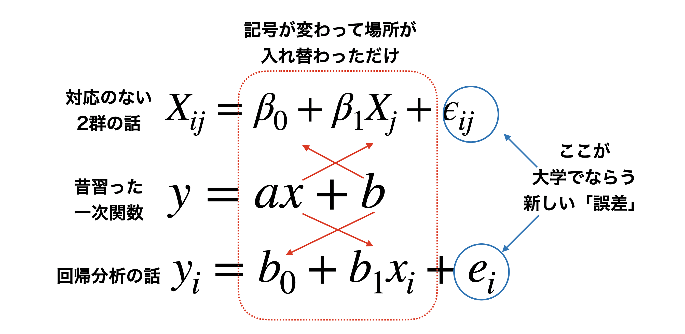

# 要因計画と平均値差の検定 {#chapter21}

ここまでは主に，平均値の比較に確率的判断の手続きを加えた仮説検定の話をしてきました。
ここでは前期の最後に学んだ，線形モデルから要因計画へと進んだ話に，[検定の話を統合します]{.underline}。線形モデルに確率的判断の手続きを加えたものが，と呼ばれる独自の体系になります。

今回の章のあらすじを先にまとめておきます。

1.  回帰分析における独立変数が離散的であれば，要因計画となる($\to$第[\[chapter12\]](#chapter12){reference-type="ref"
    reference="chapter12"}章)。回帰分析も要因計画もいずれも線形モデルで表現できるので，まとめてと呼ぶ。

    - 全体平均からの群平均の差分を効果と呼ぶ($\to$第[\[chapter12\]](#chapter12){reference-type="ref"
      reference="chapter12"}章,Pp.)。

    - 効果の全体を検証するためにはを計算するのでした(Pp.)。

    - 要因の数が増えるのは重回帰分析になるようなもの。ただし交互作用には注意して($\to$第[\[chapter13\]](#chapter13){reference-type="ref"
      reference="chapter13"}章,Pp.)。

    - 群内要因であれば，個人差の分散(平方和)も算出できる($\to$第[\[chapter14\]](#chapter14){reference-type="ref"
      reference="chapter14"}章)。

2.  平方和の比率が従う分布として F 分布というのが知られており，これを使うと標本の**誤差に対する効果の大きさ**がどれほど珍しいものであるのかを検証できる。

3.  帰無仮説が棄却されたことが，どの群間差で生じたのかを明らかにするために，を行うことでさらに精緻に分析する。

ここにあるように，まずは前期でやった線形モデルのことをよく思い出していただく必要があります。その上で，効果や誤差の「大きさ」として計算された平方和の比が従う分布を利用して，検定と接合することになります。検定は帰無仮説と対立仮説の勝負による判定にすぎないことに注意しつつ，また何が帰無仮説として置かれていたのかに注意して読み進めてください。

## 平均値の比較とモデル比較

後期に入ってから，確率の使い方が母集団を対象にしたものに変わりました。これまでは誤差が正規分布するから，という理由で確率が導入されていましたが，様々な誤差に影響された誤差まみれの数字は，正規分布するという正規分布の別の側面からアプローチしてきたのです。また，母集団と標本という区別をおくことで，母集団の分布についての仮定から，標本統計量の分布が考えられ，それを使って母数を推測するという方法を取りました。母数を推測するだけでなく，実践的な判断をする帰無仮説検定という手続きについても，解説してきました。

{#fig::21_01
width="10cm"}

さて，最初に帰無仮説検定の話をしたときに，これはモデル比較だと言いました($\to$Pp.,)。帰無仮説というモデル，対立仮説というモデルを比較して，どちらに軍配を上げるかという勝負判定をする，これが帰無仮説検定だと。

ここでの「モデル」という言葉は，たとえば帰無仮説は$\mu_1 - \mu_2 =0$とおく，といった表現がなされますから，前期の(線形)モデルという表現と異なるイメージを持ったかもしれません。しかしこれもモデル，しかも線形のモデルなのです。今からこの「帰無仮説検定」と「線形モデル」を概念的に統合することを説明してきます。

そのための例として，次のようなデータを用意しました(図[1.1](#fig::21_01){reference-type="ref"
reference="fig::21_01"})。これは対応のない，2 つの群(仮に実験群と統制群とします)の平均値をプロットしたものです。ここで示されている平均値は標本平均ですから，そこに差があるのは見た通りです。ちなみに黒い点は各群における個体 1 つ 1 つの観測値です。

### 神様の目から見た実験計画

ここで，同じデータを別の見方で捉えてみましょう。

今回の例において，従属変数である心理変数はどういう特徴なのか，目に見えないものなのでわかりません。でも，心の問題は無数の要因が積み重なった結果であると考えると，正規分布を仮定するのが自然です。つまり，実験群のひとも統制群のひとも，大きな視点から考えれば同じ人間という正規母集団からのサンプルなのです。

さて，実験参加者たちは実験者によって無作為に実験群と統制群に割り当てられました(RCT)。個人差がなければ，各群 1 名ずつのスコアを比較して考えれば良いのですが，人間を対象にしている以上そうはいきません。個人差がどうしても生じてしまうので，複数人を集めて個人差を相殺することを考えます。各群の平均値の違いを見ることで，操作の効果を見ることにするのです。

もしこの実験に効果がなければ，2 群の平均値は同じになるでしょう。この時の平均値は，実験群と統制群に分けた効果がないのですから，両群のスコアを足しあわせた全体平均になるはずです。効果がない=全体平均，なのです。しかし，群ごとに見てみると全体平均から違いが生じています。図[1.2](#fig::21_03){reference-type="ref"
reference="fig::21_03"}では，統制群は相対的に低く，実験群は相対的に高い平均値を示しています。この差分こそ(図[1.2](#fig::21_03){reference-type="ref"
reference="fig::21_03"}では短い緑の矢印で示しています)，実験の効果なのです。

{#fig::21_03
width="12cm"}

さて，群ごとの平均は次のように書くことができます。
$$\bar{X}_1 =\frac{1}{5} \sum_{i=1}^5 X_{i1}$$
$$\bar{X}_2 =\frac{1}{5} \sum_{i=1}^5 X_{i2}$$
また，全体平均次のように書くことができます[^1]。
$$\bar{X}_{gm} = \frac{1}{10} \sum_{i} \sum_{j} X_{ij}$$
これは標本を使った平均値ですが，本来は推定したい(群間の差がない)母平均について議論したいところです。$\bar{X}_{gm}$は母平均の推定値として使い道はありますが，理想化・抽象化して語れるのがモデルの良いところですから，ここでは全体平均を未知数を表すギリシア文字$\beta$をつかって$\beta_0$としておきましょう。

さて次に，群わけの効果を$\beta_1$としましょう。すると各群の平均のモデルは
$$\mu_1= \beta_0 + \beta_1$$ $$\mu_2 = \beta_0  -\beta_1$$
と表すことができます。左辺も各群の母平均なので，未知数を表すギリシア文字になっています。

つづいて，ここでの個人差はこの実験で制御できない誤差であり，群平均を中心にどういう向きで出るかわからないものですから，このことを表現するなら，
$$X_{ij} = \mu_j + \epsilon_{ij}$$
ということになります。これらを組み合わせると，
$$X_{i1} = \beta_0 + \beta_1 + \epsilon_{i1}$$
$$X_{i2} = \beta_0 - \beta_1 + \epsilon_{i2}$$
と書くことができます。ここで一工夫。$\beta_1$にプラス，マイナスの符号がついているのは，$+1,-1$を掛け算していると考えてみましょう。この符号を決めているものを$X_{1}=+1,X_{2}=-1$と表したとすると，まとめて次のように書くことができます。

$$
\label{eq::21_1}
     X_{ij} = \beta_0 +  \beta_1 X_{j} + \epsilon_{ij}
$$

これ，どこかで見覚えありませんか。そうです，前期の間にやった回帰分析と同じ形をしているのです($\to$第[\[chapter8\]](#chapter8){reference-type="ref"
reference="chapter8"}講参照)。

さて回帰分析を今ここで大雑把に復習しておきますと，2 つの変数$x_i,y_i$があったときに，両者の間に何らかの関数関係がある，と考えましょうという話でした。関数関係とは，一方を定めれば他方も定まるという関係ですから，この関係を数式で表現してやれば予測もできるぞ，嬉しいぞ。ということで，最も簡単な関数関係って何だ？
そう，中学校の時にやった一次関数$y=ax+b$だよね，ということでした。ただ中学校の時の話とは違って，データがたくさんあり，かつ，全部にぴったり当てはまる線は引けない。なので，ちょっと誤差はあるけどだいたいあってる線を引こうね，ということを考えたのでした。この関数(一次関数，線形関数，線形モデル)で予測される値を$\hat{y}_i$と表したとすると,

$$\hat{y}_i = b_0 + b_1x_i$$
データ$y_i$は予測値$\hat{y}_i$に誤差$e_i$がついて現れるから，
$$y_i = \hat{y}_i + e_i$$ なので，これを統合して
$$y_i = b_0 + b_1 x_i + e_i$$ としたのでした。

さてさて。記号で$y_i,x_i$とか$b_0,b_1$だったのが$\beta_0$とか$\beta_1$などと変わってはいますが，基本的には$y=ax+b$の一次線形関数の形です(図[1.3](#fig::21_05){reference-type="ref"
reference="fig::21_05"})。

{#fig::21_05
width="12cm"}

先ほど，効果がない＝全体平均，という言い方をしました。効果のことを，記号$\beta_1$で表しているのですから，効果がないというのは$\beta_1=0$ということです。そうすると$\beta_1X_j$
の項が消えてしまいます。つまり，全体平均$\beta_0$に誤差$\epsilon_{ij}$がついただけで，データは 1 つの正規分布から出てきたまま，ということになります。

1 つの共通の正規分布。2 つの群に分かれない，同じ正規分布。そろそろ帰無仮説検定と繋がってきたのではないでしょうか。効果がない，というのはまさに，帰無仮説のことですよね。つまり帰無仮説は，$\beta_1=0$という傾きゼロの直線，図[1.2](#fig::21_03){reference-type="ref"
reference="fig::21_03"}では群平均を横切っている，横一線の線形モデルだったのです。平均値の差の検定というのは，群平均が横一直線＝傾きゼロではないよ，という結論を出すためのロジックであり，比較される対立仮説は「傾きゼロでない何か」というモデルです。

- 帰無仮説 H0: $\mu_1 = \mu=2$ $\to$
  線形モデルにおける傾きの係数$\beta_1=0$

- 対立仮説 H1: $\mu_1 \neq \mu=2$ $\to$
  線形モデルにおける傾きの係数$\beta_1\neq 0$

帰無仮説が傾きゼロという一点ばりに対し，対立仮説はゼロ以外であれば何でも良いというラフなモデルです。ですから帰無仮説が棄却されたとしても「差がなくはない」という程度のもので，「じゃあゼロでない，何なのか」ということまでは強く主張できません。帰無仮説検定は補助的に使いつつ，実質はどのように傾いているのか，差の信頼区間はどの程度あるのか，効果量(標準化された平均値の差)は大きいのかといった，実質的な大きさを考えることが重要です。

また，前期の回帰分析の時は最小二乗法を使って回帰係数を求めたのでした($\to$第[\[chapter9\]](#chapter9){reference-type="ref"
reference="chapter9"}章，Pp.)。ただ，その時は推測統計学的な発想を導入していませんでした。データに最もうまく適合するために計算すると，とにかく求められるよ，という説明の仕方だったかと思います。手元のデータの話，つまり標本の話しかしていませんでしたので，係数として$b_0,b_1$と書いていたのですが，推測統計学の枠組みでこれを考えると，我々が知りたいのは母集団における傾き，母数だということになりますので，今回ギリシア文字$\beta_1$とか$\epsilon_{ij}$とします。

平均値差の検定と回帰分析は同じものなのだ，という話をしてきました。いずれも正規分布を仮定しており，その意味が「心理現象に仮定される全体傾向をあらわす分布」なのか「誤差の分布」なのか，という微妙な出自の違いを持っていると言えるかもしれません。しかし数学的には同じことなので，どちらの筋道からでも考えて，同じように利用できます。

また，回帰分析の係数を最小二乗法で求めたように，推測統計の枠組みで平均値を推定するのに最小二乗法を使うのだろうか，と考えている人もいるかもしれません。実はこれが大変興味深いところなのですが，推測統計の枠組みでは正規分布という確率分布を利用しますから，誤差を最小にしようという解析的な[^2]方法とは異なる考え方を使う必要があります。確率分布を使った母数の推定方法として，とという二種類の方法を今後説明していきますが，結論だけ先にいっておくと，幸いにして最小二乗法による答えと最尤法による答えは**ぴったり一致します**。

ちなみにこれまでやってきた，標本平均や標本分散から母数を推定する方法は，「」というやり方に分類されます。何であれ，同じデータであれば推定値はだいたい同じになります。同じものを推定しようとしてるのですから，違ってきたらむしろ困りますわね。

## 一要因 Between デザインの検定

さて，これまでは 2 水準の平均値の比較について話をしてきましたが，3 水準以上になるとどうなるのでしょうか？
これも，基本的には線形モデルの延長で考えることができます。たとえば表[1.1](#table::21_02){reference-type="ref"
reference="table::21_02"}のようなデータがあったとしましょう。要因は 1 つですが水準は 3 つで，群間デザインの例です。

::: {#table::21_02}
id condition notation value

---

     1      1       $X_{11}$        6
     2      1       $X_{21}$        6
     3      1       $X_{31}$        5
     4      1       $X_{41}$        5
     1      2       $X_{12}$        7
     2      2       $X_{22}$        4
     3      2       $X_{32}$        7
     4      2       $X_{42}$        6
     1      3       $X_{13}$        4
     2      3       $X_{23}$        3
     3      3       $X_{33}$        4
     4      3       $X_{43}$        6

: 一要因 3 水準 Between 計画のデータ
:::

[\[table::21_02\]]{#table::21_02 label="table::21_02"}

それぞれの群平均は，$\bar{X}_1 = 5.5,\bar{X}_2 = 6.0,\bar{X}_3 = 4.25$であり，全体平均は$\bar{X}_{gm}= 5.25$になります。
帰無仮説検定の文脈で考えれば，帰無仮説は「母平均に差がない」という仮説になりますから，記号で言えば$\mu_1 = \mu_2 = \mu_3$になります。
線形モデルで考えれば，図[1.4](#fig::21_06){reference-type="ref"
reference="fig::21*06"}にあるように，傾きのない線形モデル，つまり$X*{ij} = \bar{X}_{gm} + \epsilon_{ij}$の横一線ということになります。

{reference-type="ref"
reference="table::21_02"}を可視化したもの。全体平均からの矢印は群効果の大きさ](../images/text21/slide21_06.png){#fig::21_06
width="12cm"}

対立仮説は帰無仮説の否定ですから，横一線の直線ではない(傾きがある)，あるいは母平均のどこかに差がある，というものになります。横一線ではない，という話ではありますが，右上がりの直線なのか，左下りの直線なのか，という話は一概にできないことに注意してください。というのも，横軸の水準 1/2/3 は名義尺度水準に過ぎないからです。水準 1/2/3 が「統制群」「操作 A をした群」「操作 B をした群」であったとして，統制群が 1 である理由はとくになく，2 でも 3 でも構いません。[名義尺度水準は，対象と数字が一対一対応している]{.underline}ことがその要件であって，数字の並びに意味がないからです。図[1.4](#fig::21_06){reference-type="ref"
reference="fig::21_06"}を見ると，水準 1 から 2 に向けては右上がり，水準 2 から 3 に向けては右下がりになって，一本の直線では表現できないですね。ただこれの並びを変えて，水準 3/1/2 の順番にすると右上がりの直線をあてがうことが可能です(図[1.5](#fig::21_07){reference-type="ref"
reference="fig::21_07"})。もちろん水準 2/1/3 の順にして右下がりの直線を当て嵌めても構いません。いずれもデータの持つ情報は同じです。ですから，対立仮説としては「横一線ではない」「母平均が同じではない」とするに留めましょう。

{#fig::21_07
width="12cm"}

- 帰無仮説 H0: $\mu_1 = \mu=2 = \mu_3$ $\to$
  線形モデルにおける傾きの係数$\beta_1=0$

- 対立仮説 H1: H0 ではない。 $\to$
  線形モデルにおける傾きの係数$\beta_1\neq 0$

要因計画に帰無仮説検定の要素を加えた分析方法をとくに，と呼びます。と略して言われることもあります。「分散」分析といっていますが，やっていることは「平均値差の検定」であることに注意してください。どうして分散と呼んでいるのかは，直線が右上がりなのか，右下がりなのか一概に決められないことと関係があります。プラスにもマイナスにも変動するので，符号の効果をなくすべく二乗することで計算を進めるからです。

さて，前期の間は二乗して効果の大きさを算出するところまではやったのですが，効果と誤差をどうやって比較するか，ということについては伏せたままでした。
というのも，推測統計学的な枠組みがなければ比較方法に言及できず，また帰無仮説検定の枠組みがなければ判断基準に言及できなかったからです。今ではこれらを使って説明できます。二乗してたし合わせたもの，すなわちがどのような分布に従うのかを考え，理論分布から統計量を計算すれば良いわけです。その方法についてみていくことにしましょう。

### 帰無仮説検定の手続き

分散分析は，多水準の平均値差を検定する考え方です。帰無仮説検定の一種ですから，例の形式的手続きは踏襲していきます。

##### 仮説の設定

帰無仮説と対立仮説が必要です。既に述べたように，帰無仮説は母平均に差がないというものですから，$H_0 : \mu_1 = \mu_2 = \mu_3$
になり，対立仮説はこの否定になります。勘の良い人はここで「おや，まてよ？
」と思うかもしれません。そうです，この帰無仮説，いろんな否定の仕方が考えられるのです。つまり，

- $\mu_1 \neq \mu_2$だけど，$\mu_3$については$\mu_1=\mu_3$なのか$\mu_2=\mu_3$なのかわからない。

- $\mu_1 \neq \mu_3$だけど，$\mu_2$については$\mu_1=\mu_2$なのか$\mu_3=\mu_2$なのかわからない。

- $\mu_2 \neq \mu_3$だけど，$\mu_1$については$\mu_2=\mu_1$なのか$\mu_3=\mu_1$なのかわからない。

- $\mu_1 \neq \mu_2 \neq \mu_3$，つまりとにかく全部違う

の 4 パターン考えられます。実はこれ，全て対立仮説の一員なのです。線形モデルとしては横一線でなければよい，ということなので，どこかに(統計的に有意なレベルでの)傾きがあれば良いということになります。

##### 検定統計量を選択

平均値の推定ですが，分散を検定対象にするので$F$分布というものを使います。

##### 判断の基準になる確率を設定

有意水準$\alpha$，今回も 5%で勝負を決めるとしましょう。

##### 検定統計量の実現値を計算

検定統計量$F$の実現値の計算は，先ほどの表[\[table::21_03\]](#table::21_03){reference-type="ref"
reference="table::21_03"}から行います。群の効果の列，誤差の効果の列を全て二乗して足し合わせることで，平方和の計算ができます。

つまり，次のように考えます[^3]。

$$\sum_{i}\sum_{j} (X_{ij} - \bar{X}_{gm})^2 = n\sum_j \beta_j + \sum_{i}\sum_{j} \epsilon_{ij}$$

::: {#tbl::21_04}
value 全体平均 群平均 平均偏差 群の効果 誤差 平均偏差の二乗 効果の二乗 誤差の二乗

---

    6.000      5.250    5.500      0.750      0.250    0.500            0.562        0.062        0.250
    6.000      5.250    5.500      0.750      0.250    0.500            0.562        0.062        0.250
    5.000      5.250    5.500     -0.250      0.250   -0.500            0.062        0.062        0.250
    5.000      5.250    5.500     -0.250      0.250   -0.500            0.062        0.062        0.250
    7.000      5.250    6.000      1.750      0.750    1.000            3.062        0.562        1.000
    4.000      5.250    6.000     -1.250      0.750   -2.000            1.562        0.562        4.000
    7.000      5.250    6.000      1.750      0.750    1.000            3.062        0.562        1.000
    6.000      5.250    6.000      0.750      0.750    0.000            0.562        0.562        0.000
    4.000      5.250    4.250     -1.250     -1.000   -0.250            1.562        1.000        0.062
    3.000      5.250    4.250     -2.250     -1.000   -1.250            5.062        1.000        1.562
    4.000      5.250    4.250     -1.250     -1.000   -0.250            1.562        1.000        0.062
    6.000      5.250    4.250      0.750     -1.000    1.750            0.562        1.000        3.062
     合計                           0.00       0.00     0.00            18.25         6.50        11.75

: 差分の計算
:::

[\[tbl::21_04\]]{#tbl::21_04 label="tbl::21_04"}

表[1.2](#tbl::21_04){reference-type="ref"
reference="tbl::21*04"}の最後の行を見てくださいね。平均偏差の二乗和($\sum*{i}\sum*{j} (X*{ij} - \bar{X}_{gm})^2$)が18.25で，これが効果の二乗($n\sum_j \beta_j$)の6.50と，誤差の二乗($\sum_{i}\sum\_{j}$)の 11.75 に分解できています。

この，11.75 と 6.50 を比べてどちらが大きいかという勝負になるのですが，この平方和を比べてみればもちろん誤差の方が大きいですよね。でも大事なのは，この分散が一単位あたりどれぐらい大きかったか，という点にあります。誤差の方，11.75 はデータ全体から生み出されていますが，効果の方，6.50 は 3 つの水準から生み出されたわけです。この違いを加味して統計量を計算します。

検定統計量$F$は，分散の比の確率分布に従います。今はまだであって分散ではありません。二乗してたしただけで，足した数で割らなければならないのです。ここで割る数が何かと考えると，全体は(不偏分散で考えるので)$N-1$ですが，要因や誤差は要因を生み出した要素の数(マイナス 1)，誤差を生み出した要素の数(マイナス 1)で考える必要があるのです。こうした一要素あたりの平均的な大きさのことをと言います。

群の効果は，3 つの水準でこの平方和を作り出したわけですから，一単位は$3-1=2$で考えて，MS は
$$6.50 / (3-1) = 3.250$$
となります。また，誤差の一単位あたりの大きさは，各群の平均と各値の差分で作られており，各群に 4 人配置されていますから，各群の誤差の自由度($4-1$)が 3 群あると考えて
$$11.75/3(4-1)=11.75/9 = 1.306$$ です。

F 分布に従う検定統計量は，この MS の比率です。ここでは「誤差に比べてどれぐらい効果が大きかったか」がみたいのですから，効果の MS を誤差の MS で割って$F$値を算出します。
具体的には， $$F = 3.250/1.306 = 2.489$$ ということになります。

$F$値は F 分布に従います。比の分布なので，分布の形状を決める自由度は分子と分母の 2 つが必要です。自由度は先ほどの一単位を計算した値であり，分子の自由度$df_1 =2$，分母の自由度$df_2 = 9$の$F$分布からその出現確率を計算し，これが 0.1379077 とでます[^4]。5%水準で有意，とは言えませんでしたね。

##### 分散分析表

なんだこの面倒な計算！と思った方も多いかと思います。少なくとも私は初めて習った時は，わけがわからなくなりました。まずは「分散(平方和)の分割をする」ことと「分散の比で比較する」ということをしっかりと抑えてくれれば OK です。というのも，この手の面倒な計算はコンピュータがやってくれるからです。

その演習は次回に譲りますが，機械で計算した結果は次のようなにまとめて報告することが一般的です(表[1.3](#tbl::21_05){reference-type="ref"
reference="tbl::21_05"})。

::: {#tbl::21_05}
Df SS MS F value $p$

---

condition 2 6.500 3.250 2.489 0.138
Residuals 9 11.750 1.306

: ANOVA Table
:::

[\[tbl::21_05\]]{#tbl::21_05 label="tbl::21_05"}

この表にあるように，平方和(SS)$\to$自由度(df)をつかって平均平方(MS)$\to$比率の F 比$\to$$p$値の計算，という流れになっていることを確認してください。

結果をレポートなどで報告するときは，この表とともに，

> 一要因 3 水準の分散分析を行ったところ，$F(2,9)=2.489,p=0.138$で，水準間に統計的に有意な差はみられなかった。

などとします。

##### 効果量は?

帰無仮説検定で，差があったかなかったか，という判断だけで終わらせるのではなく，どの程度の差があったのかについて報告しないといけないのでした。分散分析における効果量は，全体の分散のうち効果の分散がどれほどの量であったかという比率，つまり効果量=効果の分散/全体の分散=1 -
(誤差の分散/全体の分散),で算出できます。これを$\epsilon^2$(イプシロンの二乗)といいます[^5]。

とはいえ，母集団における効果の分散，母集団における誤差の分散は分かりませんので，標本の不偏分散をつかって標本効果量として推定するしかありません。今回，全体の標本(不偏)分散は，表[1.2](#tbl::21_04){reference-type="ref"
reference="tbl::21_04"}の「平均偏差の二乗」列の一番下にある 18.25，これを$12-1=11$で割った$18.25/11=1.659091$ですから，

$$\epsilon^2 = 1 - \frac{1.306}{1.659} = 0.2127788$$

となりました。合わせて報告した方が良いでしょう。

### 事後の検定

さて，分散分析の結果として「有意である」という判断がなされた，つまり帰無仮説が棄却されて対立仮説が採択されたとき，複数考えられた対立仮説のどれが成立しているんでしょうか。実は，これはわかりません。帰無仮説じゃないことが明らかになっただけですから。

じゃあどうするか。簡単に思いつくのは，上のいくつかの対立仮説サブモデルを，虱潰しに検証していくことです。すなわち，1 群と 2 群，1 群と 3 群，2 群と 3 群というペアにして，対応のない$t$検定を 3 回やれば良いのでは，と考える方もいるでしょう。水準数が 4 つになると 1-2,1-3,1-4,2-3,2-4,3-4 の 6 ペア，5 つになると 1-2,1-3,1-4,1-5,2-3,2-4,2-5,3-4,3-5,4-5 の 10 ペア・・・と水準数が増えれば手間は増えますが，なぁに機械が計算してくれるんだから努力で勝負！というところですね。

ですが，この考え方はこのままではうまく機能しません。既に第[\[chapter19\]](#chapter19){reference-type="ref"
reference="chapter19"}章(Pp.)で学んだように，検定の繰り返しはタイプ 1 エラーの可能性を広げてしまいます。

ではどうすれば良いのか，ということになりますよね。この分散分析のあとの検定のことをとかといったりしますが，この事後検定については様々な方法が提案されており，どれが良い・悪いと一概には言えないところがあります(それだけで専門書一冊出ているぐらいで[@BA33892274])。とは言え，それでは困るでしょうから，2 つほど方法を紹介しておきます。

##### Bonferroni の方法

さてここで問題になっているのは，基本的に$\alpha$レベルのインフレなのですから，これを低く調節してやれば良いのではないか，というのが 1 つの解決策です。たとえば今回は 3 つの対立仮説があって，全部で 5%水準を保ちたいわけですから，$0.05/3=0.017$として判断するようにしよう，というものです。これは直感的でわかりやすい基準ですね。この方法はさらにいろいろ改良版(Holm 法，Shaffer
法，Holland-Copenhaver 法)があります。

##### Tukey の HSD 法

これが最も一般的で，よく使われている方法です[^6]。ここでは各対について別の統計量$q$を計算し，これが基準となるラインをクリアするかどうか，で判断します。

この他にも，統計パッケージによって様々な方法・オプションがあります。ですので，大事なのは「どの分析方法を使って，どのように判断したか」をしっかりと記録し，報告することだと思っておいてください。

## 二要因計画モデルの検定

では引き続き，二要因の実験デザインを検定することを考えましょう。

ここでは第[\[chapter13\]](#chapter13){reference-type="ref"
reference="chapter13"}章(Pp.)でやった，二種類の銘柄のコーヒーをホットで飲むかアイスで飲むか，というデータを例にしたいと思います。
要因は銘柄と温度，二要因ですからも計算に入れないといけない，という話でしたね。
ここに表[\[tbl::13_04\]](#tbl::13_04){reference-type="ref"
reference="tbl::13_04"}を再掲しておきます。それぞれの効果や誤差の大きさ，平方和が算出されています。

::: {#tbl::21_06}
全体平均 温度の効果 銘柄の効果 交互作用 誤差 評価

---

        9.75        -0.25        +0.75   +1.75     +1.00       13
        9.75        -0.25        +0.75   +1.75     -1.00       11
        9.75        -0.25        +0.75   +1.75     0.00        12
        9.75        -0.25        -0.75   -1.75     0.00         7
        9.75        -0.25        -0.75   -1.75     -1.00        6
        9.75        -0.25        -0.75   -1.75     +1.00        8
        9.75        +0.25        +0.75   -1.75     0.00         9
        9.75        +0.25        +0.75   -1.75     0.00         9
        9.75        +0.25        +0.75   -1.75     0.00         9
        9.75        +0.25        -0.75   +1.75     +2.00       13
        9.75        +0.25        -0.75   +1.75     0.00        11
        9.75        +0.25        -0.75   +1.75     -2.00        9
      平方和         0.75         6.75   36.75     12.00    56.25

: 再掲；平方和の計算
:::

[\[tbl::21_06\]]{#tbl::21_06 label="tbl::21_06"}

この平方和の比率が，F 分布に従うという性質を利用して，検定的判断を下します。
形式的な手続きは次の通りです。

##### 仮説の設定

帰無仮説と対立仮説が必要です。既に述べたように，帰無仮説は母平均に差がないというものです。ここではどこをどう切り取っても母平均に差がない，ということになります。1 つ目の要因の第一水準(温度要因のホット)で，2 つ目の要因の第二水準(メーカー要因の銘柄 B)の母平均を$\mu_{12}$とすると，帰無仮説は$H_0:\mu_{11}=\mu_{12}=\mu_{21}=\mu_{22}$ということになります。対立仮説はこの否定です。

##### 検定統計量を選択

平均値の推定ですが，分散を検定対象にするので$F$分布というものを使います。

##### 判断の基準になる確率を設定

有意水準$\alpha$，今回も 5%で勝負を決めるとしましょう。

##### 検定統計量の実現値を計算

検定統計量$F$の実現値の計算は，先ほどの表[1.4](#tbl::21_06){reference-type="ref"
reference="tbl::21_06"}にある平方和を基に計算します。自由度を加味して 1 単位あたりの効果の大きさにしてから比べますので，分散分析表にまとめて表示しちゃいましょう。

::: {#tbl::22_04}
Df SS MS F value $p$

---

温度 1.000 0.750 0.750 0.500 0.500
メーカー 1.000 6.750 6.750 4.500 0.067
交互作用 1.000 36.750 36.750 24.500 0.001
誤差 8.000 12.000 1.500

: ANOVA Table
:::

[\[tbl::22_04\]]{#tbl::22_04 label="tbl::22_04"}

ここでも，平方和(SS)$\to$自由度(df)をつかって平均平方(MS)$\to$比率の F 比$\to$$p$値の計算，という流れになっていることを確認しておきましょう。

さて，これをみると，温度の主効果はなく($F(1,8)=0.50,p=0.500$)，メーカーの主効果もなく($F(1,8)=4.50,p=0.067$)，交互作用がある($F(1,8)=24.50,p=0.001$)ことがわかります。今回各 2 水準ですので，主効果については事後検定をする必要はありません。交互作用がみられた場合は，どこに違いがあったのかさらに分析を進める必要があります。各水準ごとにデータを分割し(要因 A の第 1 水準，第 2 水準，要因 B の第 1 水準，第 2 水準)，その中でどこに差があるのかを探索します。今回の例で言えば，1.ホットの時に銘柄 A/B に差はあるか，2.アイスの時に銘柄 A/B に差があるか，3.銘柄 A においてホット/アイスで差があるか，4.銘柄 B においてホット/アイスで差があるか，の 4 パターンを検証することになります。もちろん検定の多重性の問題がありますから，Bonferroni や
Tukey の方法などで補正する必要があります。

また，効果量も計算して報告するのが良いでしょう。これらの話は統計パッケージが自動的にしてくれることが多いので，R の演習の時まで，細かい話はお預けにしておきます。

## 課題

##### Between 計画の ANOVA Table を書いてみよう

あるスナック菓子を三人のこどもそれぞれに買い与えたが，お菓子の長さに差があると言って喧嘩を始めてしまいました。
彼らの主張が妥当かどうか検証するために，それぞれの菓子袋から棒状のお菓子 4 本ずつをサンプリンングし，長さを測定したのが次の表[1.6](#anovaExample1){reference-type="ref"
reference="anovaExample1"}です。
それぞれの効果などは計算してあります。これを使って分散分析表を書いてみましょう。

::: {#anovaExample1}
id 袋 長さ GM mean diff eff err $SS_{diff}$ $SS_{eff}$ $SS_{err}$

---

       1 A         6   10.333    8.25   -4.333   -2.083   -2.25        18.778        4.340        5.062
       2 A         8   10.333    8.25   -2.333   -2.083   -0.25         5.444        4.340        0.062
       3 A        10   10.333    8.25   -0.333   -2.083    1.75         0.111        4.340        3.062
       4 A         9   10.333    8.25   -1.333   -2.083    0.75         1.778        4.340        0.562
       5 B        17   10.333   13.75    6.667    3.417    3.25        44.444       11.674       10.562
       6 B        11   10.333   13.75    0.667    3.417   -2.75         0.444       11.674        7.562
       7 B        14   10.333   13.75    3.667    3.417    0.25        13.444       11.674        0.062
       8 B        13   10.333   13.75    2.667    3.417   -0.75         7.111       11.674        0.562
       9 C         7   10.333    9.00   -3.333   -1.333   -2.00        11.111        1.778        4.000
      10 C         7   10.333    9.00   -3.333   -1.333   -2.00        11.111        1.778        4.000
      11 C        12   10.333    9.00    1.667   -1.333    3.00         2.778        1.778        9.000
      12 C        10   10.333    9.00   -0.333   -1.333    1.00         0.111        1.778        1.000
    合計         124                     0.000    0.000    0.00       116.667       71.167       45.500

: お菓子の長さデータ
:::

[\[anovaExample1\]]{#anovaExample1 label="anovaExample1"}

表[1.7](#Example1Ans){reference-type="ref"
reference="Example1Ans"}の(あ)〜(お)に当てはまる数字を答えてください。

::: {#Example1Ans}
SS Df MS F value $p$

---

お菓子の袋 (あ) (う) 35.5833 (お) 0.0144
残差 (い) 9 (え) 5.0565

: お菓子データの ANOVA Table
:::

[\[Example1Ans\]]{#Example1Ans label="Example1Ans"}

##### 二要因計画の ANOVA Table を書いてみよう

この街には，ファーストフードのチェーン店が 2 つ展開しています(A/B)。いずれもハンバーガー(H)とチーズバーガー(C)がメニューにあります。
各店舗でハンバーガーとチーズバーガーを 3 つずつ買ってきて，それぞれの重さを測った結果が表[1.8](#anovaExample2){reference-type="ref"
reference="anovaExample2"}です。
ショップの違いによる効果やメニューの違い，交互作用の効果，誤差，それぞれの平方を取ったものなどは計算してあります。
これを使って分散分析表を書いてみましょう。

::: landscape
::: {#anovaExample2}
id Shop Menu Weight GM diff $E_{shop}$ $E_{menu}$ $E_{int.}$ error $SS_{diff}$ $SS_{shop}$ $SS_{menu}$ $SS_{int.}$ $SS_{e}$

---

       1 A      H            55   50      5        2.333            2        1.667   -1.000            25         5.444             4         2.778      1.000
       2 A      H            56   50      6        2.333            2        1.667    0.000            36         5.444             4         2.778      0.000
       3 A      H            57   50      7        2.333            2        1.667    1.000            49         5.444             4         2.778      1.000
       4 A      C            49   50     -1        2.333           -2       -1.667    0.333             1         5.444             4         2.778      0.111
       5 A      C            49   50     -1        2.333           -2       -1.667    0.333             1         5.444             4         2.778      0.111
       6 A      C            48   50     -2        2.333           -2       -1.667   -0.667             4         5.444             4         2.778      0.444
       7 B      H            48   50     -2       -2.333            2       -1.667    0.000             4         5.444             4         2.778      0.000
       8 B      H            49   50     -1       -2.333            2       -1.667    1.000             1         5.444             4         2.778      1.000
       9 B      H            47   50     -3       -2.333            2       -1.667   -1.000             9         5.444             4         2.778      1.000
      10 B      C            47   50     -3       -2.333           -2        1.667   -0.333             9         5.444             4         2.778      0.111
      11 B      C            47   50     -3       -2.333           -2        1.667   -0.333             9         5.444             4         2.778      0.111
      12 B      C            48   50     -2       -2.333           -2        1.667    0.667             4         5.444             4         2.778      0.444
    合計                                           0.000            0        0.000    0.000           152        65.333        48.000        33.333      5.333

: ハンバーガーの重さ比較
:::

[\[anovaExample2\]]{#anovaExample2 label="anovaExample2"}
:::

表[1.9](#Example2Ans){reference-type="ref"
reference="Example2Ans"}の(か)〜(こ)に当てはまる数字を答えてください。

::: {#Example2Ans}
SS Df MS F value $p$

---

Shop (か) 1 65.333 (け) 0.001
Menu (き) 1 48.000 (こ) 0.001
Interaction (く) 1 33.333 50.000 0.001
Residual 5.333 8 0.6667

: ANOVA Table
:::

[\[Example2Ans\]]{#Example2Ans label="Example2Ans"}

[^1]: gm は grand mean の略です。
[^2]: 解析的なという言葉は，ここでは確率的でない，という意味でつかています。
[^3]: 群の効果$\beta_j$は同じ大きさのものが群の人数分，つまり$n=4$だけあるので，$n\sum_j \beta_j$としています。
[^4]: R で F 分布の確率関数は`f`ですから，`1-pf(2.489,df1=2,df2=9)`として算出します。
[^5]: 他にも同じような意味を持つ$\eta^2$という指標もよく使われます。
[^6]: ただし「よく使われている」から「正しい」とか「優れている」というわけではありません。それぞれの方法に，それぞれの仮定・前提，注目するところ・強調するところなどが変わって来ますし，「よく使われる」というのは実質的に「よく使う統計ソフトパッケージがこの統計量を計算してくれる」ぐらいの意味しかないこともあるからです。
