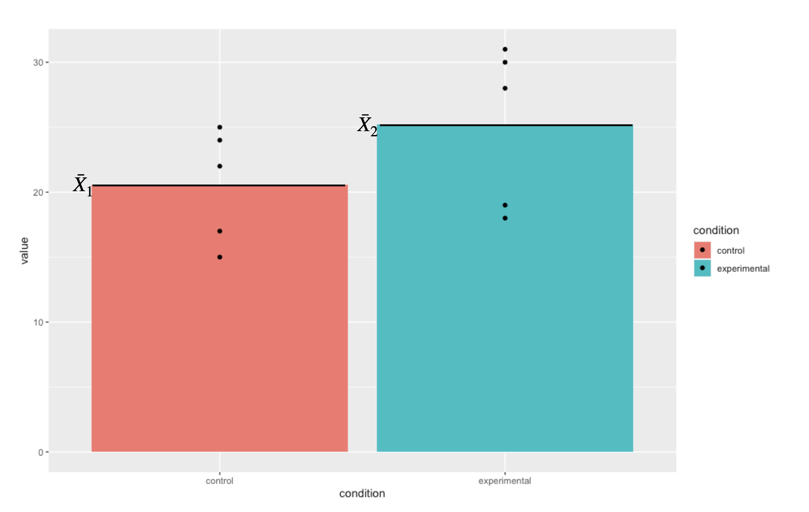
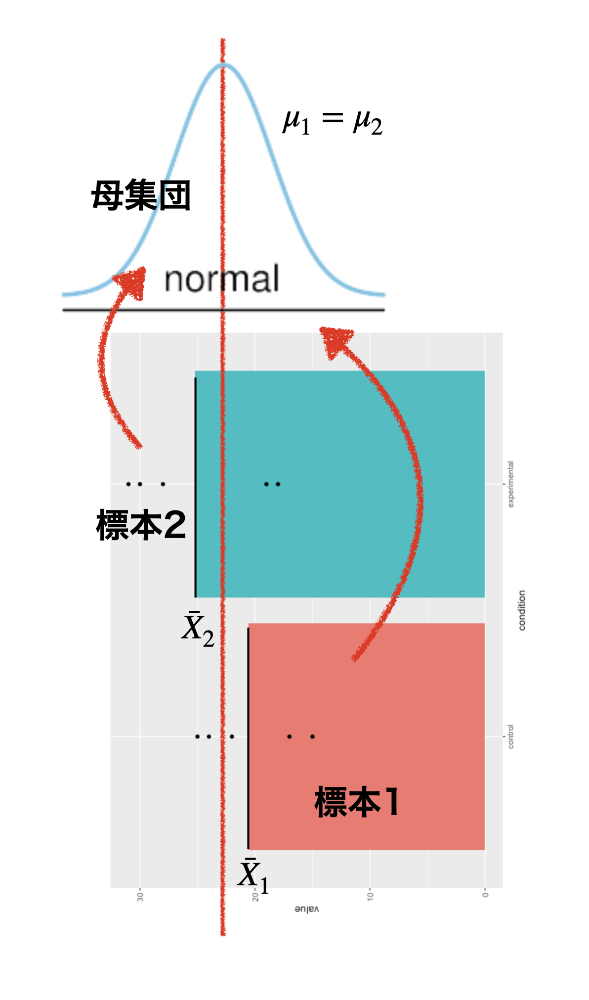
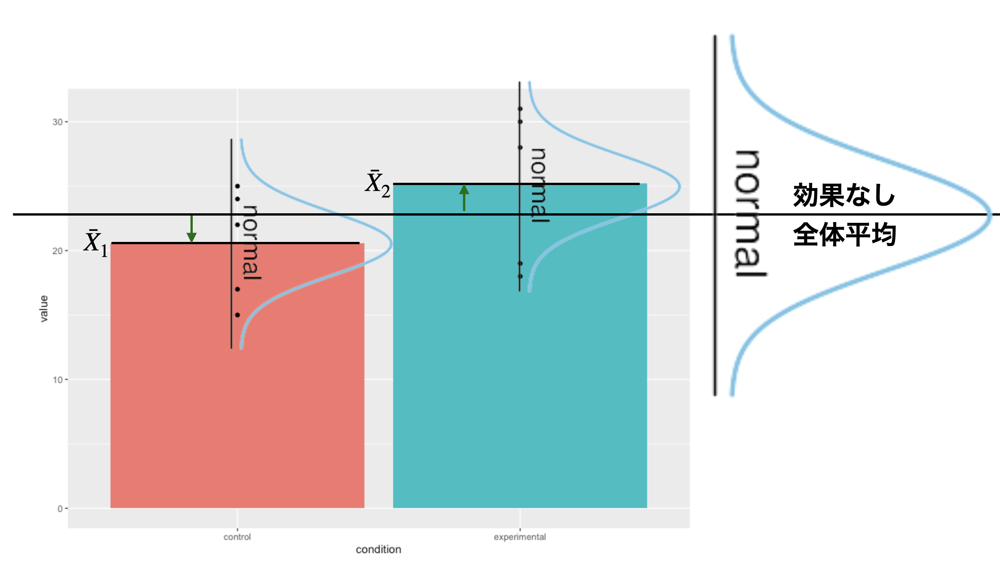
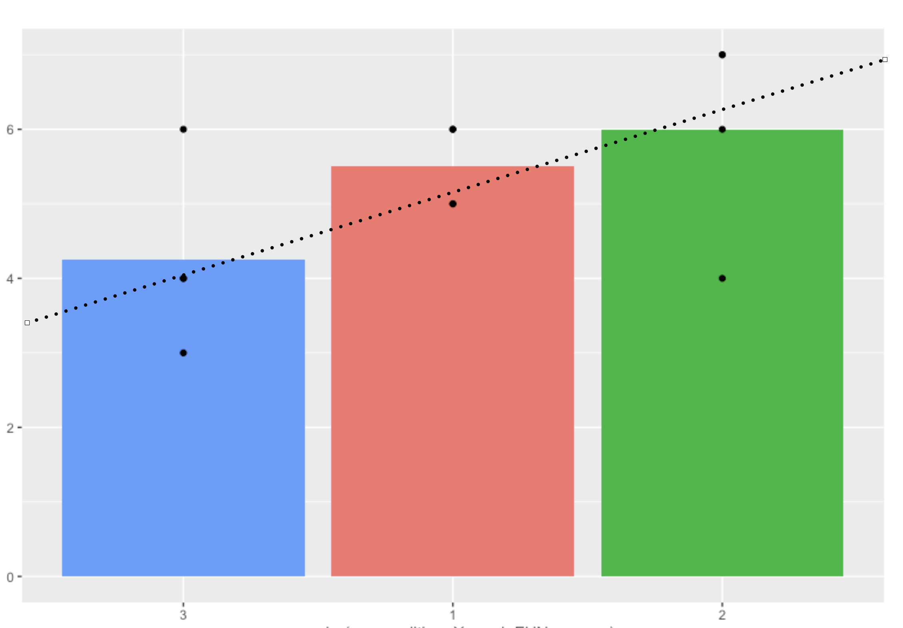

# 要因計画と平均値差の検定 {#chapter21}

ここまでは主に，平均値の比較に確率的判断の手続きを加えた仮説検定の話をしてきました。
ここでは前期の最後に学んだ，線形モデルから要因計画へと進んだ話に，検定の話を統合します。線形モデルに確率的判断の手続きを加えたものが，分散分析と呼ばれる独自の体系になります。ここでは線形モデルの一環であることを意識しつつ，質的説明変数によって水準同士の対比較になることによる分析の手順について理解することを目的とします。水準が多くなった場合の対比較には，検定の多重性の問題が影響してくるため，問題を回避するために多重比較という考え方も導入する必要があります。

## 平均値の比較とモデル比較

前期の話の流れを思い出すと，わからないことをモデルで考え(第[\[chapter5\]](#chapter5){reference-type="ref"
reference="chapter5"},[\[chapter6\]](#chapter6){reference-type="ref"
reference="chapter6"},[\[chapter7\]](#chapter7){reference-type="ref"
reference="chapter7"}章)，関係性を線形モデルで表現し(第[\[chapter8\]](#chapter8){reference-type="ref"
reference="chapter8"},[\[chapter9\]](#chapter9){reference-type="ref"
reference="chapter9"}章)，その特例(説明変数が離散的)としての実験計画法(第[\[chapter12\]](#chapter12){reference-type="ref"
reference="chapter12"},[\[chapter13\]](#chapter13){reference-type="ref"
reference="chapter13"},[\[chapter14\]](#chapter14){reference-type="ref"
reference="chapter14"}章)，という流れでした。

後期に入ってから，確率の使い方が母集団を対象にしたものに変わりました。これまでは誤差が正規分布するから，という理由で確率が導入されていましたが，様々な誤差に影響された誤差まみれの数字は，正規分布するという正規分布の別の側面からアプローチしてきたのです。また，母集団と標本という区別をおくことで，母集団の分布についての仮定から，標本統計量の分布が考えられ，それを使って母数を推測するという方法を取りました。母数を推測するだけでなく，実践的な判断をする帰無仮説検定という手続きについても，解説してきました。

::: wrapfigure
r8cm {width="8cm"}
:::

さて，最初に帰無仮説検定の話をしたときに，これはモデル比較だと言いました。帰無仮説というモデル，対立仮説というモデルを比較して，どちらに軍配を上げるかという勝負判定をする，これが帰無仮説検定だと。
ここでの「モデル」という言葉は，例えば帰無仮説は$\mu_1 - \mu_2 =0$とおく，といった表現がなされますから，前期の(線形)モデルという表現と異なるイメージを持ったかもしれません。しかしこれもモデル，しかも線形のモデルなのです。今からこの「帰無仮説検定」と「線形モデル」を概念的に統合することを説明してきます。

そのための例として，次のようなデータを用意しました(図[\[fig::21_01\]](#fig::21_01){reference-type="ref"
reference="fig::21_01"})。これは対応のない，2つの群(仮に実験群と統制群とします)の平均値をプロットしたものです。ここで示されている平均値は標本平均ですから，そこに差があるのは見た通りです。ちなみに黒い点は各群における個体1つ1つの観測値です。

### 平均値差の検定として考える

まずは最近ずっと取り組んでいる，この標本平均から母平均を推測することを考えましょう。私たちは目の前のデータのこと「だけ」について考えているのではなく，議論を一般化したいのですから。母集団に正規分布を仮定すると，標本標準偏差や$t$分布を使って母平均を推測できるのでしたね。

さて，ここで帰無仮説検定の，母平均に差がないというのはどういう状況でしょうか。$\mu_1 - \mu_2 =0$
というのはつまり，$\mu_1 = \mu_2$ということと同じですから，同じ平均値を持つ正規分布からデータが得られたと仮定した，ということになります(図[1.1](#fig::21_04){reference-type="ref"
reference="fig::21_04"})[^1]。

{#fig::21_04
width="8cm"}

それぞれの標本平均から推定される，母平均の位置は幅を持って推定されますから，その幅がどの程度重複しているのかを考える必要があります。同じだと言えるほど重複しているのか，イエスかノーか，と差し迫った状況では何らかの基準を持って決めないといけませんから，間違って差があると言ってしまう可能性を低く抑えつつ(有意水準$\alpha=0.05$にするのが一般的)，結論を出しましょうというのが帰無仮説検定でしたね。

### 神様の目から見た実験計画

ここで，同じデータを別の見方で捉えてみましょう。

今回の例において，従属変数である心理変数はどういう特徴なのか，目に見えないものなのでわかりません。でも，心の問題は無数の要因が積み重なった結果であると考えると，正規分布を仮定するのが自然です。つまり，実験群のひとも統制群のひとも，大きな視点から考えれば同じ人間という正規母集団からのサンプルなのです。

さて，実験参加者たちは実験者によって無作為に実験群と統制群に割り当てられました(RCT)。個人差がなければ，各群1名ずつのスコアを比較して考えれば良いのですが，人間を対象にしている以上そうはいきません。個人差がどうしても生じてしまうので，複数人を集めて個人差を相殺することを考えます。各群の平均値の違いを見ることで，操作の効果を見ることにするのです。

もしこの実験に効果がなければ，2群の平均値は同じになるでしょう。この時の平均値は，実験群と統制群に分けた効果がないのですから，両群のスコアを足しあわせた全体平均になるはずです。効果がない=全体平均，なのです。しかし，群ごとに見てみると全体平均から違いが生じています。図[1.2](#fig::21_03){reference-type="ref"
reference="fig::21_03"}では，統制群は相対的に低く，実験群は相対的に高い平均値を示しています。この差分こそ(図[1.2](#fig::21_03){reference-type="ref"
reference="fig::21_03"}では短い緑の矢印で示しています)，実験の効果なのです。

{#fig::21_03
width="12cm"}

1つの共通の正規分布。2つの群に分かれない，同じ正規分布。そろそろ帰無仮説検定と繋がってきたのではないでしょうか。効果がない，というのはまさに，帰無仮説のことですよね。つまり帰無仮説は，$\beta_1=0$という傾きゼロの直線，図[1.2](#fig::21_03){reference-type="ref"
reference="fig::21_03"}では群平均を横切っている，横一線の線形モデルだったのです。平均値の差の検定というのは，群平均が横一直線＝傾きゼロではないよ，という結論を出すためのロジックであり，比較される対立仮説は「傾きゼロでない何か」というモデルです。繰り返しになりますが，帰無仮説が傾きゼロという一点ばりに対し，対立仮説はゼロ以外であれば何でも良いという非常に非対称な戦いであり，結論が出たからと言って「じゃあゼロでない，何なのか」ということまでは強く主張できません。帰無仮説検定は補助的に使いつつ，実質はどのように傾いているのか，差の信頼区間はどの程度あるのか，効果量(標準化された平均値の差)は大きいのかといった，実質的な大きさを考えることが重要です。

また，前期の回帰分析の時は最小二乗法を使って回帰係数を求めたのでした。ただ，その時は推測統計学的な発想を導入していませんでした。データに最もうまく適合するために計算すると，とにかく求められるよ，という説明の仕方だったかと思います。手元のデータの話，つまり標本の話しかしていませんでしたので，係数として$b_0,b_1$と書いていたのですが，推測統計学の枠組みでこれを考えると，我々が知りたいのは母集団における傾き，母数だということになりますので，今回ギリシア文字$\beta_1$とか$\epsilon_{ij}$とします。

平均値差の検定と回帰分析は同じものなのだ，という話をしてきました。いずれも正規分布を仮定しており，その意味が「心理現象に仮定される全体傾向をあらわす分布」なのか「誤差の分布」なのか，という微妙な出自の違いを持っていると言えるかもしれません。しかし数学的には同じことなので，どちらの筋道からでも考えて，同じように利用できます。

また，回帰分析の係数を最小二乗法で求めたように，推測統計の枠組みで平均値を推定するのに最小二乗法を使うのだろうか，と考えている人もいるかもしれません。実はこれが大変興味深いところなのですが，推測統計の枠組みでは正規分布という確率分布を利用しますから，誤差を最小にしようという解析的な(確率的でない，という意味でつかています)方法とは異なる考え方を使う必要があります。確率分布を使った母数の推定方法として，とという二種類の方法を今後説明していきますが，結論だけ先にいっておくと，幸いにして最小二乗法による答えと最尤法による答えは**ぴったり一致します**。

ちなみにこれまでやってきた，標本平均や標本分散から母数を推定する方法は，「モーメント法」というやり方に分類されます。何であれ，同じデータであれば推定値はだいたい同じになります。同じものを推定しようとしてるのですから，違ってきたらむしろ困りますわね。

## 一要因Betweenデザイン，多水準の場合

これまでは2水準の平均値の比較について話をしてきましたが，3水準以上になるとどうなるのでしょうか？
これも，基本的には線形モデルの延長で考えることができます。例えば表[1.1](#table::21_02){reference-type="ref"
reference="table::21_02"}のようなデータがあったとしましょう。要因は1つですが水準は3つで，群間デザインの例です。

::: {#table::21_02}
    id  condition   notation    value
  ---- ----------- ---------- -------
     1      1       $X_{11}$        6
     2      1       $X_{21}$        6
     3      1       $X_{31}$        5
     4      1       $X_{41}$        5
     1      2       $X_{12}$        7
     2      2       $X_{22}$        4
     3      2       $X_{32}$        7
     4      2       $X_{42}$        6
     1      3       $X_{13}$        4
     2      3       $X_{23}$        3
     3      3       $X_{33}$        4
     4      3       $X_{43}$        6

  : 一要因3水準Between計画のデータ
:::

[\[table::21_02\]]{#table::21_02 label="table::21_02"}

それぞれの群平均は，$\bar{X}_1 = 5.5,\bar{X}_2 = 6.0,\bar{X}_3 = 4.25$であり，全体平均は$\bar{X}_{gm}= 5.25$になります。
帰無仮説検定の文脈で考えれば，帰無仮説は「母平均に差がない」という仮説になりますから，記号で言えば$\mu_1 = \mu_2 = \mu_3$になります。
線形モデルで考えれば，図[1.3](#fig::21_06){reference-type="ref"
reference="fig::21_06"}にあるように，傾きのない線形モデル，つまり$X_{ij} = \bar{X}_{gm} + \epsilon_{ij}$の横一線ということになります。

{reference-type="ref"
reference="table::21_02"}を可視化したもの。全体平均からの矢印は群効果の大きさ](../images/text21/slide21_06.png){#fig::21_06
width="12cm"}

対立仮説は帰無仮説の否定ですから，横一線の直線ではない(傾きがある)，あるいは母平均のどこかに差がある，というものになります。横一線ではない，という話ではありますが，右上がりの直線なのか，左下りの直線なのか，という話は一概にできないことに注意してください。というのも，横軸の水準1/2/3は名義尺度水準に過ぎないからです。水準1/2/3が「統制群」「操作Aをした群」「操作Bをした群」であったとして，統制群が1である理由は特になく，2でも3でも構いません。[名義尺度水準は，対象と数字が一対一対応している]{.ul}ことがその要件であって，数字の並びに意味がないからです。図[1.3](#fig::21_06){reference-type="ref"
reference="fig::21_06"}を見ると，水準1から2に向けては右上がり，水準2から3に向けては右下がりになって，一本の直線では表現できないですね。ただこれの並びを変えて，水準3/1/2の順番にすると右上がりの直線をあてがうことが可能です(図[1.4](#fig::21_07){reference-type="ref"
reference="fig::21_07"})。もちろん水準2/1/3の順にして右下がりの直線を当て嵌めても構いません。いずれもデータの持つ情報は同じです。ですから，対立仮説としては「横一線ではない」「母平均が同じではない」とするに留めましょう。

要因計画に帰無仮説検定の要素を加えた分析方法を特に，と呼びます。**ANOVA**(アノーバ)と略して言われることもあります。「分散」分析といっていますが，やっていることは「平均値差の検定」です。どうして分散と呼んでいるのかは，直線が右上がりなのか，右下がりなのか一概に決められないことと関係があります。プラスにもマイナスにも変動するので，符号の効果をなくすべく二乗することで計算を進めるからです。

{#fig::21_07
width="12cm"}

さて，前期の間は二乗して効果の大きさを算出するところまではやったのですが，効果と誤差をどうやって比較するか，ということについては伏せたままでした。
というのも，推測統計学的な枠組みがなければ比較方法に言及できず，また帰無仮説検定の枠組みがなければ判断基準に言及できなかったからです。今ではこれらを使って説明できます。すなわち平方和がどのような分布に従うのかを考え，理論分布から統計量を計算すれば良いわけです。その方法についてみていくことにしましょう。

## 帰無仮説検定としての一要因多水準計画

分散分析は，多水準の平均値差を検定する考え方です。帰無仮説検定の一種ですから，例の形式的手続きは踏襲していきます。

##### 仮説の設定

帰無仮説と対立仮説が必要です。既に述べたように，帰無仮説は母平均に差がないというものですから，$H_0 : \mu_1 = \mu_2 = \mu_3$
になり，対立仮説はこの否定になります。勘の良い人はここで「おや，まてよ？
」と思うかもしれません。そうです，この帰無仮説，いろんな否定の仕方が考えられるのです。つまり，

-   $\mu_1 \neq \mu_2$だけど，$\mu_3$については$\mu_1=\mu_3$なのか$\mu_2=\mu_3$なのかわからない。

-   $\mu_1 \neq \mu_3$だけど，$\mu_2$については$\mu_1=\mu_2$なのか$\mu_3=\mu_2$なのかわからない。

-   $\mu_2 \neq \mu_3$だけど，$\mu_1$については$\mu_2=\mu_1$なのか$\mu_3=\mu_1$なのかわからない。

-   $\mu_1 \neq \mu_2 \neq \mu_3$，つまりとにかく全部違う

の4パターン考えられます。実はこれ，全て対立仮説の一員なのです。線形モデルとしては横一線でなければよい，ということなので，どこかに(統計的に有意なレベルでの)傾きがあれば良いということになります。

##### 検定統計量を選択

平均値の推定ですが，分散を検定対象にするので$F$分布というものを使います。

##### 判断の基準になる確率を設定

有意水準$\alpha$，今回も5%で勝負を決めるとしましょう。

##### 検定統計量の実現値を計算

検定統計量$F$の実現値の計算は，先ほどの表[\[table::21_03\]](#table::21_03){reference-type="ref"
reference="table::21_03"}から行います。群の効果の列，誤差の効果の列を全て二乗して足し合わせることで，平方和の計算ができます。

つまり，次のように考えます[^2]。

$$\sum_{i}\sum_{j} (X_{ij} - \bar{X}_{gm})^2 = n\sum_j \beta_j + \sum_{i}\sum_{j} \epsilon_{ij}$$

::: {#tbl::21_04}
    value   全体平均   群平均   平均偏差   群の効果     誤差   平均偏差の二乗   効果の二乗   誤差の二乗
  ------- ---------- -------- ---------- ---------- -------- ---------------- ------------ ------------
    6.000      5.250    5.500      0.750     -0.250    0.500            0.562        0.062        0.250
    6.000      5.250    5.500      0.750     -0.250    0.500            0.562        0.062        0.250
    5.000      5.250    5.500     -0.250     -0.250   -0.500            0.062        0.062        0.250
    5.000      5.250    5.500     -0.250     -0.250   -0.500            0.062        0.062        0.250
    7.000      5.250    6.000      1.750     -0.750    1.000            3.062        0.562        1.000
    4.000      5.250    6.000     -1.250     -0.750   -2.000            1.562        0.562        4.000
    7.000      5.250    6.000      1.750     -0.750    1.000            3.062        0.562        1.000
    6.000      5.250    6.000      0.750     -0.750    0.000            0.562        0.562        0.000
    4.000      5.250    4.250     -1.250      1.000   -0.250            1.562        1.000        0.062
    3.000      5.250    4.250     -2.250      1.000   -1.250            5.062        1.000        1.562
    4.000      5.250    4.250     -1.250      1.000   -0.250            1.562        1.000        0.062
    6.000      5.250    4.250      0.750      1.000    1.750            0.562        1.000        3.062
     合計                           0.00       0.00     0.00            18.25         6.50        11.75

  : 差分の計算
:::

[\[tbl::21_04\]]{#tbl::21_04 label="tbl::21_04"}

表[1.2](#tbl::21_04){reference-type="ref"
reference="tbl::21_04"}の最後の行を見てくださいね。平均偏差の二乗和($\sum_{i}\sum_{j} (X_{ij} - \bar{X}_{gm})^2$)が18.25で，これが効果の二乗($n\sum_j \beta_j$)の6.50と，誤差の二乗($\sum_{i}\sum_{j}$)の11.75に分解できています。

この，11.75と6.50を比べてどちらが大きいかという勝負になるのですが，この平方和を比べてみればもちろん誤差の方が大きいですよね。でも大事なのは，この分散が一単位あたりどれぐらい大きかったか，という点にあります。誤差の方，11.75はデータ全体から生み出されていますが，効果の方，6.50は3つの水準から生み出されたわけです。この違いを加味して統計量を計算します。

検定統計量$F$は，分散の比の確率分布に従います。今はまだ平方和であって分散ではありません。分散にするためには，一単位あたり平均的にどれぐらいかを考えねばならず，ここでは特に不偏推定量である$N-1$で割った数にしなければいけません。さて群の効果は，3つの水準でこの平方和を作り出したわけですから，一単位は$3-1=2$で考えて，
$$6.50 / (3-1) = 3.250$$
となります。また，誤差の一単位あたりの大きさは，各群の平均と各値の差分で作られており，各群に4人配置されていますから，各群の誤差の自由度($4-1$)が3群あると考えて
$$11.75/3(4-1)=11.75/9 = 1.306$$ です。これの比率は
$$F = 3.250/1.306 = 2.489$$
ということになります。これが自由度$df_1 =2,df_2 = 9$の$F$分布に従うので[^3]その出現確率を計算し，これが0.1379077とでます[^4]。5%水準で有意，とは言えませんでしたね。

##### 分散分析表

なんだこの面倒な計算！と思った方も多いかと思います。少なくとも私は初めて習った時は，わけがわからなくなりました。まずは「分散(平方和)の分割をする」ことと「分散の比で比較する」ということをしっかりと抑えてくれればOKです。というのも，この手の面倒な計算はコンピュータがやってくれるからです。

その演習はまたの機会に譲りますが，機械で計算した結果は次のようなにまとめて報告することが一般的です(表[1.3](#tbl::21_05){reference-type="ref"
reference="tbl::21_05"})。

::: {#tbl::21_05}
                Df       SS      MS   F value     $p$
  ----------- ---- -------- ------- --------- -------
  condition      2    6.500   3.250     2.489   0.138
  Residuals      9   11.750   1.306           

  : ANOVA Table
:::

[\[tbl::21_05\]]{#tbl::21_05 label="tbl::21_05"}

この表とともに報告する時は，

> 一要因3水準の分散分析を行ったところ，$F(2,9)=2.489,p=0.138$で，水準間に統計的に有意な差はみられなかった。

などとします。

##### 効果量は?

帰無仮説検定で，差があったかなかったか，という判断だけで終わらせるのではなく，どの程度の差があったのかについて報告しないといけないのでした。分散分析における効果量は，全体の分散のうち効果の分散がどれほどの量であったかという比率，つまり効果量=効果の分散/全体の分散=1
-
(誤差の分散/全体の分散),で算出できます。これを$\epsilon^2$(イプシロンの二乗)といいます[^5]。

とはいえ，母集団における効果の分散，母集団における誤差の分散は分かりませんので，標本の不偏分散をつかって標本効果量として推定するしかありません。今回，全体の標本(不偏)分散は，表[1.2](#tbl::21_04){reference-type="ref"
reference="tbl::21_04"}の「平均偏差の二乗」列の一番下にある18.25，これを$12-1=11$で割った$18.25/11=1.659091$ですから，

$$\epsilon^2 = 1 - \frac{1.306}{1.659} = 0.2127788$$

となりました。合わせて報告した方が良いでしょう。

## 課題

[^1]: 特に$t$検定においては標準偏差も同じと仮定しますから，同一の正規分布になります

[^2]: 群の効果$\beta_j$は同じ大きさのものが群の人数分，つまり$n=4$だけあるので，$n\sum_j \beta_j$としています。

[^3]: $F$は比の分布なので，自由度は分子の自由度と分母の自由度の2つが要ります，

[^4]: RでF分布の確率関数は`f`ですから，`1-pf(2.489,df1=2,df2=9)`として算出します。

[^5]: 他にも同じような意味を持つ$\eta^2$という指標もよく使われます。
