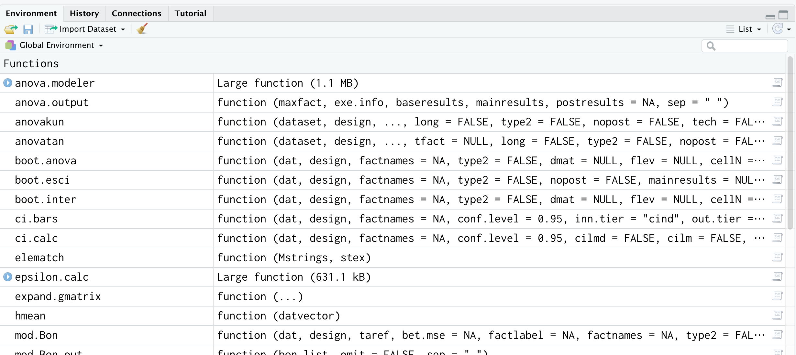
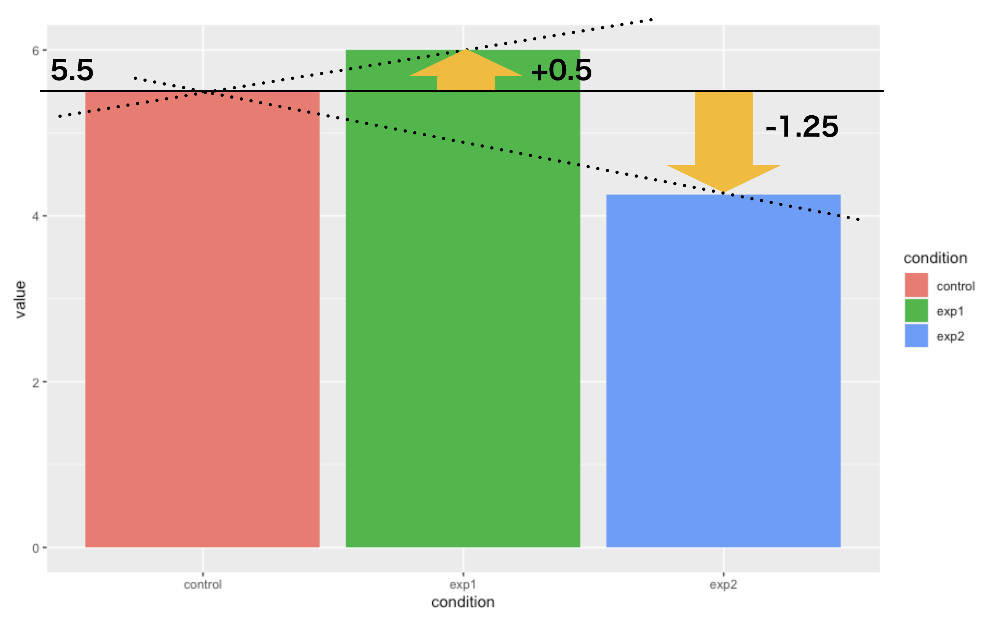

# Rによる帰無仮説検定2 {#chapter23}

ここまでで，要因計画を線形モデルとして，あるいは帰無仮説検定の枠組みで考えるやり方を説明してきました。
細かい計算はRで行う，ということで先送りしてきた話をここで回収したいと思います。Rを使った演習でどのように計算が進むのか，どのように結果が表示されるのか，どのようにその結果を解釈するのかについて学んでいきましょう。

## Rで分散分析を行う上でのポイント

それではRを起動するところから始めましょう。復習がてら，作業を始める前の最初のステップについて改めて書いておきます。

##### RStudioの起動

RStudioを起動してください。パッケージのインストールをするときなど，管理人権限が必要になるケースがあります。

##### プロジェクトを開く

プロジェクトは前回作成した物で良いと思います。同じフォルダの中で，スクリプトファイルだけ変えれば良いでしょう。メニューからプロジェクトを開き(FIle$\to$Open
Project)，RStudioの右上などで，プロジェクトが開いていることを確認しましょう($\to$図[\[fig::20_01\]](#fig::20_01){reference-type="ref"
reference="fig::20_01"})。

##### Rスクリプトを開く

今日のコードを書くためのRスクリプトファイルを準備します。`File > NewFile > R Script`と進み，何も書いてないRスクリプトの画面を表示させてください。真っ白いファイルが開いたら問題ありません。

さて，準備OKですね。

### 数のタイプ

今回は要因計画をRで計算させるということですが，ここでポイントになるのが変数の型です。
繰り返しお話ししていますように，前期でやった回帰分析と今回扱う要因計画とは，線形モデルという同じ形をしています。違うところがあるとすれば，回帰分析の説明変数が連続的であるのに対し，要因計画の説明変数は離散的(カテゴリカル)であるということです。ですから，Rで分析する時も関数の形は同じであっても，変数の種類が違うということを明らかにしておかなければなりません。

Rにはいろいろな数字のタイプがあります。オブジェクトにいろいろな変数を格納できますが，その格納された変数のタイプには，次のような種類があります。

numeric

:   数字。加減乗除などの対象になるもの。尺度水準で言えば間隔尺度水準か比率尺度水準にあたるもの。

factor

:   ファクター型。訳して要因型ということもある。要因計画の「要因」です。この変数は数字とそれにつけるラベルとの組み合わせからなります。尺度水準で言えば名義尺度水準です。

orderd factor

:   順序付きファクター型。ファクター型の特殊系で，中についている数字に順序情報がある物。尺度水準で言えば当然順序尺度水準に該当します。あまり使われることはないけど。

chr

:   文字型(Character)。一見ファクター型と見分けがつかないこともあるが，こちらは内部に対応する数字があるわけでもなく，ただの文字。シングルクォーテーション，ダブルクォーテーションで括ったものが変数に渡されるとこの型になる。

logical

:   論理型。*TRUE*か*FALSE*の2つの値しか持たない。*TRUE*は$1$に，*FALSE*は$0$に対応している。名義尺度水準の特殊な型で，オプションのスイッチオン・オフなどをこれで表したりする。大文字で書く`TRUE`や`FALSE`，あるいはそれらの一文字目`T`や`F`はこの型のラベルとして予約されているので[^1]，オブジェクト名などにしない方が良い。

これらの型を確認するには，オブジェクトの仕組みがどうなっているかを調べる必要があります。調べるのは`str`関数で，これを使うとオブジェクトの中身がわかるようになっています。

第[\[chapter4\]](#chapter4){reference-type="ref"
reference="chapter4"}講のことを思い出しつつ，`code:[code::23_01]`を入力してみてください。

``` {#code::23_01 .c++ language="c++" label="code::23_01" caption="オブジェクトに代入"}
obj <- data.frame(
    list(name=c("kosugi","yamada","ueda"),
        gender = c(1,2,1),
        height = c(167,170,180),
        weight = c(60,70,80))
)
str(obj)
```

##### コード解説

1-6行目

:   データフレームを作って`obj`オブジェクトに代入している。

7行目

:   `obj`オブジェクトの構造を確認

さて，最後の7行目を実行すると，コンソールに次のように出力されていると思います(`console[RS:out23_01]`)。

::: Rscreen
データフレームの中身out23_01

    > str(obj)
    'data.frame':   3 obs. of  4 variables:
     $ name  : chr  "kosugi" "yamada" "ueda"
     $ gender: num  1 2 1
     $ height: num  167 170 180
     $ weight: num  60 70 80
:::

ここにあるように，`obj`オブジェクトの`name`変数はchr型で，他の3つの変数は数値型(numeric)である，というのが示されています。ここで性別`gender`を因子型にしてみましょう(`code:[code::23_02]`)。

``` {#code::23_02 .c++ language="c++" label="code::23_02" caption="因子型にする"}
obj$gender <- factor(obj$gender,label=c('male','female'))
```

これの出力は`console[RS:out23_02]`のようになります。

::: Rscreen
変数を因子型にしたout23_02

    > str(obj)
    'data.frame':   3 obs. of  4 variables:
    $ name  : chr  "kosugi" "yamada" "ueda"
    $ gender: Factor w/ 2 levels "male","female": 1 2 1
    $ height: num  167 170 180
    $ weight: num  60 70 80
:::

ここに示されているように，性別がファクター型になり，それは2つの水準を持っている。それぞれに「male」「female」というラベルがついている，ということがわかります。

このfactor型にしておくというのは，Rが名義尺度水準の変数なんだなと理解したことになりますので，これで回帰分析をするとOKということになります。逆にfactor型にしておかないと，量的変数として普通の回帰分析をしてしまうので，正しくない結果になります[^2]。

### 分散分析用の関数を読み込もう

factor型にして分析するだけで，効果の大きさは見積もれるのですが，それを「判定」するには帰無仮説検定の枠組みで論じる必要があるでしょう。

また思い出して欲しいのですが，分散分析で群間・群内平方和の比較をした結果，有意であると判断されても「どこが有意なのか」までは分からないので，事後検定が必要なのでした。Rはデフォルトで分散分析やTukeyの多重比較をやってくれる関数などを持っていますが，別々の関数になっていて，自分で1つ1つやっていくのは面倒なところもあります。この主な分析$\to$事後の検定という一連の流れを，自動的にやってくれる便利な関数があります。

井関龍太さんの`anovakun`というのがそれで，ネットで一般に公開されています[^3]。CRANからダウンロードするパッケージのようにはなっていませんので，これを使うにはローカルに`anovakun`関数を書いたファイル(執筆時点，2020年8月現在で`anovakun_485.txt`)をダウンロードし読み込むか，Rから直接インターネット経由でダウンロードして使うか，の2通りの方法のいずれかを使う必要があります。どちらにしても，Rの`source`関数をつかうもので，ダウンロードしたファイルを使う場合は[プロジェクトフォルダに当該ファイルをダウンロードした上で]{.ul}，読み込むコードを実行します(`code:[code::23_03]`)。

``` {#code::23_03 .c++ language="c++" label="code::23_03" caption="ソースを読み込む"}
source("anovakun_485.txt")
```

ネットから直接ダウンロードする場合は，インターネットにつながっている状態で`code:[code::23_04]`を実行します[^4]。

``` {#code::23_04 .c++ language="c++" label="code::23_04" caption="ANOVA君のソースをネットからとってくる"}
source("http://riseki.php.xdomain.jp/index.php?plugin=attach&refer=ANOVA君&openfile=anovakun_485.txt")
```

これらのコードが実行されると，Rの環境にたくさんの関数が入っているはずです(図[1.1](#fig::23_01){reference-type="ref"
reference="fig::23_01"})。これらが入っていればOKです。

{#fig::23_01
width="12cm"}

それでは実際の使い方を見ていきましょう。

## 一要因Between計画の実際

ではまず一要因Between計画の話から。例として第[\[chapter21\]](#chapter21){reference-type="ref"
reference="chapter21"}講のデータを使います。一応再掲しておきましょう(表[1.1](#table::23_01){reference-type="ref"
reference="table::23_01"})。

::: {#table::23_01}
    id  condition   notation    value
  ---- ----------- ---------- -------
     1      1       $X_{11}$        6
     2      1       $X_{12}$        6
     3      1       $X_{13}$        5
     4      1       $X_{14}$        5
     1      2       $X_{21}$        7
     2      2       $X_{22}$        4
     3      2       $X_{23}$        7
     4      2       $X_{24}$        6
     1      3       $X_{31}$        4
     2      3       $X_{32}$        3
     3      3       $X_{33}$        4
     4      3       $X_{34}$        6

  : 一要因3水準Between計画のデータ
:::

[\[table::23_01\]]{#table::23_01 label="table::23_01"}

まずはこれを線形モデルとして分析するところからです。`code:[code::23_05]`のようにデータフレームを組み上げます。

``` {#code::23_05 .c++ language="c++" label="code::23_05" caption="データの準備"}
# データフレームを組み上げる
Example1 <- data.frame(id = rep(1:4,3),
                       condition = rep(1:3,each=4),
                       value = c(6,6,5,5,7,4,7,6,4,3,4,6))
# 要因型にする
Example1$condition <- factor(Example1$condition,
                             labels = c("control","exp1","exp2"))
```

##### コード解説

1-3行目

:   データフレームを作っています。IDは被験者番号ですが，群内での番号なので1から4の繰り返しを3回(`rep(1:4,3)`)です。条件conditionは3種類，各4人分(`rep(1:3,each=4)`)，最後の従属変数(value)は手入力するしかありません。

5-7行目

:   条件変数を要因型にしています。ラベルは統制群(control)と実験群1(exp1)，実験群2(exp2)としています。

### 線形モデルとして分析

線形モデルとしての分析は，前期でやったように`lm`関数を使います(`code:[code::23_06]`)。

``` {#code::23_06 .c++ language="c++" label="code::23_06" caption="lm関数で分析"}
result.lm1 <- lm(value~condition,data=Example1)
summary(result.lm1)
```

1行目が`lm`関数を使っていて，結果を`result.lm1`オブジェクトに入れているところです。従属変数と独立変数をチルダ`~`で繋げているところ，思い出してください。2行目はこの結果の出力になります。結果は`console[RS:out23_03]`のように示されているはずです。

::: Rscreen
lm関数の出力out23_03

    Call:
    lm(formula = value ~ condition, data = Example1)

    Residuals:
       Min     1Q Median     3Q    Max 
    -2.000 -0.500 -0.125  0.625  1.750 

    Coefficients:
                  Estimate Std. Error t value Pr(>|t|)    
    (Intercept)     5.5000     0.5713   9.627 4.91e-06 ***
    conditionexp1   0.5000     0.8079   0.619    0.551    
    conditionexp2  -1.2500     0.8079  -1.547    0.156    
    ---
    Signif. codes:  0 ‘***’ 0.001 ‘**’ 0.01 ‘*’ 0.05 ‘.’ 0.1 ‘ ’ 1

    Residual standard error: 1.143 on 9 degrees of freedom
    Multiple R-squared:  0.3562,    Adjusted R-squared:  0.2131 
    F-statistic: 2.489 on 2 and 9 DF,  p-value: 0.1379
:::

これを見ると，切片`(Intercept)`の推定値が5.5，次に2つの説明変数の係数が書いてあります。文字が連なっているのでわかりにくいかもしれませんが，それぞれ`condition`と`exp1`の関係，`condition`と`exp2`の関係を表しています。図[1.2](#fig::23_02){reference-type="ref"
reference="fig::23_02"}を見ると結果の意味は分かり易いと思います。

{#fig::23_02
width="12cm"}

第[\[chapter21\]](#chapter21){reference-type="ref"
reference="chapter21"}講では，線形モデルを
$$X_{ij} = \beta_0 + \beta_j + \epsilon_{ij}$$
としていました。ここで$\beta_0$は全体平均でした。全体平均を基本として，各水準に対する効果$\beta_j$がどうなったか，というモデル化でしたが，ここでは
$$X_{ij} = \bar{X}_1 + \beta_j + \epsilon_{ij}$$
という形になっています(図[1.2](#fig::23_02){reference-type="ref"
reference="fig::23_02"})。本質的に違うものではありません。統制群に比べて実験群1の平均値は$+0.5$，実験群2は$-1.25$の平均値の違いがあるのだな，と思っていただければ結構です。その後ろにStd.Errorや$t$値が出ていますが，これらは推定された回帰係数の標準誤差および，係数が$0$であるという帰無仮説を棄却できるかどうかの検定結果が出ています[^5]。

線形モデルですから，モデルの適合度(`Multiple R-squared, Adjusted R-squared`)なども出ていますが，それよりも最後の一行，この線形モデル全体の検定結果が出ています。これは要因計画のもう1つの切り口，分散分析による結果と同じものです。では分散分析の視点からこの分析結果を見てみましょう。

### 帰無仮説検定として分析

要因計画の帰無仮説検定版，つまり分散分析の結果ですが，線形モデルと同じなので今回得られた出力をすこし変えるだけで対応できます。最も単純には，先ほどの線形モデルの結果を`anova`関数に入れると，分散分析表が次のように示されます(`code:[code::23_07]`,`console[RS:out23_04]`)。

``` {#code::23_07 .c++ language="c++" label="code::23_07" caption="分散分析としてみる"}
anova(result.lm1)
```

::: Rscreen
分散分表の出力out23_04

    Analysis of Variance Table

    Response: value
              Df Sum Sq Mean Sq F value Pr(>F)
    condition  2   6.50  3.2500  2.4894 0.1379
    Residuals  9  11.75  1.3056   
:::

ここから，$F(2,9)=2.4894,p=0.1379$で統計的に有意な差はみられなかった，と判断できます。これらの数字，どこをどう読み取ったのか確認してください。

これだけですから，`lm`関数だけでいいじゃないかと考える人もいるかもしれません。基本的には問題ないのですが，分散分析は「群のサンプルサイズが違う場合」や，「分散の計算」においていくつかの計算バリエーションがあり，Rデフォルトの`lm`関数では十分対応できなくなるシーンが出てきます。

そこで先ほど導入した，分散分析線用関数`anovakun`を使います。実際の使い方は次のようになります(`code:[code::23_08]`)。

``` {#code::23_08 .c++ language="c++" label="code::23_08" caption="anovakunで実行"}
anovakun(Example1[,2:3],"As",3,eps=T)
```

まず，`anovakun`には分散分析に必要なデータだけを与える必要があります。今回のデータフレームにあるid列は入りませんので，`Example1[,2:3]`としてデータの2列目と3列目だけ(2列目から3列目まで)に限定しています[^6]。次に書いてある`As`は，`anovakun`独特の記法です。ここでの`s`は被験者subjectを意味しており，これの左側に群間要因を，右側に群内要因を書きます。今回は一要因の群間デザインですので，左側に1つ要因Aをおく，という書き方になっています。これを`sA`のようにすると一要因群内デザイン，`AsB`とすると，要因Aは群間で要因Bは群内の混合計画を表すことになります。最後に，今回の一要因Aの水準数を入力すれば，`anovakun`関数は全ての分析を実行してくれます。オプションとして，効果量$\epsilon^2$を表示するスイッチをオン(`eps=T`)とすると，効果量も出してくれます(`console[RS:out23_05]`)。

::: Rscreen
anovakunの出力out23_05

    [ As-Type Design ]

    This output was generated by anovakun 4.8.5 under R version 4.0.2.
    It was executed on Tue Sep 15 13:40:30 2020.
        
         
    << DESCRIPTIVE STATISTICS >>
        
    --------------------------
     A   n    Mean    S.D. 
    --------------------------
    a1   4  5.5000  0.5774 
    a2   4  6.0000  1.4142 
    a3   4  4.2500  1.2583 
    --------------------------
        
        
    << ANOVA TABLE >>
        
    --------------------------------------------------------------
    Source      SS  df     MS  F-ratio  p-value      epsilon^2 
     --------------------------------------------------------------
          A  6.5000   2 3.2500   2.4894   0.1379 ns      0.2131 
      Error 11.7500   9 1.3056                                  
    --------------------------------------------------------------
      Total 18.2500  11 1.6591                                  
                         +p < .10, *p < .05, **p < .01, ***p < .001

    output is over --------------------///
:::

各群の平均値，標準偏差および，分散分析表が表示されていますね。これを見て，どことどこの数字を参照すれば良いか等，確認しておいてください。

これだけだと，特に`anovakun`が便利そうに思えないかもしれません。が，以下様々な要因計画に対応しているので，徐々にその良さがわかってくると思います。

## 二要因Between計画の実際

それでは続いて，二要因の計画にいきましょう。第[\[chapter22\]](#chapter22){reference-type="ref"
reference="chapter22"}講のデータを使います。一応再掲しておきましょう(表[1.2](#tbl::23_02){reference-type="ref"
reference="tbl::23_02"})。

::: {#tbl::23_02}
    通し番号   群での番号 温度   メーカー     評価
  ---------- ------------ ------ ---------- ------
           1            1 Hot    銘柄A          13
           2            2 Hot    銘柄A          11
           3            3 Hot    銘柄A          12
           4            1 Hot    銘柄B           7
           5            2 Hot    銘柄B           6
           6            3 Hot    銘柄B           8
           7            1 Cold   銘柄A           9
           8            2 Cold   銘柄A           9
           9            3 Cold   銘柄A           9
          10            1 Cold   銘柄B          13
          11            2 Cold   銘柄B          11
          12            3 Cold   銘柄B           9

  : 二要因のデータ例
:::

[\[tbl::23_02\]]{#tbl::23_02 label="tbl::23_02"}

これをデータフレーム型にします。温度，メーカーは名義尺度水準なので要因型にします(`code:[code::23_09]`)。

``` {#code::23_09 .c++ language="c++" label="code::23_09" caption="データフレームにする"}
Example2 <- data.frame(id = 1:12,
                       num = rep(1:3,4),
                       temp = rep(1:2,each=6),
                       maker = rep(rep(1:2,each=3),2),
                       value = c(13,11,12,7,6,8,9,9,9,13,11,9))
Example2$temp <- factor(Example2$temp,
                        labels=c("Hot","Cold"))
Example2$maker <- factor(Example2$maker,
                         labels=c("A","B"))
```

### 線形モデルとして分析

これでデータはできたので，分析にかけるだけですね。二要因以上に計画が複雑になる場合は，交互作用を考えなければならないことに注意が必要です。線形モデルで表現するには，次のようにします(`code:[code::23_10]`)。

``` {#code::23_10 .c++ language="c++" label="code::23_10" caption="線形モデルとして実行"}
result.lm2 <- lm(value ~ temp*maker,data=Example2)
summary(result.lm2)
```

ここで，説明変数が$\ast$でつなげられています。これで主効果と交互作用の両方をモデルの中に入れたことになります。結果は`console[RS:out23_06]`のように表示されるはずです。

::: Rscreen
交互作用を入れたモデルの出力out23_06

     > summary(result.lm2)

    Call:
    lm(formula = value ~ temp * maker, data = Example2)
     
    Residuals:
        Min     1Q Median     3Q    Max 
    -2.00  -0.25   0.00   0.25   2.00 

    Coefficients:
                    Estimate Std. Error t value Pr(>|t|)    
    (Intercept)      12.0000     0.7071   16.97 1.48e-07 ***
    tempCold         -3.0000     1.0000   -3.00  0.01707 *  
    makerB           -5.0000     1.0000   -5.00  0.00105 ** 
    tempCold:makerB   7.0000     1.4142    4.95  0.00112 ** 
    ---
    Signif. codes:  0 ‘***’ 0.001 ‘**’ 0.01 ‘*’ 0.05 ‘.’ 0.1 ‘ ’ 1

    Residual standard error: 1.225 on 8 degrees of freedom
    Multiple R-squared:  0.7867,    Adjusted R-squared:  0.7067 
    F-statistic: 9.833 on 3 and 8 DF,  p-value: 0.004641
:::

ここに示されているのは，温度`temp`変数の第一水準(Hot)かつメーカー`maker`変数の第一水準(銘柄A)を基準にした時に，`tempCold`つまりメーカーは同じ(銘柄A)で温度だけ違う群は平均値が$-3.0$，次にメーカーをBで`makerB`温度はHotの群と比べるとその平均値は$-5.0$，両方変えると$+7.0$になる，ということです。それぞれ標準誤差や$t$値が出ていますが，これは傾きが0である，という帰無仮説を棄却しているだけであって，効果の大きさについてはわかりません。

また，最後に$F$統計量が出ています。自由度が$(3,8)$の時に$p=0.004641$ですが，これは線形モデル全体としてみた時に横一線の帰無仮説モデルとは違うね，というだけであって，具体的にどこがどう違うのか，というのがわかりにくくなっています。

そこでそれぞれの水準について検証できる，分散分析モデルで分析してみます。

### 帰無仮説検定として分析

要因計画の帰無仮説検定版，でやってみましょう。先ほどと同じように，Rがデフォルトで持っている関数`anova`に線形モデルの結果を入れてみます(`code:[code::23_11]`)。

``` {#code::23_11 .c++ language="c++" label="code::23_11" caption="分散分析としてみる"}
anova(result.lm2)
```

結果は`console[RS:out23_07]`のようになります。

::: Rscreen
分散分析表の出力out23_07

    > anova(result.lm2)
    Analysis of Variance Table

    Response: value
               Df Sum Sq Mean Sq F value   Pr(>F)   
    temp        1   0.75    0.75     0.5 0.499576   
    maker       1   6.75    6.75     4.5 0.066688 . 
    temp:maker  1  36.75   36.75    24.5 0.001121 **
    Residuals   8  12.00    1.50                    
    ---
    Signif. codes:  0 ‘***’ 0.001 ‘**’ 0.01 ‘*’ 0.05 ‘.’ 0.1 ‘ ’ 1
:::

分散分析表だけでなく，ご丁寧に有意かどうかわかりやすいような記号(`.`や`*`など)をつけてくれています。最後の一行には`Signif. codes`とあって，米印が1つなら5%，2つなら1%，3つなら0.1%水準で有意である，という読み方が書いてあります[^7]。これを見ると，`maker`水準は5%水準で有意にはならず[^8]，交互作用項(`temp:maker`)は有意になっていることがわかります。

ただ，このままだと「交互作用は有意だけど，どこがどう違うのかわからない」という状況ですね。4つの母平均が同じである($\mu_{11}=\mu_{12}=\mu_{21}=\mu_{22}$)という帰無仮説が棄却されただけで，どこがどう違うのかについては事後の検定を追加しなければならないからです。

ではこれを`anovakun`でやってみましょう。彼(?)なら一気に全ての答えを出してくれるのです(`code:[code::23_12]`)。

``` {#code::23_12 .c++ language="c++" label="code::23_12" caption="anovakunで実行"}
anovakun(Example2[,3:5],"ABs",2,2,eps = T)
```

先ほどと同様，`anovakun`にはid列やnum列は必要ありませんので，3行目から5行目まで，要因A,Bと従属変数だけを与えます。要因計画は間$\times$間ですので，被験者`s`の左側にA,Bとしています。2つの要因はそれぞれ2水準ですので，水準数を2つ書いています。最後の`eps=T`は，効果量である$\epsilon^2$を表示するスイッチをオン(TRUE)，ということです。

結果は`console[RS:out23_08]`のように表示されます。

::: Rscreen
ABsタイプの出力out23_08

    [ ABs-Type Design ]

    This output was generated by anovakun 4.8.5 under R version 4.0.2.
    It was executed on Tue Sep 15 11:50:09 2020.

    << DESCRIPTIVE STATISTICS >>

    -------------------------------
      A   B   n     Mean    S.D. 
    -------------------------------
     a1  b1   3  12.0000  1.0000 
     a1  b2   3   7.0000  1.0000 
     a2  b1   3   9.0000  0.0000 
     a2  b2   3  11.0000  2.0000 
    -------------------------------

    << ANOVA TABLE >>

    ---------------------------------------------------------------
     Source      SS  df      MS  F-ratio  p-value      epsilon^2 
    ---------------------------------------------------------------
          A  0.7500   1  0.7500   0.5000   0.4996 ns     -0.0133 
          B  6.7500   1  6.7500   4.5000   0.0667 +       0.0933 
      A x B 36.7500   1 36.7500  24.5000   0.0011 **      0.6267 
      Error 12.0000   8  1.5000                                  
    ---------------------------------------------------------------
      Total 56.2500  11  5.1136                                  
                       +p < .10, *p < .05, **p < .01, ***p < .001

    << POST ANALYSES >>

    < SIMPLE EFFECTS for "A x B" INTERACTION >

    ---------------------------------------------------------------
    Source      SS  df      MS  F-ratio  p-value      epsilon^2 
    ---------------------------------------------------------------
    A at b1 13.5000   1 13.5000   9.0000   0.0171 *       0.2133 
    A at b2 24.0000   1 24.0000  16.0000   0.0039 **      0.4000 
    B at a1 37.5000   1 37.5000  25.0000   0.0011 **      0.6400 
    B at a2  6.0000   1  6.0000   4.0000   0.0805 +       0.0800 
      Error 12.0000   8  1.5000                                  
    ---------------------------------------------------------------
                         +p < .10, *p < .05, **p < .01, ***p < .001

    output is over --------------------///
:::

最初に，水準ごとの平均値と標準偏差が表示され，続いて分散分析表が示されています。
これを見ると，要因A(温度)の主効果はなく($F(1,8)=0.500,p=0.4996$)[^9]，ついで要因Bの効果も5%水準では認められない(10%水準で有意，その記号として$+$が使われています)，交互作用は5%水準で有意という結果になりました。ここまでは当然，先ほどと同じですね。効果量$\epsilon^2$の列を見ると，交互作用は全体の62%の分散を説明したことになりますから，これはかなり大きな効果だったようだ，ということがわかります。

続いてPOST ANALYSISとして事後の検定が表示されています。SIMPLE EFFECTS
for \"A x B\"
INTERACTIONとあるのは，「AとBの交互作用についての単純効果」という意味で(直訳！)，各水準に限定した時に他の水準の効果があったかどうかをみています。例えば最初の行，A
at
b1とありますが，これは要因B(銘柄)の第一水準における要因A(温度)の効果をみていることになります。以下同様ですが，これらは分散分析の表をより細かくしてチェックしているようなものです。これを見ると，冷たい時の銘柄には差がない(B
at a2)ようですが，それ以外の差は統計的に有意，と言えそうです。

これらの結果を見やすくするために，図[1.3](#fig::23_03){reference-type="ref"
reference="fig::23_03"}に対応するところに線を引いてみました。結果と見比べて，どこに差があったか確認しておいてください。

{#fig::23_03
width="12cm"}

また，これらの結果を報告する時は，次のように書くと良いでしょう。

> 温度と銘柄の効果を独立変数とした二要因分散分析($2 \times 2$のBetweenデザイン)をおこなったところ，交互作用が有意($F(1,8)=24.5,p=0.0011,\epsilon^2=0.6267$)になり，事後の検定の結果，銘柄Aにおける温度の効果($F(1,8)=9,p=0.0171,\epsilon^2=0.21133$)，銘柄Bにおける温度の効果($F(1,8)=16.0,p=0.0039,\epsilon^2=0.4000$)，および温かい時の銘柄の効果($F(1,8)=25,p=0.0011,\epsilon^2=0.6400$)が統計的に有意であった。

## 一要因Within計画の実際

最後にWithin計画の例をやってみましょう。仮想データとして第[\[chapter22\]](#chapter22){reference-type="ref"
reference="chapter22"}講のものを使います。念のため表[1.3](#tbl::23_03){reference-type="ref"
reference="tbl::23_03"}に再掲しました。

::: {#tbl::23_03}
  ID     Time1   Time2   Time3
  ---- ------- ------- -------
  1         10       5       9
  2          9       4       5
  3          4       2       3
  4          7       3       5

  : Within Data Example
:::

[\[tbl::23_03\]]{#tbl::23_03 label="tbl::23_03"}

これをデータフレーム型にします(`code:[code::23_13]`)。

``` {#code::23_13 .c++ language="c++" label="code::23_13" caption="データフレームにする"}
Example3 <- data.frame(ID=1:4,
Time1 = c(10,9,4,7),
Time2 = c(5,4,2,3),
Time3 = c(9,5,3,5))
```

線形モデルとして表現するには，少し複雑な操作が必要ですので[^10]，今回は分散分析的アプローチのみ紹介したいと思います。

### 帰無仮説検定として分析

群内モデルの`anovakun`での入力は次のようになります(`code:[code::23_14]`)。

``` {#code::23_14 .c++ language="c++" label="code::23_14" caption="anovakunで実行"}
anovakun(Example3[, 2:4], "sA", 3, eps = T)
```

データセットや変数の指定，効果量オプションの指定は特に追記することはありません。デザインの指定が`"sA"`と`s`の右側に来ているところがポイントです。これを実行すると，`console[RS:out23_09]`のように結果が示されます。

まず群ごとの記述統計量が計算されています。その次に`<< SPHERICITY INDICES >>`とありますね。これはと訳されます。$t$検定の時にWelchの補正をしたのを思い出して欲しいのですが，分散分析の時も基本的に母分散が同じである，という仮定があります。この仮定が満たされない場合は補正をしなければなりません。特にWithin計画の場合は，全部の分散(共分散)が等しいという仮定を置くのではなく，少なくとも全方向に等しく広がっている空間であるはずだ，という仮定をおいています[^11]。

::: Rscreen
sAタイプのanovakun出力out23_09

    [ sA-Type Design ]

    This output was generated by anovakun 4.8.5 under R version 4.0.2.
    It was executed on Tue Sep 15 13:50:06 2020.

     
    << DESCRIPTIVE STATISTICS >>

    --------------------------
      A   n    Mean    S.D. 
    --------------------------
     a1   4  7.5000  2.6458 
     a2   4  3.5000  1.2910 
     a3   4  5.5000  2.5166 
    --------------------------


    << SPHERICITY INDICES >>

    == Mendoza's Multisample Sphericity Test and Epsilons ==

    -------------------------------------------------------------------------
     Effect  Lambda  approx.Chi  df      p         LB     GG     HF     CM 
    -------------------------------------------------------------------------
          A  1.0000     -0.0000   2 1.0000 ns  0.5000 1.0000 3.0000 0.5000 
    -------------------------------------------------------------------------
                                  LB = lower.bound, GG = Greenhouse-Geisser
                                 HF = Huynh-Feldt-Lecoutre, CM = Chi-Muller


    << ANOVA TABLE >>

    ---------------------------------------------------------------
     Source      SS  df      MS  F-ratio  p-value      epsilon^2 
    ---------------------------------------------------------------
          s 39.0000   3 13.0000                                  
    ---------------------------------------------------------------
          A 32.0000   2 16.0000  16.0000   0.0039 **      0.3896 
      s x A  6.0000   6  1.0000                                  
    ---------------------------------------------------------------
      Total 77.0000  11  7.0000                                  
                       +p < .10, *p < .05, **p < .01, ***p < .001
:::

これが満たされない場合は，Greenhouse-Geisserの補正やHuynh-Feldt-Lecoutreなどの補正をしなければならないが，どうでしょうね？
というのを確認するのがこの箇所です(`console[RS:out23_10]`)。今回は$p$が1.000で$ns$，つまりnot
significant=有意に歪んでいるとは言えない，ということなので補正は不要です。もしここが有意である，つまり丸いという状況から異なっている現状があると思われるのであれば，自由度などの補正が必要で，その時`anovakun`はオプションで補正を指定できます。ともかく今回は，このまま先に進めそうです[^12]。

::: Rscreen
下位検定の出力out23_10

    << POST ANALYSES >>

    < MULTIPLE COMPARISON for "A" >

    == Shaffer's Modified Sequentially Rejective Bonferroni Procedure ==
    == The factor < A > is analysed as dependent means. == 
    == Alpha level is 0.05. == 
     
    --------------------------
      A   n    Mean    S.D. 
    --------------------------
     a1   4  7.5000  2.6458 
     a2   4  3.5000  1.2910 
     a3   4  5.5000  2.5166 
    --------------------------

    ----------------------------------------------------------
      Pair     Diff  t-value  df       p   adj.p            
    ----------------------------------------------------------
     a1-a2   4.0000   5.6569   3  0.0109  0.0328  a1 > a2 * 
     a1-a3   2.0000   2.8284   3  0.0663  0.0663  a1 = a3   
     a2-a3  -2.0000   2.8284   3  0.0663  0.0663  a2 = a3   
    ----------------------------------------------------------


    output is over --------------------///
:::

その先にはやっと分散分析表が出てきました。これを見ると`Source`列の`s`とあるところ，これが個人差です。ここについては検定の対象外なので，$F$値などの計算は行われていません。その下の`A`からが要因の効果で，`s x A`とあるところ，つまりAに伴って生じる個人差，のところが比較対象となる誤差のところです。この$F$値が16.00，$p=0.0039$で統計的に有意(ちなみに効果量$\epsilon^2=0.3896$)なので，水準間のどこかには差があるということがわかります。

続く`<< POST ANALYSES >>`のところに，Shefferの方法を使った事後の検定があります。これによると，a1-a2のペアは$a1 > a2$の関係にあって有意で，そのほかのペアは有意ではない，ということがわかります。

結果としては，例えば次のように報告するといいでしょう。

> 一要因3水準の分散分析を行ったところ，$F(2,6)=16.00,p=0.0039,\epsilon^2=0.386$で統計的に有意であり，事後検定の結果a1水準がa2水準よりも高いことが示された(Shafferの方法による多重比較)。

以上で解説を終わります。
分散分析を面倒で煩雑な作業だ，と思った人も少なくないと思います。事実そうなのですが，だからと言って適当に実行してしまうと，誤用・誤解など問題のある研究実践になる可能性がありますので，細部まで細かく配慮しながら，どこにどういう意味があって，どのような読み取り方をするべきなのかをしっかりと理解しておいてください。

このほか，例えば三要因計画になるとか，混合計画になるなどすると，それぞれ分散分析表や事後の分析の読み取り方などでアウトプットがどんどん長くなります。が，そこで注意を切らすのではなく，落ち着いて眺めてみてください。基本的には同じような前提，作業工程を，繰り返し繰り返し適用していくだけなのです。複雑で難解なのではなく，単純で煩雑なので嫌気が差してしまうだけです。ここでしっかりと腹を据えて読み取れるようになれば，分散分析は意外と素直なモデルに見えるかもしれません。

それでも帰無仮説検定という実践的判断基準を実践するので，ある種の断定(有意差があった，なかった)が以後の解釈を歪めてしまいかねないという可能性は否定できませんし，確率的判定をしている以上は検定の多重性の問題からは逃れることができません。これを乗り越えるためには，もう少し確率的なモデルのことを詳しく理解する必要がありますし，モーメント法(平均値や不偏分散で母数を推定する)ではないほかの方法で考える必要もあります。続く講義ではこれらについて解説していきます[^13]。

## 課題

##### 課題1 線形モデルとしての分析

ある学校の国語の授業で，ある教師が4つのクラスそれぞれに対して個別のテキストを使って授業を行い，同一のテストを行うことでテキストの効果があるかどうかを検証したとします。
各クラスには10人の生徒がいて，それぞれのテスト結果が次の通りです(表[1.4](#L23::exe1){reference-type="ref"
reference="L23::exe1"})。次の各指示に従い，その結果について回答してください。なお，このデータセットは`Lesson8exe1.csv`ファイルに入っています。

::: {#L23::exe1}
   textA   textB   textC   textD
  ------- ------- ------- -------
    56      49      40      48
    55      53      41      53
    62      49      47      54
    53      52      48      51
    53      52      43      51
    56      46      40      48
    59      49      44      45
    51      51      43      49
    57      54      43      51
    59      50      49      49

  : 課題1
:::

[\[L23::exe1\]]{#L23::exe1 label="L23::exe1"}

1.  回帰分析を行ってください。切片の推定値はいくらになりましたか。

2.  回帰分析を行った結果，テキストAにくらべてテキストBの平均値はどれぐらい違うと思われますか。

3.  回帰分析を行った結果，テキストAを基準とした時にテキストCに向けて引いた回帰線について，正しい記述を選びなさい。

4.  分散分析を実行し，その時のF値を答えてください。

5.  分散分析を実行し，ボンフェローニの下位検定の結果として平均値の差が認められなかったペアを答えてください。

##### 課題2 Betweenデザインの分散分析

別の学校では，テキストをA,B,Cの3種類とし，教員が二人がそれぞれのテキストを使って教えることにしました。1クラス12人，一学年6クラスを使っての実験です。
授業後のテストの点数が表[1.5](#L23::exe2){reference-type="ref"
reference="L23::exe2"}のようになっています。次の各指示に従い，その結果について回答してください。なお，このデータセットは`Lesson8exe2.csv`ファイルに入っています。

::: {#L23::exe2}
    textA-teacherA   textB-teacherA   textC-teacherA   textA-teacherB   textB-teacherB   textC-teacherB
  ---------------- ---------------- ---------------- ---------------- ---------------- ----------------
                25               32               30               28               23               34
                39               40               29               20               27               42
                36               39               25               31               27               42
                31               29               23               19               26               37
                41               42               19               35               16               35
                34               21               24               24               27               35
                33               43               14               25               19               33
                31               26               19               34               21               41
                28               44               31               23               35               34
                34               31               26               22               30               38
                31               26               31               19               17               28
                32               29               30               23               27               33

  : 課題2
:::

[\[L23::exe2\]]{#L23::exe2 label="L23::exe2"}

1.  分散分析を実行し，テキストの効果について正しく述べてある文章を選んでください。

2.  分散分析を実行し，教員の効果について正しく述べてある文章を選んでください。

3.  分散分析を実行し，交互作用の効果について正しく述べてある文章を選んでください。

4.  下位検定の結果，テキストAにおける教員の効果は合ったと言って良いでしょうか。正しく述べている文章を選んでください。

5.  下位検定の結果，教員Bが受け持ったクラスにおいて，どういう効果があったと言えるでしょうか。正しく述べている文章を選んでください。

##### 課題3 Withinデザインの分散分析

さらに別の学校では，テキスト・教員は一種類・一人なのですが，4つの時期において成績が変化するかどうかを追跡調査しました。
各時期のテストの点数が表[1.6](#L23::exe3){reference-type="ref"
reference="L23::exe3"}のようになっています。次の各指示に従い，その結果について回答してください。なお，このデータセットは`Lesson8exe3.csv`ファイルに入っています。

::: {#L23::exe3}
    id   period1   period2   period3   period4
  ---- --------- --------- --------- ---------
     1        39        38        42        52
     2        59        66        62        56
     3        27        33        44        44
     4        41        38        41        42
     5        46        46        44        51
     6        22        21        37        27
     7        54        45        52        51
     8        59        51        76        65
     9        49        55        59        66
    10        48        37        41        47
    11        34        36        39        45
    12        65        54        62        69
    13        51        42        43        43
    14        44        37        53        53
    15        42        47        50        54
    16        49        48        61        47
    17        48        39        62        49
    18        46        50        44        46
    19        45        40        48        55
    20        44        48        46        57

  : 課題3
:::

[\[L23::exe3\]]{#L23::exe3 label="L23::exe3"}

1.  分散分析を実行し，時期の主効果について正しく述べている文章を選んでください。

2.  下位検定を見て，効果があった箇所を選んでください。

[^1]: 予約語といい，他にも何もないことを表す`NULL`や，無限大を表す`Inf`，欠損値を表す`NA`などがある。数学定数`pi`も予約語の1つ。

[^2]: 具体的には，3水準に1,2,3という量的な数字を割り振って分析するということは，$1<2<3$という順序性と2-1=3-2という等間隔性を持たせたことになります。要因計画の可視化の時に，横軸は入れ替え可能(順序性がない)だったことを思い出してください。

[^3]: [http://riseki.php.xdomain.jp/index.php?ANOVA君](http://riseki.php.xdomain.jp/index.php?ANOVA君)

[^4]: この長いリンク先を転記するのは大変です。Googleで「ANOVA君」を検索し，井関先生のサイトに飛んでから，「下のアイコンをクリックしてファイルを保存してください。」とあるANOVA君ソースファイルのリンク先を右クリック，リンク先をコピーすれば確実です。

[^5]: 各群の母平均の推定値でもありますが，各群について一変数の$t$検定をしているのではなく，これら線形モデル全体として(他の説明変数に条件づけられた分布の中で)標準誤差を計算します。詳しくは[@南風原200206]のp.118を参照してください。

[^6]: 大括弧$\left[, \right]$は，データフレームの行および列を指定するのに使います。
    一行目だけを指定したい場合は`Example1[1,]`，一列目だけ指定したい場合は`Example1[,1]`，1行1列目の要素だけアクセスしたい場合は`Example1[1,1]`のようにします。

[^7]: おそらくこれが諸悪の根源で，なんとなく星の数が多い方が「良い結果」のような印象を持ちますし，分析したらとりあえず星を探す，という仕草が生まれるようになっていますよね。帰無仮説検定はあくまでもモデル比較の判定であって，判定基準が厳しいほど「良い」とか，基準をクリアできなかったから「惜しい(残念)」という評価を伴うものではないはずなのに，です。有意差がなかったら，そういう結果が得られた，というだけですし，星の数が小さくてもえらいとかすごい，ということにはならない，ということを再確認してください。「心理学者は星を探して喜んでるんだ」というようなジョークの的にならないように，適切な分析的素養を身に付けましょう。

[^8]: 世の中には「有意傾向」という変な言葉があります。今回の$p$値は6%でしたが，これは5%水準ではアウトですよね。こういった5%をちょっとだけ上回っちゃった，惜しい！という時に，「有意になりそうな傾向があった」略して「有意傾向があった」という表現がされることがあるのです。あるいは「傾向差があった」という言葉もまことしやかに使われていたりします。が，これらは心理学独自の間違った表現であり，決して使うべきではありません。なぜなら，5%だろうが6%だろうが，任意に決めた判定基準であって，$p$
    値の大小関係は現実の効果の大きさとは関係がないからです。

[^9]: 米印があるべきところに$ns$とありますが，これはnot
    significant，つまり有意ではないという意味です。

[^10]: 具体的には，一人ひとりに回帰分析をしつつ，個々人の切片＝個人差がより上位の確率分布にしたがっている，という階層的線形モデルという形になり，次回以降で取り上げる確率モデルの導入をしないといけないのです。Rで実行する場合も別途パッケージを導入する必要があり，とても今回の残り時間で扱い切れる分量ではないので，割愛させていただきました。興味がある人は二年次のデータ解析応用でお会いしましょう。

[^11]: Within計画の時にややこしいのは，モデルでいうと個々人に線形モデルを仮定して，個人差＝切片が異なるような階層的なモデルになっているということです。個々人の分散が同じ，というのはなかなか厳しい仮定だと思われますが，水準同士の相関関係(共分散)も考慮に入れて，分散共分散行列(対角要素に分散，非対角要素に共分散が入っている正方行列)が均質である，という仮定ぐらいはせめて保持したいわけです。水準数が増えるとこの相関関係を表現するする世界は多次元空間に広がっていくので，究極的には丸くなる，球面性の検定といわれる所以です。

[^12]: まったく！検定の多重性が問題だとかなんとか言いながら，そもそも前提が満たされているかどうかの検定は挟まないといけないし，ここでは有意差がでると補正，出ないとOKってなんかいつもとは違う判断をしないといけない。分散分析とか帰無仮説検定というのは，とても厳密な手続きが必要なのですが，こんな感じであちこちに補正，修正などが入ってきて，正直嫌になりますよね。私は嫌なのでそういう悩みのないベイズ統計的アプローチの方がいいと思うんですが，みんなよくこんなの真面目にやってきたなあと思いますよ。

[^13]: 分散分析はオワコンだ，と思われて久しいのですが，今でも学術論文には帰無仮説検定が実践されているので，みなさんには古典を読むためのリテラシーとして教えています。
