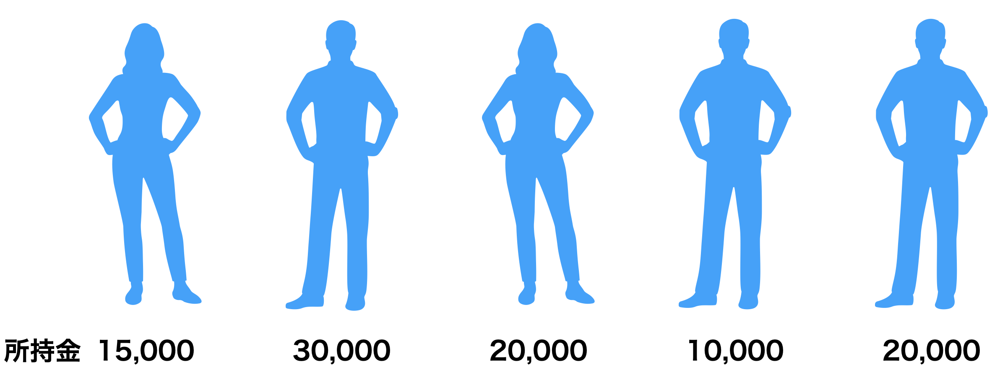
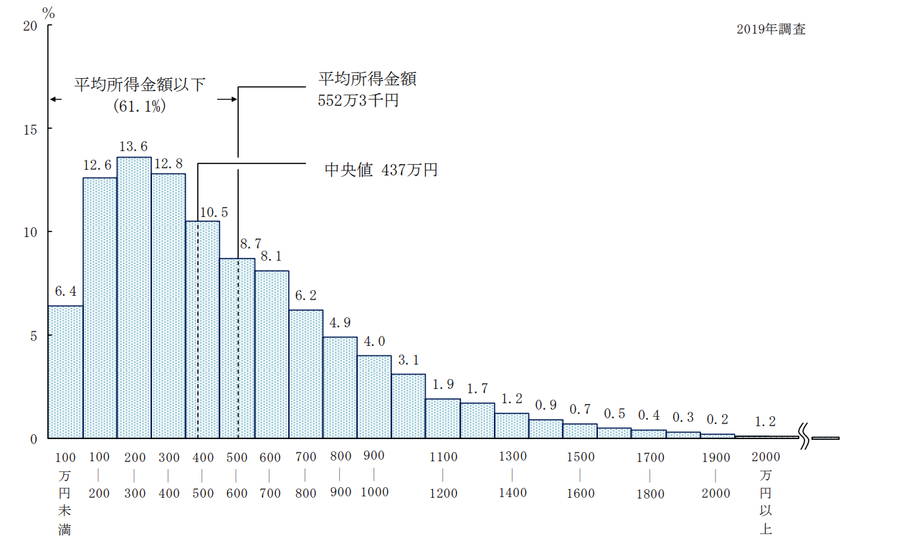
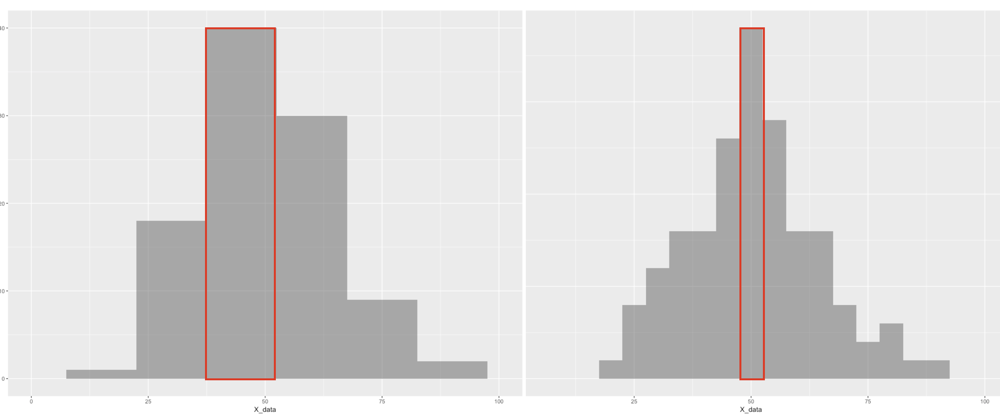
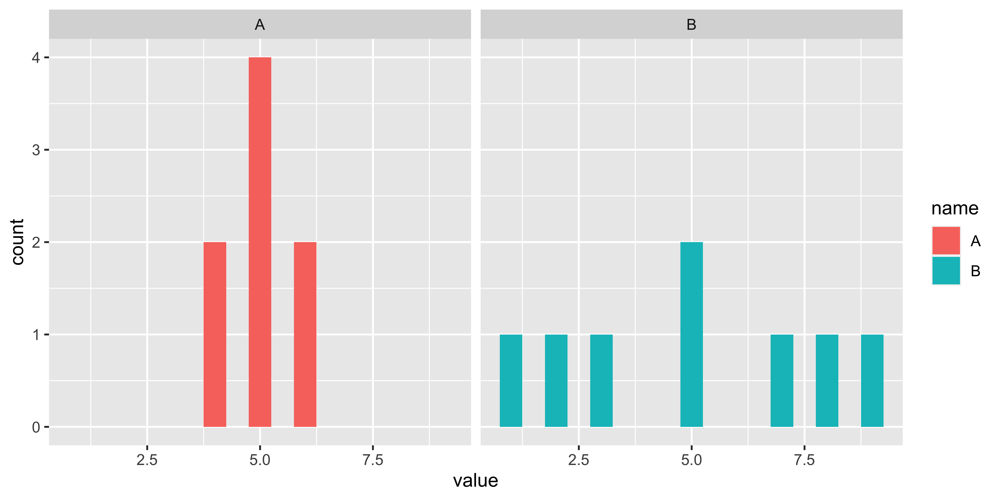
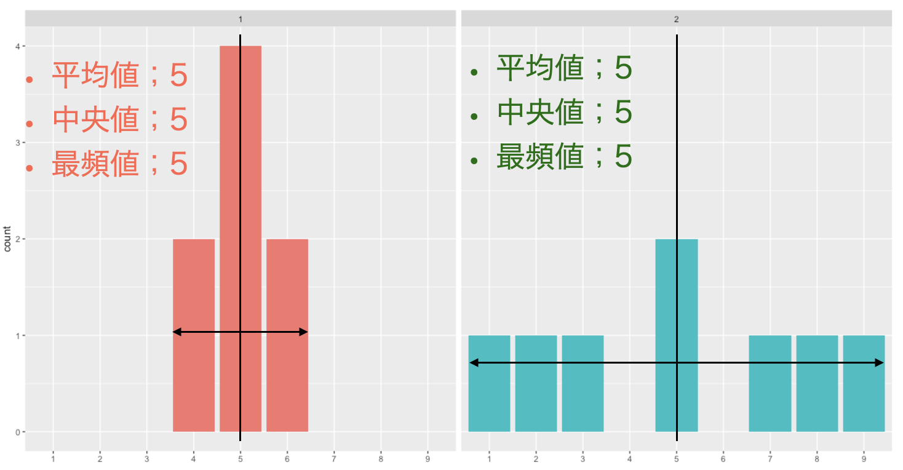
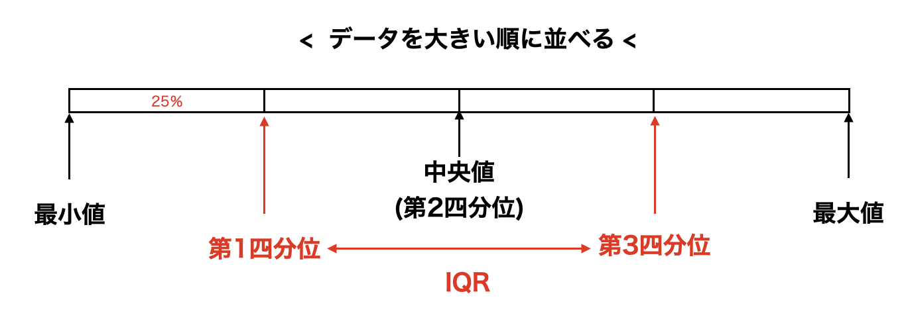
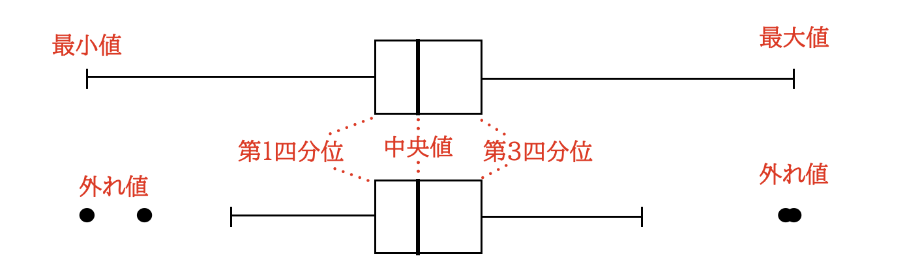
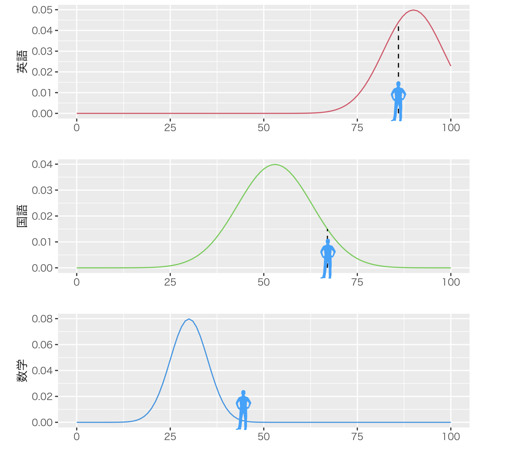
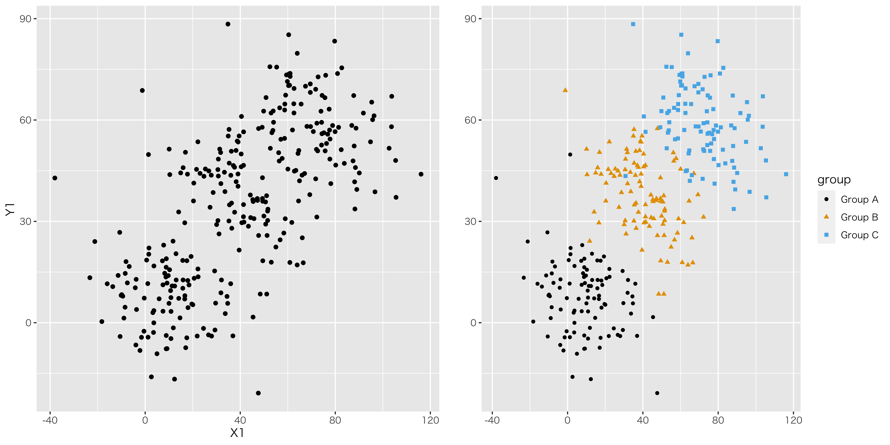

# 記述統計量 {#chapter4}

## はじめに

さて，ここまでで心理学においてなぜ統計学が必要か，計算機とはどういうものか，計算機に与えるデータはどういうものか，という話をしてきました。下準備はそこまでです。いよいよ，今回から心理統計の具体的な話に入っていきます。

初めに，心理統計の3つの枠組みを紹介しておきます。

記述統計 descriptive statistics

:   データの特徴を記述する統計法。可視化，代表値による要約など。
    データを取ったらまずやるべき作業がこちら。手元のデータでわかることを，隅々まで書き表すのが狙いです。

推測統計 inferential statistics

:   部分的なデータから全体像を推測する統計学。心理統計の目的は一部のサンプルから全体を予測することにあるのです。この授業の後半(後期)は主にこの話になります。

多変量解析 multivariate analysis

:   大量のデータから意味のある情報を引き出す，あるいは無意味な情報を削ぎ落とす技術です。調査研究をする場合はもちろん，センサーなどの機器から大量に取れるデータを扱う場合にも使われる技術です。データサイエンス，機械学習(いわゆるAI)などにも通じる領域です。本学では2年のデータ解析応用で扱います。

ということで，ここにあるように記述統計学が最初のステップになります。手元にあるデータの特徴を記述することが目的になります。記述という意味では可視化もそうなのですが，今回は数字によってデータの特徴を記述することを考えます。複数のデータの代表的な値ですから，代表値と言われたりします。

研究対象を数値化したとしましょう。それを眺めて「いろいろな数字があるなあ」と感心していたのでは，数値化した意味がありません。得られた**データは図にする**のが基本です。すぐに図にします。いろいろな図にします。前回も話しましたが，とにかく図にします。しなければなりません。さて，図を見て考えをまとめるのが重要なのですが，具体的にどういう特徴があるのか，あるいはどういう違いがあるのかといったことを，要約して表現できればなお良いですね。そこで代表値を考えることになります。

いきなり身も蓋もないことをいうようですが，たくさんの数値を1つの代表値を使って記述する，というのは基本的に無理があります。十人十色，いろいろな違いがあるからこそ，そのデータセットは意味があるのに，たった1つの数字に変えて表現するのですから。代表値は，何らかの側面で評価することで1つに定まるものであって，あくまでもその評価次元での代表値に過ぎません。つまり，1つの代表値だけで全体が分かるわけではないのです。あるいは，1つの代表値にするということは，少し無理をして情報を削ぎ落とすということでもあります。代表値は何であれ，必ず何らかの情報が欠け落ちているのです。ですから，統計データを扱うときは，複数の代表値を使って多角的に判断するのが基本です。そのことをまずしっかり理解しておいてください。

その上で，代表値を2つの種類に分けて説明します。ひとつは中心化傾向の指標，もうひとつは散らばりの指標です。

## 中心化傾向の指標

### 平均値mean

[^1]，より正確には算術平均[^2]は最もよく知られた代表値でしょう。計算方法は，全てのデータをたしあわせて，足したデータの個数で割る，というものです。

図[1.1](#fig::04_01){reference-type="ref"
reference="fig::04_01"}に5人の所持金を示しています。この例では，平均値は次のように計算できますね。
$$(15000+30000+20000+10000+20000)/5=19000$$

{#fig::04_01
width="12cm"}

##### 文字と記号の導入

さてこれを，今後のために記号で一般的に表記する方法について知っておきましょう。
変数は一般に$x$や$y$で表されます。
今回は5人分のデータがありますが，1人目のデータ，2人目のデータ，といった違いを表すときは$x_1,x_2,\cdots$のようにアルファベットの右斜め下に小さく数字を添えます。添字と言います。
さて今回は所持金という1つの変数でしたが，2つ目の変数，3つ目の変数・・・とたくさんのデータが手に入ることもあります。そのようなとき，変数は$x_{ij}$と添字を2つ書いて表現します。ここで$i$がケース(個体，観測番号)を表し，$j$が何番目の変数であるかを表す，というルールにします[^3]。

次に足し算の記号を紹介します。$\sum$で総和を表すことにします。この記号はギリシア文字の大文字のSで，足し合わせるsummationの頭文字をとって$\sum$，サムと読みます。この記号には上と下に文字を追加して，次のような意味で使います。
$$\sum_{i=1}^5 x_i= x_1 + x_2 + x_3 + x_4 + x_5$$
ここにあるように，$\sum$の下に$i$という文字があります。この文字$i$が$1$から始まって$5$まで変化し総和する，という数学記号です。$\sum_{i=1}^5 x_i$の$x_i$という変数について，$i$が1から5まで変わるわけですから，右辺にあるように添字が変わりながら全て足し合わせる，という意味の記号です。この$\sum$も，文脈から考えてどこからどこまで足すのかが明らかな場合，上下の添字は省略されることがあります。

さて，先ほどの5人の平均ですが，足し算の場所は$x_1+x_2+\cdots+x_5=\sum_{i=1}^5 x_i$と書けます。これを5で割れば平均になりますから，$\frac{1}{5}\sum x_i = 19000$というわけです。このように記号で表現しておくと，平均値は一般に次のように表すことができます。

$$\bar{x} = \frac{1}{N}\sum_{i=1}^N x_i$$

今回は5人でしたが，一般に$N$個のデータを扱うときにまで拡張できました。左辺は平均値$\bar{x}$で，エックスバーで表すことが一般的です。

### 中央値median

次の代表値はです。データを大きさの順に並べて行って，ちょうど真ん中のケースの値をその代表値として使う，というものです。先程の図[1.1](#fig::04_01){reference-type="ref"
reference="fig::04_01"}の場合は，並べ替えると$10000<15000<20000=20000<30000$となります。上から3番目(下からでもいいです)が20000円ですから，中央値は20000円ということになります。

今回はたまたま，5人のケースですから真ん中は3番目となりましたが，データの数が偶数しかなかったらどうするか，という問題があります。その場合は，真ん中に来た2つの値の算術平均でもって中央値とすることが一般的です。

### 最頻値mode

最後にについてです。漢字の成り立ちからわかるように，頻度が最も多いものを代表地とするのが最頻値です。先程の図[1.1](#fig::04_01){reference-type="ref"
reference="fig::04_01"}の場合は，10000円が1人，15000円が1人，30000円が1人ですが20000円持っている人が2人いましたので，最頻値は20000円になります。

このように，データの中心をどのように考えるかによっても3つも考え方があり，それぞれが一致するわけではないのです。それぞれの意義がありますので，見比べながら考える必要があります。

では練習です。次の表[1.1](#tbl::04_01){reference-type="ref"
reference="tbl::04_01"}のようなデータがあった場合，平均値，中央値，最頻値はそれぞれどうなるでしょう？

::: {#tbl::04_01}
  A       B       C       D       E
  ------- ------- ------- ------- --------
  10000   10000   20000   25000   100000

  : 5人の所持金データその2
:::

[\[tbl::04_01\]]{#tbl::04_01 label="tbl::04_01"}

この場合，平均は33000円，中央値は20000円，最頻値は10000円となりました。平均値が他の2つより大きくなりましたね。これはがあるからです。Eさんが，平均値をぐっと押し上げているのです。平均値は量的な中心をとりますので，1人でも遠く離れたところに位置すると全体的に中心が引っ張られます。中央値は順番の情報しか使いませんので，大金持ちが1人いても1位だ，と判断するだけです。最頻値は度数の問題ですので，大金持ちが1人いても度数1にしかなりません。平均値は外れ値に弱い，あるいは中央値や最頻値がそれに強いというだけです。

では平均値は使い物にならないのでしょうか？
もちろんそうではなくて，左右対称に散らばっているようなデータであれば，平均値は良い代表値になります。データの散らばりが左右対称ではなく歪んでいるようであれば，平均値は適切な代表値になりません。

図[1.2](#fig::04_02){reference-type="ref"
reference="fig::04_02"}は，厚生労働省による「国民生活基礎調査」で示されたデータです[^4]。これを見ると所得分布は左側に歪んでおり，平均値は552万3千円ですが，中央値は437万円，最頻値は200-300万円のクラスということになります。最頻値は一番データ点が多いところですので，「国民の平均所得は552万円です」と言われると多くの人が(この例では少なくとも55.9%の人が)，「えっ，私の年収低すぎ・・・?」という印象を抱きます。もちろん所得分布が低い方に歪んでいる状況も悪いのですが，代表値として平均値を使うことがそもそも適切でない例ともいえます[^5]。ニュース報道などでは平均値しか報道されませんが，それでは不当な印象を与えることになります。**データは図にする**ことが大事なのです。

{#fig::04_02
width="12cm"}

ところで，最頻値は頻度を数えるものですから，間隔尺度水準以上の連続的な数字の場合はいくつかの区間に区切って数えることになります。図[1.2](#fig::04_02){reference-type="ref"
reference="fig::04_02"}の例もそうですね。ただしこの時，最頻値は区間幅の区切り方が違うと結果が変わってしまうことに注意しましょう。図[1.3](#fig::04_03){reference-type="ref"
reference="fig::04_03"}の2つのヒストグラムは，実は同じデータなのです。違いは区間幅binwidthのとり方で，左図は15点間隔，右図は5点間隔でグラフを書きました。最頻値はそれぞれ赤で囲ったところになりますが，左図の場合の最頻値は40-55点クラス，右図の場合は47-52点のクラスになります。最頻値の場合は，どのような区間幅でカウントするかということにも注意が必要ですね。

{#fig::04_03
width="12cm"}

では，ここで出てきた3つの中心化傾向の指標を一旦まとめておきましょう。

平均値

:   データを全部使って計算しており，外れ値がなければ全データが反映される良い指標。実際，統計分析で最も活躍している指標です。左右対称の分布に適しています。

中央値

:   外れ値の影響を受けにくい指標で，ちょうど真ん中，という意味も分かり易いです。ただ，分布の真ん中の数字だけしか使ってません。データが偶数個のときの中央値の計算は諸説あります。

最頻値

:   外れ値の影響を受けにくく，左右対称でない分布の時も意味が分かり易いです。データの値ではなく度数分布にのみ注目しており，度数分布の区間幅が変わると変わってしまうという欠点があります。

## 散らばりの指標

### 分散と標準偏差

つぎは散らばりの指標について考えていきましょう。データの中心がどこにあるか，というだけではわからないこともあるのです。表[1.2](#tbl::04_02){reference-type="ref"
reference="tbl::04_02"}のような2つのデータがあったとしましょう。これを図示したのが図[1.4](#fig::04_04){reference-type="ref"
reference="fig::04_04"}です。

::: {#tbl::04_02}
  A   B
  --- ---
  4   1
  4   2
  5   3
  5   5
  5   5
  5   7
  6   8
  6   9

  : 2つのデータ
:::

[\[tbl::04_02\]]{#tbl::04_02 label="tbl::04_02"}

{#fig::04_04
width="12cm"}

このデータ，A/Bグループについてそれぞれ平均値，中央値，最頻値はどうなるでしょう。何と，平均値はA群もB群も5，中央値もA/B群ともに5，最頻値もA/B群ともに5となります。中心化傾向の指標だけでは，A群とB群の違いが表現できません。こんなにも違う見た目をしているのに！

この2つの群は何が違うかといって，図[1.5](#fig::04_05){reference-type="ref"
reference="fig::04_05"}を見れば明らかなように中心から左右にどれほど散らばっているかが違うのです。

{#fig::04_05
width="12cm"}

##### 分散

これをうまく表現する代表値は，があります。指標化のポイントは，「中心から個々のデータ点が平均的にどの程度離れているか」を考慮することにあります。数式では次のように表されます。

$$s_x^2  = \frac{1}{N}\sum_{i=1}^N (x_i - \bar{x})^2$$

この式にある$(x_i - \bar{x})$は，各データ点$x_i$が平均$\bar{x}$から離れている程度を表しています。これを特にと言います。それを二乗していますね。これがポイントで，二乗しておかないと平均偏差の総和はゼロになってしまうからです[^6]。プラスとマイナスが打ち消し合うからゼロになってしまうわけで，符号の影響をなくすべく二乗しているのだと思ってください。符号をなくすのには絶対値でもいいのですが，絶対値は数式で書けないから使いにくいのです[^7]

実際に計算してみましょうか。A群の分散は，次のようになります。
$$\frac{1}{8}((4-5)^2+(4-5)^2+(5-5)^2+(5-5)^2+(5-5)^2+(5-5)^2+(6-5)^2+(6-5)^2)$$
$$=\frac{1}{8}(1^2+1^2+0^2+0^2+0^2+0^2+1^2+1^2) = \frac{4}{8}=0.5$$
B群の分散は，次のようになります。
$$\frac{1}{8}((1-5)^2+(2-5)^2+(3-5)^2+(5-5)^2+(5-5)^2+(7-5)^2+(8-5)^2+(9-5)^2)$$
$$=\frac{1}{8}(4^2+3^2+2^2+0^2+0^2+2^2+3^2+4^2) = \frac{58}{8}=7.25$$
このように，A群の分散は0.5，B群の分散は7.25と，B群の方が散らばりが大きいことがわかります。

分散はデータの散らばりを表現しています。分散が大きい方がデータの散らばりが大きい，というわけですね。
逆に分散がゼロになると，そのデータには散らばりがない，ということです。
実際取ったデータの分散がゼロだと，そこから得られる情報がない，ということになります。
なぜなら，例えばクラスの全員がテストで100点を取ると，分散は0です。この時は「どういう勉強をすれば成績が上がるか」とか「成績が低い人をどうサポートすれば良いか」という知見を得ることができません。分散が0のデータセットには，個々の違いがないので情報が得られないのです。つまり，分散はそのデータから取り出せる「意味」「情報」の上限という点で非常に重要な指標なのです！

##### 標準偏差

ところで，分散は元のデータを二乗した値から計算しているのでした。ですから，その単位が元の尺度と異なることに注意が必要です。つまり，元がcm位のデータであれば，分散は$cm^2$の単位になっているのです。ですから数字が必然的に大きくなりがちですし，分散の大きさが実際どれぐらいなのか，という実感が持ちにくいという欠点があります。

そこで，単位を元に戻すことを考えます。二乗して大きくなっているのですから，平方根を撮ってやれば元に戻りますね。
$$s_x = \sqrt{\frac{1}{N}\sum_{i=1}^N (x_i - \bar{x})^2}$$
このようにして計算された$s_x$のことを(SD)と言います。これはルートを取るだけですので，すぐに計算できますね。先程の例ですと，A群のSDは0.7071，B群のSDは2.6925です。

#####  とIQR

他にも範囲を表現する指標はあります。分散や標準偏差が平均値に関する指標であったのに対し，中央値に関係した指標としてというのがあります。文字通り，データを四分割した時の切れ目にあたる数字のことです。
中央値はデータを大きい順に並べ替えて，ちょうど真ん中になる数字という話でしたが，四分割した場合は図[1.6](#fig::04_06){reference-type="ref"
reference="fig::04_06"}にあるように，下の方が第1四分位，上の方が第3四分位ということになります。中央値は第2四分位と同じことになるのですね。

{#fig::04_06
width="12cm"}

この第1と第3をつかった幅，つまり第3四分位数から第1四分位数を引いた数字のことをと呼びます。中央値と同じように外れ値の影響を受けにくく，また標準偏差のように元データと同じ単位ですので，理解しやすい指標です。
さてここで，四分割じゃなくて五分割がいい，と思った人もいるかもしれません。いや三分割でも何分割でもいいんですが，要するになんらかの割合で区切った値というのを考えることは可能ですよね。この「割合に応じた値」のことを，と言います。たとえば第1四分位は25パーセンタイル，第3四分位は75パーセンタイルと同じ意味です。この表現が使えるのなら，任意の数字で分割できるのでいいですね。分布の形状によっては，95パーセンタイルとか5パーセンタイルといった値を表示することもあります。

ところで第[\[chapter3\]](#chapter3){reference-type="ref"
reference="chapter3"}章で，ボックスプロットについて言及しました。みなさんはもしかするとという名称で，高校までの数学で学んだことがあるかもしれません。この図示の方法は，データがどのぐらいの幅を持っているかを箱とひげで表現しています。箱の真ん中にあるのが中央値，箱の下のラインが第1四分位，上のラインが第3四分位を表すのが一般的です。ですが，髭に当たる部分については2通りの書き方があります。図[1.7](#fig::04_07){reference-type="ref"
reference="fig::04_07"}にあるのは同じデータですが，ひげの長さを「最大値から最小値まで」とする方法(上段)もありますし，「IQRの1.5倍まで」とする方法(下段)もあります。どちらの方法で描画されているのか，注意するようにしてください[^8]。

{#fig::04_07
width="12cm"}

##### 最大値，最小値，範囲

次に最も簡単な散らばりを示す数値を紹介します。はデータのなかで一番大きな値を指します。は逆に，データの中で一番小さな値です。は最大値から最小値を引いたものです。これは単純ですね。

さてここまでで，中心化傾向の指標と散らばりの指標について説明してきました。冒頭でお伝えしたように，これらの代表値は1つだけで表現できることに限界があります。論文などでは，取得したデータについての記述統計量をまず記載することが基本です。データの平均値，中央値，標準偏差，最大値と最小値などを記載することで，どういうデータだったかが(データ点全てを書かなくても)見えてきます。逆にいうと，平均値だけではデータの真ん中を示すだけですし，歪んだデータになっているかもしれないことが読み取れません。ちなみにデータが左右対称でない場合，よく使われる統計的分析手法が適用できないこともあります。それを無視してデータを分析すると，間違った結論に辿り着くかもしれないのです。データを様々な角度でみる(描画し，複数の代表値を確認する)ことを厭わないでください。幸い，多くの統計パッケージはすぐにこれらの指標を算出してくれますので，計算の苦労はありません。

## データの相対的位置 {#zScore}

さてデータ全体を代表値で見ることができるようになりました。ここで平均値と標準偏差を見ることができるようになりましたが，これを使って各データ点の相対的な位置を表現することを考えましょう。

心理学の研究対象の多くは，絶対ゼロ点を持たないものです。例えば性格というのを考えると，とある性格特性が「ない」ということはありません。もちろん他の人とくらべてより明るい人だとか，より勤勉な人だとか，より情緒が不安定な人だ，といったことはあります。しかしこれらはいずれも，多くの人の中での相対的な位置であって，明るい人でない＝暗い人ではあっても，明るいか暗いといった次元に存在しない人，というのはありません。すなわちデータの特徴として間隔尺度水準であることがせいぜいなのです。そうした他者との比較において考える時，相対的な位置を表現する方法を考えなければなりません。

ゼロ点が存在しないので，相対的な位置を決める中心点を平均値におくとしましょう。平均値に比べてその人がどの程度離れているか，というのは平均偏差ですから$x_i - \bar{x}$で表現できます。表[1.3](#tbl::04_03){reference-type="ref"
reference="tbl::04_03"}にとある学生の成績のデータを載せてみました。これをみると，この人の素点は英語が最も高く，この人は英語が得意なんだな，と思うかもしれません。でもクラス平均と比べてみると，あらびっくり，むしろ平均より低いので，相対的に英語は苦手なんじゃないか，ということがわかります。素点だけでは困りますよね[^9]。さて，偏差を見ると国語と数学のどちらもその平均偏差は$+14$です。なるほど，国語と数学は同じぐらい出来がいいのだな，と考えたいところですが，果たしてこの考え方もあっているでしょうか？

::: {#tbl::04_03}
   科目   成績$X_i$   クラス平均$\bar{X}$   偏差($x_i - \bar{x}$)   SD($s_x$)
  ------ ----------- --------------------- ----------------------- -----------
   英語      86               90                     -4                 8
   国語      67               53                     14                10
   数学      44               30                     14                 5

  : 成績の比較
:::

[\[tbl::04_03\]]{#tbl::04_03 label="tbl::04_03"}

実はこれでもまだ足りません。というのも，このクラスの標準偏差をみると，国語と数学では倍ほど違いがあります。標準偏差の違いは，データの散らばり方の違いです。図[1.8](#fig::04_08){reference-type="ref"
reference="fig::04_08"}にプロットしてみました。このテストの点数が，左右対称の分布をしているとした時の例です。

{#fig::04_08
width="12cm"}

図[1.8](#fig::04_08){reference-type="ref"
reference="fig::04_08"}の最上段には英語の分布とこの人の位置が書いてあります。分布のピーク＝最も人が多いところは90点ぐらいのところにあり，この人はそれの左側ですから相対的にやや劣ることがわかります。二段目・三段目に国語と数学があり，相対的に優れていることがわかります。同時に，国語の分布はやや幅広く，数学は平均点が低く散らばりの幅も少ないことがわかります。国語は幅広ですから，この人よりも高い点数を取る人もいるようです。一方数学は幅が狭いため，この人よりも高い点数を取れる人がほとんどいません。ということは，かなり上位の数学力を持っていることになります。
このように，相対的な位置を考えるときはこのデータがどれぐらい広がっているかを考えなければなりません。そこで平均からの偏差を標準偏差で割り，標準偏差いくつ分はずれているのかを考えましょう。この点数を$z_i$とし，次のように計算します。

$$z_i = \frac{(x_i - \bar{x})}{s_x}$$

このスコア$z_i$をと言います。もっと簡単にzスコアということもあります。このように標準化したスコアでこの人の成績をみてみますと，英語は$-0.5$，国語は$+1.4$，数学は$+2.8$となります。国語の優秀さよりも数学の優秀さのほうが際立っていることが，数字で表されましたね。

この標準化されたスコアは平均が0ですし，標準化されたスコアの分散は1になっています(標準偏差も1です)。平均を取り除いて標準偏差いくつ分なのか，という表現にしたのですから当然ですね。言い方を変えると，この数字からは平均や分散を取り除いたことで，単位の大きさに左右されずに複数の変数で比較できるようになったということです。先ほど，国語と数学の点数を比較しました。素点だと平均や分散によって変わってくるので，それを取り除いたことで比較できたのですが，これは国語が200点満点，数学が1000点満点だったりしても可能です。相対的な位置だけの問題になっているからです。他にも，身長と体重と言った単位が全く違うものを比較できます。心理学のデータは単位がよくわからないのですが，このスコアにすると相対的にどれぐらい「明るい人」「真面目な人」なのか，ということがわかり，比較できるようになります。標準化スコアは心理学研究の中でなくてはならないものなのです。

またみなさんはというのを知っていると思います。学業成績に関係してくるアレですね。偏差値は，実はこのzスコアと同じです。ただzスコアだとマイナスになったり，単位が小さくなったりするので，平均50，標準偏差10になるように変換して，
$$\text{偏差値}= 10z_i + 50$$
という計算で算出します。今回の例でいうと，この人の偏差値は英語で45，国語は64，数学は78ということになります。

## 変数間関係の指標

さて，最後のセクションは複数の変数を対象にした指標の話です。ここまでの記述統計量(平均値，中央値，最頻値，分散，標準偏差，四分位，パーセンタイル，最小値，最大値，範囲)はいずれも1つの変数に対して計算される量でした。今度は身長と体重とか，国語の点数と算数の点数といった，2つの変数がどういう関係にあるかを示す指標を考えたいのです。指標の話をする前に，可視化を考えましょう。複数の変数を図にするとき，連続的な変数であれば**散布図**を描くのが直感的にもわかりやすいでしょう。

{#fig::04_09 width="8cm"}

::: {#tab::04_04}
    ID Name           height   weight
  ---- ------------ -------- --------
     1 曽根　海成        175       68
     2 上本　崇司        170       71
     3 鈴木　誠也        181       96
     4 田中　広輔        171       82
     5 小窪　哲也        175       83
     6 長野　久義        180       85

  : データの一部
:::

[\[tab::04_04\]]{#tab::04_04 label="tab::04_04"}

図[1.9](#fig::04_09){reference-type="ref"
reference="fig::04_09"}に，身長と体重のデータをプロットしたものを示しました[^10]。データの一部は表[1.4](#tab::04_04){reference-type="ref"
reference="tab::04_04"}に示した通りです[^11]。X軸のラベルにheight(身長)，Y軸のラベルにweight(体重)とありますように，2つの変数を同時にプロットしています。左下に目立つように1点色とサイズを変えた点を打ちましたが，これは表[1.4](#tab::04_04){reference-type="ref"
reference="tab::04_04"}のID=1のケース，つまり曽根選手を表しています。彼は身長が175cm，体重が68kgであり，対応するX軸，Y軸をみるとちょうどその値になっていますね。このように，各点が1つのケースに対応しているのが散布図です。

これを見ると次のことがいえそうです。すなわち，身長が高い人は，体重も大きく，背が低い人は体重も小さいが多い傾向がある，と。というのも，身長が高くて体重が軽い領域(グラフの右下)や，身長が低くて体重が重い領域(グラフの左上)に点が打たれていないので，そういう人はいない，と思えるからです。この図のように，散布図に打たれた点が右上がりの方向にあると，2つの変数の間になんらかの関係があるということが推察できますね。その関係がどのようなものであれ，このような関係にあると私たちは「何があるんだろう」と考えたり，「背が高いということは体重も重いだろうな」と予測したりできます。来年チームにやってくる新しい選手が，どんなポジションでどんな特技を持っているかはわからなくても，身長が200cmだということだけ分かれば，まあ体重が60kgってことはないよな，と予測できますものね。

さて，前期後期を通じてこの授業のポイントは「見えないものを見ようとする」でした。皆さんはここで変数間の相関を推察したわけです。関係がありそうだと予測したと言ってもいいかもしれません。直接は見えない関係をデータから見いだすには，変数間関係が重要であることがお分かりいただけますでしょうか。

図[1.9](#fig::04_09){reference-type="ref"
reference="fig::04_09"}に示した関係は，特に「正の相関関係」と言います。方向が同じ，つまり一方が大きければ他方も大きい，一方が小さければ他方も小さい，という関係にあるからです。逆に負の相関関係というのもあります。一方が大きければ他方は小さく，その逆も成り立つような状況がそうで，散布図でいうと点が右下がりになるような散らばりをするときです。負の相関関係でも関係は関係ですから，予測できますね。

どちらの傾向もないデータは相間がない，無相関である，といいます。散布図で書くと，各点が円のように広がる形になります。無相間であれば，関係性・規則性がないので，予測はできません。性格心理学では血液型と性格は無相関である，ということがわかっていますが，この話をすると「でも僕は血液型はA型で，多くの人に几帳面な性格だ，って言われるんですよ！」と反論する人がいます。実際に授業しているとよくある質問です。何がおかしいのかわかりますか？
心理学者の主張は「無相関である」，です。関係がない，一般的な傾向がないということです。無関係なので，A型で几帳面な人もいるし，几帳面でない人もいます。B，O，AB型で几帳面な人もいますし，そうでない人もいるというだけなのです。無相関であれば，そこから考察することはできません。

このように，変数間関係は色々な面において重要な指標です。分散がなければ情報が取り出せない，というのと同じで，相関関係がなければ関連する情報が取り出せないのです。このことを念頭に置いた上で，変数間関係を指標化することを考えましょう。

##### 共分散

二変数間関係の強さを表す指標はといいます。先程の図[1.9](#fig::04_09){reference-type="ref"
reference="fig::04_09"}を例にとって考えてみましょう。身長変数を$x$，体重変数を$y$とします。ID=1の曽根選手のデータは，$x_1= 175,y_1=68$のように表します。データ全体を使って身長の平均，体重の平均を計算できますが，これをそれぞれ$\bar{x},\bar{y}$と表しましょう。共分散は次の式で表されます。
$$s_{xy} = \frac{1}{N}\sum_{i=1}^N (x_i - \bar{x})(y_i - \bar{y})$$
これはよく見ると，分散の式に似ていると思いませんか。分散の式は次のように書くのでした。
$$s_{x}^2 = \frac{1}{N}\sum_{i=1}^N (x_i - \bar{x})^2$$
この二乗になっているところを展開して見ると次のようになります。
$$s_{xx} = \frac{1}{N}\sum_{i=1}^N (x_i - \bar{x})(x_i - \bar{x})$$
こうして$s_{xy}$と$s_{xx}$を見比べるとわかりやすいと思いますが，分散は変数$x$と$x$自身との共分散であるとも言えるわけです。

もう少し違う見方をしてみましょう。共分散は[それぞれの変数についての平均偏差]{.ul}の積の平均である，とも言えます。$(x_i - \bar{x})$は変数$x$について，$i$さんの値が平均からどれほどずれているかを表していて，平均より上であればプラス，下であればマイナスになります。$(y_i - \bar{y})$は同様に変数$y$についての話ですが同じ個人$i$さんについてのデータでもあります。なので，ある個人$i$が，変数$x$でも平均より上，変数$y$でも平均より上であれば，この2つを掛け合わせた$(x_i - \bar{x})(y_i - \bar{y})$はプラス$\times$プラスで，プラスの数字になります。
同様に，ある人がどちらの変数でも平均より下であれば，マイナス$\times$マイナスでプラスですから，この数字は大きくなります。
この数字が小さくなるのは，ある人が一方の変数で平均より上，他方の変数で平均より下，というときです。このとき掛け合わせた数字はマイナスになるので，総和を減らすことになります。このような数字を人数文足し合わせる($\sum_{i=1}^N$)という操作ですから，最終的にプラスであれば正の相関関係マイナスであれば負の相関関係がある，ということになるわけです。

注意すべきことは，共分散の大きさは変数の単位に依存するということです。たとえば身長と体重の共分散の場合ですと，身長の単位はcm，3桁の数字で，体重は単位がkg，2桁の数字が多いでしょうから，かけ合わせたもの平均は2〜3桁の数字になるでしょう。この時の単位はcm$\times$kgでよくわかりません。ただ，身長をmmに換算し，体重をインチに換算するといったことをすると，それに応じて共分散の大きさは変わってきます。関係が同じなのに，単位を変えただけで数字が変わってしまっては困りますね。

##### 相関係数

そこでの出番です。相関係数[^12]は，単位に影響されずに変数間関係をみるものです。共分散の大きさは，元データの単位に依存するので，変数間関係を表す指標の大きさが単位に依存するということは，異なる変数間関係を比較できないことになって不便だからです。「身長と体重の関係の強さ」と「国語の成績と算数の成績の関係の強さ」はどっちが強い結びつきをしているのでしょう？
との問いには共分散を見ても答えられません。さてでは，それぞれの変数の単位を揃えるにはどうしたらよいのでしょう？

そう，標準化ですね。それぞれのデータをzスコアに計算しなおせばよいのです。変数$x$をzスコアにしたものを$z_x$と表すとして，これの共分散を考えましょう。変数$x$と$y$の相関係数は$r_{xy}$と表します。
$$\begin{aligned}
    r_{xy} &=  \frac{1}{N}\sum_{i=1}^N (z_{x_i} - \bar{zx})(z_{y_i} - \bar{zy}) & \mbox{zスコアの平均は$0$}\\
      &= \frac{1}{N}\sum_{i=1}^N z_{x_i} z_{y_i}  & \mbox{zスコアの式に戻そう}\\
      &= \frac{1}{N}\sum_{i=1}^N \frac{(x_i - \bar{x})}{s_x} \frac{(y_i -\bar{y})}{s_y}  & \mbox{$i$は分子にしか関係ないから}\\
      &= \frac{\frac{1}{N}\sum_{i=1}^N (x_i - \bar{x})(y_i -\bar{y})}{s_xs_y}  & \mbox{分子が共分散だ}\\
      &= \frac{s_{xy}}{s_xs_y}  & \\\end{aligned}$$

このように展開できました。相関係数は共分散をそれぞれの標準偏差で割ったもの，と考えれば良いわけですね。この数字は単位が違う2つの変数でも計算できますし，単位が整えられているので$-1 \le r_{xy} \le 1$の範囲に収まります。

{#fig::04_10
width="8cm"}

図[1.10](#fig::04_10){reference-type="ref"
reference="fig::04_10"}には様々な相関係数のプロットを示しました。ちなみに先程の野球選手の身長と体重のデータは，相関係数$r=0.601$になります。大体の散布図のイメージを持っておいてもらうことも重要ですし，何かデータを取ったら図にする，ということを忘れないでください。

### 相関係数の落とし穴

最後に，相関係数を見る時の注意を5つあげておきます。いずれも数字だけ見るのではなく，データの散布図やその意味をしっかり考えれば引っ掛かりはしないのですが，実際のデータ分析をするときは(あまりにも簡単に相関係数が計算できてしまうがために)，見落とされることが多いケースでもあります。よく読んで注意するようにしておいてください。

##### 落とし穴1；直線じゃないかも

図[1.10](#fig::04_10){reference-type="ref"
reference="fig::04_10"}の左上には$r=-1$の例，右下には$r=+1$の例があります。このように，相関係数はその極限で，直線になる関係であることを理解しておいてください。言い換えると，相関係数はあくまでも変数間の直線的関係を指標化したものであって，曲線的な関係の場合はうまく表現できないのです。図[1.11](#fig::04_11){reference-type="ref"
reference="fig::04_11"}には曲がった散布図の例を示しました。このデータの相関係数は$r=0.005$です。ほとんど関係ないですね！じゃあこのX軸の変数とY軸の変数は何の関係もない，といっていいでしょうか。例えばこのデータ，X軸がコーヒーの温度，Y軸が美味しさだったらどうでしょう。熱すぎても冷たすぎても，コーヒーは美味しくありません。適温というのがあるのです。あるいはX軸が血圧，Y軸が健康度だったらどうでしょう。血圧も高ければ高いほど健康，低ければ低いほど不健康というわけではないですよね。これらの例にあるように，心理的なデータや整理的なデータというのは，中庸であることが重要であることがあります。その時に相関係数を算出して，それがとても低いので「血圧と健康には関係がない」と結論づけるのは間違えています。直線性を表す指標がよくない，というだけなのですから。

{#fig::04_11
width="8cm"}

##### 落とし穴2；全体の傾向じゃないかも

逆に，ある2変数の相関係数が$r=0.922$でした。この2変数には強い相関があるといって良いでしょうか。待って待って，一旦落ち着いて散布図を書いてみましょう。例えば図[1.12](#fig::04_12){reference-type="ref"
reference="fig::04_12"}のようなデータなのかもしれないのですから。

{#fig::04_12
width="8cm"}

図[1.12](#fig::04_12){reference-type="ref"
reference="fig::04_12"}は，確かに相関係数は高いのですが，明らかにおかしなポジションにいるデータが1件ありますよね。平均値が外れ値に引っ張られたように，平均値をその計算新規の中に取り込んでいる相関係数も，外れ値に弱いところがあります。今回この極端な値を取る1ケースを取り除くと，相関係数は$r=0.3$にまで下がります。左の小さな群だけで見れば，むしろ関係ないと考えるべきなのです。これもデータを図にしなければ気づかない落とし穴です。

##### 落とし穴3；データの一部が切り取られている? 

とある大学の入学試験のデータを取ってみたとします。入試の成績と，入学後の成績のデータを集め，入試の成績がどれぐらい入学後の成績と関係があるのかを考えたい，というわけです。良い成績で入学したら，入学後も成績が高いというのが普通に考えられる結果ですが，実はその相関係数は$r=0.4$ぐらいだった，ということもあります。なぁんだ，入試の成績はその後の頑張りと関係ないんじゃないか，入試なんか意味がないんじゃないか，と思うのは大間違い。

さて図[1.13](#fig::04_13){reference-type="ref"
reference="fig::04_13"}には，X軸に入試の成績を，Y軸には入学後の成績をプロットしてみました。相関係数は全体で0.7あるのです。ところが，大学入試というのは世知辛いもので，ある点数を取らない人はそもそもその大学に入れませんよね。図でいうと，ある線(60点)より右側の黒いデータしか分析する時に手に入らないのです。この黒い点だけみて相関係数が低いから，関係ないんだと思ってしまうのは間違いです。このように，データがそもそも打ち切られている可能性にも注意が必要です。このようなデータは切断データといわれます。これは相関係数の問題というより，データの問題なのですが，データの性質をよく考えて考察しなければならないということはしっかり意識しておいていただきたいところです。

{#fig::04_13
width="8cm"}

##### 落とし穴4；データは色々な情報が混在している? 

図[1.14](#fig::04_14){reference-type="ref"
reference="fig::04_14"}の左を見てください。これは右上がりの散布図ですから，なるほど変数間に関係はありそうです。実際に相関係数を計算すると$r=0.67$になります。今度は散布図もみているからバッチリ！と思うかもしれませんが，さにあらず。
実はこのデータ，3つのグループのデータが混ざった全体的な傾向です。図の左側には，グループごとに色分けをしてみました。おや，これを見るとグループの中ではむしろ右下がりの分布をしていませんか？
実はその通りで，グループAは$r_A=-0.29$，グループBは$r_B=-0.42$，グループCは$r_C=-0.35$と，いずれも負の相関をしているのです。にもかかわらず，全体で見ると正の相関をしている，ということもあるわけですね。

{#fig::04_14
width="8cm"}

このデータ，例えばX軸がゲームで遊ぶ時間，Y軸が学校の成績だったとしますと，全体で見るとゲームをすれば成績が上がる，という結論になってしまいますね。でも学校別(グループ別)でみるとむしろ逆，ここにあるのは3つの学校のそもそもの成績の違いが反映されているだけでした，ということもあるわけです。このように，外的な指標で群が変わることがわかっているなら，プロットする時にその情報を加えて，このような情報の混在が生じていないかをチェックする必要があります。プロットするのは当然ですが，プロットのやり方にも注意が必要なのですね。また，群ごとの違いがわかっていなくても，潜在的に何か違うグループに分かれているのかもしれません。回答者の特性を考慮して，いくつかのクラスターに分けて分析するという手法も統計的に考えられています。データを色々な角度から見る，という姿勢は忘れてはいけません[^13]。

##### 落とし穴5；相関と因果を取り違えてはいけない

他にも例えば次の変数間には高い相関があることがわかっています[^14]。

-   ニコラス・ケイジ映画出演数とプール溺死数

-   マーガリン消費率とメイン州の離婚率

-   自分のベッドシーツに絡まって死んだ人の数とチーズ消費量

このように，相関があるからと言って意味があるわけではありません。おそらくニコラス・ケイジ(ハリウッド俳優)が頑張って映画に出たからといって，米国でのプール溺死者数が増えるわけではないし，マーガリンを塗らなければ離婚率が下がるというものでもないでしょう。ただデータを取ると，見かけ上，相関係数が高くなってしまっただけなのです。こうした関係のことを**疑似相関**と言います。我々は目に見えない心理学的な現象を，相関関係を手掛かりに分析していくのですが，たまたまみられる表面的な関係性を「ほらやっぱり！」と思い込んでしまわないように，慎重に考えなければなりません。

また，相関関係はどちらかが原因でどちらかが結果であるという，因果関係を示すものでもありません。先の例でいうと，マーガリンを塗るから離婚する，という関係があるわけではないのです。ほかにも町の消防署の数と火事の件数にも相関関係があります。これは消防署の人間が町に火をつけて回ってるわけではないですよね(むしろ逆)，相関関係を因果関係と取り違えると大変なことになりますので，この点にも注意が必要です。

相関係数という関係を探るヒントは強力ですが，時にミスリーディングにもなります。これらの注意点にも常に配慮しつつ，目に見えない本当の関係を見つけ出さなければなりません。厳しいですねえ。

## 課題

##### 代表値を算出する

データ$X = \{17 , 15,  30 , 30, 43 \}$があったとき，平均値，中央値，最頻値はそれぞれ何になりますか。

##### 標準化の計算

次の表[1.5](#tbl::04_05){reference-type="ref"
reference="tbl::04_05"}の表の空欄を全て埋めてください。

::: {#tbl::04_05}
      ID       X    Y    Xの平均偏差   Yの平均偏差   $z_x$   $z_y$
  ---------- ----- ---- ------------- ------------- ------- -------
      1       149   37      -2.2          -12.4             
      2       137   52                                      
      3       164   67                                      
      4       159   43                                      
      5       147   48                                      
     平均                                                   
     分散                                                   
   標準偏差                                                 

  : 二変数$X$と$Y$
:::

[\[tbl::04_05\]]{#tbl::04_05 label="tbl::04_05"}

[^1]: 英語ではaverageというのも平均を意味します。meanの方がより意味が狭く，averageはより広い意味で代表的であるという違いがあるようです。

[^2]: 他にも調和平均，幾何平均などがあります。

[^3]: この講義ではこのルールで通します。必ずしも個体が前で変数が後，という決まりがあるわけではありませんが，このような記号を導入するときはどの文字が何に対応しているか明記することが一般的です。この講義で特に明記していなければ，前の添字が個体で後ろの添字が変数を表すのだと思ってください。

[^4]: <https://www.mhlw.go.jp/toukei/saikin/hw/k-tyosa/k-tyosa19/dl/03.pdf>

[^5]: もちろん為政者の目から見れば，平均は550万円もあるんだから日本は豊かだ，とアピールできるので良い指標なのかもしれません。数字に悪意はなく，何の数字をどのように使うのかという人の側に問題があるだけです。

[^6]: 検算してみよう!

[^7]: 絶対値は$|x|$と書くじゃないか，と思った人もいるかもしれません。おしい，もう一歩。この記号の中身，計算式を考えてみてください。$0\le x$のとき，$|x|=x$です。$x<0$のとき，$|x|=-x$です。これ，「・・・の時」という条件で分岐してて，この箇所が数式で書けてないですよね。

[^8]: 高校数学，引いてはセンター試験などでは最大値から最小値まで表す，という記法が使われているようですが，データ分析の文脈ではIQRの1.5倍までをひげにして，それ以上の数字は外れ値として点で表す方法が一般的です。どちらが正しいとも言えないのですが，今後は後者の書き方に出会うことの方が多いと思いますので，注意を促すために書いています。

[^9]: 私の娘が通っていた中学校では，定期試験の結果を表にまとめたプリントを親に見せてくれるのですが，本人の素点と本人の平均点しか表示されておらず，全く無意味な数値の羅列でした。学校に抗議するよう娘には伝えたのですが，卒業まで決して直ることはありませんでした。

[^10]: このデータは第[\[chapter3\]](#chapter3){reference-type="ref"
    reference="chapter3"}章で使ったものと同じ，2020年のプロ野球選手のデータセットです。

[^11]: データは全体で924人分あります。

[^12]: ここではピアソンの積率相関係数についてのみ説明しています。相関係数は他にも，ポリコリック相関係数，ポリシリアル相関係数，テトラコリック相関係数など，色々なバージョンがあります。

[^13]: マーケティングの領域では，セグメンテーションと呼ばれることもあります。購買層ですね。クラスターというのはCOVID-19の関係で一般的な用語になりましたが，この言葉そのものに悪い意味はなく，塊という意味です。

[^14]: 参考；<http://tylervigen.com/spurious-correlations>
