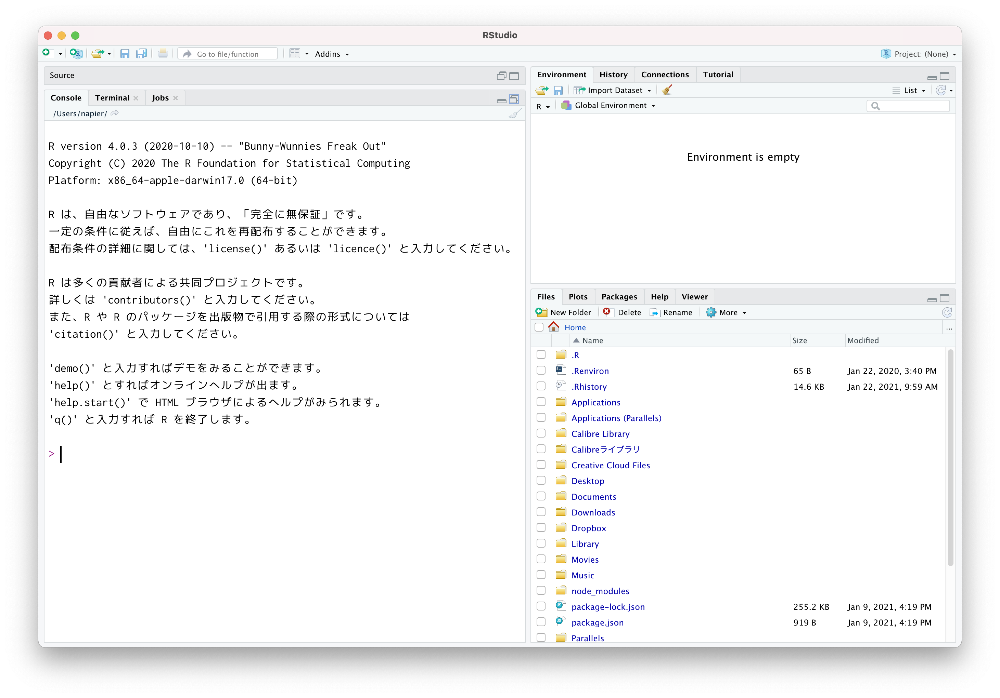
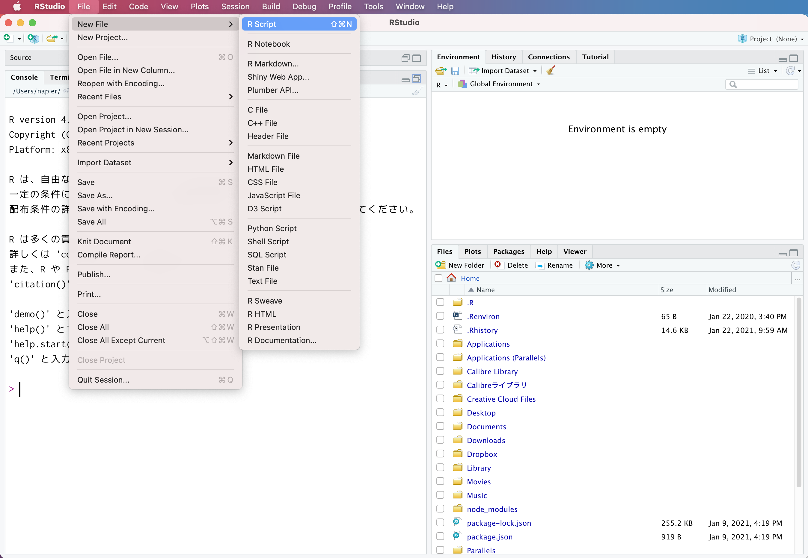
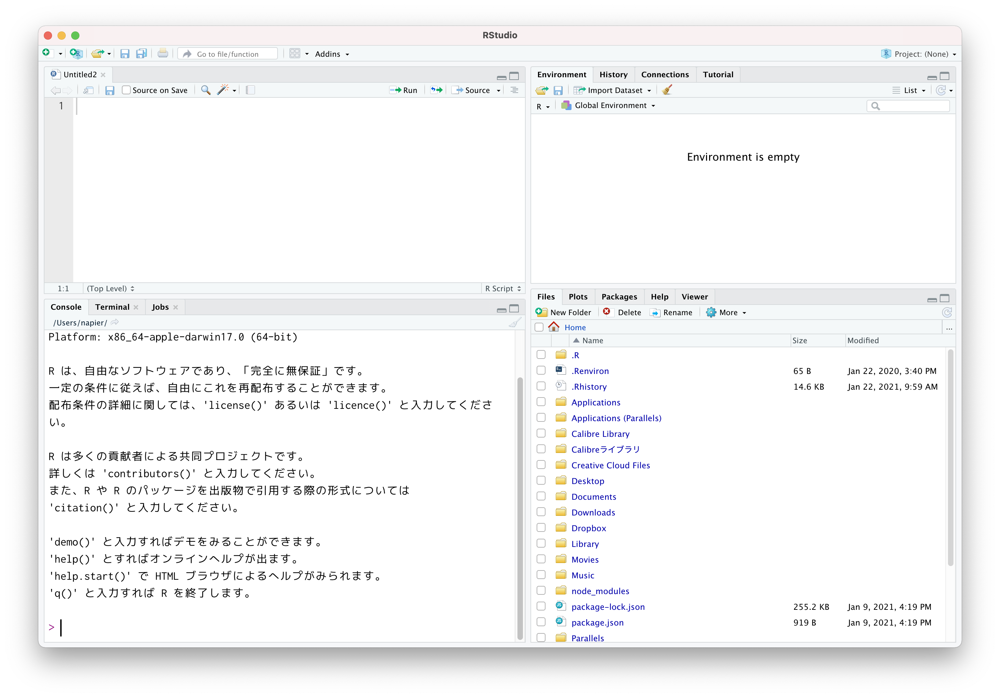
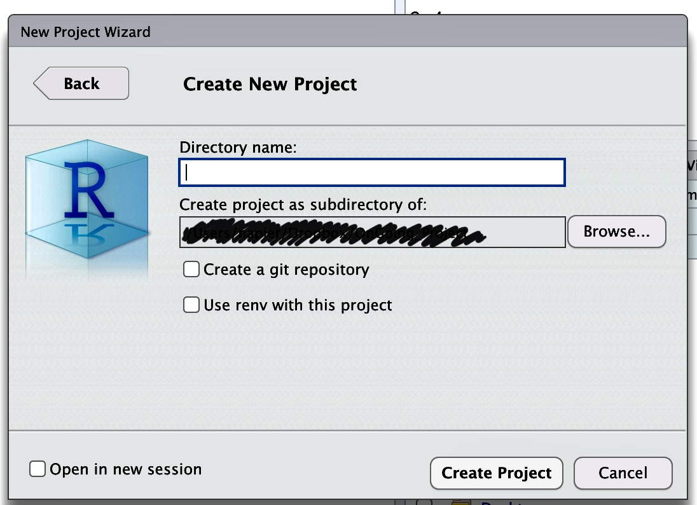
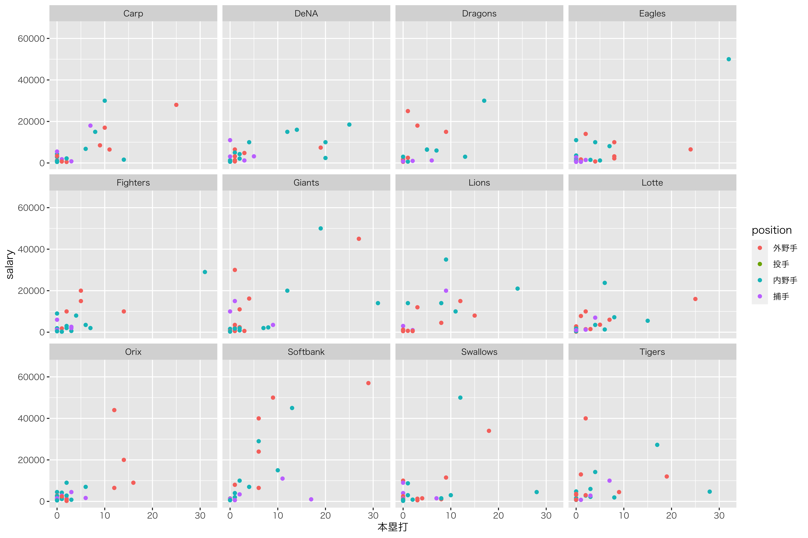

# 統計環境Rを使ってみる {#chapter5}

ここまで，データを可視化したりデータの代表値を計算する方法について学んできましたが，実践上これらは全てコンピュータを使って行います。
今回はPCを使った実践的な内容になります。パソコンを実際に触りながら，意図したことを正しく機械に伝え，意図した結果を得られるようにスキルアップしていきましょう。

## 環境の準備

### 統計解析環境とアプリケーション

皆さんはパソコンをどういう用途で使うことが多いでしょうか。インターネットで調べ物をしたり[^1]メールの読み書きをする，というのが多いかもしれません。FacebookやTwitter，InstagramなどSNSを利用する，これもインターネットに関係するアプリケーションですね。これらはスマートフォンやタブレットなどの方が手軽で便利にアクセスできるので，それらを使うことの方が多いかもしれません。

インターネットにアクセスするのではなく，手元のPCで(ローカル環境で)作業する例としては，文章を書くことが多いでしょう。大学生をはじめ研究者というのは基本的にコミュニケーションをする人ですから，半ば文筆業であると言っても過言ではありません。またこの文章を作成するために，必要な資料を作ることがあり，数値データを扱う場合は表計算ソフトを使うことになるでしょう。表計算ソフトの代表例として，Excel，Numbers，Calcsなどがあります。表計算ソフトは記述統計量やグラフの作成など，これまで学んできたことが簡単にできるものがありますが，それ以上の複数の変数を一度に扱った分析を行うのには，機能的に不十分です。

そこで，より専門的な統計的処理をするためには，統計専用のソフトウェアを使うことになります。統計専用のソフトウェアとしては，SPSSやSAS，Stataなどの商用ソフトウェアもありますが，専修大学人間科学部心理学専攻では現在，Rを学科共通のツールとして利用することにしています。

### 統計環境R

Rは統計環境，統計言語とも呼ばれることがあります。統計に関する分析をCUIで行うので統計"言語"と呼んだり，数字だけでなく図を描くなど数値処理に関わることを全体的にカバーしているので"環境"と呼ばれたりします。Rが優れている点はフリーソフトウェアであるという点で，誰でも無償で利用できることです。商用ソフトウェアと違って，ソースが公開されているのでその気になれば誰でもその内部構造を調べることができますから，間違い(エラー，バグ)がないかどうかをみんなの目でチェックできるというのが利点です。金銭的に補償があるわけではないのですが，そもそも学問の世界は市井の資本主義的発想とは異なる価値で評価される世界ですから，無償であることは問題になりません。

またRは多くの研究者が利用しており，その研究成果をフリーソフトウェアの精神で共有しています。こうしたRの基本関数以外の機能は，パッケージという形で提供されます。Rのパッケージを共有している場所はThe
Comprehensive R Archive
Network()と呼ばれ，ここに登録されているパッケージは誰でも利用できます。最先端の分析ツールがここを介して共有され，間違いや問題が生じたら随時修正されていきますので，成長する統計ソフトウェアということができるでしょう。

### 総合開発環境RStudio

Rは優れた統計ツールではありますが，本体だけでは簡素な言語的やりとりができるに過ぎません。分析を進めていくとすぐにわかりますが，ファイルの操作や描画機能，過去ログの参照や管理など，統計言語を扱う際にそれを取り巻くさまざまな操作が必要になります。ここをカバーしてくれるのがRStudioというアプリケーションです。

RStudioはそれ単体では使うことができません。Rが入っているPC上で，Rを取り込んで初めて意味のあるアプリケーションになります。Rの計算機能を活用するだけでなく，文書作成機能やデータベースとの連携など非常に高機能な統合的サービスを提供してくれます。文章を書き，その文章に必要な計算を行い，その結果が全て記録(スクリプト，コマンド，プログラム)として残るわけですから，科学論文を書くためにはRStudioだけでも十分です。

### 統計環境の準備

専修大学の情報科学センターにあるPC室や，心理学科が管理する4号館4FのPC室にはRやRStudioがすでにセットアップされていますので，これを利用するのであれば特に準備は必要ありません[^2]。

しかしながら，大学のPC室に行かなくても自宅で論文やレポートを書きたい，ということもあるかもしれません。また，大学などの設備は大学が管理していますので，自分でパッケージを追加したい，とおもっても管理権限がなくうまく行かないこともあるかもしれません。幸いRやRStudioはフリーソフトウェアですので，手元のPCにインストールして環境を構築するにしても，元手は一切かかりません。これを機に，自分のパソコン環境にR/RStudioを準備しておくと良いでしょう。

RやRStudioの環境構築については，その方法を検索すればさまざまなものが出てきますので，そちらを参考にしてください[^3][^4]。書籍では，手前味噌で恐縮ですが@kosugi2019などが良いでしょう[^5]。

以降は環境が準備できているものとして解説を続けます[^6]。

## RとRStudioの基本的な機能

それでは今から，RStudioを使った統計処理の演習を始めましょう。少し不便かもしれませんが，この資料を横に置いて，**必ず自分でコードを入力しながら**進めていってください。テキストと同じ結果が手元で再現できることを確認しながら進むことは，再現できることの重要性の確認になります。また，最初のうちは打ち間違えなどで思うように動かないことも頻発するでしょうが，その経験を繰り返すことで徐々に使い慣れていきます。失敗の経験はテキストの文中に書き込まれていませんから，読むだけでは身につきません。また，読み進んで気が向いたところだけ実行するときは，その前のデータや内容を参照している場合にエラーになるので，結局元に戻ってやり直すことになります。最初のうちは写経して作法を身につけることも重要なのです。最初の基礎的な訓練[^7]ができていると，徐々に大きなプロジェクト[^8]を動かすことができるようになりますので頑張って！

### RStudioの機能と画面

最初にRStudioを起動すると，図[1.1](#fig::05_01){reference-type="ref"
reference="fig::05_01"}のような画面になっていると思います[^9]。ここでメニューから` File > NewFile > RScript `と進むと(図[1.2](#fig::05_02){reference-type="ref"
reference="fig::05_02"})，画面に白いページの領域が追加されます(図[1.3](#fig::05_03){reference-type="ref"
reference="fig::05_03"})。

大きくみると画面が四分割されたようになります。この4つの領域を基本として話を進めていきます[^10]。

{#fig::05_01
width="10cm"}

{#fig::05_02
width="10cm"}

{#fig::05_03 width="10cm"}

##### コンソール・ペイン

デフォルトでは画面の左下になりますが，ペインにあるのがRそのものです。
RStudioはRを取り込んで使いやすくする環境を提供するもの，という話をしましたが，とりこまれたRだけの画面が左下にあります。そこにはRのバージョン情報や，次のような注意書きが書かれています。

>     R version 4.0.3 (2020-10-10) -- "Bunny-Wunnies Freak Out"
>     Copyright (C) 2020 The R Foundation for Statistical Computing
>     Platform: x86_64-apple-darwin17.0 (64-bit)
>
>     R は、自由なソフトウェアであり、「完全に無保証」です。 
>     一定の条件に従えば、自由にこれを再配布できます。 
>     配布条件の詳細に関しては、'license()' あるいは 'licence()' と入力してください。 

その下に`>`という記号が出ていると思います。これは入力を待っている状態でこの記号の左側に命令をどうぞ，という意味です。この記号が出ているときは，Rは次の動作準備OKで指示を待っているという状態です。ここにコードを入力すれば計算結果が出力されるのですが，その前にスクリプトペインの説明をします。

##### スクリプト・ペイン

スクリプトペインは，Rのコードを書くところです。Rは一問一答型(インタプリタ[^11]方式ともいいます)なのですが，実際の統計処理はあれをして，これをして・・・とたくさんの処理が連なることになります。この一連の手続きを書いておくのがこの場所です。

スクリプトとはお料理のレシピのようなものです。1つ1つの計算は，例えば「玉ねぎをみじん切りにする」といった単一の作業をさせることになりますが，全体としてハンバーグを作るのが目的であれば，1つ1つの作業を全て順番通りに実行しなければなりません。直接コンソールペインに書き込んで言ってもいいのですが，途中で「今どの工程だっけ」というのがわからなくならないとも限りませんので，一旦スクリプトのところに書いてから実行する，という手段を取るのが便利です。

実際にコマンドを1つ1つ書いていくときには，書き間違えたり違う方法を試したくなったりするので，書いたり消したりしながら進むのが普通です。ですが最終的には清書したものだけを残すようにしましょう。下書きの要素も全て記録していると，あとで何がどうなったかわからなくなります。また，何度か繰り返しているうちに「何にどのような操作をしたか」がわかっているようでわからなくなることがあります。最終的には，1つのスクリプトファイルを一行目から順に実行していけば，全ての作業が再現できるようにする，ということが重要です。途中で別のレシピを参照したり，記録されたいない操作を挟むのはやめましょう。

さてでは，このスクリプトペインに`code:[code::05_01]`を書いてみてださい[^12]。

``` {#code::05_01 .c++ language="c++" label="code::05_01" caption="四則演算のコード"}
# 四則演算
    1+2
    2-4
    3*5
    6/3
    sqrt(16)
```

##### コード解説

1行目

:   コメントアウト。`#`記号で始まる行は，その後ろに何を書かれていてもRは無視します。なので，この記号を冒頭に描いて，ここに何をしているかという説明を書き入れています。このコメントは，あとで見直す時に何をしていたか判るためのものなので，必ず書かなければならないというものではないのですが，あればあるほど親切で丁寧なコードと言えるでしょう。

2-5行目

:   順に和，差，積、商を求めるコードです。積`*`と商`/`の記号はPCではこのように書きますので注意してください。

6行目

:   これは関数を使って答えを出しています。`sqrt`関数は正の平方根を返します。

書いたあと，スクリプトペインの右上にある`Run`を押すと一行ずつ実行されていきます。マウスで複数行を選んで`Run`ボタンを押すと囲んだ箇所を実行します。このスクリプトペイン全体を実行したいときは`Source`ボタンを押します。

{#fig::05_04
width="8cm"}

これらのボタンを押すと，コードがコンソールに送られて実行結果が返ってきます(図[1.4](#fig::05_04){reference-type="ref"
reference="fig::05_04"})。コンソールに示されているものは，この資料では次のような囲みで表現します(`console[RS:out05_01]`)が，さて，みなさんの環境で同じ結果が得られましだでしょうか。

::: Rscreen
四則演算out05_01

    > # 四則演算
    > 1+2
    [1] 3
    > 2-4
    [1] -2
    > 3*5
    [1] 15
    > 6/3
    [1] 2
    > sqrt(16)
    [1] 4
:::

出力をみると，1つ1つの問い(例えば`1+2`)に対して，毎回答え(例えば`[1]  3`)が返ってきています。一行ずつ実行した人はわかると思いますが，毎回`>`の記号がでてRが回答準備ができている時に，次の命令を受け入れることになります。もしおかしなコマンドが入っていれば，エラーが出ているはずですので，それをよく読んでどういうエラーなのかを考えましょう。我々が書くコードは，ミスやバグが多分に含まれます。私もいまだにスペルミスでエラーを発生させています。複数行を一気に実行してしまうと，どこにエラーが出ているかわかりにくなりますので，一行ずつ実行することを強くお勧めします[^13]。

ところで，$1+2$の答えは$3$ですが，出力の`[1]`はなんでしょう？
これは答えの要素がひとつ，という意味です。これからたくさんのデータを一度に処理することがありますが，そのときは答えがたくさん出てくることがあるので，その場合は何行にもわたって答えが返されることがあります。詳しくは後ほどの実践例で説明していきます。

さて，これが基本中の基本の使い方です。実践的な内容に入る前に，そのほかのRStudioペインの説明をしていきましょう。

##### Environment/History・ペイン

画面の右上にあるのはEnvironmentやHistoryのペインです。Environmentは環境，すなわちこのRの頭の中にどういう変数、関数が入っているかを示してくれるところです。例えばたくさんのデータセットを読み込んだ，というときは，それがどういうデータなのかを示してくれたりします。

Historyは履歴を表すタブです。ここをみると，今実行した過去のログが残っています。「さっき書いた命令をもう一度実行したい」というときはここで探すといいでしょう。このペインには，`to Source`や`to Console`というったボタンもあります。ある行を選んでこのボタンを実行すると何が起こるか，確かめてみてください。

##### Files/Plots/Packages/Help/Viewer・ペイン

右下のペインはよく使う便利なところです。

1.  Filesペインは，ファイル操作をする場所です。ファイルのコピー，移動，フォルダの作成などができます。エクスプローラやFinderと同じようなものだと思ってください。

2.  Plotsペインは図の出力を確認するところです。ここで作られた図を適当なサイズやファイル形式に変換して出力することもできます。

3.  Packagesペインは，Rのパッケージを管理するところです。Rはパッケージを追加することで機能がアップしますが，この追加やアップデートをこのペインで実行すると便利です。

4.  Helpペインは，関数のヘルプが表示されるところです。表記は全て英語なのが残念ですが。

5.  ViewerペインはHTMLなどの出力をみる画面です。

これらは必要に応じてみていくことになりますので，ここでは大体のイメージが掴めていればOKです。またこれらのペインは場所を変えることも可能ですので，自分の良いようにレイアウトしてみてください。

### プロジェクト管理とRmarkdownによる実践

さて環境の意味がわかったところで，いよいよ実践に入っていきます。先ほども少しコードを書いてみましたが，今度はより本格的に使っていこうと思います。

#### プロジェクトによる管理

RStudioを使う時の基本は，プロジェクトによる管理です。分析するデータ、テーマ、内容によってプロジェクトを切り替えながら使います。みなさんはこの授業の他にも，Rを使う授業があるかもしれません。また，学年が上がっていくについれて，様々な心理学実験，研究に関わっていくことになります。その時、全てを同じドキュメントフォルダに入れてしまうと、何が何だかわからなくなるので，フォルダごとに区分しますよね。それと同じように，Rで作業する場所をRStudioでもくぎりながら管理しようということです。

メニューバーから`File > New Project`と進んでください。すると「New
Directory」「Existing Directory」「Version
Control」の選択肢が出てきます。New
Directoryは新しいディレクトリ(=フォルダ)を作ってそこで関連ファイルをまとめますよ，という意味です。Existing
Directoryは既に存在するディレクトリ(=フォルダ)をまとめる場所にしますよ，という意味です。みなさんの環境に応じて使い分けてください。ここでは新しくフォルダを作る例を説明します[^14]。

{#fig::05_05
width="8cm"}

図[1.5](#fig::05_05){reference-type="ref"
reference="fig::05_05"}には`New Directory > New Project`と進んだ次のウィンドウを示しています。黒く塗りつぶしているところは私の個人的なPC環境の内容が反映されるので誤魔化しているんですが，みなさんの環境にあった場所(DocumentとかDesktopと言った場所)を選び，上の空白になっているところに新しいプロジェクト名(例えばなど[^15])を入力してOKとします。するとしばらくすると，画面が変わるはずです。一見同じ状態のようにも見えますが，実はところどころ違いがあります。気がつきましたか？

{#fig::05_06
width="12cm"}

図[1.6](#fig::05_06){reference-type="ref"
reference="fig::05_06"}にはプロジェクトを開いている時のRStudio画面を示しています。赤く丸で囲っているところが，プロジェクトを開いていない時との違いがある箇所です[^16]。これをみると，コンソールペインやFileペインの場所に，今指定したフォルダの位置が示されていることがわかります[^17]。このプロジェクトが開いているフォルダに移動していることが重要で，このフォルダの中が今作業している場所として認識されるので，このフォルダの中にあるファイルにはファイル名だけでアクセスできるようになります。プロジェクトが違ったり，プロジェクトの起動をしていなかったりすると，作業している場所[^18]が変わりますので，注意が必要です[^19]。

::: tcolorbox
　以下ではみなさん自身でRコードを書いていくのですが，誰しも，間違いなく，エラーに遭遇します。
エラーはムカつきますし，理由がわかりませんし，何書いているかわからん！ってなりますよね。

　でも，エラーはヒントなのです。ここでこういうエラーが生じましたよ，というヒントをくれているし，それに対応しさえすればちゃんと動いてくれます。
プログラムは思った通りに動くのではなく，書いた通りに動くのです。
ですから，赤字で何か出てきた場合はどういうエラーなのかを読み取るようにしましょう。何行目の，どの部分で生じたエラーかが別れば，対応の仕方がわかります。

　最初のうちはエラーの読み方もわからないと思います。そういう時は遠慮なく質問してください。ただし質問する時に「エラーが出て動きません」とだけ言われても困ります。エラー情報がないと私も対応できませんから。
「何行目を実行したら，これこれこういうエラーが出て動きません」と言われると，対応できます。怖がらずに進めていきましょう。
:::

### Rの基本操作

ではこのプロジェクトの中で、演習を進めていきましょう。
先ほどと同じように，`File > New File > R Script`と進んで新しいスクリプトファイルを開きます。

今から色々書いていきますが，これを記録しておくには，ファイルを保存する必要があります。`File > Save`と進むと保存できますので，ファイル名をつけて保存します。拡張子[^20]は`.R`にしておきましょう(小文字の`.r`でも結構です)。特に思いつかなければ，`Lesson01.R`とでもしておいてください。

#### 関数の利用

先ほど，`sqrt(16)`という関数の例をみました。この`sqrt`関数はスクェアルート，つまり平方根を求めろというものです。何の平方根を求めるか，というと16という数字の平方根ですので，実行すると4という答えが返ってくるわけです。

このように，関数名で命令を指定し，その対象は小かっこ`()`で囲って渡すというやり方をします。$f(x)$ということですね。括弧の中に入るものはといい，今回のように目的となる数字を渡すこともありますが，そのほか関数を動かす上でのオプションを指定することもあります。また，1つの引数だけではなく，複数の数字を渡したり，複数のオプションを指定することもあります。

例えば関数がどのように動くか知りたいという時，ヘルプを開くのも関数で行います。`code:[code::05_02]`を実行すると，Helpペインにその説明が出てくるので確認してみてください。

``` {#code::05_02 .c++ language="c++" label="code::05_02" caption="ヘルプのコード"}
# ヘルプも関数
    help(sqrt)
```

#### パッケージの利用 {#HowToUseRpackage}

Rでは関数を使って様々な計算をこなします。Rをインストールした段階でも，簡単な統計計算は十分できるようになっています。ですが，より専門的な分析やより高機能な情報処理をしようとするならば，を利用することになります。Rは豊富なパッケージが利用できることがその特徴で[^21]，パッケージはCRANを通じて世界に公開されています。RStudioのパッケージペインを開くと`install`と`update`というボタンがありますが，`install`ボタンを押すと何のパッケージをとってくるか，入力できるようになります[^22]。"Packages"とあるところに必要なパッケージ名を入力すると，自動的にCRANにアクセスしてダウンロードが始まります。パッケージのインストールとダウンロードはその環境下では一度実行するだけで結構です。パッケージというのは関数群であり，関数を記載したファイルのダウンロードが終われば適切な場所(Library)に保存されます。

ただ，ダウンロードしただけではすぐにその関数が使えるようになりません。ダウンロード後は，必要に応じて`library`関数でパッケージを呼び出してやると，パッケージに含まれる関数が使えるようになります。購入したものを装備するかどうかは別，ということを頭の片隅に置いておいてください[^23]。
また，パッケージの中には関係するパッケージを一まとめにしたパッケージというのもあります。インターネットへのアクセスは必要ですが，優れたパッケージを無償で入手できますので，便利なものをいくつか決めていれとくと良いでしょう。本講義で必要なパッケージは随時指定しますが，ひとまずは`tidyverse`パッケージ[@tidyverse]を入れておきましょう[^24]。

このインストールは，RStudioのパッケージペインからも実行できますが，`code:[code::05_02b]`のようにコードを使って実行することも可能です。

``` {#code::05_02b .c++ language="c++" label="code::05_02b" caption="コードからインストールする"}
install.packages("tidyverse")
```

#### オブジェクトの利用

Rで扱う変数、関数、データセットなどには全て，名前がついています。なまえがついた「それ」のことをオブジェクトと呼びます[^25]。`code:[code::05_03]`を書いてみてください。

``` {#code::05_03 .c++ language="c++" label="code::05_03" caption="オブジェクトに代入"}
# オブジェクト
    A <- 2
    B <- 3
    A + B
    A
```

1行目

:   コメント

2行目

:   Aと名付けたものに数字の2を代入する。代入の記号は小なり(`<`)とハイフン(`-`)の二文字でできていて，矢印記号$\leftarrow$を表しています。RStudioの機能で，Macの場合はoptionとマイナス記号，Windowsの場合はAltキーとマイナスを同時に押すと入力できます。。

3行目

:   Bと名付けたものに数字の3を代入しています。

4行目

:   オブジェクトAとオブジェクトBを足し合わせています。

5行目

:   オブジェクトAの中身を表示させろ(中身はなんだっけ)，という意味です。

実行結果は`console[RS:out05_02]`のようになるでしょう。

::: Rscreen
オブジェクトに代入するout05_02

    > # オブジェクト
    > A <- 2
    > B <- 3
    > A + B
    [1] 5
    > A 
    [1] 2
:::

一行目は当然なんの回答もありませんが，2，3行目を実行してもすぐに次のプロンプト(`>`)がでて指示待ちになります。これは「代入しろ」といわれたから代入したのであって，特に反応を求めてないからです。次の4行目になって初めて足し算をせよ、と言われたのでその結果が5である，と返答しています。また，5行目はAとだけ入力されました。このように指示待ちの時にそのオブジェクト名を入れると，その中身を全て表示してくれます。今回は2がはいっているので，2ですよ，と答えてくれています。

このようにオブジェクト名だけで計算を進めることが可能です。オブジェクト名はなんでもいいのですが，`TRUE, FALSE, NA`などRが特別な意味を持たせている言葉や，`pi`などの数学的意味がある言葉は予約語といって既に使われているので，そのままの方がいいでしょう。かといって，A,
B,Cといった無味乾燥な記号でもわかりにくいので，その時々に応じて任意の名前をつけてあげてください。

ちなみにこの「オブジェクトに代入」は基本的に上書きされるというルールです。先程のコードに続いて`code:[code::05_04]`を書いてみてください。

``` {#code::05_04 .c++ language="c++" label="code::05_04" caption="オブジェクトは上書き"}
A <- 4
A + B
```

今度は結果として7が表示されたと思います。先ほどはAに2を代入せよといい，そのあとでAに4を代入せよと命じたので，いまAは4に上書きされています[^26]。この基本的に上書きされる，ということはよく注意しておいてください。というのも，これから長いコードを書くことがあったときに，部分的に実行を繰り返すと上書きに上書きを繰り返すこともあり得るからです。そうすると，ある時うまくいったけど，次に同じことをしようとしたらうまくいかなかった，ということにもなりかねません。くどいようですが記録は再現性の担保のためにやっているわけですから，一時的な記憶やたまたまうまくいった例に依存しては困ります。環境が空っぽの状態，クリアな状態で一行目から順に走らせて，何度やっても同じ答えが出るようにしましょう。

環境をクリアにするには，Environmentタブのバーにある箒のアイコンをクリックします。これでRの頭の中が空っぽになります。あるいは`rm(list=ls())`というコードを実行するとクリアされます。スクリプトの一行目にこれを書いておくことをお勧めします。

また，Rは終了すると，それまでの作業を保存しますから，同じプロジェクトをもう一度開くと以前の記憶が蘇ります。これが便利なのですが実は少し厄介で，学生さんが「自分の環境ではできた」といっても私の手元で再現できない(からレポートやり直し)ということがあります。きっと記録されているスクリプトの外で，なんらかの作業がなされているのです。清書できたスクリプトは，Rの頭の中を空っぽにしてから再チェックすると良いでしょう。また，`Tools > Global Option`から，Workspaceの"Restore
.RData into workspace at a
startup"(起動時に.RDataからワークスペースの情報を復元する)のチェックを外し，"Save
workspace to .RData on
exit"(終了時に.RDataにワークスペースの情報を保存する)を"never"(絶対そんなことしない)にしておくことで，いつでもクリーンな環境から始められます(図[1.7](#fig::05_07){reference-type="ref"
reference="fig::05_07"})。

{#fig::05_07
width="8cm"}

#### オブジェクトの型1・ベクトル

`code:[code::05_05]`を実行してみましょう。

``` {#code::05_05 .c++ language="c++" label="code::05_05" caption="ベクトル処理"}
obj1 <- 1:10
    obj1 + 2
    obj2 <- c(2,3,4,1,2,3,4,5,6,7)
    obj1 + obj2
```

1行目

:   `obj1`オブジェクトに"1:10"を代入

2行目

:   `obj1`オブジェクトに2を加える

3行目

:   `obj2`オブジェクトに"c(2,3,4,1,2,3,4,5,6,7)"を代入

4行目

:   `obj1`オブジェクトに`obj2`オブジェクトを加える

一行目で代入している"1:10"
はR独特の表記法で，コロンで繋いだ数字は連続した数字を意味します。ここでは1から10までの連続した数字，すなわち$1,2,3,4,5,6,7,8,9,10$です。このように数字のセットを一度に扱うことができます。このオブジェクトに2を加えるというのは，各要素に2を加えることと同じですので，そのような結果が出力されていますよね。
また三行目で代入しているのは$2,3,4,1,2,3,4,5,6,7$という数字列です。これを`c`関数で括っています。この`c`は一文字ですが関数で[^27]，数字をセットにするという働きをします。そして四行目で，対応する各要素を足し合わせるという計算を行っています。

このように，数字をセットで扱うことができるのが電卓とは違うところです。統計ではたくさんのデータを扱うわけですから，この機能は基本中の基本になります。ちなみに，数字のセットのことは数学でベクトルというのでした。こんかいのオブジェクトは数字をベクトルとして保管していることになります。

#### オブジェクトの型2・リスト

データセットは数字だけではなく，文字列などを含むことがあります。そうした対象をまとめて扱うのがという形式です。つづいて`code:[code::05_06]`を実行してみましょう。

``` {#code::05_06 .c++ language="c++" label="code::05_06" caption="リスト型"}
obj3 <- list(
        name = c("Taro", "Hanako", "Ken"),
        gender = c("male", "female", "male"),
        height = c(170,160),
        weight = 55
    )
    obj3
    obj3$name
```

1行目

:   `obj3`オブジェクトに代入するのは`list`であることを，`list`関数を使って明示しています。この関数の中身は複数行にわたり，括弧が閉じられるのは6行目になりますので，そこまでで1つの命令文だということになります。

2行目

:   nameという名前のついたベクトルを作ります。

3行目

:   genderという名前のついたベクトルを作ります。

4行目

:   heightという名前のついたベクトルを作ります。

5行目

:   weightという名前のついたベクトルを作ります。要素が1つでも，要素1のベクトルとRは解釈します。

6行目

:   1行目から続く`list`関数の終わり。リストの中に含まれるベクトルは間まで区切られていること，対応する括弧がきちんと閉じられていること，が重要です。

7行目

:   オブジェクトの中身はなあに，ということで中身を表示させています。

8行目

:   `obj3`オブジェクトのname要素だけにアクセスしてみました(要素を見せて，と命じている)。

出力された画面を見て，何が起きているかを確認してみてください。コードの2から6行目に当たるところでは，コンソールの左端が`>`ではなく`+`になっていると思います。これは前の行から続いて入力されている，つまり入力がまだ終わっていないことを意味する記号になっています。また7,8行目については，表示させる指示をしているので，その結果が返ってきているはずです。

このように，名前(文字列)や性別(名義尺度水準)，身長や体重(比率尺度水準/量的変数)などをひとまとめにして`obj3`というオブジェクトに保管する，ということができています。このオブジェクトのある変数だけ参照したい，というときは，オブジェクト名の背後にドルマーク(`$`)をつけて繋げます。RStudioで入力してる時は，`obj3$`と書いただけで「中身はこれですが」という候補のリストが示されたと思います。このように入力補完をしてくれるのもRStudioのいいところです。

ところでこれがデータセットだとすると奇妙ですね。名前や性別は3つありますが，身長は2つ，体重は1つしかデータがありません。普通こんなことはなくて，1つのケースについて複数の変数があるので，縦に個体$\times$横に変数の長方形型をしているデータセットが一般的になるはずです。リスト形式は各要素の長さに関係なく，なんでもまとめて置けるので便利なのですが，データ分析においては長方形であるという形の制約があって良いはずです。この制約を持ったリスト形式のことを型と言いいます。

#### オブジェクトの型3・データフレーム型

データフレーム型にするには，`data.frame`という関数を使います。`code:[code::05_07]`を実行してください。

``` {#code::05_07 .c++ language="c++" label="code::05_07" caption="データフレーム型"}
df <- data.frame(
        name = c("Taro", "Hanako", "Ken"),
        gender = c("male", "female", "male"),
        height = c(170,160,155),
        weight = c(55,60,43)
    )
    df
    df$name
```

1行目

:   `df`オブジェクトに代入するのは`data.frame`であることを，`data.frame`関数を使って明示しています。

2行目

:   nameという名前のついたベクトルを作ります。

3行目

:   genderという名前のついたベクトルを作ります。

4行目

:   heightという名前のついたベクトルを作ります。要素数を合わせます。

5行目

:   weightという名前のついたベクトルを作ります。要素数を合わせます。

6行目

:   1行目から続く`data.frame`関数の終わり。ここに含まれるベクトルは間まで区切られていること，対応する括弧がきちんと閉じられていること，が重要です。

7行目

:   オブジェクトの中身はなあに，ということで中身を表示させています。

8行目

:   `df`オブジェクトのname要素だけにアクセスしてみました(要素を見せて，と命じている)。

コンソールには`console[RS:out05_03]`のように表されていると思います。

::: Rscreen
オブジェクトに代入するout05_03

    > df <- data.frame(
        +     name = c("Taro", "Hanako", "Ken"),
        +     gender = c("male", "female", "male"),
        +     height = c(170,160,155),
        +     weight = c(55,60,43)
        + )
    > df
        name gender height weight
    1   Taro   male    170     55
    2 Hanako female    160     60
    3    Ken   male    155     43
    > df$name
    [1] "Taro"   "Hanako" "Ken"
:::

このオブジェクト，`df`の出力を見るとわかるように，行に個人，列に変数の長方形方になっています。変数にアクセスする時は，list型の時と同じようにオブジェクト名の背後に`$`をつけて，`df$name`のようにします。

今回はひとまずデータを作るために，各ケースの値を入力して行ってもらいましたが，実際に統計解析をする時は表計算ソフトで素データを入力し，ファイルからRにデータを読み込むことが一般的です。これについては第[1.4.1.0.1](#readCSV){reference-type="ref"
reference="readCSV"}節で説明します。

## Rmarkdownによる文書作成

ここまでで，Rに計算させたりデータを入力したり，と統計的な処理をいろいろさせてきました。RStudioは総合開発環境として，こうしたRの計算機能に加えて文書作成機能も持っています。ここではRStudioを使った文書作成を解説したいと思います。

表計算ソフトと文書作成ソフトは別々のものですがセットで販売・利用されることが多いものです。これらをまとめてオフィスソフトということがあります。Microsoftが提供するのはWord,
Excel, PowerPointなどのOfficeシリーズですし，Appleが提供するのはPages,
Numbers,
Keynoteなどです。他にもフリーソフトウェアとしてLibreOfficeシリーズがあり，そこではWriter,
Calc, Impress
Presentationという名称になっていますが，何も文書作成，表計算，プレゼンテーションのアプリです。こうしたものが一般的に提供されているので，表計算ソフトで数値計算し，文書ファイルで報告書を書いて，プレゼンテーションアプリで紙芝居形式の発表をする，というのがよく行われています。これから皆さんもたくさんこうした資料を作ることになると思いますが，作成に当たっては，表計算ソフトで図表を作って，それをコピー＆ペーストして文書ファイルやプレゼンテーションファイルに切り貼りする，という方法を取ることでしょう。これが短い資料であれば問題ないのですが，長い資料や多くのデータになってきたりすると，貼り付ける図を間違えるとか，数字の修正をする前の図版だった(更新されたグラフにアップデートし忘れた)といった問題が生じやすくなります。これをと言ったりします。

文書作成とそこに含まれる図表や数字の計算が，同じ環境で行われればこの問題は無くなります。RStudioはそれを実現してくれる環境です。計算環境はRが持っていますから，それを文書に組み込む仕組みがあれば良いのです。RStudioではRmarkdownという書式を使ってこれに対応します。RmarkdownはMarkdownといわれるプレーンな文書作成形式にRを組み込んだRStudio独自のファイル形式です。メニューから`File > New File > R Markdown`とすすむと，最終的にどの出力形式のファイルが必要か聞いてくるところがあります(図[1.8](#fig::05_08){reference-type="ref"
reference="fig::05_08"})。ここにあるように，最終的にHTML，PDF，Wordといったファイル形式で出力ができます[^28]。ここではひとまずHTMLを選びましょう。Titleには文書タイトルを，Authorには作者名を入れますので，ここも適当なタイトルと皆さんの名前を入れてOKを押してください。

{#fig::05_08
width="8cm"}

するとRmarkdown形式のファイルが開かれます。すでに何か書き込まれたファイルになっていますが，これは書き方の例が書いてあるのです。図[1.9](#fig::05_09){reference-type="ref"
reference="fig::05_09"}に最初の数行をキャプチャしたものを示しました。皆さんの手元の環境でも同じになっているか，確認しながら以下の解説を読んでください[^29]。

{#fig::05_09
width="8cm"}

このファイルの1〜6行目は，文書全体の設定をしているところです。ここは基本的に変更する必要はありません。
1行目，6行目には'---'とありますが，この区切り記号が重要な意味を持ちますので，変更しないように特に注意してください。2行目はタイトル，3行目は作者，4行目は作成日，5行目は出力形式が書いてあります。これらは先程の図[1.8](#fig::05_08){reference-type="ref"
reference="fig::05_08"}で指定したものが反映されているはずです。これらは変更しても結構ですが，書式ルールから外れると後々うまくいかなくなるので注意してください。

7行目からが本文です。よく見ると，背景が灰色のゾーンと白色のゾーンがあると思います。灰色のゾーン(8〜10行目，18〜20行目など)はと呼ばれるRのコードを書く領域です。白色のゾーン(11〜17行目，21〜25行目など)は文書，本文を書くところになります。7行目以降はサンプルの文章が入っていますから，全て削除してしまっても構いません。実際に皆さんがレポート等を書く時は削除しましょう[^30]。でも今一旦そのままで，ファイルの上にある"Knit"というボタンを押してみましょう。これはと言い，文章を編み上げるという意味です。このファイルが未保存の場合は，保存するファイル名を指定する画面が出ますが，任意の名前にして実行してみましょう[^31]

{#fig::05_10
width="12cm"}

図[1.10](#fig::05_10){reference-type="ref"
reference="fig::05_10"}には，Rmarkdownのファイルと出力結果を並べてみました[^32]。対応関係がわかりますでしょうか。設定のところで入力したタイトルが大きく表示され，ついで作者名，日付が示されています。その後で本文が続きます。

出力の方では本文がR
Markdownから始まっています。これはもとのファイルの方では`##`で示されたところに対応していますね。Rmarkdownファイルでは，`#`記号はコメントアウトではなく，見出しの階層を示しています。`##`はレベル2，`###`とするとレベル3と，`#`の数で階層の深さを表現しているのです。階層が低いほど文字が大きく表示される仕組みです[^33]。

見出しのついてない文章に関しては，そのまま本文として出力されています。注目すべきは，灰色の背景を持ったRの領域の箇所です。例えば元ファイルの19行目には，`summary(cars)`と書かれていますね。これはRのコマンドで，`cars`というオブジェクトの要約を，`summary`関数を使って表示せよ，というものになっています。**本文にはこの命令文しか書いてありませんが**，右の結果を見ると灰色の背景でどのような命令がなされたかを示すと同時に，結果が表示されています(speed変数とdist変数の記述統計量が表示されています)。また，元のファイルの27行目では`plot(pressure)`というコードが書かれています。これは`plot`関数によって図が描けという命令文なのですが，これもファイルの方に反映されているはずです。

このように，計算結果をコピー＆ペーストで文書に書き写すのではなく，明示するのは計算手順だけでよいのです。このようにすることで，この出力された文書を受け取る側は，どのような計算がなされ，どのような結果になるかを確認できます。そしてそこには生じるはずがないのです！これは科学論文を作成するときに，方法を明示することと間違いがないことを担保しているという意味で，大変便利で画期的な方法であることがおわかりいただけたかと思います。

##### 自分で書いてみる

それでは元のファイルの7行目以下を全て削除し，自分なりにRmarkdownを書いてみましょう。
`code:[code::05_08]`のように書くのを目標とします。
このとき，Rのコードを書くチャンク領域を挿入するには，図[1.11](#fig::05_11){reference-type="ref"
reference="fig::05_11"}に示した上のボタンを押して，Rを選択します。`code:[code::05_08]`に書いてあるように，バッククォーテーションを3つ繋げて，中括弧でrと書き(```` ```{r} ````)，バッククォーテーションで閉じるという方法でも結構です。

チャンクには，設定や一時的な実行を行うためのボタンが表示されます(図[1.12](#fig::05_12){reference-type="ref"
reference="fig::05_12"})。実行ボタンを押すとknitではなくその下に実行結果が表示されるので，自分の意図した結果が示されているか，確認できます。

```` {#code::05_08 .c++ language="c++" label="code::05_08" caption="Rmarkdownを書いてみる"}
---
title: "れんしゅう"
author: "小杉考司"
date: "2/5/2021"
output: html_document
---

# 計算をする

## 四則演算

### 足し算

足し算をします。

```{r}
2+3
```

### 引き算

引き算をします。

```{r}
5-2
```
````

{#fig::05_11
width="10cm"}

{#fig::05_12
width="10cm"}

うまくできましたでしょうか。コードや設定に間違いがあればknitは中断してしまいますが，エラーメッセージを読んで対応しましょう。RMarkdownについて，詳しくは@高橋201805が一冊を使って解説していますし，@紀ノ定201806や@kosugi2019なども参考になります[^34]。

## グラフの文法

RとRStudioを使って計算し，文書を作成するという基本的な使い方についての概説は以上です。それではこれから，より実践的な演習に入っていきます。

まずはデータをファイルから読み込むこと，そしてそれを描画するグラフの文法について紹介します。

### データの読み込みと整理

データが数件しかないのであれば，上で解説した方法で`data.frame`型に1つ1つ入力していけば良いのですが，Rのコードでそれを実行するとなると大変です。また実際の研究のシーンであれば，機械が大量にデータをファイルに出力するといったこともあるでしょう。Web調査を行った結果なども，表計算ソフトで利用できる形に出力されるのが一般的です。

ここではそうしたファイルからデータを読み込む方法について説明します。

データファイルを自分で作ることもあるかもしれません。データを手入力してファイルを作る場合は，表計算ソフトを使う方が便利です。このときに注意すべきことは，**1つ載せるには1つのデータしか入れない**ということです。これからデータを色々加工していきますが，加工する前のデータはなるべくプレーンな状態であったほうが良いのです(すでに加工された食材を違う料理に利用するのは大変ですから！)。

図[1.13](#fig::05_13){reference-type="ref"
reference="fig::05_13"}には分析に不向きな，悪いデータファイル作成の例を示しました。これをまずはじっくり眺めて，どこがまずいのか考えてみてください。少なくとも7つの点で問題があります[^35]。

{#fig::05_13
width="12cm"}

分析しにくいよくないデータになっているのは次の箇所です。

1.  1行目にこの表のタイトルのようなものが入っていますが，これは分析には使わない情報なので不要です。

2.  1行目はセルを結合しています。データセットは`data.frame`型のように矩形であるべきなので，データのサイズを狂わせる行の存在は不適切です。

3.  2行目には大学名が入っているようです。AからD列はC大学，FからIはD大学のデータのようですが，1つのデータセットに複数のデータが混在しているのはよくありません。

4.  身長と体重，という変数名のところには1つのセルに複数の数字が入っています。カンマで区切られており，見た目にはわかりますが，機械的には(カンマのせいで)数字ではなく文字列として扱われます。データがデータになっていないのです。

5.  変数2の列は「非常にそう思う」という言葉の回答と，数字が入っています。1つの列の中に複数の種類のデータが含まれるので分析できません(文字と数字の集計ができない。ちなみにこの場合は文字変数として扱われます)。

6.  7行目に平均とありますが，データの平均はデータから計算できる量なので，Rで算出するものです。データの中に計算結果を入れておくべきではありません。

7.  I列6行目，D大学の杉田さんに関する変数3の箇所が空欄です。これはデータが入手できなかったところかもしれませんが，これは欠損値であることを明示すべきです。

8.  「東京の大学」と「神奈川の大学」という複数のシートがあります。データファイルとしては1つのシートにすべての情報が入っていなければなりません。同時に分析できるデータなのであれば，一枚のシートにまとめるべきです。

皆さんはいくつ気づいたでしょうか。これらの問題点を通じて言えることは「1つのデータセット，1つのセルには過不足ない情報を入れる」ということです。表を作って見せるのであればこのような入力でも良いのですが，ここでは数値データを分析することが目的なのですから，レイアウトや数字でない情報，計算してここから作れる情報は，分析に必要のない過剰な情報なのです。ちなみにアンダーラインや文字色，セルの色などは分析の時に自動的に受け落ちます(データではない情報なので)。

加えて分析の時に不便なのは，文字と数字の関係です。1つのセルに複数の数字が入る場合，区切り記号などをつけることが多いかと思いますが(スペースも機械にとっては文字です！)，こうした文字種・変数の種類・水準が混在しているのも情報過多ということになります。

今回の問題点を修正したのが図[1.14](#fig::05_14){reference-type="ref"
reference="fig::05_14"}のようなデータセットです。単一のデータセットで完結しています。また1つの列に一種類の変数，不要な情報はなく，過剰な情報もないデータセットになっているのがわかるかと思います。なお，変数3のところに`NA`とあるのは`No Answer`の略でを意味しています。これは読み込む時に，欠損値をどのような文字にしているか，という指定ができますので問題になりません。

{#fig::05_14
width="12cm"}

このように，データの入力の基本は，**1行に1ケースの情報が入っている，過不足のない1つのデータセットを作ること**である，と言えます。

このようにして作られたデータファイルは，UTF-8の文字コードによるcsv形式で保存するのが基本です($\to$第[\[chapter2\]](#chapter2){reference-type="ref"
reference="chapter2"}章[\[suffix\]](#suffix){reference-type="ref"
reference="suffix"}節)。ファイルを保存する時に，ファイル形式をしっかり指定し，拡張子も`.csv`にしましょう。csvファイルはASCIIファイルですし，文字コードも世界基準のUTF-8にしておけばどのPC空でもみることができます。ある一企業が開発した特定のOS，特定のアプリケーションを持っていなければデータを見ることができない，というのは科学的研究の観点からは不適切なのです。

##### データファイルを読み込む {#readCSV}

さて，ではデータファイルがプロジェクトの中に保存できたとしましょう。このファイル名を`sample.csv`とします。このデータファイルを読み込むには，読み込むための関数を使います。Rが持っている基本関数である`read.csv`関数を使えば読み込めるのですが，ここではより便利なパッケージの関数を使ってみましょう。

ここではRmarkdownではなく，プレーンなRスクリプトファイルをつくって話を進めます。
`FIle > New File > R Script`から新しくファイルを開くか，先ほどのRスクリプトファイルの下に`code:[code::05_09]`のコードを書いて実行してください。

``` {#code::05_09 .c++ language="c++" label="code::05_09" caption="CSVファイルを読み込む"}
library(tidyverse)
dat <- read_csv("sample.csv",na = "NA")
```

1行目

:   `tidyverse`パッケージを読み込む。次の`read_csv`関数がこのパッケージに含まれているからです。

2行目

:   `dat`オブジェクトに，`read_csv`関数で読み込むファイルを代入します。関数の第一引数はファイル名，`na`は欠損値の指定で，`NA`という文字列を欠損値として扱うことを宣言しています。

このようにすることで，外部ファイルを読み込むことができます。

::: tcolorbox
　ここでWindowsユーザの多くがエラーに遭遇します。「資料として配布されたファイルが文字化けして読み込めません」という相談が毎年頻発します。

　理由はWindows特有の過保護な親切設計と，いまだに局所的な古い文字コードを使っていることにあります。
資料ファイルはcsv形式でダウンロードして使ってもらうようにしています。こちらは世界標準のUTF-8でエンコードしてあります。
Windowsでこれをダウンロードすると，親切にも「ダウンロードしたら開くよね」といって勝手にExcelで開きます。みなさんもファイルの中身が見られたら安心ですね。でもそれを保存する時に，うっかり中身を触ってしまうようなことがあれば，文字コードを変えて上書き保存してしまいます。これで文字化けします。Excelなどで開かずに，直接Rで読み込むことがポイントです。

　また読込の時にエラーが生じるのであれば，WindowsのRにおける文字コードが勝手に日本ローカルに設定されて違う文字コードで読み込んでしまうことになります。
そんな時は読み込み関数に`locale=locale(encoding=”utf8")`をオプションとして追加すると良いでしょう。
:::

### グラフの描画

つづいてグラフの描画に進みましょう。第[\[chapter3\]](#chapter3){reference-type="ref"
reference="chapter3"}章[\[dataVisualization\]](#dataVisualization){reference-type="ref"
reference="dataVisualization"}節で触れたように，**データは図にする**のが基本中の基本ですし，この図をプログラミングすることが客観性，再現性の観点からも重要です。適切な図からは適切な情報の読み取りができますし，人為的でなくても不適切な図から間違った印象を受け取ることもありますから，なぜ・どういうつもりで図にするかを明文化できるようにしておきましょう。このことについての専門書，@Kieran2018の第1章は，知覚心理学や認知心理学の観点からグラフの書き方について論じられています。是非一度読んでみてください。

ここではにしたがって作図をする，`ggplot2`パッケージ[@ggplot2]を使いながら説明します。

##### 可視化の文法

可視化の文法に沿った作図のコードは，次のように考えていきます。

1.  X軸Y軸にどのような変数を置くかを考える。

2.  X軸Y軸から出来上がるキャンバスに，点や線，何をプロットするのかを指定する。

3.  その上にモデルを加えて，元のデータとの対応を考えたりする。別のデータを重ねることもある。

これを踏まえて，先程の`code:[code::05_09]`の続きに[^36]，`code:[code::05_10]`を入力してください。

``` {#code::05_10 .c++ language="c++" label="code::05_10" caption="まずはキャンパスを設定する"}
g1 <- ggplot(data = dat,  mapping = aes(x = 身長, y = 体重))
    g1
```

1行目

:   `g1`オブジェクトにggplotで作った図の情報を渡します。

2行目

:   `g1`って何?
    つまりこれを表示しろ，という命令です。`plot(g1)`と書いても結構です。

この1行目で，データは`dat`というオブジェクトを使い，x軸に`dat`オブジェクトの身長変数，y軸に体重変数を対応させたマッピングをしなさい，ということを指定しています。`aes`関数はピンとこないかもしれませんが，この1行目で，データは`dat`というオブジェクトを使い，x軸に`dat`オブジェクトの身長変数，y軸に体重変数を対応させたマッピングをしなさい，ということを指定しています。`aes`関数はなんと読むのかもピンとこない変な綴りだと思うかもしれませんが，実はaestheticの略です。エステティック，審美的・美学的思想という意味です。データの美的対応を考える箇所ですので，ちょうどいい名称ですね。この`aes`関数の中にはこのほかにも，色を何に対応させるか，サイズを何に対応させるか，群わけはどの変数に対応しているか，と言った対応関係を表す関数情報を設定するところだと思っておいてください。

さてこのように，データの縦横だけを指定したオブジェクトを作り，それを表示させると，プロットのところには灰色の背景を持ったキャンパスだけが表示されたと思います(図[1.15](#fig::05_15){reference-type="ref"
reference="fig::05_15"}の左上)[^37]。

これがベースになって，次々と要素を付け加えていきます。次のコード`code:[code::05_11]`，`code:[code::05_12]`を書いて実行してみてください。

``` {#code::05_11 .c++ language="c++" label="code::05_11" caption="キャンパスにデータ点をプロット"}
g2 <- g1 + geom_point()
    g2
```

1行目

:   `g1`オブジェクトに点(point)を打つ関数を追加したものを，`g2`オブジェクトとします。

2行目

:   `g2`って何?
    つまりこれを表示しろ，という命令です。`plot(g2)`と書いても結構です。

``` {#code::05_12 .c++ language="c++" label="code::05_12" caption="線形モデルを当てはめる"}
g3 <- g2 + geom_smooth(method="lm")
    g3
```

1行目

:   `g2`オブジェクトに滑らかな線を引く関数を追加し，`g3`オブジェクトとします。線の関数は`lm`，Linear
    Modelの略で直線を引く時に使います。

2行目

:   `g3`って何?
    つまりこれを表示しろ，という命令です。`plot(g3)`と書いても結構です。

![ggplotによる描画。左上は`code:[code::05_10]`，右上は`code:[code::05_11]`，左下は`code:[code::05_12]`，右下は`code:[code::05_13]の結果`](../images/text05/Rplot05_01.png){#fig::05_15
width="16cm"}

図がどのように変わっていくか，確認できたでしょうか。`g1`オブジェクトはただの白いキャンパスでしたが，それに点を打ったり(散布図)，線を引いたり(モデルの当てはめ)することでグラフがどんどん出来上がっていきます。
オブジェクトに次々追加していくことでこれができています。今回は理解のために逐一オブジェクトを作りましたが，慣れてくると一文で表現できます。

また今回使った`geom_`という関数は，geometry(幾何学)の頭文字ですが，これを使ってさまざまなマッピングをします。よく使われるものに，次のようなものがあります。

-   `geom_point` 点を打つ。散布図を書くことができる。

-   `geom_boxplot` ボックスプロットを書く。

-   `geom_bar` 棒グラフを書く。

-   `geom_line` 線を引く。折れ線グラフなどに使う。

-   `geom_smooth`
    滑らかな線を引く。どのような線を引くかは色々な関数が考えられる。

これらの組み合わせで，さまざまなグラフが表現できるのです。少し書き換えるだけですぐにできますので，色々変えて遊んでみましょう。

最後に，次のコード`code:[code::05_12]`を実行してみましょう。

``` {#code::05_12 .c++ language="c++" label="code::05_12" caption="線形モデルを当てはめる"}
g4 <- g3 + facet_wrap(~地域)
    g4
```

1行目

:   `g3`オブジェクトを地域変数で区切った図にせよ，という対応を指示。

2行目

:   `g4`を表示しろ，という命令です。

今度は`facet_wrap`という関数が出てきました。`facet_`というのは分割，区切りを考える関数です。データにはさまざまな情報を書き込むことができますが，適当なグループで書き分けることでわかることも出てきます。今回は地域という変数で分割せよ，という表現をしており，その結果が図[1.15](#fig::05_15){reference-type="ref"
reference="fig::05_15"}の右下のようになっています。

可視化の文法については，習うより慣れろといった側面があります。さまざまな出力例をみながら，どのようにこのグラフが書けたのか，文法を読み解く練習もしてみましょう。ggplotによる出力例は，<https://www.r-graph-gallery.com/ggplot2-package.html>などが参考になります。

## 課題

今回の課題は，Rmarkdownファイルで作成してください。タイトルは「課題5」とし，作者明(Author)のところに学籍番号，氏名を記入してください。出力形式はHTMLを選んでおいていただければ結構です。**提出するファイルはエラーのない完備な.Rmdファイルです**。ファイル形式の間違い，出力にエラーが含まれている(未完成な)ものは返却しますので注意してください。

##### 記述統計量を計算する

次の手順を実行し，データの記述統計量を計算してください。

1.  サンプルデータ`baseball2020.csv`をダウンロードし，プロジェクトフォルダに保存します。

2.  `code:[code::05_exe1]`を実行し，データを整えます。

3.  データ全体の要約をする関数`summary`を使って，データオブジェクトの記述統計量を表示してください。

4.  身長変数heightの平均値を算出してください。平均値の関数は`mean`です。

5.  体重変数weightの標準偏差を算出してください。標準偏差の関数は`sd`です。

6.  年収変数salaryの中央値を算出してください。中央値の関数は`median`です。

7.  身長と体重の相関係数を算出してください。相関係数の関数は`cor`で，2つの引数をとります。

``` {#code::05_exe1 .c++ language="c++" label="code::05_exe1" caption="データの読み込みと整え"}
library(tidyverse)
    dat <- read_csv("baseball2020.csv")
    dat$team <- as.factor(dat$team)
    dat$position <- as.factor(dat$position)
    dat$bloodType <- as.factor(dat$bloodType)
```

1行目

:   `tidyverse`パッケージを読み込みます。

2行目

:   データファイルを読み込みます。

3-5行目

:   `team,position,bloodType`などの変数は，名義尺度水準です。これが名義尺度水準であると設定し，同じ変数名に上書きしています。名義尺度水準にする関数は`as.factor`です。

##### 図を書いてみる1

同じデータセットを使って，`code:[code::05_exe1]`を実行してください。

``` {#code::05_exe2 .c++ language="c++" label="code::05_exe2" caption="さまざまなグラフを書いてみる"}
g1 <- ggplot(data = dat, mapping = aes(x = height, y = weight, color= team))
    g1 + geom_point()
    g1 + geom_smooth() 
    g2 <- ggplot(data = dat, mapping = aes(x = team, y = salary, fill= team))
    g2 + geom_boxplot()
```

1行目

:   データは`dat`オブジェクト，x軸は身長変数，y軸は体重変数で，チームごとに色分けをします。

2行目

:   散布図を書いてみます。

3行目

:   データに合うような線を引いてみます。

4行目

:   データは`dat`オブジェクト，x軸にチームを，y軸に年収変数をおいて，チームごとに色で塗りつぶします。

5行目

:   箱ひげ図を書いてみます。

##### 図を書いてみる2

図[1.16](#fig::05_16){reference-type="ref"
reference="fig::05_16"}と同じ図を書いてください。

{#fig::05_16 width="16cm"}

[^1]: 正確には，検索サイトを使って目的とするウェブサイトにアクセスする，という言い方になります。ウェブサイトを見る(ブラウズする)のはブラウザーというアプリケーションを使います。Chrome，Safari，Edge，Firefoxなどがブラウザーアプリケーションの名前で，Google，Yahooなど最初に開くウェブサイトのことをホームページと言います。ウェブサイトは個人や企業が提供しているものが多く，GoogleやYahooなどは検索サイトと言われます。

[^2]: 他にも心理学科には，計算機サーバというのがあり，ここにRStudio
    Serverが準備されています。RStudioServerは，インターネットを介するウェブブラウザからRStudioにアクセスすることができるものです。残念ながらまだ試験的導入段階で，心理学科の学生が一気にアクセスするとサーバがダウンしてしまいますので，希望者のみの利用にとどまっています。

[^3]: Rの唯一の弱点は検索可能性が低いこと。Rという一文字で検索してもまともなものにヒットしないので，"CRAN"とか"RとRStudio
    インストール"など周りに言葉を足して検索してみてください。

[^4]: 新しいものでは，高知工科大学柳井先生のこちら<http://yukiyanai.github.io/jp/resources/>とか，Quiitaの記事<https://qiita.com/hujuu/items/ddd66ae8e6f3f989f2c0>が良いでしょう。

[^5]: インストールに際しては，RStudio DesktopのFree
    editionを選んでください。RStudio CloudやRStudio
    Serverは別のものです。

[^6]: トラブルがあって環境の準備がうまくできていない場合は，`classkosugitti@gmail.com`までご相談ください。

[^7]: キーボードの入力に慣れていない人は，ブラインドタッチの練習をすることをお勧めします。キー入力は今後も活用できる社会人の基本スキルですので，なるべく早く習得しておいた方が人生が楽しくなります。ブラインドタッチの練習には，寿司打などのサイト<http://typingx0.net/sushida/play.html>で遊びながら学べていいですよ。ちなみに今やってみたら，私の成績は「高級10,000円コース【普通】で、★5,820円分
    お得でした！（速度：6.1key/秒、ミス：57key」でした。

[^8]: 卒論は4年間の集大成になる個人プロジェクトです。

[^9]: こちらはMacOS11.1，RStudioは1.4.1103，Rは4.0.3の環境で行っています(執筆時2021年2月2日)。OSが違うとか，バージョンが違う，サーバ版を使っているとかで細部が異なっている可能性があります。

[^10]: RStudio
    version1.4から，列を追加することができるようになりましたので，必ずしも四分割で使わなければならないというわけではありません。どこに何があるのかを把握していればOKです。ちなみに列を増やしたり配置を変えたりするのは，`Tool > Global Option > Pane Layout`から可能です。

[^11]: プログラミング言語の実行方法として，コードを逐次翻訳していく方法と，プログラム全体を一気に機械語に翻訳して実行する方法のに種類があります。前社をインタプリタ方式，後者をコンパイル方式と言います。インタプリタ方式の利点は書いたコードがすぐに実行されるので，どこでどういう処理がされているか分かり易いことです。エラーがあってもすぐにその場で帰ってきます。コンパイラ方式の利点は実行速度です。全部の処理を一気に機械語に翻訳してあるので，計算速度が非常に早くなります。コンパイラ方式の欠点は，どこでエラーが生じたかわかりにくい点です。

[^12]: この資料では指示がわかりやすくなるように行番号を含めて表示していますが，実際は行番号を入力する必要はありません。

[^13]: うまくいかなくて質問するときは，どの行でどのようなエラーが出たのか，を伝えてください。エラーの文章をコピーして伝えるようにしてください。よくない質問の仕方は「なんかエラーが出てできませんでした」です。こちらもサポートのしようがありません。

[^14]: Version
    Controlはパスしましたが、研究をする上ではこれが重要になってきます。つまり，何月何日にどのような作業をしたか，という記録を全て残しておく必要があるからです。研究ノートやラボノートと言われる記録をつける時に必要です。この記録は不正をしていない証拠にもなります。ここを選ぶとGitやSubversionといったバージョン管理ソフトと連携できます。今はそこまで厳格に管理する必要がないと思うので，説明を省略しますが，ゼミによっては必要になることもあるでしょう。

[^15]: 半角英数のみで作るべきです。

[^16]: MacOSの例なのでWindows版では上のバーのところなど，違いもあります。

[^17]: この例では`C:\Users\napier\Desktop\toukei`です。napierは私のPCの名前，toukeiはプロジェクト名です。

[^18]: ワーキングディレクトリといいます。

[^19]: 実際に授業をしていて，ファイルへのアクセスエラーで相談を受ける原因第2位です。第1位はファイルエンコードの問題です。

[^20]: $\to$第[\[chapter2\]](#chapter2){reference-type="ref"
    reference="chapter2"}のセクション[\[suffix\]](#suffix){reference-type="ref"
    reference="suffix"}

[^21]: 本講執筆時点(2021/02/05)で289,680件のパッケージがCRANに登録されています。それ以外にも無数のパッケージがGithubなどで公開されています。

[^22]: 出てくるボックスに示された，"Install
    From"が「どこからとってくるか」を示している欄になりますが，これはCRANが自動的に選択されているので変更する必要はありません。

[^23]: と同時に，同じパッケージを何度もダウンロードする必要はないということです。もっとも，Rのバージョンが上がるとか，違う環境で実行する場合は再ダウンロードが必要なこともあります。

[^24]: この`tidyverse`パッケージは，実はパッケージのパッケージですので，これをインストールしようとすると関連するその他のパッケージを次々と自動的に呼び出して環境を整えてくれます。初回は少し時間がかかりますが，気長に待ちましょう。大学のPC室や計算機サーバなどには，すでにインストールが終わっているのでその作業は必要ありません。

[^25]: 適当な日本語訳がありません。objectはもの，対象という抽象的な意味なので，カタカナでオブジェクトとするしかないのです。

[^26]: オブジェクトの中に何が入っているかは，Environmentタブをみるとわかることがあります。今見ると，Aに4，Bに3が入っていることが示されているでしょう。

[^27]: combineやconcatenateの略語と言われています。

[^28]: PDF形式に出力するには，TeXという別のシステムがまた必要ですが，これもRStudioからインストールすることができます。

[^29]: もちろんTitleとAuthorはちがうはずですが！

[^30]: 後ほど指示しますが，本講の課題はRmarkdown形式のファイルを提出してもらいます

[^31]: 初めての場合，RStudioが`knit`に必要な関連パッケージをインターネットからダウンロードしようとします。ダウンロードしても良いか?
    と聞いてきますのでOKを選択してください。

[^32]: knitがうまく完了していれば，Viewerペインに表示されているはずです。

[^33]: レポートの書き方についてはこの授業で教える範囲を超えますので詳細は他の授業に譲りますが，アカデミックライティングの基本は構造化された文章であることは踏まえておいてください。科学論文や学術的な文書というものは，段落＞見出し＞小見出しといった階層構造を持っています。特に心理学論文の場合は，段落が「問題」「方法」「結果」「考察」の4つであることが決まっていて，独自のスタイルに勝手に変えることはできません。

[^34]: 専修大学の国里ゼミと小杉ゼミでは，卒論をRmarkdownで書くことを推奨しています。再現性の観点から便利であることはもちろん，文書の規定に合わせたり引用文献リストを自動生成させたりする，専修大学専用パッケージ`senshuRmd`を共同開発しており，これを利用します。

[^35]: 残念ながら官公庁などが提供するデータの中には，こうしたよくない形式のファイルがよくみられ，データの活用ができにくくなっている実体があります。

[^36]: 続きというのは，パッケージやデータの読み込みが終わっていることが必要だからです。描画に必要な`ggplot2`パッケージは，`tidyverse`パッケージを読み込むと同時に読み込まれています。

[^37]: Macユーザであれば，x軸，y軸のラベル名が表示されず四角い豆腐のようなものしか出ないかもしれません。これは文字コードの問題で，次のコードを実行すれば直ります。`old <- theme_set(theme_gray(base_family = "HiraKakuProN-W3"))`。あるいは，「Mac
    ggplot2 豆腐 文字化け」などで検索してみてください。
