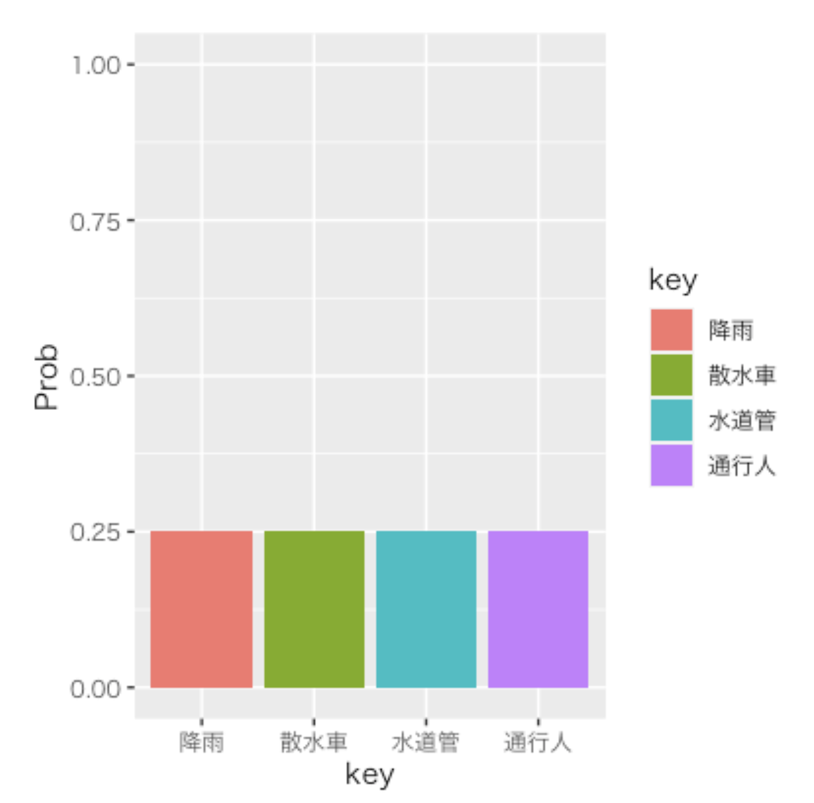
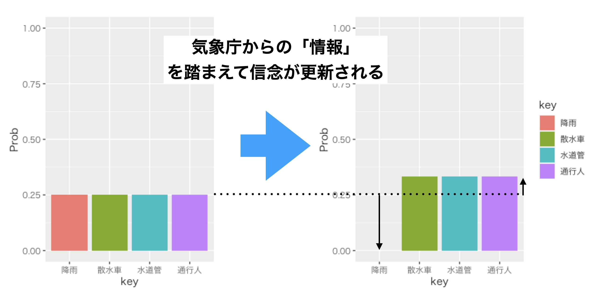
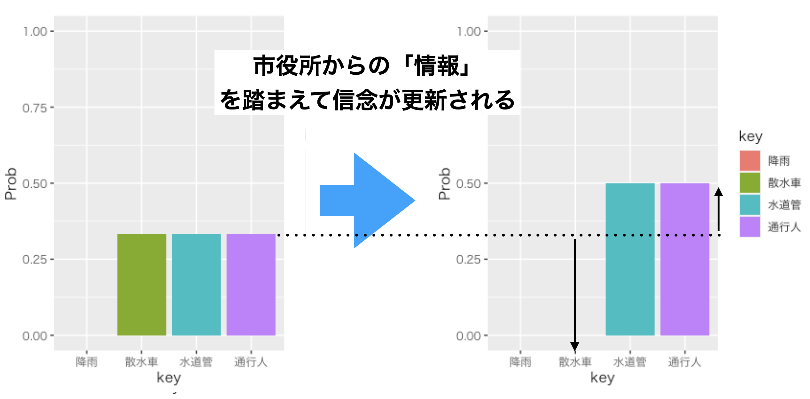
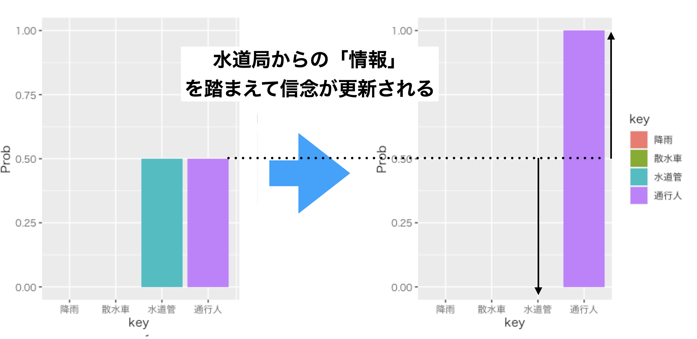
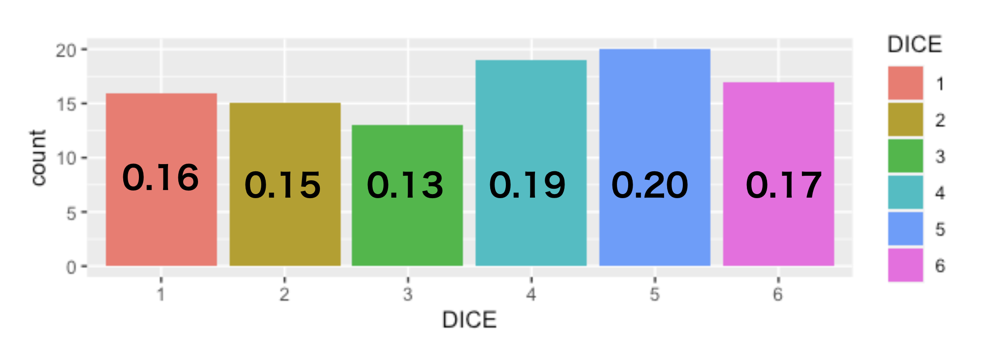
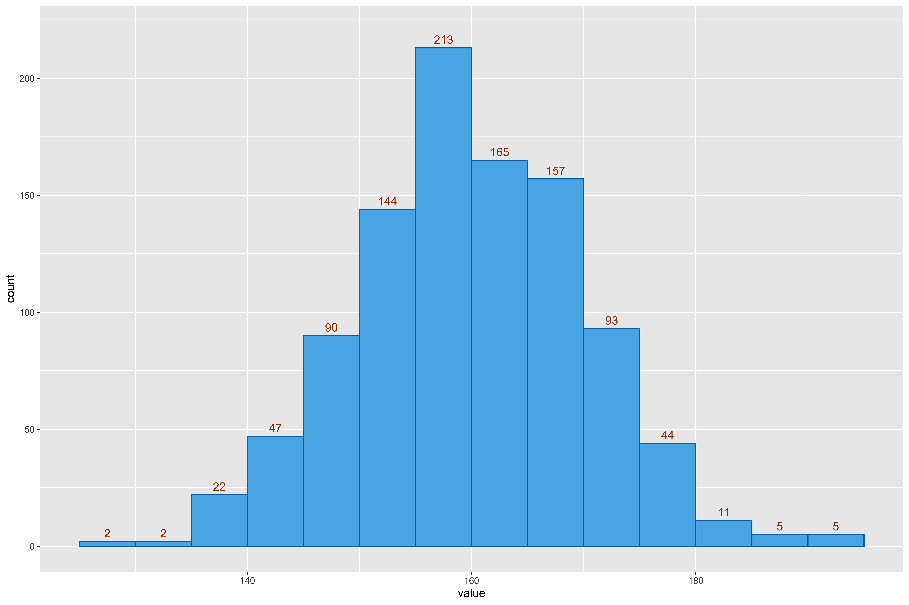
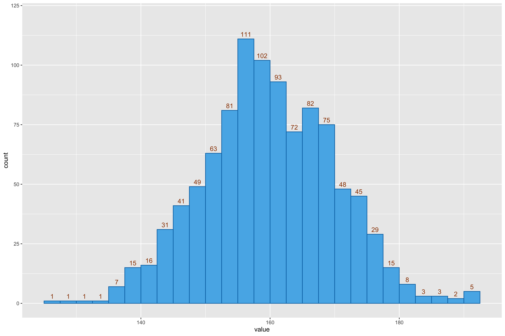
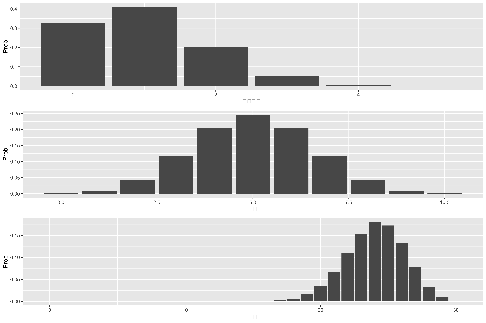

# 確率分布 {#chapter7}

今回は確率のお話です。

前回は心理学的な測定の話をしました。そこから急になぜ数学の話になるの，と思った人もいるかもしれませんが，確率と統計は切っても切れない関係にあるのです。
心理学における測定には，誤差が生じるという話をしました。この誤差は，目に見えなければどういう振る舞いをするかもわからない，規則性のないものです。
ただこの規則性のなさを，どうコントロールするかというときに，確率の概念が出てきます。

確率と呼ばれる数字は，偶然性や毎回の不確実さを表しつつ，その奥にある大局的な性質を記述できます。
測定の誤差が積もり重なると平均がゼロになるように，毎回の事実はわからなくても全体的な傾向を記述することはできるのです。

これは大規模調査を行う時にも応用できます。すなわち，個々人の違いはわからなくても，集計して統計を取った時に，その全体の平均的な傾向を掴むことは可能なのです。

偶然性をハンドリングし，全体的な傾向としてそれをコントロールするために，確率の考え方は避けては通れないのです。

## 確率と呼ばれる数字

確率と統計については高校数学でもある程度習うでしょう。「場合の数」を数え上げることから始まって，順列，組み合わせ・・・ああ面倒くさい！という印象を持っている人もいるかもしれません。

でもそれと同時に，皆さんはもっと日常的に確率という言葉を使っています。たとえば天気予報で降水確率は 30%だとか，100%勝てる！といった表現をすることがありますね。

これのどちらもです。確率という言葉で表される数字が従うべき条件は，実は次の 3 つに集約されます。

1.  確率の値は非負（正または 0 の数字）

2.  全標本空間における全ての事象の確率の合計は 1.0

3.  任意の 2 つの相互に排他的な事象について，どちらか一方が発生する確率は個々の確率の和である

まず，確率は正の数字ですから(たとえば 10%=0.1 のこと)，1 つ目の条件は問題ないでしょう。

2 つ目はややこしい言葉が並んでいます。実現する出来事のことを事象といい，ここの出来事のことを標本，標本が含まれる世界全体のことを全標本空間と呼んでいますから，ここでは「あり得る全てのこと」ぐらいに理解しておいてください。つまりこの 2 つ目の条件は「あり得る全ての確率を足し合わせたら 1.0 になる」ということを指しています。だから高校数学での確率は，あり得る全ての事象を数え上げさせて，その中の相対的な頻度でもって確率としていたのです。でもたとえば，天気予報が「晴れ」「雨」「曇り」の 3 つの状態(事象)に限定されていて，明日の天気はその中でも「雨」になりそうな度合いが 0.3 ぐらいだというのであれば，それでもいいのです[^1]。皆さんも決意や意志の強さを確率で表現したいことがあるかもしれませんが，その時は心の中のあり得る状態を全て考えたうち，どの程度の強い思いなのかを表現すれば良いのです。ちなみに天気予報は未来の予測であり，起こりうる全ての未来を書き出して天気の割合を算出しているわけではありません。過去の同じような天気図になった時に，実際に生じた事象を集計したものを参考に，未来に託す想いの強さを確立の言葉で表現しているのです。

さて，第 3 の条件は少しややこしいようです。でも言葉をよく読んでみましょう。「任意の 2 つの相互に排他的な事象」は「なんでもいい 2 つの事象，ただし排他的」ということです。排他的というのは一方が成立すると他方は成立しないというように，他を排除する，両立しない，という意味です。確率の例でいうなら，サイコロの出目で 1 が出るという事象と，2 が出るという事象は相互に排他的です。1 と 2 の面が同時に上を向くなんてことはあり得ないわけですから。これを踏まえて後段を考えると，「どちらか一方が発生する」確率です。先の例で言えばサイコロで「1 か 2 が出る」状態ですね。その場合は個々の確率の和，すなわち$1/6+1/6=1/3$ということを説明しているだけです。

この 3 つの条件を満たしていると，その数字は確率と言って構いません。
高校までの数学で習った確率は，たとえば「サイコロの目が出る確率は，サイコロを無限回転がしていくとその相対頻度は最終的に 1/6 に収束するはず」として定義しています。この無限回試行を行う，というのは実際にはできませんが，それぞれの出目の確率が等しいならいつかは$1/6$にたどり着くはずで，出目の割合がそれぞれ$\{ 1/6,1/6,1/6,1/6,1/6,1/6 \}$だとすると，非負で，全部足すと 1 で，第 3 の条件も成立しているので，これは確率だと言えます。また「降水確率」などとして使われる「確率」の場合，「今日が無限回繰り返されれば・・・」という考え方は成立しないのですが，「雨が降る確率が 60％，曇りが 30％，晴れが 10％の確率」と表現し，「雨かつ曇り，という状態はない」と考えれば，確率の定義には当てはまっていますから，これも確率です。**この条件を満たす数字が確率であり，確率に関する数学的法則はいずれも同じように作用する**，というところがポイントです。

持って回ったような言い方をしていますが，ここで伝えたいのは要するに「無限回の数え上げだけが確率じゃない」ということです。雨が降る確率とか，お昼ご飯にカレーを食べる確率とか，そういう言い方でも問題ないよということです[^2]。むしろそうした確率の方が馴染みやすい数字ではないでしょうか。ちなみに無限回試行の相対頻度から確率を算出するやりかたで定義する方法をと呼ぶことがあります。それに対して，確信できる度合いの強さを表現するものとして定義する方法をということがあります。どちらが正しいという話ではないので，定義に則して考えると様々な解釈が可能だ，ということをここでは抑えておいてください[^3]。

### 推論

主観確率のように，自分の考えていることを確率で表現することの例を考えてみましょう[^4]。

ある日，朝起きたら家の前の地面が濡れていたとします。何があったのか，と考えますよね。昨日寝ている間に雨が降った？
散水車が通った？ 水道管が破裂した？ 通行人が飲み物をこぼした？
他にもいろんなパターンが考えられるかもしれませんが，とりあえずこの 4 つの可能性を考えたとしましょう。これで考えられる可能性は全部だ，とします。そこでさっき考えた「可能性」を検証していくことにします。

1.  気象庁に電話して，昨晩雨が降ったか確認した → 降ってなかったとします。

2.  市役所に電話して，昨晩散水車が通ったか確認した → 通ってなかったとします。

3.  水道局に電話して，昨晩水道のトラブルがあったか確認した → とくにそういった問題はなかった，とします。

このように考えていくと，残る最後の可能性，「通行人が飲み物をこぼしたに違いない」と我々は結論づけるしかありません。かのシャーロック・ホームズも次のように言っていたではないですか。

> なんども言っているだろう？
> ありえないことを全て取り除いて，それでもなお何かが残るのであれば，それが真実に違いないさ。たとえどんなに可能性が低そうに見えてもね。

ここで示したように，我々が推論するというのは実は，確率の言葉で表現できるのです。図[1.1](#fig::07_01){reference-type="ref"
reference="fig::07_01"}には，朝起きて初めて地面が濡れているのをみた時の状況を表しています。考えうる可能性は 4 つあって，どれが正しいのかわからない状態です。どれが正しいのかわからないというのはつまり，有力な手がかりがないわけですから，どれも同じぐらい怪しいというか，どれも同じぐらいしか確信が持てないでいます。可能性は 4 つあって，全体が 1.0 でなければならないとすると，各事象(推理)に与えられる確率は 25%ずつということになります。

{#fig::07_01
width="8cm"}

ここで気象庁に電話をしたとしましょう。すると雨は降っていなかった，という情報が手に入ったわけです。これを受けて，「雨が降った可能性は 0 だ」と考えることができます。確率で表現するためには全部の確率(可能性)の和が 1.0 でなければなりませんから，残りの 3 つの確率＝確信度が 33%に上がったことになります(図[1.2](#fig::07_02){reference-type="ref"
reference="fig::07_02"})。

{#fig::07_02
width="8cm"}

次に同じように，今度は市役所に電話して，散水車の可能性を確かめました。そうするとそんなことはしていない，という情報が手に入ります。これを受けて「散水車が通った可能性も 0 だ」と考えが変わります。確率で表現するなら，選択肢が 2 つに減りましたがどちらも同じぐらいの確からしさしかないので，50%ずつに確信度が変わった，ということです(図[1.3](#fig::07_03){reference-type="ref"
reference="fig::07_03"})。

{#fig::07_03
width="8cm"}

最後に水道局に確認して，水道の問題でもないことがわかりました。これを受けて，シャーロック・ホームズばりに「あり得ないことかもしれないが，通行人が飲み物をこぼしたとしか考えられない」という状態になるわけです。確率でいうなら，他の事象の可能性がゼロで，全部の面積が 1 なのですから，100%間違いない！ということです。

{#fig::07_04
width="8cm"}

このように，確率は確信度を表現する数字として使うことができます。またこのお話にあったように，我々は「情報を得て，推論する」のです。情報を得ることで確率が変わるのがポイントで，心理学者がデータをとって分析するのも，データという情報があることで考えが前に進むからです。また**推論とは確率を再分配すること**とも言えます。より確からしいものに考えを進めていく，科学という営みはデータで確信度をアップデートする＝確率の値を再分配していくことだとも言えます。

## 確率分布 {#確率分布}

ある事象が確率的に振る舞う，あるいは個々の出来事を正確に予測はできなくとも全体的にある傾向に従うことが示せる場合，その事象は確率的な動きをする変数という意味でと呼ばれます。
確率変数がどのような振る舞いをするのか，その起こりうる全ての事象と対応した確率を網羅的に書き出した一覧のことをといいます。一覧といっても，辞書のように書けるわけでもありませんから(書いてあってもいいのですが)，確率分布は数式で表現したり関数で表したりします。関数で表された確率分布のことをといいます。

たとえば図[1.1](#fig::07_01){reference-type="ref"
reference="fig::07_01"}から[1.4](#fig::07_04){reference-type="ref"
reference="fig::07_04"}のようなものも，確率分布です。全ての事象と対応する確率が描かれているからです。図[1.1](#fig::07_01){reference-type="ref"
reference="fig::07_01"}は 4 つの出来事すべてに$1/4=25\%$の確率を割り当てています。
この図を見ると，4 つの事象それぞれの棒グラフの間に隙間が空いています。これは X 軸が離散的，あるいはカテゴリカルに分かれているからです。尺度水準でいうところの，名義尺度水準や順序尺度水準の変数がこれにあたります。このように離散的な変数についての確率分布のことを離散分布と言います。これに対して，連続的な変数の確率分布は連続分布といいます。間隔尺度水準，比率尺度水準の数字は連続分布ですね[^5]。

### 離散分布と確率質量

離散的な確率変数の例をさらにみていきましょう。サイコロを例にとります。サイコロの出目は離散的ですからね。サイコロを 100 回投げてその出目を記録し，グラフにしたのが図[1.5](#fig::07_05){reference-type="ref"
reference="fig::07_05"}です。

{#fig::07_05
width="8cm"}

ここには全ての出目を数えてその相対頻度を書き表してあります。このような離散的な確率変数の大きさを表す数字のことをとくに，といいます。また相対頻度は先に述べた確率の条件に合致しているので，確率と考えることができます。ですから確率質量の総和は 1.0 になります。

### 連続分布と確率密度数 {#continuousDistribution}

次に連続変数の場合を考えてみましょう。先ほどと同じく，今度は 1000 人の身長を測定したデータを例にします。身長は連続量だと考えることができます。図[1.6](#fig::07_06){reference-type="ref"
reference="fig::07_06"}にそのヒストグラムを書いてみました。このヒストグラムは 1 階級が 5cm 幅で，各階級に何人いるかの数字も同時に書いています。このように階級ごとに区切ったものは，先のサイコロの例と同じように相対頻度にできますから，たとえば 160-165cm の階級の確率質量は 0.165，という言い方をしてもいいかもしれません。

{#fig::07_06
width="8cm"}

しかし「5cm で区切る」ということに深い意味はなく，これが別に 2.5cm でも 1cm でもいいわけです。たとえば同じデータを 2.5cm 間隔で区切りで書き直したのが図[1.7](#fig::07_07){reference-type="ref"
reference="fig::07_07"}になります。

{#fig::07_07
width="8cm"}

このように，度数は階級の区間に依存しますので，どれぐらいの幅の中にどれぐらいの量が詰まっているか，で考える必要があります。確率変数の確率質量に関する密度ですから，これをといい，確率密度＝確率質量/区間幅で計算します。たとえば図[1.6](#fig::07_06){reference-type="ref"
reference="fig::07_06"}の 160-165cm の階級は 0.165 の確率質量でしたから，密度は$0.165/5=0.033$，というように考えます。図[1.7](#fig::07_07){reference-type="ref"
reference="fig::07_07"}の場合は 160-162.5cm の階級に 0.93 ですから，$0.93/0.25=0.372$というようになります。

しかしこれでは，連続変数を離散変数のようにカテゴリカルに区切っているだけですから，連続変数は連続変数らしくもっと細かく，連続的になるようにこの階級をどんどん短くしていくことを考えましょう。数学的には，間隔をどんどん短くしていった極限を考えることを微分というのでした。この考え方を使って，間隔を極限まで短くして確率密度を表現したものが，連続分布になるわけです。

ここで注意することがいくつかあります。まず，離散変数の時は全事象の確率質量を足し合わせると 1.0 になるのでした。連続変数の場合は微分してその密度を考えてきましたが，全体のことを考えるには微分の逆である積分の計算が必要です。つまり連続変数の場合は
，全区間の確率密度を積分すると 1.0 になる，ということになります。次に，確率質量と違って確率密度の値は 1.0 を超えることもあるということです。これは密度が確率質量(1.0 未満)を階級で除したものであることを思い出すとすぐにわかります。分母がどこまでも小さくなっていくのですから，ある点の密度はどんどん大きくなっていくしかないのです。分母が極限まで小さくなると，密度は無限大になります。それと関係して，連続変数の場合ある一点の確率はゼロであるということになっています。つまり，**確率密度は常に「区間」を伴って考えますので，ある一点の確率，というのは連続変数の場合存在しません（0 と定義します）**。これはそうしないと色々都合が悪いので，このようなルールにしたということです。面倒な言い方になるのですが，たとえば身長が 165cm である確率は，と言われるとこの定義からゼロになるのです。そうではなく，身長が 165cm 以上である確率は，とか，身長が 165cm 以上 170cm 未満の間にくる確率は，という言い方をしなければならないということです。

### 確率分布関数

さて，離散変数であれ連続変数であれ，確率的な振る舞いの全てを書き出したものが分布として用いられるということでした。離散変数ならまだしも，連続変数の場合に全ての実現値の値を書くことは不可能ですから，これらは数学関数の形を使って表現されます。
こうした関数は，離散変数の場合は，連続変数の場合はと言います。「質量」と「密度」の違いに注意しておいてください。確率密度関数の場合は，細かい話をすると微分や積分の話が出てくることになりますが，この授業では積分計算をいちいちやったりしませんので安心してください。性質として，全部足し合わせると 1.0（連続変数の場合は全部の面積が 1.0）であること，確率は非負の数字であること，を把握していれば問題ありません。

また表記法についてですが，ある変数$X$がある確率分布に従うことを「$X\sim$確率分布(パラメータ)」の形で表現します。この$\sim$はチルダという記号ですが，このほにゃっとしたカーブで左側の変数が右側の分布に従うことを意味するわけです。右側にくる確率分布関数には，かっこ付きでを記載します。パラメータとは分布の見た目を決める数字のことで，この数字を調整すると分布の形がかわります。形といっても Form(数式)が変わるのではなく，Shape/Figure(見た目)の形が違うということです。たとえば先ほどの図[1.5](#fig::07_05){reference-type="ref"
reference="fig::07_05"}は横一線，[1.7](#fig::07_07){reference-type="ref"
reference="fig::07_07"}は単峰のなだらかな山のような見た目をしていますが，これはある関数に特定の値を入れた時の形状なのです。分布の形を決めるのは，パラメータの値を決めることと同じであるということを，頭の片隅においといていただけたらと思います。

## ベルヌーイ分布と二項分布

### ベルヌーイ分布

さてここまでで，確率という考え方を導入しました。
離散的イベントが確率的に生じる場合，離散確率分布に従う，といいます。連続的な量が確率的に得られる場合，連続確率分布に従うといいます。
確率の大きさをすべて書き表したものを確率分布といい，確率分布は関数で表現されます。離散変数は確率質量関数，連続変量は確率密度関数でそれぞれの事象・量の生じやすさが表されます。

少しややこしくなってきたので，具体的で最も簡単な例をあげながら話を進めることにします。
コイントスを考えましょう。コインを弾いて表が出るか，裏が出るかは確率的な事象ですね。
は，「表」か「裏」かのどちらかになります[^6]。これしかないので，離散的な確率変数です。

このような，結果が 2 種類だけであり，毎回の試行が独立（前に出た結果が続く結果に影響することはない）な試行のことを，ベルヌーイ試行といいます。17 世紀の数学者，ヤコブ・ベルヌーイに因んだ名前です。コイン$X$の表が出ることを，$X=1$，裏が出ることを$X=0$と書くとします。表が出る確率が$\theta$であれば，裏が出る確率は$1-\theta$になります。すべての確率を足し合わせると 1.0 になるし，事象は表か裏しかないからです。これは次のように表現できます。

$$X \sim Bernoulli(\theta)$$

べるぬーい，のスペルが面倒ですが，先ほど説明した表記法が具体例として示されていることを確認してください。ここで$\theta=0.5$であればこのコインは表が出るか，裏が出るかが半々だということなので，公平なコインだと言えます。マジシャンが細工をして表が出やすくなったコインというのがあるとすれば，たとえば$X \sim Bernoulli(0.8)$のように表現できるでしょう。このように，確率分布関数の名前(ここでは*Bernoulli*)の後ろのカッコ内にパラメータ$\theta$を，そしてそのパラメータの値が幾つになるかで確率分布の性質を記述したことになります。このようにパラメータが 1 つだけの分布関数もありますし，複数あるものもあります。

ベルヌーイ分布関数の中身はどうなのでしょうか。$X=1$になる確率が$\theta$で，$X=0$になる確率が$1-\theta$である，というのを数式で表現するには，次のようにします。
$$P(X=k) = \theta^k(1-\theta)^{1-k} \mbox{ただし$k=\{0,1\}$}$$
ここで$P(X=k)$は$X$が$k$になる確率を表します。$k$は 0 か 1 です。表が出る確率$P(X=1)$は$\theta^1(1-\theta)^0=\theta \times 1=\theta$，となっていますね($x^0=1$という指数の定義がポイント)。

### 二項分布

さて，コイントスを 2 回行ったとします。同じコインでピン，ピンと。
結果としてあり得るのは，表・表，表・裏，裏・表，裏・裏の 4 通りです。
確率はそれぞれ$\theta^2$,$\theta(1-\theta)$,$\theta(1-\theta)$,$(1-\theta)^2$となります。ここで表・裏と裏・表は同じ$\theta(1-\theta)=\theta(1-\theta)$ですから，$2\theta(1-\theta)$ですね。$\theta=0.5$だとすると，表が 2 回でる確率が 0.25，1 回出るのが 0.5，0 回出るのが 0.25 ということになります。この 3 つの数字を足しても 1.0 になりますから，$n$回中$k$回表が出るという組み合わせもまた確率分布になります。

$n$回中$k$回成功する[^7]確率を表す確率分布は，といい，次の式で表します。

$$P(X=k) = \binom{n}{k}\theta^k(1-\theta)^{n-k}$$

ここで$\binom{n}{k}$は組み合わせの記号で，${}_nC_k$と同じ意味です。こちらの表記法で習った人が多いかもしれません。これは二項係数とも呼ばれるもので，詳しくは高校数学の教科書に戻って確認して欲しいのですが，ここでは要するに複数回試行の成功率を考えるときには二項分布になるという仕組みを理解してください[^8]。

さて，二項分布に従う確率変数は，「何回試行したか」という試行回数$n$にも寄ることなので，パラメータに$n$を表記に追加しなければなりません。分布の形を決めるパラメータが成功率$\theta$と試行回数$n$の 2 つになり，次のように表記します。

$$X \sim Binom(\theta, n)$$

{#fig::07_08
width="8cm"}

図[1.8](#fig::07_08){reference-type="ref"
reference="fig::07_08"}にはいくつかの二項分布の例を示しました。パラメータの設定はそれぞれ，最上段は$n=5,\theta=0.2$,中段は$n=10,\theta=0.5$,下段は$n=30,\theta=0.8$となっています。同じ関数ですが，パラメータ$n,\theta$の違いで見た目が変わっていることに注意してください。

## 確率関数の期待値 {#expectation}

最後に確率分布関数の特徴を記述することについて触れておきます。
確率分布とは，確率的に変動する数字の実現値と，出現確率を一覧にしたもので，確率質量関数や確率密度関数で表現されるのでした。
離散変数であれ，連続変数であれ，いろいろな数字が出てくる可能性があるので，その特徴を記述する方法をみておきましょう。
ここでは確率分布の平均と分散を考えます。確率分布の平均はとくにと呼ばれます。

確率的にしか得られない数字に対して，平均的にどれぐらいの数字が得られるか，は「トータルどの程度の数字が期待できるか」という意味で期待値と呼ぶのです。
サイコロの例で説明しましょう。サイコロの出目は 1，2，3，4，5，6 ですが，サイコロを振って出る目の平均はどれぐらいの値になるのか？
を考えます。ここではもちろん正当なサイコロ，出目がいずれも$1/6$の確率であることとします。
確率変数$X$の期待値は$E(X)$で表し，次のように計算します。

$$E(X) = \sum x_i \times p_i$$

ここで$x_i$は確率変数がとりうる値，$p_i$はその値が出てくる確率です。そしてすべての可能性を足し合わせ($\sum$)ます。
サイコロの期待値は次の通りです。 $$1\times\frac{1}{6}+
2\times\frac{1}{6}+
3\times\frac{1}{6}+
4\times\frac{1}{6}+
5\times\frac{1}{6}+
6\times\frac{1}{6}
=3.5$$
実際に 3.5 という出目があるわけではありませんが，平均はこうなるということです。このように，確率分布の平均値は実現値$\times$その確率を全て足し合わせたもの，と思っておいてください。
たとえば，これがわかれば宝くじの期待値がわかります。2004 年のサマージャンボ宝くじ，1 ユニット，1000 万通り当たりの当選金は表[1.1](#takarakuji){reference-type="ref"
reference="takarakuji"}のようになります。

::: {#takarakuji}
等級 当選金 本数 当選確率

---

       1等          2億円         1      0.00001%
      前後賞       5千万円        2      0.00002%
      組違い        10万円       99      0.00099%
       2等          1億円         1      0.00001%
       3等         100万円       10      0.0001%
       4等          10万円       100      0.001%
       5等          3000円     100000       1%
       6等          300円      1000000     10%

夏ラッキー賞 ラッキー賞 40000 0.4%

: 2004 年のサマージャンボ宝くじ当選金一覧
:::

[\[takarakuji\]]{#takarakuji label="takarakuji"}

これを元に期待値を計算すると次のようになります。

$$200000000 \times 0.0000001 + 50000000 \times 0.0000002 + \cdots + 10000\times0.4=143.0$$

宝くじは一枚 300 円で買えますから，300 円買っても平均 143 円しか当たらないことになります。言い換えると 157 円=$52\%$は胴元の儲けになるので，ギャンブルとしては効率が悪い部類に入ることがよく知られています[^9][^10]。

話を戻します。このようにして，(離散)確率分布関数の平均値が計算できます。平均値だけでなく，分散も計算できます。式は次のようになります。

$$Var(X) = \sum (x_i-E(X))^2 \times p_i$$

実際の出目から期待値を引いたものの二乗に，その確率をかけたものを総和するのですね。サイコロの場合は次のようになります。

$$
(1-3.5)^2\frac{1}{6}+
(2-3.5)^2\frac{1}{6}+
\cdots+
(5-3.5)^2\frac{1}{6}+
(6-3.5)^2\frac{1}{6} = 2.9166...
$$

連続分布の場合は足し算でなく積分をすることになりますが，基本的な発想は同じです。

以上，今回は確率の基本的なお話でした。

## 課題

##### 確率分布の期待値と分散の計算

出目が 1,2,3,4 の 4 面サイコロがあります。このサイコロの期待値と分散はいくらでしょう。なお，このサイコロは公平(Fair)なもので，どの面も等確率で出る可能性があります。

##### 確率と呼ばれる数字

次の確率についての記述において，正しいもの全てに丸をしてください。

1.  連続変数の場合，確率密度が負の値をとることもある。

2.  サイコロを振った時，1 か 2 が出る確率は 1/36 である。

3.  離散変数の場合，全ての事象を分母にとった相対頻度で確率を表現できる。

4.  降水確率のような「確率」という言葉の使い方は，主観的な評価を含んでいるのであり正しい確率の定義ではない。

5.  「わからない」ことを確率で表現する 1 つの方法は，全ての事象の生起確率を 0 と見積もることである。

6.  サイコロの目やコイントスの結果などは，相互に排他的な事象である。

7.  確率質量は 1 を超える場合もある。

8.  確率密度は 1 を超える場合もある。

9.  連続変数の確率分布を関数で表したものは，確率密度関数である。

10. 離散変数の確率分布を関数で表したものは，確率質量関数である。

[^1]: 日常用語で使う確率表現の場合は，間違った使い方があり得ます。たとえば元大阪府知事の橋下徹さんは，2007 年の選挙戦前のインタビューで「出馬は 20000%ない」と発言しましたが(しかもそれを数日後に覆して出馬し，当選しましたが，それはおいといて)，これは確率の数字ではありません。
[^2]: もちろん条件を満たしている必要があるので，橋下さんの表現は数学的に正しくはありません。
[^3]:
    [\[chapter25\]](#chapter25){reference-type="ref"
    reference="chapter25"}章で改めてこの問題に立ち返ります。お楽しみに。

[^4]: このサブセクションのお話は，@Maeda2017 の 2 章の受け売りです。この本はとてもいい本ですから，ぜひ読んでみてください。私も監訳者の 1 人ですから，宣伝です!
[^5]: 連続とは何か，というのは数学的には結構込み入ったお話ですが，直感的には「どのような値と値の間にも中点があるなら連続」と思っておけばいいでしょう。たとえば身長などの連続変数は，160 と 170 の間に 165，160 と 165 の間に 162.5，160 と 162.5 の間に 161.75，160 と 161.75 の間に\...とどこまでも行けるわけです(測定精度が出るかどうかはともかく，理論的に)。
[^6]: コインが地面に突き刺さって立ったらどうするんだ！というツッコミがあるかもしれませんが，「その場合は表とする」とか，ルールを決めておけばいいですよね。ここでは例なので単純な 2 種類のアウトカムだけで話をさせてください。
[^7]: 表が出る，でもいいのですが 0/1 の二択は裏表以外にも，男女，正誤，合否，生死など色々なもののメタファになりますので，ここは表が出ることを成立する，成功する，という言い方にしたいと思います。
[^8]: 一応少し補足しておきます。$n$個の中から順番を区別して取り出す方法が順列，順番の区別をしない(裏・表＝表・裏)のが組み合わせというのでした。順列は$n$個から$k$個取り出すとき${}_nP_k = n\times (n-1)\times (n-2) \times \cdots (n-k+1)$という数だけあります。この中で重複している組み合わせは${}_kP_k = k \times (k-1)\times \cdots 1 = k!$ありますので，組み合わせは$\binom{n}{r} = \frac{{}_nP_k}{k!}$個，ということになります。
[^9]: 外国では，「宝くじは貧乏人の税金だ」などと言われることもあるようです。一攫千金を求めてつい・・・ね。
[^10]: ちなみにこれは「バラ」で買った場合です。連番で買うとちょっと計算がややこしいです。
