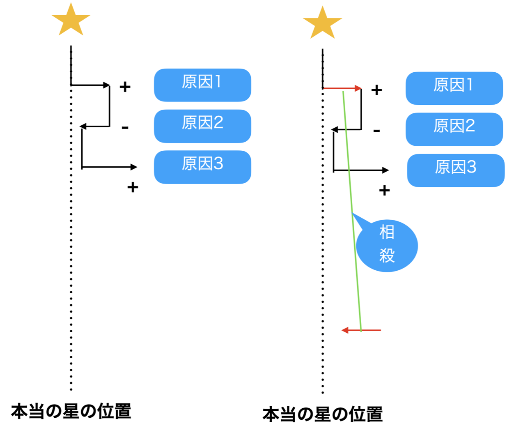
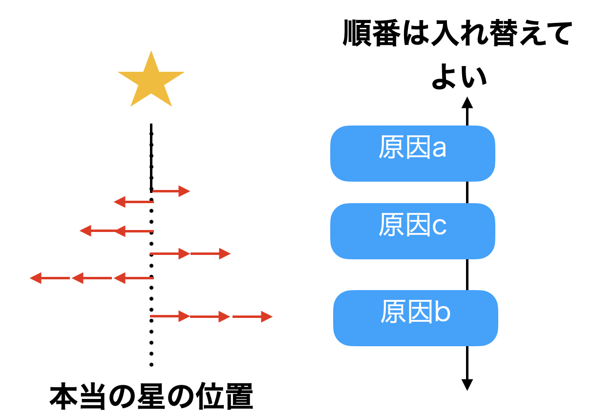
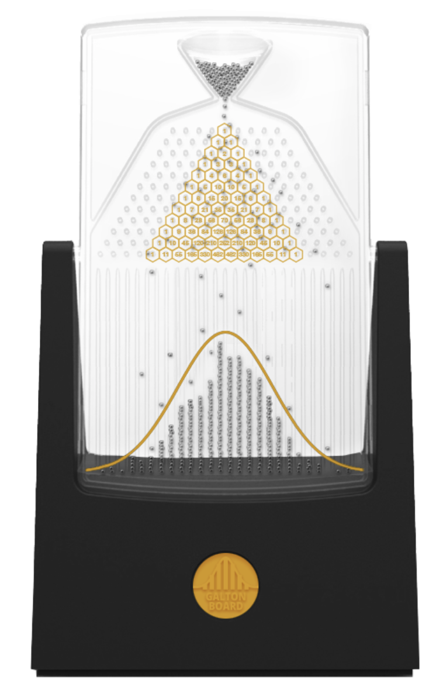
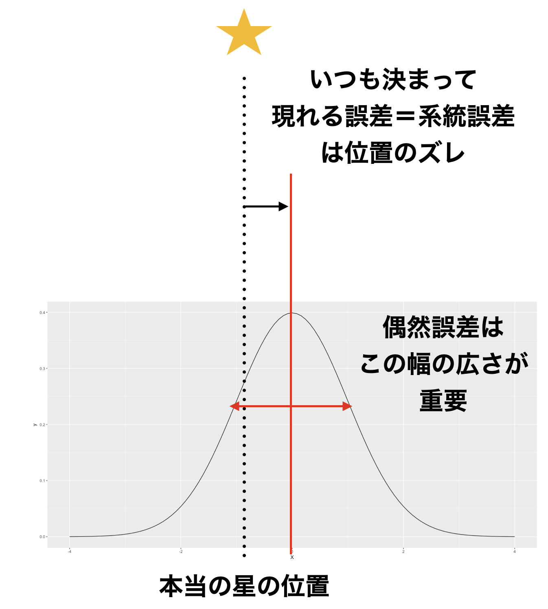
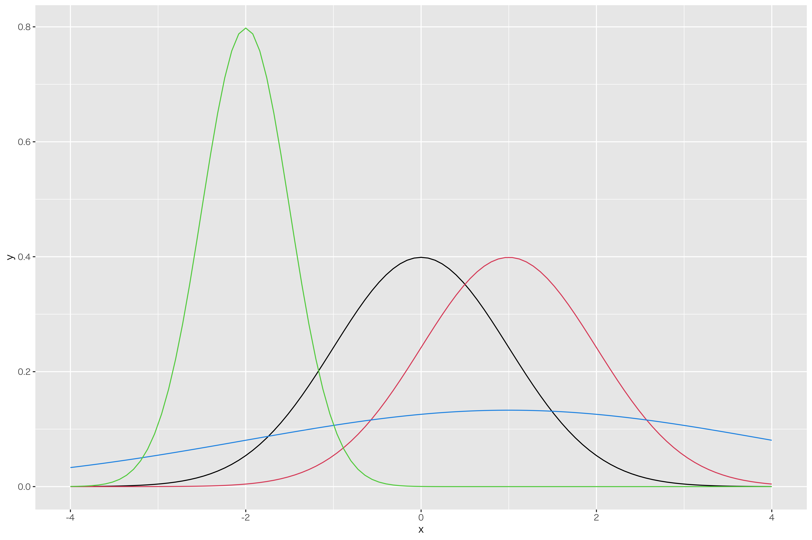
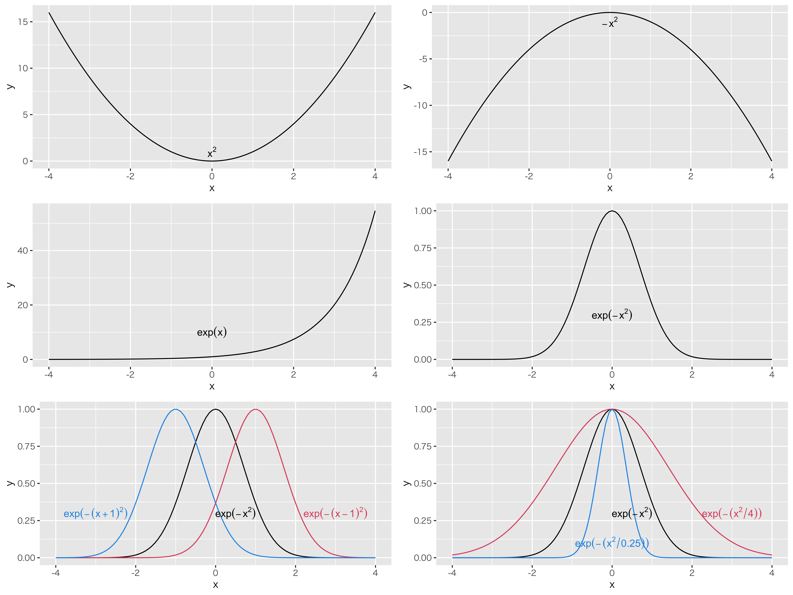
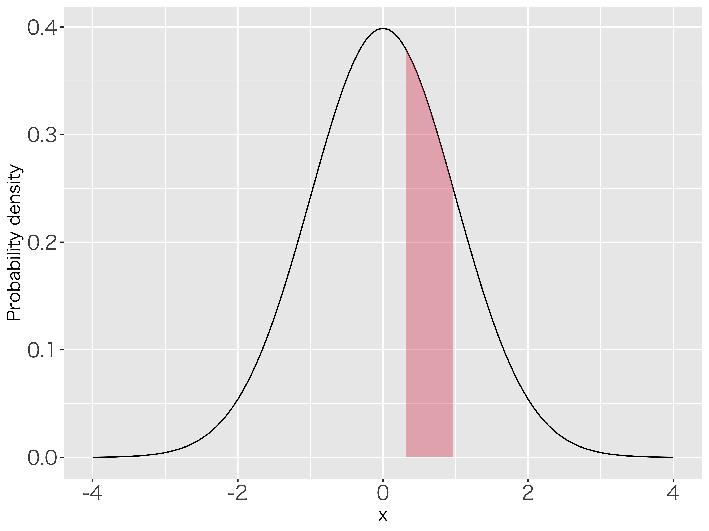
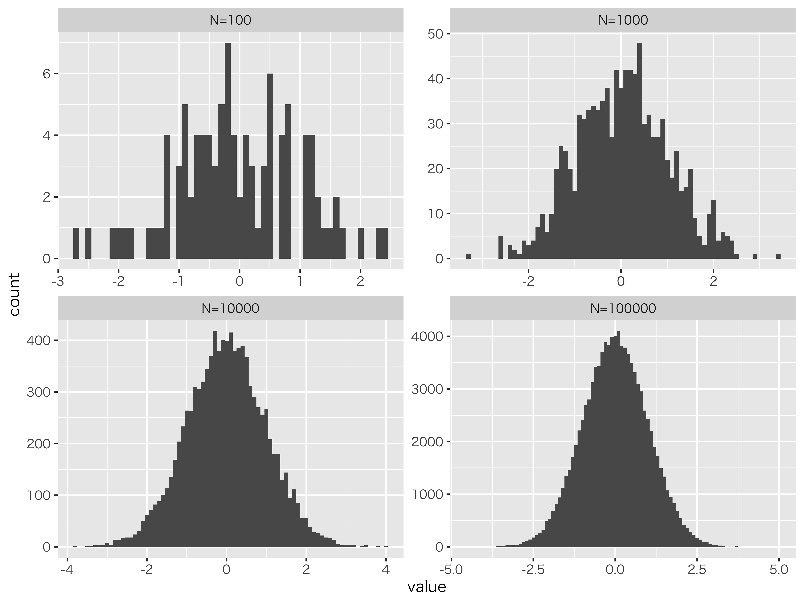

# 正規分布と推測統計学 {#chapter8}

前回，確率という数字，またベルヌーイ分布，二項分布など離散的な確率変数について説明しました。
今回は連続的な確率変数の代表格であるについて説明します。
心理学を始め，統計的アプローチでこの正規分布は中心的な役割を担います。統計モデルのほとんどは正規分布帝国に含まれる，といわれるほどです[@三中 2018]。
数式的には小難しいのですが，その意味的なところを理解できるように解説していきます。

## 正規分布の形

### 正規分布ができるまで

正規分布の始まりは，ドイツの物理学者カール・フレードリヒ・ガウスの研究からです。彼の貢献に敬意を評して，正規分布のことをとも呼びます。
彼が考えていたのはに関することでした。天文学ではケプラーが何十年にもわたる観測データを集めたりしていましたが，人間が観測するデータには誤差が含まれています。この誤差をなんとかハンドリングしたいというのがそもそものモチベーションです。

誤差はとに分かれます。系統誤差は機械の精度や測定者の癖などで，必ず一方向にずれるもの。これはその機械の特徴や測定者の癖がわかれば，修正することが可能です。一方，偶然誤差の方は「偶然生じるもの」なので，どのように出てくるのかは全然予測できません。他の何者とも相関しない(関係が見出せない)というのが特徴です。
さらに，誤差は，「いろいろな原因が積み重なって生まれる」と考えられます。たとえば天体観測の場合，レンズの歪み，気温や湿度などの条件，観測者のちょっとしたミス・・・これらの積み重ねで「正しい値からずれる」と考えるのです。

天体観測の例で考えましょう。ある星の位置を測定していたとします。星がちょうどスコープの中に入るように，天体望遠鏡の位置を左右に調整していくとします。話を簡単にするために，右側にずらすことをプラス，左側にずらすことをマイナスと考えます。
さて，ではまず何かの原因で，測定値が本当の値からちょっとプラスの方向にずれる，ということがあったとしましょう。次に第二の「誤差の原因」があり，それが今度はちょっとマイナスに働いたとします。さらに第 3 の「誤差の原因」があり，それが今度はちょっとプラスに働いたとします。誤差は何段にも何段にも重なっていくとすると，途中には「同じぐらいの大きさで向きが違う」誤差，というのも含まれてくるでしょう。これは測定上はプラス・マイナスの大きさが相殺し合って，表に出てこないことになります(図[1.1](#fig::08_01){reference-type="ref"
reference="fig::08_01"})。

{#fig::08_01
width="8cm"}

誤差の大きさは様々ですが，たとえば大きなプラスの誤差は($\to\to$)，標準的なサイズの誤差($\to$)が二度連続して出た，と考えることもできます。積み重なる原因はたくさんたくさんあるのですから，この際ちょっとぐらい増えても変わりません。
また，どうせ足し合わせるんですから，順番を入れ替えても構いません。そうすると，相殺のペアはあちこちで見つけることができるようになります。結局プラスに何回，マイナスに何回，という組み合わせがどれだけ出るかという話になります。

{#fig::08_02
width="8cm"}

さて，誤差がプラス側に出るのを 1，マイナス側に出るのを 0 と表したとして，その試行を何度も何度も繰り返し，結果的に「1 が 1 つだけ」「0 が 1 つだけ」「1 が 2 つ」「0 が 2 つ」「1 が 3 つ」・・・「全部 1」「全部 0」というパターンを数え上げていくとすると，これはどういう形になるでしょうか。

そう，ですね！

復習です。$n$回試行したうち，$k$回表が出る(成功する)確率を表す確率分布のことを，二項分布というのでした。
今回の例では$n \to \infty$，つまり何度も何度もコイントスをする，無限回する，というイメージで考えてください。
そのうち，たまたま 1 回表がでた（ちょっとプラスになった)のは何回か，2 回表が出た，3 回出たのはどうか，・・・・全部表だった場合はどうか，という時の組み合わせの形を考えていきます。その行き着く先が，今回のなのです。

違った例から説明してみましょう。みなさんはというおもちゃをご存知でしょうか(図[1.3](#fig::08_03){reference-type="ref"
reference="fig::08_03"})。釘が等間隔に打ち付けられている板で，その上からパチンコ玉を落とすのです。
パチンコ玉は釘にあたります。その時，右側に落ちるか左側に落ちるかの確率は$1/2$ですね。たとえば左側に落ちたとしましょう。落ちた先にもまた釘があり，そこに当たって右にいくか左に行くかは，また$1/2$の確率になります。右側に落ちていたとしても同様で，次の釘で左右のどちらに弾かれるかは半々です。2 段目までで考えると，「左，左」に来たケースと「左，右」あるいは「右，左」に来たケース，「右，右」に来たケースがありますが，それぞれのケースになる確率は$0.25:0.5:0.25$ですね。これは二項分布の$\theta=0.5,n=2$のケースですが，この$n$がどこまでも連なっている，つまり釘の段がどこまでも続いているのが正規分布の世界であり，それを模したのがゴルトンボードです。

{#fig::08_03
height="10cm"}

このボードの下には左右対称のなだらかな山の形が描かれていますが，これが正規分布の形です。美しいですね。

さて，「誤差は偶然生じる」「誤差は多段階で積み重なる」ということから，二項分布の極限を考えました。その結果得られる形のことを正規分布といいます。正規分布は連続値の確率分布の代表格で，さまざまなところにその形を見出すことができます。この確率分布のポイントは左右対称になっていることと，より極端な値はより出てきにくい，ということです，つまり誤差を生み出すさまざまな要素が全てプラスに働くこと，全てマイナスに働くことというのはめっっっっっったにない，ということです。
たとえば心理学で考えたい性質，性格とか社会的態度といった心理学的傾向は，何がその形成要因になっているかわかりません。親の学歴，親の年収，育った地域の教育水準，幼稚園に通ったのか保育園に通ったのか，食事は肉と魚どっちが多かったかとか，それはもう無数の原因があると思います。全てがその心理学的傾向に影響したとして，それぞれが「高かった」「低かった」「よかった」「幼稚園だった」「魚だった」というように分岐していくと，無数のパターンが考えられます。その結果，人の心理学的傾向はどのように分布するかというと，とある平均的な程度を中心にして，「やや外向性が高い人」「やや不安定性が高い人」といった相対的な比較がされるようになり，かつ「極端に外向性が高い人」というのは滅多にいない，ということになるでしょう。つまりそうした性質は正規分布にし違うと考えられるのです。学力なども同様です[^1]。

正規分布はこのように，さまざまな影響源による累積的影響の帰結として捉えることができます。意味的には，誤差のように確率的な散らばりの形を表すものでもあり，心理学的傾向の例のように集団レベルでの性質が従う分布としてとらえられることもあります。この形状をとくに Normal
Curve ということもありますが，これの中心から外れることが Abnormal だというわけではありませんので，最近は Normal というより Gaussian という形容詞で呼ぶことが多いのかもしれません[^2]。

### 正規分布を特徴づける

正規分布の形で大事なのは，「位置」と「幅」です。
系統誤差がどれぐらい出てくるのか，に該当するのが位置です。偶然誤差は相殺し合うので平均 0 になります。偶然誤差がどれぐらい出てくるのか(散らばるのか)については，幅で特徴付けることができます(図[1.4](#fig::08_04){reference-type="ref"
reference="fig::08_04"})。

{#fig::08_04
width="8cm"}

ところで，正規分布の幅というのはどこで測れば良いのでしょう？
分布の形はなだらかな山形ですから，標準偏差がどこを表しているのかイメージしにくいのではないでしょうか。
もしこの誤差の分布が三角形であれば，その幅を定義するには底辺の長さを使えば良いでしょう。しかし正規分布は緩やかなカーブをしていますし，理論的にその裾野は$-\infty$から$+\infty$まで広がっているのです。

これについては，@長沼 201611 がとてもわかりやすい解説をしてくれています。すなわち，この正規分布のカーブを飛行機が飛んでいると考えれば特徴が見つけやすいというのです(図[1.4](#fig::08_04){reference-type="ref"
reference="fig::08_04"})。
飛行機は操縦桿を引くと機首が上がり，上に上がります。操縦桿を押すと機種が下がり，下に下がります。
正規分布カーブのように飛ぶ時は，二箇所で操縦桿が水平になるシーンが出てくるはず。そこを結ぶとカーブの幅が定義できます。この幅の長さが標準偏差 2 つ分に該当します。平均を挟んで，左右に標準偏差 1 つ分ずつでてくるわけですね。

{#fig::08_05
width="8cm"}

ということで，正規分布は位置と幅が重要だということがわかりました。
記述統計でいえば，位置は平均です。左右対称な分布の中心にあたりますから，これが適切な代表値でしょう。同様に幅は標準偏差で考えることができます。
数学的に正規分布を記述する場合，ある変数$X$が正規分布に従うことを，$X\sim N(\mu,\sigma)$と記述します。ここで$N$は Normal の$N$です。$\mu$は平均を表しており，ギリシア文字$\mu$は「ミュー」と読みます。$\sigma$は標準偏差を表しており，ギリシア文字$\sigma$は「シグマ」と読みます。総和記号$\sum$はギリシア文字 S の大文字$\Sigma$からきていますが，これは小文字の s です。
正規分布の表記法は，テキストによっては$N(\mu, \sigma^2)$と書かれることも少なくありません。$\sigma^2$は標準偏差$\sigma$の二乗ですから分散を表しています。二乗するかしないかの違いはありますが，幅を表している数字ですし，二乗する/平方根をとる，という操作で相互に変換可能ですから，どちらで表現しても間違いではありません。本講義では$\sigma$で表記を統一したいと思います[^3]。

図[1.6](#fig::08_06){reference-type="ref"
reference="fig::08_06"}には，さまざまな平均値と標準偏差を持った正規分布の形を描いてみました。ここに描かれている曲線は**全て正規分布です**。全然違うようにも見えますが，平均と SD の値の取り方によっては，このように見え方としての形(Shape,Figure)は変わります。が，これを描いている数式としての形(Form)は同じであることに注意してください。

図の中心にある黒い線がと呼ばれる，そのなの通り標準的な形の正規分布です。これは平均が$\mu=0$，SD が$\sigma=1$の分布です。
平均値が変わることは，その位置がずれることです。標準正規分布と同じ形をしていて位置が右にずれている赤い線がありますが，これは$\mu=1,\sigma=1$のときの形状です。

標準偏差が変わることは，その幅が変わることになります。標準偏差を小さくすると分布の山は尖っていき，標準偏差を大きくするとなだらかな分布に変わっていきます。
図の最も左にピークを持っている分布は，$\mu=-2,\sigma=0.5$にしたときの正規分布の形です。位置が左にずれ，山が尖っていることがわかりますね。
最もなだらかなラインは$\mu=1,\sigma=3$にして描きました。ほとんど横ばいのような形ではありますが，これでも左右対称で山形の正規分布の一種です。

{#fig::08_06
width="8cm"}

一口に正規分布と言っても，パラメータの設定によって見え方が大きく変わることがお分かりいただけたのではないでしょうか。言い換えると，パラメータさえ調節すればさまざまなデータにも応用できそうです。これが正規分布帝国が幅広く用いられる 1 つの理由であると言えるでしょう。

## 正規分布の関数

正規分布の形状は，ガウスが発見した確率密度関数で描かれます。その関数は次のような形をしています。

$$f(x)= \frac{1}{\sqrt{2\pi \sigma^2}} exp(-\frac{(x-\mu)^2}{2\sigma^2})$$

さあいきなり訳のわからない形がでてきました。結論からいうと，この関数形を必ずしも覚えておく必要はありません。しかし，どうしてこのような形になっているかを理解すると，この式も少しはわかりやすくなりますので，少し解説してみましょう。

まず今から求めたいのは，誤差の確率分布ですから，そこからいくつか満たすべき条件というのが出てきます。確率という数字は非負です。また，ここでは連続変数ですから，確率密度関数の面積を積分すると 1.0 になる必要があります。
つぎに誤差の分布ですから，中心から外れるほどその出現確率が少なくなるようにならなければなりません。しかも傾向がないので左右対称です。これらの条件を満たすような関数を作ることを考えます。

まず左右対称の分布からいきましょう。左右対称の関数として，真っ先に思い浮かぶのは$y=x^2$のような二次式ではないでしょうか(図[1.7](#fig::08_07){reference-type="ref"
reference="fig::08_07"}の 1 段目左)。ただ$y=x^2$だと原点から離れるほど大きくなってしまいます。誤差は逆で，一箇所をピークにどんどん下がっていって欲しいので，$y=-x^2$にした方が良さそうです(図[1.7](#fig::08_07){reference-type="ref"
reference="fig::08_07"}の 1 段目右)。さてそうすると，今度は値$y$が全てマイナスになってしまいます。確率関数を作ろうとしているのにこれはまずい。確率は全て正の数字でなければならないからです。
ここでを導入します。指数関数とは$y=e^x$という形をしています。これは$y=exp(x)$とも書き，自然対数$e$を何乗するかという関数です[^4]。関数の形をグラフにすると，図[1.7](#fig::08_07){reference-type="ref"
reference="fig::08_07"}の 2 段目左のようになります。指数の定理から，指数$x$がマイナスであるとは逆数にするという意味ですから，マイナスになることはありません[^5]。この関数を先ほどの$y=-x^2$と組み合わせて，$y=exp(-x^2)$とします(図[1.7](#fig::08_07){reference-type="ref"
reference="fig::08_07"}の 2 段目右)。この段階で，既に正規分布っぽい形にはなっているのです。すなわち，左右対称で両端に行くほど小さくなる関数ですね。足りないのは，パラメータ$\mu,\sigma$によって位置と幅を調節する機能をつけたいこと，面積が 1 になるように整えたいこと，この 2 点です。これを追加していきます。

まずパラメータの追加から。位置をコントロールできるようにするには，$x$に数字を足したり弾いたりしてやればいいことになります。平均を$\mu$として，$y=exp(-(x-\mu)^2)$とすることでこの問題は解決します(図[1.7](#fig::08_07){reference-type="ref"
reference="fig::08_07"}の 3 段目左)。
次に幅をコントロールしたいですね。これは$x$の倍率を調節してやれば良く，$x$を分散$\sigma^2$で割ってやることで対応できます。すなわち，$y=exp(-\frac{x^2}{\sigma^2})$です(図[1.7](#fig::08_07){reference-type="ref"
reference="fig::08_07"}の 3 段目右)。
位置と幅の両方をコントロールするには，$y=exp(-\frac{(x-\mu)^2}{\sigma^2})$とすれば良いでしょう。

あとはこの関数が，積分して面積 1 になるように整えてやる必要があります。このようにしてやると，関数が確率を表す数字として扱うことができるようになるからです。この関数の面積を計算して，その面積で割ってやればいいことになりますね。
ただこの複雑な関数，面積を求めるのが大変難しい。ただの積分ではうまくいきそうにないのです。その数学的な問題を突破したのがガウスで，凄すぎるのでガウス積分と名前がついているほどですが，これについては説明すると長くなるので解説は他所に譲り[^6]，答えだけ言っておくとその面積は$\sqrt{2\pi \sigma^2}$になります[^7]。ということで，その面積で割ってやるように関数を規格化しましょう。そうすると先ほどの式になります。再掲しますね。

$$f(x)= \frac{1}{\sqrt{2\pi \sigma^2}} exp(-\frac{(x-\mu)^2}{2\sigma^2})$$

ここで$\mu=0,\sigma=1$という標準化されたスコアであれば，この関数の形は一気に簡単になります。標準化された正規分布のことをといいますが，次の式になります。

$$f(x) = \frac{1}{\sqrt{2\pi}} exp(-\frac{x^2}{2})$$

標準正規分布は位置や幅の調整が入りませんから，式導出の経緯が見て取れるかと思います。

{#fig::08_07
width="8cm"}

## 標準正規分布の面積を測る

さて，正規分布の確率密度関数の形がわかりました。これは連続分布ですから，縦軸はであることに注意してください。
また定義上，「ある点の確率」は存在しません。確率は，幅を持った面積で表されることも思い出してください($\to$
Pp.)。

たとえば標準正規分布において，確率点$0.3$から$1.0$までの面積(確率)を求めたいとします。図[1.8](#fig::08_08){reference-type="ref"
reference="fig::08_08"}の範囲ですね。
これをどのようにして求めるのか，4 つの方法をご紹介しましょう。

{#fig::08_08
width="8cm"}

##### 計算する

正しく算出するためにはもちろん，関数の形から計算すれば良いのです。当たり前と言えば当たり前ですが，計算式は次のようになります。
$$p(x) = \int_{0.3}^{1.0} \frac{1}{\sqrt{2\pi}} exp(-\frac{x^2}{2}) =0.2234333...$$
このように面積を求めるのは積分になります。$\int$というのは積分記号で，$0.3$から$1.0$の範囲の面積を求めよ，としてその右に関数を書きます。この計算ができるのであれば何より正確で，22.34%
なんだな，ということがわかります。

しかし積分の計算に慣れていない人にとっては難しいですね[^8]。そこで次の方法をご紹介します。

##### 数表を見る

2 つ目の方法は数表を見る，です。数表とは数字の表のこと。何を言ってるんだと思うかもしれませんが，心理統計のテキストにはたいてい付録として数表がついているものでした。代表的な関数については，ある程度計算したものの一覧表があると，計算機を使う必要がないから便利だったのですね。あるいはそうした表だけがのっている数表の本というのもかつてはありました[^9]。数表の例を[1.1](#tbl::08_01){reference-type="ref"
reference="tbl::08_01"}に挙げます。

この表には，$z$と lower , upper
とした列があります。lower は$P(0\le Z \le z)$の範囲を，upper は$P(Z\ge z)$の範囲を表しています(図[1.9](#fig::08_09){reference-type="ref"
reference="fig::08_09"})。
ここで$z$列は今知りたい確率点，今回でいえば$z=0.3$とか$z=1.0$のことになります。
次の lower$=P(0\le Z \le z)$列には，$z=0$からその求めたい確率点までの面積が入っています。たとえば$z=0.3$のところを見ると，$P(0\le Z \le 0.3)=0.118$となっていますから，この確率が 11.8%であることがわかります。
今回は 0.3 から 1.0 までの面積が知りたかった訳ですが，それは直接この表には載っていません。ただ，$z=1.0$の数字を見ることができますから，それを参照して$P(0\le Z \le 1.0)=0.341$がわかります。0 から 0.3 までが 0.118 で，0 から 1.0 までが 0.341 ですから，0.3 から 1.0 までは$0.341-0.118=0.223$，22.3%だと読み取ることができます。

この数表には$P(Z\ge z)$の確率も載っています。たとえば upper$=P(Z\ge 0.3)=0.382$ですから，0.3 以上になる確率は 38.2%ということがわかります。
こうした数表を駆使することで，ある範囲からある範囲までの面積がいくらか，という計算をできます。

またたとえば，確率点がマイナスの場合はどうするか，というのを疑問に思われる方もいるかもしれません。その時は，正規分布が左右対称であることを思い出してください。$z=-0.3$以上の面積が知りたい，という時は，まず$z=0.3$のときの数字から$P(Z\ge 0.3)=0.382$を見つけます。左右がひっくり返っても同じですから，$P(Z \le -0.3)=0.382$になります。$-0.3$までの面積がわかっても，知りたいのは$-0.3$以上です。しかし確率は全ての面積が 1.0 ですので，$P(Z \ge -0.3) = 1-0.382 = 0.618$と計算できます。あるいは，$P(0\le Z \le 0.3)=0.118$で，平均$z=0$までの面積が半分，すなわち 0.5 ですから，$0.5+0.118=0.618$と求めても構いません。ともかく，半分しかない数表であっても，これを使えばさまざまな面積計算ができるということです。

::: {#tbl::08_01}
z lower upper z lower upper z lower upper z lower upper z lower upper

---

    0.00   0.000   0.500   0.60   0.226   0.274   1.20   0.385   0.115   1.80   0.464   0.036   2.40   0.492   0.008
    0.01   0.004   0.496   0.61   0.229   0.271   1.21   0.387   0.113   1.81   0.465   0.035   2.41   0.492   0.008
    0.02   0.008   0.492   0.62   0.232   0.268   1.22   0.389   0.111   1.82   0.466   0.034   2.42   0.492   0.008
    0.03   0.012   0.488   0.63   0.236   0.264   1.23   0.391   0.109   1.83   0.466   0.034   2.43   0.492   0.008
    0.04   0.016   0.484   0.64   0.239   0.261   1.24   0.393   0.107   1.84   0.467   0.033   2.44   0.493   0.007
    0.05   0.020   0.480   0.65   0.242   0.258   1.25   0.394   0.106   1.85   0.468   0.032   2.45   0.493   0.007
    0.06   0.024   0.476   0.66   0.245   0.255   1.26   0.396   0.104   1.86   0.469   0.031   2.46   0.493   0.007
    0.07   0.028   0.472   0.67   0.249   0.251   1.27   0.398   0.102   1.87   0.469   0.031   2.47   0.493   0.007
    0.08   0.032   0.468   0.68   0.252   0.248   1.28   0.400   0.100   1.88   0.470   0.030   2.48   0.493   0.007
    0.09   0.036   0.464   0.69   0.255   0.245   1.29   0.401   0.099   1.89   0.471   0.029   2.49   0.494   0.006
    0.10   0.040   0.460   0.70   0.258   0.242   1.30   0.403   0.097   1.90   0.471   0.029   2.50   0.494   0.006
    0.11   0.044   0.456   0.71   0.261   0.239   1.31   0.405   0.095   1.91   0.472   0.028   2.51   0.494   0.006
    0.12   0.048   0.452   0.72   0.264   0.236   1.32   0.407   0.093   1.92   0.473   0.027   2.52   0.494   0.006
    0.13   0.052   0.448   0.73   0.267   0.233   1.33   0.408   0.092   1.93   0.473   0.027   2.53   0.494   0.006
    0.14   0.056   0.444   0.74   0.270   0.230   1.34   0.410   0.090   1.94   0.474   0.026   2.54   0.494   0.006
    0.15   0.060   0.440   0.75   0.273   0.227   1.35   0.411   0.089   1.95   0.474   0.026   2.55   0.495   0.005
    0.16   0.064   0.436   0.76   0.276   0.224   1.36   0.413   0.087   1.96   0.475   0.025   2.56   0.495   0.005
    0.17   0.067   0.433   0.77   0.279   0.221   1.37   0.415   0.085   1.97   0.476   0.024   2.57   0.495   0.005
    0.18   0.071   0.429   0.78   0.282   0.218   1.38   0.416   0.084   1.98   0.476   0.024   2.58   0.495   0.005
    0.19   0.075   0.425   0.79   0.285   0.215   1.39   0.418   0.082   1.99   0.477   0.023   2.59   0.495   0.005
    0.20   0.079   0.421   0.80   0.288   0.212   1.40   0.419   0.081   2.00   0.477   0.023   2.60   0.495   0.005
    0.21   0.083   0.417   0.81   0.291   0.209   1.41   0.421   0.079   2.01   0.478   0.022   2.61   0.495   0.005
    0.22   0.087   0.413   0.82   0.294   0.206   1.42   0.422   0.078   2.02   0.478   0.022   2.62   0.496   0.004
    0.23   0.091   0.409   0.83   0.297   0.203   1.43   0.424   0.076   2.03   0.479   0.021   2.63   0.496   0.004
    0.24   0.095   0.405   0.84   0.300   0.200   1.44   0.425   0.075   2.04   0.479   0.021   2.64   0.496   0.004
    0.25   0.099   0.401   0.85   0.302   0.198   1.45   0.426   0.074   2.05   0.480   0.020   2.65   0.496   0.004
    0.26   0.103   0.397   0.86   0.305   0.195   1.46   0.428   0.072   2.06   0.480   0.020   2.66   0.496   0.004
    0.27   0.106   0.394   0.87   0.308   0.192   1.47   0.429   0.071   2.07   0.481   0.019   2.67   0.496   0.004
    0.28   0.110   0.390   0.88   0.311   0.189   1.48   0.431   0.069   2.08   0.481   0.019   2.68   0.496   0.004
    0.29   0.114   0.386   0.89   0.313   0.187   1.49   0.432   0.068   2.09   0.482   0.018   2.69   0.496   0.004
    0.30   0.118   0.382   0.90   0.316   0.184   1.50   0.433   0.067   2.10   0.482   0.018   2.70   0.497   0.003
    0.31   0.122   0.378   0.91   0.319   0.181   1.51   0.434   0.066   2.11   0.483   0.017   2.71   0.497   0.003
    0.32   0.126   0.374   0.92   0.321   0.179   1.52   0.436   0.064   2.12   0.483   0.017   2.72   0.497   0.003
    0.33   0.129   0.371   0.93   0.324   0.176   1.53   0.437   0.063   2.13   0.483   0.017   2.73   0.497   0.003
    0.34   0.133   0.367   0.94   0.326   0.174   1.54   0.438   0.062   2.14   0.484   0.016   2.74   0.497   0.003
    0.35   0.137   0.363   0.95   0.329   0.171   1.55   0.439   0.061   2.15   0.484   0.016   2.75   0.497   0.003
    0.36   0.141   0.359   0.96   0.331   0.169   1.56   0.441   0.059   2.16   0.485   0.015   2.76   0.497   0.003
    0.37   0.144   0.356   0.97   0.334   0.166   1.57   0.442   0.058   2.17   0.485   0.015   2.77   0.497   0.003
    0.38   0.148   0.352   0.98   0.336   0.164   1.58   0.443   0.057   2.18   0.485   0.015   2.78   0.497   0.003
    0.39   0.152   0.348   0.99   0.339   0.161   1.59   0.444   0.056   2.19   0.486   0.014   2.79   0.497   0.003
    0.40   0.155   0.345   1.00   0.341   0.159   1.60   0.445   0.055   2.20   0.486   0.014   2.80   0.497   0.003
    0.41   0.159   0.341   1.01   0.344   0.156   1.61   0.446   0.054   2.21   0.486   0.014   2.81   0.498   0.002
    0.42   0.163   0.337   1.02   0.346   0.154   1.62   0.447   0.053   2.22   0.487   0.013   2.82   0.498   0.002
    0.43   0.166   0.334   1.03   0.348   0.152   1.63   0.448   0.052   2.23   0.487   0.013   2.83   0.498   0.002
    0.44   0.170   0.330   1.04   0.351   0.149   1.64   0.449   0.051   2.24   0.487   0.013   2.84   0.498   0.002
    0.45   0.174   0.326   1.05   0.353   0.147   1.65   0.451   0.049   2.25   0.488   0.012   2.85   0.498   0.002
    0.46   0.177   0.323   1.06   0.355   0.145   1.66   0.452   0.048   2.26   0.488   0.012   2.86   0.498   0.002
    0.47   0.181   0.319   1.07   0.358   0.142   1.67   0.453   0.047   2.27   0.488   0.012   2.87   0.498   0.002
    0.48   0.184   0.316   1.08   0.360   0.140   1.68   0.454   0.046   2.28   0.489   0.011   2.88   0.498   0.002
    0.49   0.188   0.312   1.09   0.362   0.138   1.69   0.454   0.046   2.29   0.489   0.011   2.89   0.498   0.002
    0.50   0.191   0.309   1.10   0.364   0.136   1.70   0.455   0.045   2.30   0.489   0.011   2.90   0.498   0.002
    0.51   0.195   0.305   1.11   0.367   0.133   1.71   0.456   0.044   2.31   0.490   0.010   2.91   0.498   0.002
    0.52   0.198   0.302   1.12   0.369   0.131   1.72   0.457   0.043   2.32   0.490   0.010   2.92   0.498   0.002
    0.53   0.202   0.298   1.13   0.371   0.129   1.73   0.458   0.042   2.33   0.490   0.010   2.93   0.498   0.002
    0.54   0.205   0.295   1.14   0.373   0.127   1.74   0.459   0.041   2.34   0.490   0.010   2.94   0.498   0.002
    0.55   0.209   0.291   1.15   0.375   0.125   1.75   0.460   0.040   2.35   0.491   0.009   2.95   0.498   0.002
    0.56   0.212   0.288   1.16   0.377   0.123   1.76   0.461   0.039   2.36   0.491   0.009   2.96   0.498   0.002
    0.57   0.216   0.284   1.17   0.379   0.121   1.77   0.462   0.038   2.37   0.491   0.009   2.97   0.499   0.001
    0.58   0.219   0.281   1.18   0.381   0.119   1.78   0.462   0.038   2.38   0.491   0.009   2.98   0.499   0.001
    0.59   0.222   0.278   1.19   0.383   0.117   1.79   0.463   0.037   2.39   0.492   0.008   2.99   0.499   0.001

: 標準正規分布の表
:::

[\[tbl::08_01\]]{#tbl::08_01 label="tbl::08_01"}

{#fig::08_09 width="8cm"}

##### 計算機を使う

さてさて，数表を見るのは大変面倒だということがわかりました。これなら積分計算をした方が早いくらいかもしれません。実用的にはもちろんこんな面倒なことはしません[^10]。表計算ソフトや統計パッケージには，標準正規分布ほか代表的な確率分布の計算をする関数が，最初から含まれているものです。たとえば R には表[1.2](#tbl::08_02){reference-type="ref"
reference="tbl::08_02"}のような関数があります。

::: {#tbl::08_02}
用途 コード名`XXX`の関数名 説明

---

確率密度 dxxx(q) q は確率点を表す。コード名が norm なら dnorm(q)となる。
累積分布 pxxx(q) q は確率点を表す。コード名が norm なら pnorm(q)となる。
確率点 qxxx(p) p は確率を表す。コード名が norm なら qnorm(p)となる。
乱数 rxxx(n) n は乱数の数を表す。コード名が norm なら rnorm(n)となる。

: 標準正規分布の表
:::

[\[tbl::08_02\]]{#tbl::08_02 label="tbl::08_02"}

`XXX`のあたりが少しわかりにくいですが，ここには確率分布を表す関数名が入ると思ってください。正規分布でしたら`norm`ですし，そのほかにも色々な分布があって，たとえば$t$分布であれば`t`，$\chi^2$分布であれば`chisq`，ベータ分布であれば`beta`等です。これらのコード名の前に，$d,p,q,r$をつけることで確率密度，累積分布，確率点などの値を返してくることになります。具体例を見てみましょう。
R で次のように入力し，実行した例を示します。

```{#code::08_01 .c++ language="c++" label="code::08_01" caption="確率に関する関数使用例"}
dnorm(x = 0, mean = 0, sd = 1)
    pnorm(q = 1.0, mean = 0, sd = 1)
    qnorm(p = 0.618, mean = 0, sd = 1)
    rnorm(n = 10, mean = 0, sd = 1)
```

::: Rscreen
確率に関する関数の出力例 out08_01

    > dnorm(x = 0, mean = 0, sd = 1)
    [1] 0.3989423
    > pnorm(q = 1.0, mean = 0, sd = 1)
    [1] 0.8413447
    > qnorm(p = 0.618, mean = 0, sd = 1)
    [1] 0.3002323
    > rnorm(n = 10, mean = 0, sd = 1)
    [1] -1.00458071 -1.16956265  0.59980728 -0.07192335  0.66660905 -0.10629118 -0.94452719 -0.04108743  2.39762300 -0.10580504

:::

1 つずつ確認しましょう。
`dnorm(x = 0, mean = 0, sd = 1)`は$\mu=0,\sigma=1$の正規分布における，確率点 0 の確率密度，すなわち正規分布曲線の高さを示しています。
`pnorm(q = 1.0, mean = 0, sd = 1)`は$\mu=0,\sigma=1$の正規分布において，確率点 1.0 までの面積を求めています。0.841 となっていますが，これは数表でいうところの$P(0\le Z \le 1.0)=0.341$に対応しています。数表は 0 からの面積ですが，関数は$-\infty$からの面積ですから，正規分布の左半分を足してやると$0.5+0.341=0.841$となって計算が合いますね。
`qnorm(p = 0.618, mean = 0, sd = 1)`は$\mu=0,\sigma=1$の正規分布において，$-\infty$からの面積が$p=0.618$になるときの確率点を答える関数です。先ほどの関数とは逆の操作ですね。今回は先の例で示した 0.3 までの面積を入れてみると，確かに 0.300 という答えが返ってきました。

図[1.10](#fig::08_10){reference-type="ref"
reference="fig::08_10"}に`dXXX，pXXX，qXXX`が何を表すかを図子しました。$d$は高さ，$p$は面積，$q$は x 軸上の座標を表していることを再確認してください。

{#fig::08_10
width="8cm"}

こうした関数を使うことで，たとえば 0.3 から 1.0 までの面積は，`pnorm(q = 1.0, mean = 0, sd = 1) - pnorm(q = 0.3, mean = 0, sd = 1)`とすることで算出できます。

ところで最後の`rnorm`はなんでしょう？ これが第四の方法に関係してきます。

##### 乱数を使う方法 {#randomVariablesMethod}

関数`rnorm(n = 10, mean = 0, sd = 1)`を実行すると，10 個の数字が出てきています。10 個というのは関数の中で$n=10$と設定したからです。これは好きな数にできますが，出力される数字はなんでしょうか。

これは乱数といって，なんの規則性もない数字の連なりのことです。1 つ 1 つの数字の現れ方には規則性がないのですが，長い目で見ると正規分布に従っているといった，確率変数の実現値を擬似的に作り出すのがこの関数なのです。
こうした偶然性を表現するために，コンピュータには擬似乱数発生装置が用意されていて，関数の形がわかっている代表的な確率分布であれば，そこからどういう数字が出てくるのかシミュレーションしてみることができるわけです。

たとえば R では 10 万点の正規分布に従う乱数を発生させる，ということも一瞬でできます。乱数は規則性がないように出てくる設計になっているので，毎回得られる数字は異なりますが，それを集計するとある確率分布に従っていることがはっきりわかってきます(図[1.11](#fig::08_11){reference-type="ref"
reference="fig::08_11"})。

{#fig::08_11
width="8cm"}

このように，発生させる乱数の個数が多くなると，理論的な形(今回は標準正規分布)の近似として十分利用できることになります。
発生させた乱数はそれぞれデータとして扱えますから，このデータの中でたとえば 0.3 より大きく 1.0 より小さいものの個数を数え，発生させた乱数の数で割ってやる，すなわち相対頻度にすることで確率の計算をできます。
具体例を見てみましょう。

```{#code::08_02 .c++ language="c++" label="code::08_02" caption="乱数を使った近似"}
X <- rnorm(n = 100000 , mean = 0 , sd = 1)
    length(X[X>0.3 & X<1.0])
    length(X[X>0.3 & X<1.0])/100000
```

##### コード解説

1 行目

: 平均 0，標準偏差 1 の正規乱数を 10 万個発生させ，X に保存する。

2 行目

: `length`関数はベクトルの長さを返す関数。オブジェクト`X`のなかでも，条件`X>0.3 & X<1.0`に合致するものだけを抜き出し，その長さを算出。

3 行目

: 条件に該当するデータの個数を 10 万で割ることで相対頻度にする。相対頻度は確率の数字として解釈できる。

::: Rscreen
乱数を使った近似 out08_02

    > X <- rnorm(n = 100000 , mean = 0 , sd = 1)
    > length(X[X>0.3 & X<1.0])
    [1] 22371
    > length(X[X>0.3 & X<1.0])/100000
    [1] 0.22371

:::

この方法でも，結果はご覧の通り 0.223 という他の数字と同じぐらいの値を得ることができました。もちろん乱数ですので，もう一度やると小数点下何桁かのところで違う数字が出てくるかもしれません。その精度をあげたい時は，乱数の発生個数を増やしてやるといいでしょう。たとえば 10 倍にすれば，さらに小数点下 1 桁ぶんの精度が上がることになります。この方法は，コンピュータの計算能力が高くなったからこそ使えるようになった技で，なんだかかえって面倒な方法のようにも見えますが，実はこの方法が最近になって俄然活用されるようになってきたのです！詳しくは第[\[chapter28\]](#chapter28){reference-type="ref"
reference="chapter28"}講のあたりで触れますので，お楽しみに。

## 標準正規分布の利用 {#UsefulNormal}

最後に(標準)正規分布をどのように利用するかについて，少しだけ触れておきます。

正規分布は誤差だけでなく，集合的な性質を見るときにもよく現れるという話をしました。たとえば，大学入試共通試験の点数の分布はきれいな正規分布になっていたりします。心理学で扱う心理変数にも正規分布が仮定されます。というのも，人の行動を決めるのには，生まれてから今まで無数の選択を繰り返し，その積み重ねで出てきていると考えられるからで，そうしたデータをたくさん集めると(ゴルトンボードのように)正規分布になると考えられるからです。

ここで次のように考えてみましょう。手元に何人かぶんのデータがあったとします。理論的にいって，このデータは正規分布に従うと無理なく仮定できるとします。
手元のデータは数十，数百ぐらいしかなかったとしても，さっきの乱数の話のように，正規乱数に従う数十，数百の実現値があると考えると，この標本分布も正規分布を近似していると言えるかもしれません。
であれば，このデータをつかってある種の推測ができるようになります。

皆さん，模擬試験で「あなたの偏差値は XXXX です」とか「もしこの試験を 10000 人が受けていたとしたら，あなたは XXX 番目です」というフィードバックを受け取ったこと，ありませんか？
繰り返しになりますが，学力テストのようないろいろな要因が絡むもの(ex.本人の努力，使ってるテキスト，学校の雰囲気，テスト会場の気温と湿度，家庭環境，子供の頃の経験・・・・)は，正規分布に従うと考えられ，全体が正規分布するのなら，その相対的な位置は正規分布の式から推定できるので，このような推測が成り立つのです！

この授業のテーマは「見えないものを見るための心理統計」でした。その一端がここから伺えます。本当に 1 万人もテストを受けているとは言えない模擬試験でも，分布の仮定から「実際には見えない位置」まで推測できちゃうのです。

正規分布は平均と標準偏差で特徴付けられ，それがどういう値になっているかはわかりませんが，このデータをすればそのことを気にする必要もなくなります[^11]。
標準正規分布はその特徴がよくわかっています。数表や計算機を使うと特定の範囲の面積も明らかになります。たとえば正規分布は平均 ±1 標準偏差の中に全体の 68.2%が，平均 ±2 標準偏差の中に全体の 95.4%が，平均 ±3 標準偏差の中に全体の 99.7%が含まれるのです。
であれば，標準化したスコアが 1 であれば全体の上位 15.8%に，標準化したスコアが 2 であれば全体の上位 2.2%にいると言えます[^12]。この確率を 1 万人換算すれば，「偏差値 60 のあなたは上位 15.8%」とか「偏差値 70 のあなたより上には 227 人しかいません！」といったことが言えるようになります。

この話を数式で表現しておきましょう。

1.  データ$x$が正規分布に従っている，というのを$x \sim N(\mu,\sigma)$と書く。

2.  データを標準化する。$z_i = \frac{x_i - \mu}{\sigma}$

3.  $z_i \sim N(0,1)$より，標準正規分布の特徴を使って推測する。

ここで第二のステップ，標準化そのものは，データが正規分布に従っていると言えなくても行える計算作業であることに注意してください。集合的なデータが正規分布しているという仮定と組み合わさることで初めて，推測につかえるようになります。
推測に用いる統計学，は後期に入るとじっくり取り掛かることになります。ここでは正規分布の特徴の活用例として示すにとどめます。

## まとめにかえて

話をまとめておきましょう。

正規分布には，大きく分けて 2 つの意味があります。
ひとつは誤差の分布として，です。とくに偶然誤差はどの程度散らばるかということがわかれば，それを見込んで評価できる＝ある程度誤差を飼い慣らすことができる，というのがその利点です。データ＝真値+誤差，という古典的テスト理論モデルは誤差が正規分布すると仮定します。その期待値がゼロになることから，データが十分たくさんあれば真値に辿り着くことができると考えるのでした。

もうひとつ，正規分布を集団全体の傾向を表す分布として理解できます。とくに平均（期待値）がどのあたりにあるかに注目し，トレンドを掴むことができるようになります。たとえば平均身長や平均寿命など，社会的にデータを蓄積することでその傾向を考えることができますね。これは個人の特徴＝期待値+個人差，という考え方であり，心理学全域に関わるモデルです。平均的な傾向を探ったり，比較したりすることで議論を進めるためにこの全体的な特徴を利用するのです。

正規分布の第二の意味(集合データの傾向)からは，正規分布の特徴をつかってそのデータの相対的な位置・割合い(ex.何パーセンタイルの辺りにいるか，等)を推測するのに用いることができます。
その際，正規分布の式に平均と分散を入れて計算することもできますが，計算が複雑になるので，データの方を標準化し，標準正規分布と照らし合わせて解釈することが一般的です。
分布を仮定することで，一部のデータから全体を推測する，というのは心理統計の醍醐味の 1 つでもあるわけです。

正規分布の凄さがわかってもらえましたでしょうか。

## 課題

##### 正規分布の面積を求める

標準正規分布における，1.確率点$p=-1$の確率密度，2.確率点$q=0$までの累積確率，および 3.確率点$-1.96$〜$+1.96$の範囲の面積を求めてみましょう。

##### 正規分布を推測に利用する

あるクラスの試験の結果は，平均点が 75，標準偏差が 15 点の正規分布に従っていると考えられる。このとき，40 点以上 50 点未満の人は何%になるか求めてみましょう。ここで「50 点未満」は 50 点未満であり，49 点以下ではないことに注意してください。

[^1]: 収入などは偶然性による影響ではなく，人為的な傾向が入ってくるので正規分布になりません。
[^2]: 平均的な人間が正常 normal で，平均から逸脱した人間は異常 abnormal である，という考え方は人類がその評価基準を社会的なものに求めるようになったからであり，このことをニーチェは「神は死んだ」と表現したわけです。正義や善悪を神の視点で考えるのではなく，人間同士の相対的な態度で考える態度です。しかし集団的傾向の中心にいることが正しいことを意味するものではないことは，みなさんもお分かりいただけると思います。
[^3]: 心理統計のテキストでは，一般的に$\sigma^2$で表すことの方が多いようです。数学や統計ソフトウェアでは二乗せずに計算することが多く，たとえば確率プログラミング言語の Stan がもっている正規分布関数は$\sigma$として扱っています。
[^4]: $e$は何かというと 2.718\...という実数です。微分しても変わらない数字ということで，数学の世界では重宝されます。$e$については@Maor_Eli2019-01-10 が読み物として楽しく理解できます。
[^5]: 指数についてこれまで習ったことを思い出してください。$a\neq 0$のとき，$a^0=1$ですし，$a^{-n}=\frac{1}{a^2}$と定義するのでした。
[^6]: こういうの見ると，「あ，ずるい。著者め逃げたな」と思いませんか。私なら思います。そう思われると悔しいので，参考図書として@西内 201712 をあげておきます。また@長沼 201611 の P.62--69 も参考になります。
[^7]: $\pi$は 3.141592\...という実数です。円周率ですね。面積になぜ円周率が出てくるのか，それがガウスの凄いところです。
[^8]: とくに文系には！私も文系出身ですので，最初に習った頃は「うん，わからん！」となりました。
[^9]: 過去形で書いていることからも明らかなように，これら数表が便利だったのは現在ほどコンピュータが個人消費者レベルにまで浸透していない時代のことで，今は次に紹介する計算機を使う方が素早く正確です。
[^10]: じゃあなんでやらせたんだ，という意見もあるかもしれませんが，たとえば公認心理師認定試験など計算機を持ち込めない環境で，数表から読み取って答えを出さねばならないシーンがあるかもしれない，と思いまして。
[^11]: 標準化したスコアについては Pp.を参照。
[^12]: R を使った計算をしました。`1-pnorm(q=1,mean=0,sd=1)=0.15865`，あるいは`1-pnorm(q=2,mean=0,sd=1)=0.02275013`です。
