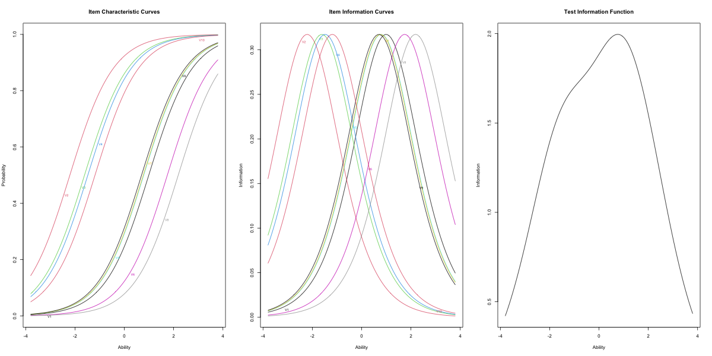
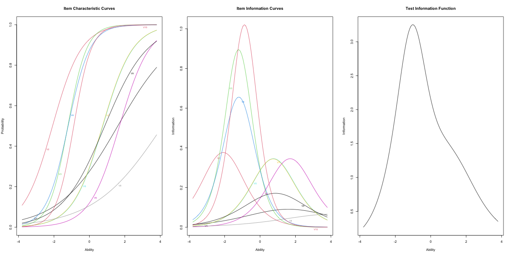
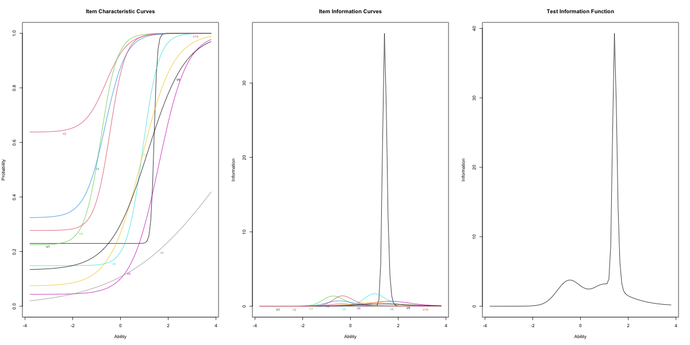
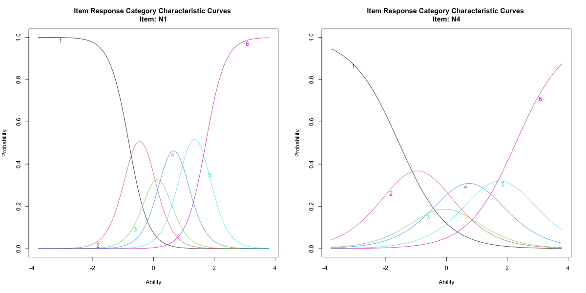

# R をつかった項目反応理論 {#chapter11}

今回も R を使った演習です。R を使っての行列計算，R を使っての因子分析と進めてきましたが，今回は R をつかって項目反応理論を実践的に理解していきましょう。

## 項目反応理論の実際

### データの素描

項目反応理論は，テスト理論に関するモデルですから，サンプルデータとして二値データを使いましょう。表[1.1](#tbl::11_01){reference-type="ref"
reference="tbl::11_01"}に使うデータの一部を示しています[^1]。

::: {#tbl::11_01}
V1 V2 V3 V4 V5 V6 V7 V8 V9 V10

---

     0    0    1    0    0    0    0    0    0     0
     1    1    0    0    0    0    0    0    0     1
     0    1    0    1    0    0    0    0    0     1
     0    1    1    1    1    1    0    0    0     1
     0    1    1    1    1    0    0    0    0     1
     1    1    1    1    0    0    0    0    1     1

: IRT で使うサンプルデータ(一部)
:::

[\[tbl::11_01\]]{#tbl::11_01 label="tbl::11_01"}

このように，テスト理論で使うデータは 0/1 の二値データで，1 が正答，0 が誤答を表しています。

これらのデータを使って R で分析をしていきます。IRT を実行するパッケージとして，`ltm`[@ltm]や`irtoys`[@partchev2017package]などがあります。ここでは`ltm`パッケージの方を使っていきましょう。

分析に先立って，データの記述統計量を確認しておきます。`code:[code::11_01]`を実行してください。

```{#code::11_01 .c++ language="c++" label="code::11_01" caption="データの読み込みから記述統計量の計算まで"}
rm(list=ls())
    library(tidyverse)
    library(ltm)
    dat <- read_csv("IRTsample.csv")
    ltm::descript(dat)
```

##### コード解説

1 行目

: 環境の初期化

2-3 行目

: パッケージの読み込み

4-5 行目

: サンプルデータ`IRTsample.csv`を読み込む。文字化けする人は，`read_csv`関数のオプションとして`locale=locale(encoding="UTF-8")`を追加してください。

6 行目

: ltm パッケージに含まれる`descript`関数を実行

いろいろな情報が一気に出力されるので，順にみていきます。まず`console[RS:out11_01]`のところです。ここには各変数の 0 と 1 の比率が入っています。この例では，`V1`は 0 が 71.0%，1 が 29.0%含まれているということです。最後の`logit`は，0 から 1 の間に入る数字$p$にたいして，$logit(p)=\log\left(\frac{p}{1-p}\right)$で計算される量です。ここでは$p$は正答率であり，この`logit`の値が負であれば 0 の比率が，正であれば 1 の比率が多かった，ということを意味します。0/1 がちょうど半々であれば，`logit`の値は 0 になる，そういう数字です。これを見るだけでも，`V8`はずいぶんと正答率が低かったんだな，`V3`は逆に正答率が高かったんだな，ということがわかります。

::: Rscreen
記述統計の出力 1out11_01

        Proportions for each level of response:
        0     1   logit
    V1  0.710 0.290 -0.8954
    V2  0.114 0.886  2.0505
    V3  0.186 0.814  1.4762
    V4  0.206 0.794  1.3492
    V5  0.670 0.330 -0.7082
    V6  0.832 0.168 -1.5999
    V7  0.666 0.334 -0.6901
    V8  0.884 0.116 -2.0309
    V9  0.652 0.348 -0.6278
    V10 0.254 0.746  1.0774

:::

次のセクション`console[RS:out11_02]`には，正答数の分布が示されています。10 問全部正解したのは 3 人だけ，6 問正解した人が 104 人だった，といったことがわかります。

::: Rscreen
記述統計の出力 2out11_02

            Frequencies of total scores:
            0  1  2  3  4   5  6  7  8  9 10
       Freq 4 19 41 62 97 104 66 54 36 14  3

:::

次のセクション`console[RS:out11_03]`には，が計算されています。この相関係数は 2 値と連続値の相関係数であり，ここでは各変数(二値)と合計得点(0 から 10)の相関係数を計算しています。この合計得点の計算方法には，その変数自身を含める場合(Included)と含めない場合(Excluded)の二種類があります。具体的に説明したほうがわかりやすいでしょう。たとえば変数`V1`についていうと，「その変数自身を含める場合」の合計得点とは$V1+V2+V3+V4+V5+V6+V7+V8+V9+V10$で計算しています。「含めない場合」は$V2+V3+\cdots+V10$とするわけです。含める場合の相関係数が 0.5207，含めない場合の相関係数が 0.2480 です。当然自身が含まれているほうが合計得点に深く関わっているので相関係数が高くなります。裏を返せば，含める場合と含めない場合の相関係数に大きな差があるとき，その変数はテスト全体に大きく貢献する重要な変数だといえるでしょう。

::: Rscreen
記述統計の出力 3out11_03

    Point Biserial correlation with Total Score:
        Included Excluded
    V1    0.4228   0.2118
    V2    0.3959   0.2502
    V3    0.5202   0.3567
    V4    0.5209   0.3501
    V5    0.5449   0.3470
    V6    0.4635   0.2983
    V7    0.5440   0.3452
    V8    0.2901   0.1350
    V9    0.4992   0.2890
    V10   0.5890   0.4180

:::

次のセクション`console[RS:out11_04]`には，が算出されています。これも全体の場合と，特定の変数を抜いた場合とを計算しています。
心理尺度における信頼性係数としての$\alpha$係数は，0.8 以上であれば信頼性がある，といった目安がありますが，二値データの場合はここに示したようにそれよりもずいぶんと低くなります。これは二値データの分散が小さくなることから仕方のないことですし，項目反応理論で分析する上での信頼性は情報量関数として表されますから，問題ではありません。

::: Rscreen
記述統計の出力 4out11_04

            Cronbach's alpha:
            value
    All Items     0.6341
    Excluding V1  0.6303
    Excluding V2  0.6195
    Excluding V3  0.5978
    Excluding V4  0.5986
    Excluding V5  0.5982
    Excluding V6  0.6100
    Excluding V7  0.5987
    Excluding V8  0.6380
    Excluding V9  0.6130
    Excluding V10 0.5817

:::

最後にセクション`console[RS:out11_05]`では，変数同士の関連がとくに弱いものが示されています。変数同士のペアについて度数分布表を作成し，$\chi^2$検定によって`p.value`を算出しています。この値が小さければ，2 つの変数の関係が強いことを示していると解釈できるのですが，ここにあげているように大きな数字になっているということは，変数間の関係が弱いと読み取ることができます。

::: Rscreen
記述統計の出力 4out11_05

    Pairwise Associations:
       Item i Item j p.value
    1       2      8   0.625
    2       1      8   0.409
    3       1      2   0.347
    4       6      8   0.303
    5       4      8   0.234
    6       7      8   0.222
    7       5      8   0.195
    8       1      4   0.191
    9       1      3   0.166
    10      3      8   0.124

:::

### IRT モデルの実際

データの感じがわかったところで，IRT モデルを実行していきましょう。

今回は 3 つのモデルを試してみます。確認のために，少しモデル式に言及しておきます。困難度母数だけに注目するのがで，モデル式は次の通りです。

$$p_j(\theta) = \frac{1}{1+exp(-1.7 (\theta -b_j))}$$

ここで$p_j(\theta)$は能力が$\theta$のひとが項目$j$に正答する確率であり，$b_j$がと呼ばれます。これは開発者の名前を使って，別名とも呼ばれています。

項目の識別力にも注目するのがで，モデル式は次の通りです。

$$p_j(\theta) = \frac{1}{1+exp(-1.7 a_j(\theta -b_j))}$$

ここで$a_j$はと呼ばれます。

最後にでは，困難度，識別力に加えてというのを推定します。モデル式は次の通りです。

$$p_j(\theta) =c+ \frac{1-c}{1+exp(-1.7 a_j(\theta -b_j))}$$

もちろん式ではピンと来ないという人もいると思いますので，実際にどのように表されるかみていきましょう。

#### 1PL モデルの場合

`ltm`パッケージを使って 1PL モデルを実行します。`code:[code::11_02]`を実行してください。

```{#code::11_02 .c++ language="c++" label="code::11_02" caption="1PLモデルの実行"}
result.1pl <- rasch(dat)
print(result.1pl)
plot(result.1pl,type="ICC")
plot(result.1pl,type="IIC")
plot(result.1pl,type="IIC",items = 0)
```

##### コード解説

1 行目

: 1PL モデル(ラッシュモデル)の実行

2 行目

: 結果の出力

3 行目

: のプロット。`plot`関数のオプションで表示する情報を ICC と指定。

4 行目

: のプロット。`plot`関数のオプションで表示する情報を IIC と指定。

5 行目

: のプロット。`plot`関数のオプションで表示する項目番号をゼロにすると TIC になる。

2 行目で結果の出力を行っていますが，出力[\[RS:out11_06\]](#RS:out11_06){reference-type="ref"
reference="RS:out11_06"}のように表されます。

::: Rscreen
2PL モデルの結果出力 out11_06

    Call:
    rasch(data = dat)

    Coefficients:
     Dffclt.V1   Dffclt.V2   Dffclt.V3   Dffclt.V4   Dffclt.V5   Dffclt.V6
         0.992      -2.208      -1.615      -1.480       0.787       1.744
     Dffclt.V7   Dffclt.V8   Dffclt.V9  Dffclt.V10      Dscrmn
         0.768       2.187       0.699      -1.189       1.126
    Log.Lik: -2468.743

:::

1PL モデルで表現する項目の違いはだけですから，この数字(`Dffclt`)が小されければ簡単な項目，大きければ難しい項目だったことがわかります。たとえば`V2`の困難度母数は$b_2=-2.208$ですが，記述統計のところで見た正答率(88.6%)を考えると，簡単な問題だったことがわかりますね。は`Dscrmn`として 1.126 と推定されています。これは項目を通じて一定です。このことは図[1.1](#fig::11_01){reference-type="ref"
reference="fig::11_01"}の左にある ICC をみて，全ての曲線の傾きが同じことで確認できます。

{#fig::11_01
width="12cm"}

図[1.1](#fig::11_01){reference-type="ref"
reference="fig::11_01"}の左が数値的出力結果を図示したものです。これを見た方がわかりやすいかもしれません。x 軸は$\theta$，つまり測定する潜在変数の値になっており，テストで言えばある人の学力$\theta_i$があったときに，各問いにどれぐらいの確率で正答するかを表していることになります。これをみると`V2`が最も簡単で，`V8`が最も難しかったテストであることがわかります。

また図[1.1](#fig::11_01){reference-type="ref"
reference="fig::11_01"}の中央にあるのが IIC で，それぞれの項目がどのあたりの能力値$\theta$を測定するときに最も敏感になるかを表しています。これは項目反応理論でいうの表現であることを思い出してください。最後に図の左側にあるのは，この IIC を 10 問分足し合わせたテスト全体の情報曲線，TIC になります。これをみると，$\theta=0$よりやや右側のあたりにピークがきているので，このテスト全体としては平均より高い学力の人を測定するときに，最も鋭敏に働くことがわかるでしょう。

#### 2PL モデルの場合

ひきつづき`ltm`パッケージを使って，2PL モデルを実行していきましょう。`code:[code::11_03]`を実行してください。

```{#code::11_03 .c++ language="c++" label="code::11_03" caption="2PLモデルの実行"}
result.2pl <- ltm(dat~z1)
print(result.2pl)
plot(result.2pl,type="ICC")
plot(result.2pl,type="IIC")
plot(result.2pl,type="IIC",items = 0)
```

##### コード解説

1 行目

: 1PL モデル(ラッシュモデル)の実行

2 行目

: 結果の出力

3 行目

: のプロット

4 行目

: のプロット

5 行目

: のプロット

2 行目で結果の出力を行っていますが，出力[\[RS:out11_15\]](#RS:out11_15){reference-type="ref"
reference="RS:out11_15"}のように表されます。

::: Rscreen
2PL モデルの結果出力 out11_15

    Call:
    ltm(formula = dat ~ z1)

    Coefficients:
         Dffclt  Dscrmn
    V1    1.602   0.603
    V2   -2.078   1.228
    V3   -1.213   1.892
    V4   -1.199   1.620
    V5    0.759   1.176
    V6    1.698   1.175
    V7    0.740   1.174
    V8    4.133   0.516
    V9    0.866   0.828
    V10  -0.880   2.020

    Log.Lik: -2446.104

:::

2PL モデルで表現する項目の違いは，との 2 つです。識別力母数を入れることで，IIC 曲線の傾きもデータに合わせて調整できるようになりました。識別力母数のデフォルトは(推定しないのであれば)1.0 ですから，ここから大きく逸脱するような項目には注意です。今回は`V8`をみると，困難度が非常に高いこともわかりますが，識別力が非常に低くなっているので，この項目に誤答したからと言ってすぐさま成績が悪い，と判断できるほどではないことがわかります。

最後の一行に`Log.Lik`とありますが，これはを表しています。これが大きいほど，データとモデルの適合度が高いことを意味します。1PL のときの`Log.Lik`が
$-2468.743$でしたから，1PL モデルより 2PL モデルの方が当てはまりがよかったと言えるでしょう。

プロットによる出力も見ておきましょう(図[1.2](#fig::11_02){reference-type="ref"
reference="fig::11_02"})。識別力母数が入ったことで，ICC の傾きが項目によってさまざまになりますし，IIC や TIC の見た目もすっかり変わってしまいましたが，読み取り方は同じです。

{#fig::11_02
width="12cm"}

#### 3PL モデルの場合

最後に`ltm`パッケージを使って，3PL モデルを実行していきましょう。`code:[code::11_04]`を実行してください。

```{#code::11_04 .c++ language="c++" label="code::11_04" caption="3PLモデルの実行"}
result.3pl <- tpm(dat)
print(result.3pl)
plot(result.3pl,type="ICC")
plot(result.3pl,type="IIC")
plot(result.3pl,type="IIC",items = 0)
```

コードは一行目の関数以外ほとんど同じですので，逐一解説は致しませんが，出力のところを見ておきましょう(出力[\[RS:out11_07\]](#RS:out11_07){reference-type="ref"
reference="RS:out11_07"})。

::: Rscreen
3PL モデルの結果出力 out11_07

    Call:
    tpm(data = dat)

    Coefficients:
         Gussng  Dffclt  Dscrmn
    V1    0.230   1.407  15.123
    V2    0.638  -0.610   2.232
    V3    0.225  -0.825   2.907
    V4    0.324  -0.637   2.324
    V5    0.149   0.931   2.992
    V6    0.043   1.613   1.706
    V7    0.074   0.879   1.509
    V8    0.000   4.490   0.471
    V9    0.133   1.144   1.255
    V10   0.278  -0.438   3.085

    Log.Lik: -2431.371

:::

3PL モデルは困難度，識別力に加えてが計算されます。これは ICC の形(図[1.3](#fig::11_03){reference-type="ref"
reference="fig::11_03"}の左)を見ればわかりますが，曲線全体が底上げされたようになっているものがあります。この最低ラインの高さが当て推量母数の大きさです。図や数値から，`V2`のそれが大きい数字であることが読み取れます。ICC は$\theta$の関数である正答率ですが，これが$\theta$の値に関わらず一定の値を取るということは，どれだけ能力が低くてもその確率で正答してしまうことを意味しています。なので「適当に推測して答えを当てられる大きさ」という意味で当て推量母数と呼ばれているのです。

{#fig::11_03
width="12cm"}

今回当て推量母数を含めて考えたことで，IIC や TIC がまた大きく変化しました。この数字が高すぎる V2 は，テストとしてはあまり良い項目ではなかったのかもしれません。また，モデルの適合度としては 3PL モデルが最もよかったのですが，2PL モデルとそれほど大きく違うわけでもありません。
どのモデルでどのように推定するべきか，推定されたモデルはどういう仮定を持っているのかについて，しっかり理解した上で利用するようにしましょう。

## 段階反応モデルの実際

続いての練習に進みましょう。項目反応理論は正答/誤答の二値データに対して用いるものでしたが，これを多段階反応に拡張したモデルの 1 つが段階反応モデルです。多段階反応とは，「全く当てはまらない」を 1，「非常に当てはまる」を 7 とする，といったようなのようなスタイルの調査項目です。反応させるカテゴリの段階数に応じて，5 件法とか 7 件法と呼ばれたりします。

リッカート尺度の場合は，シグマ法をつかって累積度数からカテゴリに該当する値を算出し，それを元に態度得点を作るという方法でした。最もこのやり方でやっても，いい尺度であればそのまま素点を尺度値としてもほとんど問題がないため，シグマ法が回りくどい方法だと思われたのか，使われなくなってしまいました。しかし実際には「いい尺度であれば」という条件を満たしているかどうか，しっかり確認しなければなりません。歪んだ分布や偏ったカテゴリ反応なのに，素点をそのまま尺度値とするのは不適切なことがあります。また，リッカート尺度で撮られたデータは因子分析をすることによって，解釈度に分類されて，因子ごとのスコアを算出して利用されることが一般的です。しかし，尺度値が適切でなければ，ピアソンの積率相関係数も適切ではなく，そこから計算が始まる因子分析のモデルにも疑義が生じます。

カテゴリ反応はあくまでも並びの問題であって，の情報しか持たないと考えるのであれば，その背後にある態度のような連続体を仮定し，この態度$\theta$が大きくなることで徐々に反応カテゴリが変わる，というのほうが適切な分析方法になるわけです。

項目反応理論(の段階反応モデル)を使って確認することは決して難しくありません。今回は因子分析の時に使った`bfi`データの一部を使って段階反応モデルを実践してみましょう。一部を使うとしたのは，段階反応モデルは項目反応理論の中間ですから，潜在変数が 1 次元(一因子)である，という仮定があるからです。ここでは`N`因子(Neuroticism，神経質さ)を使った例を示しています。

```{#code::11_05 .c++ language="c++" label="code::11_05" caption="GRMの実行"}
library(psych)
dat <- bfi %>%
  dplyr::select(-gender, -education, -age) %>%
  dplyr::select(starts_with("N"))
result.grm <- grm(dat)
result.grm
plot(result.grm, type = "ICC", items = 1)
plot(result.grm, type = "IIC", items = 1)
plot(result.grm, type = "ICC", items = 4)
plot(result.grm, type = "IIC", items = 4)
plot(result.grm, type = "IIC", items = 0)
```

##### コード解説

1 行目

: `psych`パッケージを読み込む。サンプルデータ`bfi`を用いるためです。

2-4 行目

: データの加工。`bfi`データから，性別，最終学歴，年齢などの情報を取り除き，また N で始まる変数だけ選出(`select`)しています。

5 行目

: 段階反応モデルの実行。

6 行目

: 結果の出力。

7 行目

: 項目 1 についての ICC，厳密にはと呼びます。

8 行目

: 項目 1 についての IIC を表示させています。

9 行目

: 項目 4 についての ICC を表示させています。

10 行目

: 項目 4 についての ICC を表示させています。

11 行目

: 項目群についての TIC を表示させています。

`code:[code::11_05]`の 6 行目で，分析結果の数値的出力をさせていますので，それをみておきましょう(出力[\[RS:out11_25\]](#RS:out11_25){reference-type="ref"
reference="RS:out11_25"})。

ここで，`Dscrmn`とあるのは識別力母数ですが，困難度母数に対応するのが`Extrmt1`から`Extrmt5`にあたります。この尺度は 6 件法ですので，反応カテゴリが変わる切れ目，すなわちが 5 つあるのです。これらが 2PL モデルでいうところの困難度に対応すると言ってもいいでしょう。

::: Rscreen
GRM モデルの結果出力 out11_25

    Call:
    grm(data = dat)

    Coefficients:
        Extrmt1  Extrmt2  Extrmt3  Extrmt4  Extrmt5  Dscrmn
    N1   -0.810   -0.093    0.342    0.985    1.720   3.125
    N2   -1.366   -0.555   -0.111    0.648    1.483   2.890
    N3   -1.187   -0.298    0.123    0.876    1.767   2.026
    N4   -1.564   -0.355    0.238    1.240    2.280   1.277
    N5   -1.296   -0.125    0.494    1.479    2.530   1.112

    Log.Lik: -21721.91

:::

数値を見ていてもピンとこないかもしれませんので，図でこの各項目の特徴を確認しておきましょう。変数`N1`と`N4`の IRCCC を図[1.4](#fig::11_04){reference-type="ref"
reference="fig::11_04"}に示しました。この図に表されている複数の曲線が，$\theta$に対応した各カテゴリに反応する確率を表しています。図の左，`N1`は綺麗なカーブが描かれており，各カテゴリのピークが見て取れますが，`N4`は反応カテゴリ 3 の山が埋もれてしまっていることがみてとれます。この項目については，6 段階ではなく 5 段階で反応を求めるのがよかったのかもしれません[^2]。

{#fig::11_04
width="12cm"}

原理的には難しいことのように感じますが，コードを書いて実践する分にはほとんど苦労がなく，二値モデルと同じように考えることができます。コードには IIC や TIC を描くものもありますが，1PL,2PL,3PL モデルと変わらない感じで多段階モデルが実行できますね。
みなさんも心理尺度を使う時は，盲目的にスコアリングし，因子分析するのではなく，どういう仮定の元でどういう計算をしているかを理解しながら，データや調査協力者にとって最適な分析をするように心がけてください。

## カテゴリカル因子分析との対応

さて多段階反応による分析も簡単にできることがわかりましたが，気になるのは段階反応モデルが一因子構造しか仮定していないところです。bfi データはビッグファイブと呼ばれるように五因子(5 次元)の仮定があるのですが，一因子ずつ`grm`を実行して後で統合するのは大変です。

でも大丈夫。簡単に多次元に展開する方法があります。
いわゆる一般的な因子分析は，ピアソンの積率相関係数を元に(積率相関係数の相関行列$\bm{R}$の固有値分解から)因子を求めていくのですが，この積率相関係数が間隔尺度水準を仮定したもので，シグマ法で計算された尺度値を使っていないのであれば疑義が残る，という話でした。
この元になる相関係数が，潜在的連続体を仮定した順序尺度水準向けの相関係数である，であれば，その問題は解決します。反応段階が順序尺度を仮定した因子分析のことをとくにと言います。カテゴリカル因子部な席は，前回紹介した`psych`パッケージに少しオプションを足すだけで簡単に実行できるものです。

```{#code::11_05 .c++ language="c++" label="code::11_05" caption="GRMの実行"}
dat <- bfi %>% dplyr::select(-gender, -education, -age)
result.fa <- fa.poly(dat, nfactors = 5, rotate = "geominQ")
print(result.fa, sort = T, cut = 0.3)
```

##### コード解説

1 行目

: サンプルデータ`bfi`の加工をしています。

2 行目

: ポリ個リック相関係数に基づく因子分析の実行

3 行目

: 結果の出力。

コードの 2 行目を見ていただくとわかる通り，ただの`fa`関数ではなく`fa.poly`としただけで，あとは因子分析と同じです。この`.poly`のところがポリコリック相関係数を使うよう指定しているところで，これで実質的に測定尺度水準が順序尺度水準であると想定した因子分析をしたことになっています。

カテゴリカル因子分析は，段階反応モデルと数学的に等価であることが知られています。出自が違いますので，分析の数字や出力方法に違いがありますが[^3]，実質的には同じことをしていると理解してください。また，R ではたった数文字追加するだけで適切な分析方法になるのですから，使わない手はないと思います。

カテゴリカル因子分析は，因子分析の文脈から順序尺度水準の項目を扱えるように，と発展してきたものです，これに対して，項目反応理論の文脈から心理尺度を扱えるように，と発展してきたルートもあります。これはと呼ばれるもので，これを提供する R パッケージもあります。それが`mirt`パッケージ[@mirt]です。最後にこれを使ったコードの例を示しておきます。この計算には時間がかかりますが，完全情報最尤推定によって項目反応理論で算出するような，精度の高い因子得点を得ることができるのは利点だと言えるでしょう。

```{#code::11_06 .c++ language="c++" label="code::11_06" caption="mirtの実行"}
library(mirt)
result.mirt <- mirt(dat, 5)
print(result.mirt)
result.mirt %>% summary(rotate = "geominQ")
```

## 課題

[^1]: このデータ全体については，`IRTsample.csv`というファイル形式で配布していますので，それを読み込んで使ってください
[^2]:
    ちなみに`N1`は「すぐ怒る(Get angry
    easily)」，`N4`は「割と凹む(Often feel
    blue)」です。日本語訳は小杉の意訳で定訳ではありません。あしからず。

[^3]: たとえば因子分析の文脈では，因子負荷量を提示して単純構造を目指すのに対し，項目反応理論の文脈では IRCCC を描いたり TIC を描いたりして各反応カテゴリの特徴を精査します。
