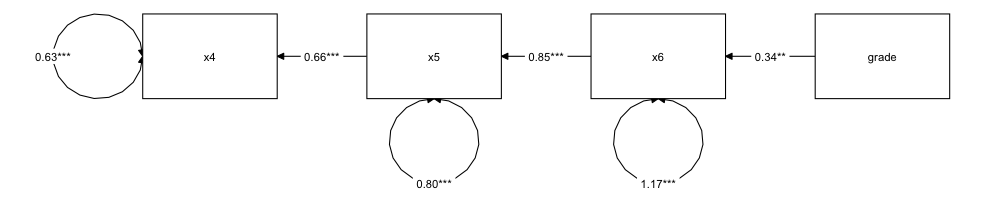

# R による構造方程式モデリング {#chapter13}

これまでの流れと同じで，統計技術の理論を知っただけではなく，自分で実際に計算できる演習を経てこそ理解が深まります。本講では R をつかって実際に構造方程式モデリングを解くことを演習的に学んでいきましょう。
構造方程式モデリングを実装するパッケージは複数あるが，最も応用範囲がひろい`lavaan`パッケージを用いることにします。
授業を始めるにあたって，まずは`lavaan`パッケージをインストールしておいてください[^1]。

## モデル式の入力

### 観測変数だけのモデル

まずは観測変数同士の関係をパスでつなぐモデルをみてみましょう。観測変数同士のパスですから，(重)回帰分析をやるようなものと同じです。
今回のデータとして`lavaan`パッケージに含まれている`HolzingerSwineford1939`データセットを使います。これは[@holzinger1939study]のデータで 301 人に対して行われた 15 の能力テストスコアの一部が入ったデータです。一部を[\[tbl::13_01\]](#tbl::13_01){reference-type="ref"
reference="tbl::13_01"}に示しました。

::: {#tab:tbl::13_01}
id sex ageyr agemo school grade x1 x2 x3 x4 x5 x6 x7 x8 x9

---

     1     1      13       1 Pasteur         7   3.33   7.75   0.38   2.33   5.75   1.29   3.39   5.75   6.36
     2     2      13       7 Pasteur         7   5.33   5.25   2.12   1.67   3.00   1.29   3.78   6.25   7.92
     3     2      13       1 Pasteur         7   4.50   5.25   1.88   1.00   1.75   0.43   3.26   3.90   4.42
     4     1      13       2 Pasteur         7   5.33   7.75   3.00   2.67   4.50   2.43   3.00   5.30   4.86
     5     2      12       2 Pasteur         7   4.83   4.75   0.88   2.67   4.00   2.57   3.70   6.30   5.92
     6     2      14       1 Pasteur         7   5.33   5.00   2.25   1.00   3.00   0.86   4.35   6.65   7.50

: Holzinger and Swineford(1939)のデータ
:::

[\[tab:tbl::13_01\]]{#tab:tbl::13_01 label="tab:tbl::13_01"}

変数の意味は以下の通りです。x1 から x3 が空間的知覚，x4 から x6 が言語的能力，x7 から x9 が移動する物体の認識力を測るものになっています。

id

: 被験者 ID

sex

: 性別(男性=1,女性=2)

ageyr

: 生まれ年

agemo

: 生まれ月

school

: 所属校

grade

: 学年

x1

: 視覚的知覚

x2

: 立方体

x3

: 菱形

x4

: 段落の理解

x5

: 文章完成

x6

: 言葉の意味

x7

: 加速

x8

: 点を数える

x9

: 直線・曲線文字の区別

さて，ではまず回帰分析をやってみることにしましょう。変数 x4 を x5,x6 で回帰する重回帰モデルを`lavaan`を実行するには`code:[code::13_01]`のように書きます。

```{#code::13_01 .c++ language="c++" label="code::13_01" caption="重回帰モデル"}
model1 <- "
x4 ~ x5 + x6
"
result1 <- sem(model1, data = HolzingerSwineford1939)
summary(result1, fit.measures = T)
# 比較
result1.1 <- lm(x4 ~ x5 + x6, data = HolzingerSwineford1939)
summary(result1.1)
```

##### コード解説

1-3 行目

: モデルの記述

4 行目

: 関数による推定

5 行目

: 結果の出力

6-8 行目

: 従来の`lm`関数による当てはめ例

ここでモデルを書くところは，ダブルクォーテーションで括られていることに注意してください。このようにすることで，R に複数行からなるモデルを渡すことが可能になります。実際のモデルは 2 行目だけで，これは`lm`関数に書いているモデル式の形と同じであることがわかります。モデルを書いて，モデルとデータの組みを`sem`関数に渡すと結果が帰ってくる，これだけです。結果を出力するときに，オプションとして`fit.measures`を書いてあるところだけが違います。

出力結果の一部を出力[\[RS:out13_01\]](#RS:out13_01){reference-type="ref"
reference="RS:out13_01"}に示します。実際はもっと色々でているのですが，CFI
, TLI, AIC,BIC, RMSEA,
SRMR などはそれぞれ適合度指標を荒らしています。推定結果は`Regression:`の`Estimate`のところを見てください。これらは，`lm`関数と同じ係数になっていることが確認できます。

::: Rscreen
観測変数だけのモデル out13_01

        (中略)

        User Model versus Baseline Model:

      Comparative Fit Index (CFI)                    1.000
      Tucker-Lewis Index (TLI)                       1.000

    Loglikelihood and Information Criteria:

        (中略)

    Akaike (AIC)                                 673.134
      Bayesian (BIC)                               684.255
      Sample-size adjusted Bayesian (BIC)          674.741

    Root Mean Square Error of Approximation:

      RMSEA                                          0.000

      (中略)

    Standardized Root Mean Square Residual:

      SRMR                                           0.000

    Parameter Estimates:

      Standard errors                             Standard
      Information                                 Expected
      Information saturated (h1) model          Structured

    Regressions:
                       Estimate  Std.Err  z-value  P(>|z|)
      x4 ~
        x5                0.423    0.047    8.958    0.000
        x6                0.390    0.056    7.002    0.000

    Variances:
                       Estimate  Std.Err  z-value  P(>|z|)
       .x4                0.537    0.044   12.268    0.000

:::

このように，重回帰モデルをするのであれば記述方法は同じです。違いはさまざまな観点からの適合度指標モデルということ。加えて，このモデルはどんどん拡張していくことができる点にあります。

たとえばというのがあります。これは影響力のルートが$x \to y \to z$のように，次から次へと繋がっていくモデルです。SEM ができるまでは，まず$x \to y$を回帰分析し，次に$y \to z$を分析する，という方法でした。しかしこれでは$R^2$など適合度を逐一確認する必要があり，またモデル全体の評価ができないという欠点があります。しかし SEM ではコード`code:[code::13_02]`のように書くだけです。

```{#code::13_02 .c++ language="c++" label="code::13_02" caption="パス解析のモデル"}
model2 <- "
x4 ~ x5
x5 ~ x6
x6 ~ grade
"
result2 <- sem(model2, data = HolzingerSwineford1939)
summary(result2, fit.measures = T, standardized = T)
```

このモデル式(2-6 行目)にあるように，$grade \to x6 \to x5 \to x4$という一連の影響力を分析し，一気に適合度を表現してくれています。出力結果には適合度指標のほか，全ての変数を標準化した標準化係数を出すオプションを追加しました。

これを図にしたのが図[1.1](#fig::13_01){reference-type="ref"
reference="fig::13_01"}です。ちなみにこの図も R のパッケージで書きました。パス図を自動的に書いてくれるパッケージとして`semPlot`パッケージ[@Charles2013]や`tidySEM`パッケージ[@tidySEM]などを使います。ここでは`tidySEM`パッケージの`graph_sem`関数を使いました。

::: center
{#fig::13_01
width="12cm"}
:::

### 測定方程式を入れたモデル

今度は測定方程式を入れたモデルを考えてみましょう。回帰モデルは従属変数と独立変数をチルダ(`~`)でつなぎましたが，潜在変数を作る場合は`=~`で右辺に観測変数，左辺に潜在変数をセットします。
コード例を`code:[code::13_03]`に示します。

```{#code::13_03 .c++ language="c++" label="code::13_03" caption="因子分析モデル"}
model3 <- "
 visual =~ x1 + x2 + x3
textual =~ x4 + x5 + x6
  speed =~ x7 + x8 + x9
"
result3 <- sem(model3, data = HolzingerSwineford1939)
summary(result3, fit.measures = T, standardized = T)
```

これのモデル図は図[1.2](#fig::13_03){reference-type="ref"
reference="fig::13_03"}のようになります[^2]。モデル上とくに指定はしてありませんが，潜在変数同士の相関係数も自動的に推定されています。パス係数は潜在変数からでてきていますから，因子負荷量のように考えることができますね。

::: center
{#fig::13_03}
:::

このモデルは因子分析の一種ですがとはいくつかの点で違います。1 つは因子数が 3 である，と最初から決めていた点。2 つ目は因子負荷量ですが，探索的因子分析の場合はどの項目に対しても共通因子からの因子負荷量が計算されていました。今回の例では，x4 から x9 の変数にすいても visual 因子からのパスが出ている，というモデルだったのです。今回のモデルではそれらのパスはなく，visual 因子は x1,x2,x3 にしか影響していません。言い換えると，x4 から x9 に対する visual 因子のパス係数は 0 である，と特定したようなものです。

探索的因子分析の場合，理想的には「因子が関係する項目には十分影響しているが，関係しない項目には全く影響しない」というが理想とされていました。SEM を使うとこの理想的なモデルが合っているかどうかを検証する＝モデル上で制約をかけてその適合度を評価する，という使い方ができます。このような方針の因子分析のことをと呼んで，探索的因子分析と区別します。

検証的因子分析をすることは，関係のない項目への影響を 0 とする，という強い仮定を置いていることにもなりますが，このことによってや，を検討している，と考えることもできます[^3]。もしこの理論的なモデルの当てはまりが悪ければ，異なる因子負荷のパターンを考えなければなりません。あるいは因子数を変えてモデルを組まなければならないかもしれないのです。因子数は同じだけど因子負荷量が違う，といったモデルを考えることもできますし，因子負荷量も固定して「この値に違いない」としたモデルを検証する，ということもできます。モデルを当てはめるデータは違っても構いません。むしろ違うデータに同じモデルが当てはめられ，十分な適合度があればそれはそのモデルの普遍性があるということで，いいことなのです。

このように，SEM では同じモデルを男性と女性，学生と社会人，日本人データと外国人データといった複数のデータに当てはめて，どこまで同じでどこから違うか，と言った比較をできます。こうしたモデル比較のことをといいます。

### 構造方程式モデルへ

それでは潜在変数同士の関係に，更なる仮定を入れたモデルを考えてみましょう。

```{#code::13_04 .c++ language="c++" label="code::13_04" caption="構造方程式モデル"}
model4 <- "
 visual =~ x1 + x2 + x3
textual =~ x4 + x5 + x6
  speed =~ x7 + x8 + x9
 textual ~ visual + speed
  speed ~ grade
"
result4 <- sem(model4, data = HolzingerSwineford1939)
summary(result4, fit.measures = T, standardized = T)
modificationindices(result4) %>%
  as_tibble() %>%
  arrange(-mi)
```

##### コード解説

1-7 行目

: モデルの記述。visual, textual,
speed の 3 因子をつくり，textual は visual と speed から説明されるモデル。さらに speed 因子は学年によっても説明される。

8 行目

: 関数による推定

9 行目

: 結果の出力。適合度指標と標準化係数の出力オプションをつけて。

10-12 行目

: 分析結果のを出力。ただし指標`mi`の大きい順に並べ替えるために 11 行目で出力を`tibble`型にし，`arrange`関数で並べ替えている。

まずは今回のモデルについても，図でみたほうがわかりやすいでしょう。結果を合わせて図[1.3](#fig::13_04){reference-type="ref"
reference="fig::13_04"}に示してみました。

::: center
{#fig::13_04}
:::

この図の出力と，R での出力はどこが対応しているか，それぞれ確認しましょう。

まずは測定方程式のところです。因子負荷量，すなわち潜在変数からのパスは全ての変数を標準化したところの数字ですので，`Std.all`の列を参照します。この因子で説明できなかった独自成分の大きさは，`Varianvces`のところに表されています。

構造方程式として，textual 因子が visual 因子と speed 因子に説明されており，そのパス係数が`Regressions:`の`Std.all`列に示されています。speed 因子はさらに grade 変数にも説明されているので，そのパス係数も確認できます。

SEM の基本として，パスが入った(影響を受けた)変数は，影響が受けた部分と受けなかった部分に分割されます。影響を受けなかった部分が残りの分散として，`Variances:`のところに示されています。

visual 因子は説明変数になっていますが，パスが入ってきませんので，この分散は 1.00 です。図では visual 因子の楕円の上に 1 からの影響が入っていますが，これは分散が 1 だということの意味です。同じく grade 変数も説明されない変数[^4]ですので，この分散が 1(標準化されています)になっているのです。

::: Rscreen
構造を入れたモデルの出力結果(一部)out13_02

    Latent Variables:
                       Estimate  Std.Err  z-value  P(>|z|)   Std.lv  Std.all
      visual =~
        x1                1.000                               0.899    0.770
        x2                0.573    0.109    5.249    0.000    0.515    0.437
        x3                0.724    0.124    5.846    0.000    0.651    0.576
      textual =~
        x4                1.000                               0.978    0.849
        x5                1.109    0.067   16.646    0.000    1.085    0.851
        x6                0.924    0.056   16.349    0.000    0.903    0.834
      speed =~
        x7                1.000                               0.727    0.667
        x8                1.022    0.130    7.837    0.000    0.744    0.737
        x9                0.782    0.108    7.273    0.000    0.569    0.564

    Regressions:
                       Estimate  Std.Err  z-value  P(>|z|)   Std.lv  Std.all
      textual ~
        visual            0.453    0.094    4.841    0.000    0.416    0.416
        speed             0.226    0.093    2.435    0.015    0.168    0.168
      speed ~
        grade             0.645    0.105    6.147    0.000    0.887    0.443

    Variances:
                       Estimate  Std.Err  z-value  P(>|z|)   Std.lv  Std.all
       .x1                0.554    0.132    4.187    0.000    0.554    0.407
       .x2                1.121    0.103   10.841    0.000    1.121    0.809
       .x3                0.851    0.097    8.769    0.000    0.851    0.668
       .x4                0.370    0.048    7.706    0.000    0.370    0.279
       .x5                0.448    0.059    7.635    0.000    0.448    0.276
       .x6                0.358    0.043    8.268    0.000    0.358    0.305
       .x7                0.658    0.080    8.178    0.000    0.658    0.554
       .x8                0.466    0.072    6.478    0.000    0.466    0.457
       .x9                0.695    0.069   10.021    0.000    0.695    0.682
        visual            0.807    0.161    5.029    0.000    1.000    1.000
       .textual           0.764    0.096    7.918    0.000    0.798    0.798
       .speed             0.425    0.083    5.130    0.000    0.804    0.804

:::

最後に出力[\[RS:out13_03\]](#RS:out13_03){reference-type="ref"
reference="RS:out13_03"}にある，の出力を見てみましょう。一行目にあるのは，visual 因子は変数 x9 へのパスをつけると，適合度がぐっと上がるよ，ということを意味しています。

::: Rscreen
修正指数(一部)out13_03

    # A tibble: 64 x 8
       lhs     op    rhs        mi   epc sepc.lv sepc.all sepc.nox
       <chr>   <chr> <chr>   <dbl> <dbl>   <dbl>    <dbl>    <dbl>
     1 visual  =~    x9       41.9 0.442   0.397    0.394    0.394
     2 visual  ~     speed    25.3 0.507   0.411    0.411    0.411
     3 visual  ~     textual  25.3 2.24    2.44     2.44     2.44
     4 textual =~    x1       16.6 0.490   0.479    0.411    0.411
     5 visual  ~~    speed    13.6 0.184   0.314    0.314    0.314
     6 speed   ~     visual   13.6 0.228   0.282    0.282    0.282
     7 visual  ~     grade    12.8 0.445   0.495    0.247    0.495
     8 grade   ~     visual   12.8 0.137   0.123    0.247    0.247
     9 speed   =~    x1       11.1 0.313   0.227    0.195    0.195
    10 x1      ~~    x9       11.0 0.169   0.169    0.272    0.272

:::

実際に visual 因子が変数 x9 に影響している(x9 から因子が構成されている)というモデルを作り，適合度指標を比べてみましょう。表[1.2](#tab:13_03){reference-type="ref"
reference="tab:13_03"}に代表的な適合度指標の修正前の値と修正後の値を示しました。

::: {#tab:13_03}

---

index before after
CFI 0.895 0.945
TLI 0.856 0.923
AIC 7479.335 7433.224
BIC 7557.115 7514.707
RMSEA 0.100 0.073
GFI 0.919 0.944
AGFI 0.866 0.905

---

: 修正前後での指標の変化
:::

[\[tab:13_03\]]{#tab:13_03 label="tab:13_03"}

いずれの適合度指標においても，大きな改善が見られています。さて，これをどう考えたらいいでしょうか。

## 実践上の注意点

ここまでで，さまざまなモデルを表現できること，それを統一的に評価できることが理解できたかと思います。
とくに，統一的に評価できることでさまざまなモデル比較も簡単になり，さらに適合度が良いモデルにするためにはどうすれば良いかについて，指標も出てくることがわかりました。

文山共分散行列の隅々まで記述できる大きな力を手に入れたことは間違い無いのですが，大事なのは，我々は構造方程式モデルを使う側であって，それに使われる側であってはならない，ということです。学会誌に掲載されるような論文で，構造方程式モデルを見ると，その適合度は CFI,TLI,AGFI が 0.9 を超えているような，とても適合度の良いモデルがほとんどです。適合度が悪いモデルだと，これはデータとモデルがあっていないということですから，モデルの改善を求められたり掲載されなくなったりするということがあるでしょう。しかし大事なのは，モデルを使って主張したい心理学的内容のほうであって，適合度が良いだけでの中身のないモデルではないはずなのです。

今回も機械的に visual 因子が x9 変数から構成されるようにすると，適合度が上がるという提案を受けて実施してみたところ，確かに適合度は上昇しました。ところでこの x9 変数というのは直線や曲線のスピードを認識するテストであって，(静的な)空間認知のうりょくとは違うものでは無いでしょうか？
そもそもそういうつもりで作ったものでは無いのに，機械に指摘されて「ひょっとしたらそういう側面があったのかも。そうだ，最初からそう思っていたに違いない」というように，自分を無理やり納得させてはいないでしょうか？

心理学の場合は変数の多くが関係しあっていますから，「移動する直線を見るというのは空間認知とも考えられるのだ。少なくともデータはそう示している」という理屈が成り立つかもしれません。しかし結果を見てから考え方を変えるのは，適切な研究実践法では無いでしょう。これらの問題は結果の再現性が担保されないという心理学の危機の引き金になりました[^5]。自分に都合の良い結果やモデルを出すことが目的ではなく，心がどのような状態になっているのかについての理論的積み重ねや発展こそ，目的であったことを忘れてはいけません。

とくに構造方程式まで使えるようになると，心理学的実体同士の関係を描写し，モデル化できるということが魅力的に映るかもしれません。心理学者は，これこそがやりたかったことなのかもしれないですね。しかしデータを超えての解釈はご法度ですし，何より構成された潜在変数が心理的な実在であるかどうかは，改めて考えなければならないのです。これらはあくまでも分散共分散行列から算出されるでしかなく，「文章読解力」「空間把握力」といった次元に貼り付けた自分たち自身の命名法に酔って，思考停止するようなことがあってはなりません。

この潜在変数同士の影響力が心理学的にどういう意味があるのか，をしっかり考えてから，モデルでの検証に進まなければならないことに注意して使ってください。

## そのほかの統計パッケージ

構造方程式モデリングの利点の 1 つは，モデルを可視化したことにあります。皆さんもモデルの図を見た方が，出力結果を見るよりも理解が進んだ気がするでしょう。

こうした構造方程式モデリングを実行するソフトウェアは，R の専売特許ではありません。
たとえばという IBM
社が出しているソフトウェアでは，マウスをクリックしながら統計モデルを作り分析していくことができます。モデルの構成から GUI でできるのは大変な利点です。

また，構造方程式モデリングはさまざまな分析手法の統合的ツールです。言い換えるとかなり複雑なモデルであっても，ゴリゴリ計算し分析してくれます。現在考えられているさまざまなモデルの，ほぼ全てについて計算できるソフトウェアがです。このソフトウェアで分析できない SEM は無い，と言っていいほどその用途は広く，また計算スピードも爆速です。カテゴリカルな変数にももちろん対応していますから，IRT/GRM のような出力もできます。

R の利点は商用ソフトと違ってフリーで手に入るところですが，有用・有償・商用パッケージでも良いのであれば，これらのソフトも活用することを考えてもいいでしょう。また R でも`lavaan`パッケージの他に，`sem`パッケージというのもあります。ツールは色々あって，ユーザがそれを選べるようにことが理想的ですから，皆さんも興味があれば色々試してみましょう！

## 課題

[^1]: R のコンソールに`install.packages("lavaan")`と入力するか，RStudio のパッケージタブから入力しましょう。
[^2]: この図は@小野島 2021 の関数を使っています。tikz を使って綺麗なモデルが描ける素晴らしい関数の提供に感謝。
[^3]: 因子的妥当性とは，因子が十分に大きく項目に影響していることです。収束的妥当性とは，因子が関係しない項目に影響しないこと，弁別的妥当性は因子同士が別のものであると区別できることを表しています。
[^4]: 説明されない変数のことをとくにといいます。これに対して説明されることがある変数はといいます。
[^5]: 先程の良い結果しか雑誌に掲載されない問題のことを，の問題といい，今も問題視されています。
