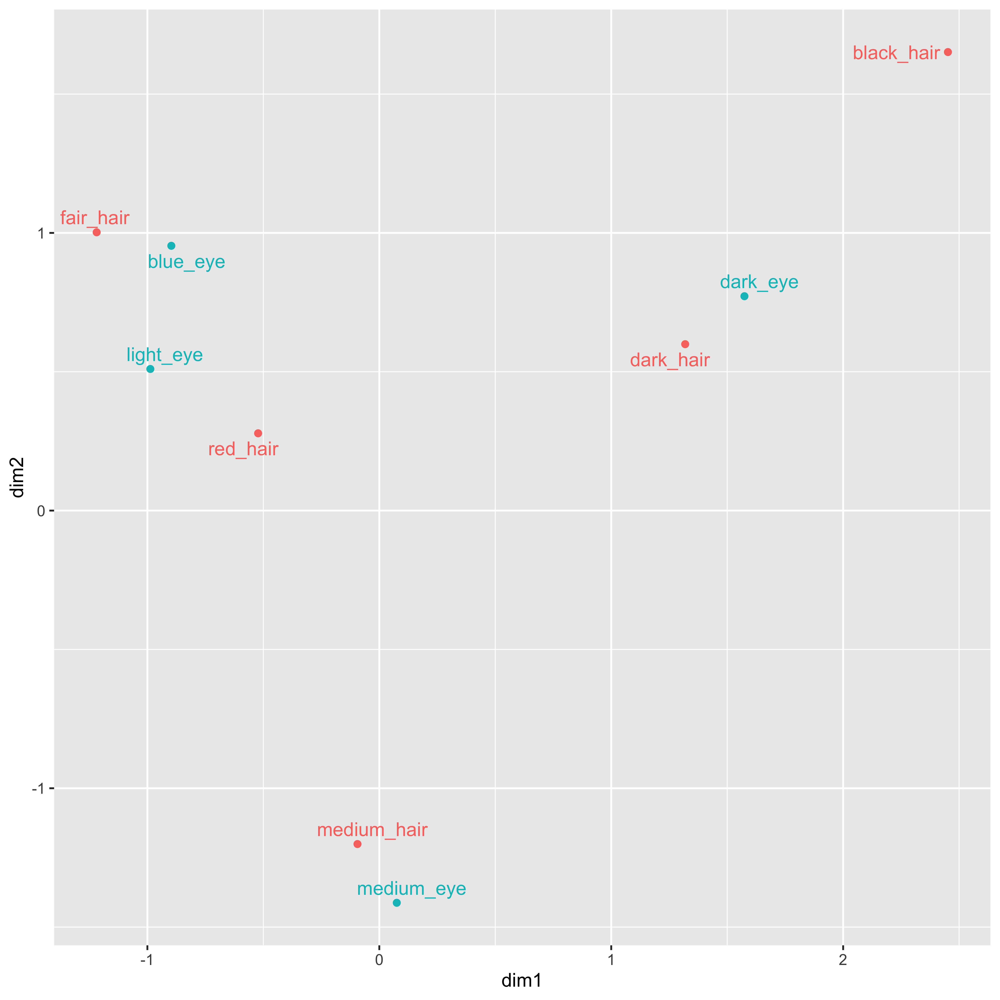

# 双対尺度法 {#chapter14}

さて前回 SEM を学んだことで，分散共分散行列をとことんまで分析し尽くす方法が手に入ったことになります。SEM は統合的な表現方法ですから，観測変数でも潜在変数でもいいですし，順序尺度水準以上の代償関係が表現できる数値データであれば，あらゆる表現ができるわけです。

ではこれで多変量解析は全て理解したことになるのでしょうか。いえ，もちろんそうではありません。分散共分散行列の分解はできるようになりましたが，変数間関係の表現は分散共分散行列だけではありません。
ここまで，データの持つ情報は分散が全て，変数間関係は共分散で表されるから分散共分散行列が全てだ，と言わんばかりに話をしてきましたが，その枠を外すとどうなるでしょうか。

## 直線的ではない関係

ご存知の通り，分散共分散行列を標準化した行列は相関行列といいますが，相関係数が 1.0(あるいは-1.0)の状態を考えれば明らかなように，分散共分散行列(や相関行列)で表現されるのは変数の直線的な関係性に限った話です。心理学の場合は中庸が良いようなシーンも少なくありません。たとえば血圧と健康度の関係で言えば，低血圧でも高血圧でも不健康であり，ちょうどいい血圧が一番健康的だというのはすぐにわかります。このように中庸が良い場合は，散布図が U 字型に現れてきます。散布図が U 字型であれば，相関係数としては 0 近くになりますが，血圧と健康が無関係だとは誰も言えないでしょう。

ごくシンプルかつ具体的な例をあげてみましょう。血圧と頭痛の頻度について調査したとします。血圧は高い，普通，低いの 3 段階。頭痛の頻度は「ない」、「たまに」、「ときどき」，「いつも」の 4 段階です。表[1.1](#tbl::14_01){reference-type="ref"
reference="tbl::14_01"}のような結果を見ると，この集計表に直線的な関係は確かになさそうですね。でも関係ないわけではない，と思いませんか。

::: center
::: {#tbl::14_01}
血圧 ない たまに ときどき いつも

---

高い 0 0 3 2
普通 5 0 0 0
低い 0 2 3 1

: 血圧と頭痛
:::

[\[tbl::14_01\]]{#tbl::14_01 label="tbl::14_01"}
:::

このような場合は、「血圧が高い人か低い人は、頭痛がある」という傾向が見て取れるはずです。しかしこのデータ，機械的に血圧が高いを 1，普通を 2，低いを 3 とし，同様に頭痛もない〜いつもを 1,2,3,4 として相関係数を計算すると，$r=0.165$になります。相関関係では傾向をうまく読み取れていないのです[^1]。

その根本的な原因は，もちろんスコアリングの方法にあります。共分散を計算するには間隔尺度水準以上の情報が必要で，今回のような 3,4 件法では相関係数を計算して良い数字ではありません。
ではポリコリック相関係数のように順序尺度水準の相関係数なら良いか，といいたいところですが，それでもまだ不十分です。なぜなら，血圧が高い方から低い方まで，順番が保存されてしまっているからです。

関係を導き出すには抜本的な改革が必要です。たとえば表[1.2](#tbl::14_02){reference-type="ref"
reference="tbl::14_02"}のようにすればどうでしょうか。こうすると左下から右上にかけての直線的な関係がまだ見えてきます。
これは血圧の順番を「高い」「低い」「普通」に並べ替えたものです。
また，頭痛の順番も「いつも」と「ときどき」をひっくり返しました。

::: center
::: {#tbl::14_02}
血圧 ない たまに いつも ときどき

---

高い 0 0 2 3
低い 0 2 1 3
普通 5 0 0 0

: 並び替えられた「血圧と頭痛」
:::

[\[tbl::14_02\]]{#tbl::14_02 label="tbl::14_02"}
:::

順番を並び替えてしまったというのは，尺度水準的には数字を無視して「高い」「低い」「普通」というカテゴリーとして暑かったということになります。つまり，名義尺度水準レベルにまで落として考えたのです。

このように並べ替えて，血圧のスコアを高い$\to3$，低い$\to2$，普通$\to1$とし，また頭痛の頻度をいつも$\to3$，ときどき$\to4$と付け替えて相関係数を計算すると，今度は$r=0.810$になりました。こちらの方が線形性は高いことが数字でも確認できました。

ここで行ったのはこのように，全ての反応カテゴリをただの言葉だと考えて，付与された数字を無視して並べ替えたことになります。そうすることで，左下から右上にかけて線形性を高めることができました。しかし「高い」と「低い」，「低い」と「普通」の配置も等間隔である必要はなく，もっと直線性がはっきりするように配置してやってもよいのでは，というアイデアが浮かびます。

ここで考え方が反転したことに注意してください。一般的なリッカート尺度では，反応カテゴリに(シグマ法などで)数字をつけて，変数間の線形性を算出して意味を考えるのでした。
ここでは逆に，変数間の線形性を最大にするように反応カテゴリに数字をつけてやろう，という考え方です。データの直線性というのはデータの特徴を最も強調し解釈しやすい形です。そのようにデータを整えるためには，反応カテゴリにどういう数字を付与すれば良いか，と考えるのです。この方法をといいます。

反応カテゴリに数字を与えるとき，名義尺度水準にまで落として，すなわち数字の意味を無くして並べ替えるような作業をします。もちろん分析対象が，初めから名義尺度水準であっても構いません。たとえば出身県を調査したようなデータがあったとして，他の変数との線形関係を最大にするように並べ替え，数字を付与することもできます。数量化の考え方は，名義尺度水準の変数に解釈しやすい数値を与えることとも言えるのです。

## 林の数量化理論

数量化の研究をしたのは，日本の偉大な統計学者，林知己夫(はやし
ちきお)[^2]という人です。その名を冠して林の数量化理論と呼ばれることがあります。

林は様々な研究成果を挙げており，論文ごとにデータに必要な分析方法を開発するというようなスタイルでした。その膨大な研究業績を，弟子である飽戸弘[^3]が分類して，同じような分析方法ごとに I 類，II 類，III 類，IV 類，と呼んでいきました。

::: {#tbl::14_03}
手法 外的基準 データ 目的 関連する手法

---

数量化 Ⅰ 類 量的変数 質的変数 外的基準の予測 重回帰分析
数量化 Ⅱ 類 質的変数 質的変数 外的基準の判別 判別分析
数量化 Ⅲ 類 なし 質的変数 変数間の関係の要約と記述 正準相関分析
数量化 Ⅳ 類 なし 対象間の類似度 対象間の関係の要約と記述 多次元尺度法

: 林の数量化
:::

[\[tbl::14_03\]]{#tbl::14_03 label="tbl::14_03"}

表[1.3](#tbl::14_03){reference-type="ref"
reference="tbl::14_03"}にあるように，基本的には質的変数，すなわち名義尺度水準や順序尺度水準のデータが得られたときに，それを解釈するためにはどのような数値を割り振ってやれば良いか，という発想から生まれたものになっています。

先程の表[1.1](#tbl::14_01){reference-type="ref"
reference="tbl::14_01"}のようなデータの並べ替えについては，数量化でいうところの III 類に該当します。ただこの数量化 III 類はおもしろいもので，同時期に独立にこの手法がフランス，カナダでも発展しており，2 つの別名を持っています。フランス学派が開発した手法はといい，カナダ在住の日本人，西里静彦[^4]が開発した手法はといいます。どの分析も，基本的にはカテゴリカルな変数について直線性を最大にする値を割り振ることを目的にします。

カテゴリカル変数なので，分析の応用範囲は多岐にわたります。どのような変数でも名義尺度水準に落とすことができるからです。表[\[tbl::14_04\]](#tbl::14_04){reference-type="ref"
reference="tbl::14_04"}には一般的なデータセットの形を示しました。ID があって，Q1,Q2\...と項目が列方向に並ぶ形です。一行が一人の反応を表しています。Q1 がたとえば性別などの名義尺度水準の変数であっても，男性$\to1$，女性$\to2$のようにコード化するルールを決めて入力します。Q2 はたとえばリッカート法で当てはまる，やや当てはまる・・・などの 5 件法だったとしましょう。その場合はシグマ法によるスコアを入れる，あるいは簡便的に当てはまるを 5，やや当てはまるを 4，といったように数字を割り振って入力しますね。

これをカテゴリ軽変数と見なしてデータセットにした例が表[1.5](#tbl::14_05){reference-type="ref"
reference="tbl::14_05"}です。ID は分析対象ではありませんから横に置くとして，Q1 が 2 列に増えています。ID=1 の人は男性なのですが，この人は Q1:Male=1 かつ Q1:Female=0 というようにコード化されています。同様に，Q2 には「どちらとも言えない」を選択しているのですが，これを 3 とするのではなく`00100`と 5 列にわたってコード化しているのです。このようにすることで，全ての変数をカテゴリーとして扱うことができるようになります。

::: center
::: {#tbl::14_05}
ID Q1 Q2 $\cdots$

---

      1          1          3       $\cdots$
      2          2          4       $\cdots$

$\vdots$ $\vdots$ $\vdots$

: カテゴリカル化したデータセット
:::
:::

::: center
::: {#tbl::14_05}
ID Q1:M Q1:F Q2:5 Q2:4 Q2:3 $\cdots$

---

      1          1          0        0      0      1     $\cdots$
      2          0          1        0      1      0     $\cdots$

$\vdots$ $\vdots$ $\vdots$

: カテゴリカル化したデータセット
:::
:::

また表[1.1](#tbl::14_01){reference-type="ref"
reference="tbl::14_01"}を並べ替えた時のように，こうした名義尺度のデータの線形性が最大になるように，行だけでなく，列も並べ替えます。データの中で線形性が最大になるように，反応カテゴリ**と**回答者に数字を割り振るのです。
ちなみに表[1.1](#tbl::14_01){reference-type="ref"
reference="tbl::14_01"}は集計されたデータであり，今回の表[1.5](#tbl::14_05){reference-type="ref"
reference="tbl::14_05"}は集計前のデータです。カテゴリカルな変数の分析の場合は，どちらでも良いのです。行と列の関係が表されている数字であれば，「ある/ない」のような二値反応でも，集計された度数でも構いません。さらにいえば，行と列の関係が記述されていればなんでもいいのです。

これまでの回帰分析，因子分析から SEM に至るまでの流れは，変数間関係だけを考えてきました。N 行 M 列のデータ行列の計算の途中で，行に関する情報は平均化して潰されてしまい，最終的には$M \times M$サイズの正方行列だけを扱うことになったのでした。そして M 個の変数に因子負荷量などの重みをつけて考察してきました。
今回のカテゴリカルなデータは，$N\times M$行の矩形行列をそのまま分析し，行と列の両方に重みをつけます。正方行列でも矩形行列でも，変数と変数，変数と回答者がどのように関係しているかというところを見るという意味では同じです。SEM では分散共分散行列や相関行列が，双対尺度法ではクロス集計表や素データがその分析対象になります。数学的な面から説明すると，正方行列の場合はをして，とを求め，固有ベクトルが変数の重みになるのでした。
矩形行列の場合はと呼ばれ，行および列に対応するをその重み，座標と考えることになります。本質的には同じようなものだと思っていただければと思います。

## 双対尺度法による分析

それでは実際の分析例を見てみましょう。次のコード`code:[code::14_01]`は，`MASS`パッケージに含まれるサンプルデータ`caith`を対応分析で分析するものです。

```{#code::14_01 .c++ language="c++" label="code::14_01" caption="双対尺度法による分析"}
library(MASS)
caith
result <- corresp(caith,nf=min(nrow(caith),ncol(caith)-1))
result
plot(result)
```

##### コード解説

1 行目

: パッケージ`MASS`のよみこみ

2 行目

: サンプルデータ`caith`を表示させる

3 行目

: 対応分析関数`corresp`で分析した結果を`result`オブジェクトに入れる

4 行目

: 結果の出力

5 行目

: 結果のプロット

データ`caith`はスコットランドの Caithness 地方に住んでいた人に対してなされた調査で，髪の毛の色と目の色の関係を集計したものです。列方向に髪の毛の色，行方向に目の色が入っていますね(表[1.6](#tbl::14_06){reference-type="ref"
reference="tbl::14_06"})。

::: {#tbl::14_06}
fair red medium dark black

---

blue 326 38 241 110 3
light 688 116 584 188 4
medium 343 84 909 412 26
dark 98 48 403 681 85

: データ`caith`の中身
:::

[\[tbl::14_06\]]{#tbl::14_06 label="tbl::14_06"}

この行・列のカテゴリにはとくに順序性などありませんが，分析することで最も線形性の高いウェイトをつけることができます。もちろん 1 次元で表現できない可能性があり，その場合は第二，第三と次元数を増やして行きます。データの行数あるいは列数の小さい方マイナス 1 次元まで求めることができます。それを表現しているのが，関数`corresp`のオプション`nf`で，行数`nrow(caith)`，列数`ncol(caith)`の小さい方(`min`関数)マイナス 1 を指定しています。

結果は出力[\[RS:out14_01\]](#RS:out14_01){reference-type="ref"
reference="RS:out14_01"}のようになります。行及び列にスコアがついていますね。この値を尺度値として使うと，データの相関係数が最大になるというような指標化がなされたのです。

::: Rscreen
対応分析の結果 out14_01

    First canonical correlation(s): 4.463684e-01 1.734554e-01 2.931691e-02 1.134031e-16

     Row scores:
                  [,1]       [,2]       [,3] [,4]
    blue   -0.89679252  0.9536227  2.1884132    1
    light  -0.98731818  0.5100045 -1.0837859    1
    medium  0.07530627 -1.4124778  0.1894089    1
    dark    1.57434710  0.7720361 -0.1482208    1

     Column scores:
                  [,1]       [,2]       [,3]       [,4]
    fair   -1.21871379  1.0022432  0.4271282 -0.8692696
    red    -0.52257500  0.2783364 -4.0268545 -1.3400421
    medium -0.09414671 -1.2009094  0.1103959 -0.8453208
    dark    1.31888486  0.5992920  0.3450676 -1.2251588
    black   2.45176017  1.6513565 -1.5736976  1.1609621

:::

結果はプロットされたものを見た方がわかりやすいかもしれません。図[1.1](#fig::14_01){reference-type="ref"
reference="fig::14_01"}にプロットを示しました。
たとえば横軸，dim1 にそって目の色を見ていくと，light -- blue -- medium --
dark の順に並べた方が良い，ということがわかります。とくに light と blue は近いのであまり大きな意味的違いはないことがわかります。
同様に髪の毛の色は，fair -- red --medium --dark
--black の順に並べられることになります。具体的な数字はそれぞれ出力の一列目の通りです。
この dim1 だけでは表現できない違いが，dim2 で表されており，それが図では上下の広がりとして示されていますね。

この並びが，新しく構成された次元だと考えることができます。
そしてこれを見ると，たとえば髪の毛と目の色がどちらも dark である場合，この二点は近くにプロットされています。この二点が近くにあるということは，両者の結びつきが強いということです。髪の毛が暗い人は目の色も暗い人が多い，といった関係の強さが見て取れます。

::: center
{#fig::14_01
width="12cm"}
:::

ちなみにこれは対応分析独特の表示法で，行と列の変数が 1 つの画面にうつされていますね。
厳密には，行ベクトルが作る次元，列ベクトルが作る次元は別物です。ですから，列の要素を行の空間に写像するためには変換が必要で，逆もまた然り，なのです。
双対尺度法の場合はこの違いを厳格に捉えます。対応分析の場合は，相互に写像しあった座標を一枚の図にすることで情報を圧縮しています。
数学的には同じモデルであっても，表現の仕方や表示の仕方に，モデル作成者の考え方が反映されているとも言えるでしょう。

## テキストマイニングへの応用

さて，本講で紹介した分析方法は，名義尺度水準を対象にしていて，かつ外的な基準がなく内的な構造を明らかにしようとするものだということがわかってきました。いわば名義尺度水準における因子分析ですね。
名義尺度水準を対象にしたということは，およそ言語化できたものは全て分析の対象にできる，とも言えます。最も低次元で一対一対応した言葉の世界の数字だからです。

応用例として，を紹介しておきましょう。別名自然言語処理とも言われますが，これはテキスト，すなわち普段の「言葉」に潜む関係を分析する手法です[^5]。
文章を対象にしますから，小説や新聞記事などはもちろん，日記や逐語録なども分析の対象にしてしまおうというものです。心理学の分野では面接法などにおいて，クライアントがどのように語るかを全て記録することがありますが，これをみて「うーん，こういうことを考えているんだな」と読み取るのは主観的な判断によるものです。ここにテキストマイニングを用いれば，機械的にどう言った言葉の使われ方をしているかを分析できます。あるいはツイッターやフェイスブックなどの SNS でどのような言葉，記事が流行しているかと言ったことを分析する，というような使い方もできます。分析対象が一気に広がりますね。

このテキストマイニングがやっていることは二段回に分かれ，第一段階が，第二段回が多変量解析です。第一段階は，「今日はいい天気ですね」といった平文を「きょう」「は」「いい」「てんき」「です」ね」といった要素に分解することを指します。英語のような分かち書きがされる言語であればこれは簡単なのですが，日本語の場合は分かち書きされていないことに加え，漢字，ひらがな，カタカナなど表記方法もさまざまですから，この分析をするための特別な解析エンジンが必要です。幸い，すでに開発されているものがフリーソフトウェアとして利用できます。時間がかかりますがこれらを使うと，品詞ごとに分解し，その原形(活用する前の形)や活用形は何か，と言ったことを一覧にしてくれます。

自然言語ですので大量の分割がなされますが，それを言葉同士の関係を表す行列の形で表現します。使われている品詞の原形ごとに誰が何回発言したかとか，各要素が 1 回の文章の中で同日に使われた回数をカウントするなどして，言葉と人，言葉と言葉の関係をデータ化するのです。
データ化できればあとはこっちのものです。数量化できるのですから，その言葉群のなかでどの言葉とどの言葉が近いのか，他のどの変数と関係するのか，と言った分析をできます。

テキストマイニングについては R でもできますし，専門的なソフトウェアがあります。詳しくは@樋口耕一 2020-04-06 を参照してください。

## 課題

[^1]: 相関係数でお話ししましたが，分散共分散行列でも同じです。共分散で表現すると単位のせいで関係が直接的には理解できません。
[^2]:
    林 知己夫(はやし ちきお、1918 年 6 月 7 日 -
    2002 年 8 月 6 日)は、日本の統計学者。正四位勲二等、理学博士。統計数理研究所第 7 代所長。
    社会調査・世論調査におけるサンプリング方法の確立を始め、数量化理論(Hayashi's
    Quantification
    Methods)の開発とその応用で知られる。1990 年代以降、データの科学(Data
    Science)を提唱し、その研究・思想は現在へと引き継がれている。Wikipedia より。

[^3]:
    飽戸 弘(あくと ひろし、1935 年 3 月 14 日 -
    )は、日本の社会学者、東京大学名誉教授。専門は、社会心理学、コミュニケーション論。Wikipedia より。

[^4]:
    西里 静彦(にしさと しずひこ、1935 年 6 月 9 日 -
    )は、カナダの行動計量学者（計量心理学）。学位は Ph.D.（ノースカロライナ大学・1966 年）。トロント大学名誉教授、アメリカ統計学会フェロー、日本行動計量学会名誉会員。北海道十勝郡浦幌町出身(札幌市生まれ)。Wikipedia より。

[^5]: マイニングとは鉱脈を掘る，という意味です。
