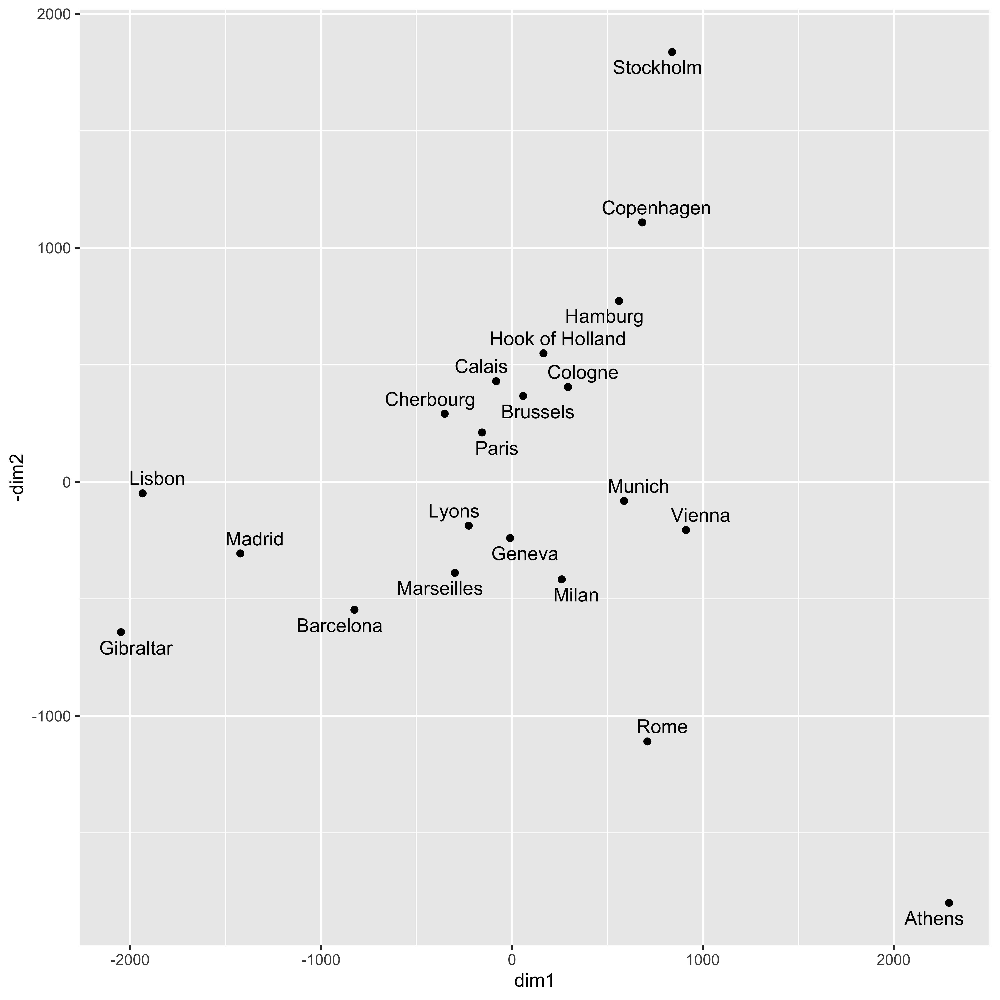

# 多次元尺度構成法 {#chapter15}

今回はについて解説します。
ここまで分散共分散行列を分解するところから，クロス表のような名義尺度水準のデータを分解するところまでやってきました。

多次元尺度構成法は，分散共分散行列を扱う線形モデルよりはやや過程が緩く，また数量化のように解析者が数字を与えることを目的にするというよりは，その名の通り尺度を作ろうとしているという意味で心理学的・心理測定的なモデルだといえるでしょう。

私たちが単位もない不確かなものを対象にしながらもそれを測定するモノサシをつくることができるのは，2つの対象にたいしてその比較をして一方が他方よりも大である，ということが言えるからでしょう。
記号を使って言えば，$x$と$y$を比べて$x \succeq y$である，ということから，尺度上の値$p \ge q$を対応させるということが，尺度を作るということです[^1]。
このとき比較する2つが重さや広さのような物理的なものであればわかりやすいですし，「痛み」や「喜び」といった心理的な要素であっても構いません。あるいは「より賛成」といった態度表明のようなものでも良いかもしれません。
この比較から出てくる関係は，分散共分散や相関係数のように強い線形の過程を置かなくても，より緩やかにという考え方で表現されます[^2]。

MDSは距離行列を固有値分解するモデルです。それではこの方法について内容を見ていきましょう。

## 多次元尺度構成法 {#多次元尺度構成法}

Rにはサンプルデータとして`eurodist`というヨーロッパ各地の都市間距離のデータが用意されています。表[\[tbl::15_01\]](#tbl::15_01){reference-type="ref"
reference="tbl::15_01"}にその一部を示します。

::: {#tbl::15_01}
                Athens   Barcelona   Brussels   Calais   Cherbourg   Cologne
  ----------- -------- ----------- ---------- -------- ----------- ---------
  Athens             0                                             
  Barcelona       3313           0                                 
  Brussels        2963        1318          0                      
  Calais          3175        1326        204        0             
  Cherbourg       3339        1294        583      460           0 
  Cologne         2762        1498        206      409         785         0
:::

[\[tbl::15_01\]]{#tbl::15_01 label="tbl::15_01"}

元のデータは$21 \times 21$のサイズです。表から，例えばアテネ(Athens)とバルセロナ(Barcelona)の距離が3313km，と言うことが読み取れます。表の右上が空白になっていますが，これはがなので，無駄な情報を表示しないようにしているからです。アテネとバルセロナの距離は，バルセロナとアテネの距離に等しいですからね。

さて距離行列はこのように，ですから，をすることでを求めることができます。基底は座標を形成する基本単位ですから，それを使って各変数の位置にあたる座標を計算できます[^3]。このように距離行列から座標を求めて，変数をプロットすることで変数間関係を可視化する手法のことをと言います。

試しに`eurodist`データをMDSで2次元プロットしてみましょう。

::: center
{#fig::15_01
width="12cm"}
:::

図[1.1](#fig::15_01){reference-type="ref"
reference="fig::15_01"}をみると，上の方にストックホルム(Stockholm)があって，右下にアテネが，中央にパリ(Paris)が・・・といった配置になっています。地球上の位置と完全に一致しているとは言えませんが，それでも概ねうまくプロットできていますね[^4]。このように，距離関係だけから地図を作ることができるというのが，MDSという手法なのです。

## 距離と心理学のデータ {#distance}

MDSは距離関係だけから地図を作る方法でした。因子分析は相関関係から次元を作る方法でした。この2つの手法はとても似ています。というのも，相関関係と言うのが変数と変数の近さ・遠さ，つまり距離を表しているとも言えるからです。
あらためてとは何かを考えてみましょう。2点$x,y$の距離を$d(x,y)$とすると，距離とよばれる数字の条件は次のようになります。

非負性

:   $d(x,y)\ge 0$

非退化性

:   $d(x,y)=0 \Leftrightarrow x=y$

対称性

:   $d(x,y)=d(y,x)$

三角不等式

:   $d(x,z) + d(z,y) \ge d(x,y)$

もっとも一般的に使われるのはユークリッド距離で，2次元座標$(x_1,y_1),(x_2,y_2)$があった時のユークリッド距離は次のように計算します。
$$\sqrt{(x_1-x_2)^2+(y_1-y_2)^2}$$
3次元座標$(x_1,y_1,z_1),(x_2,y_2,z_2)$の場合は項を増やすだけです。
$$\sqrt{(x_1-x_2)^2+(y_1-y_2)^2+(z_1-z_2)^2}$$
このようにして計算される距離ですが，上の条件を考えると何も二乗してルートを取らなくても絶対値を足し合わせるような方法でも構いません。例えば2次元座標の場合は，次のような計算でもいいのです。
$$|x_1-x_2|+|y_1-y_2|$$
現にこのような距離のことをといいます。二乗ではなくn乗してn乗根をとる，という形で一般化することもできます。
$$d(x,y) = \left( \sum_{i=1}^n |x_i - x_j|^p\right)^{\frac{1}{p}}$$
これはという名前がついています。他にもマキシマム距離，バイナリ距離，チェビシェフの距離，キャンベラ距離などがあり，いずれもRの`dist`関数のオプションで選ぶことができますので，ヘルプなどを参照してみてください。

また，相関係数$r_{ij}$は$-1 \le r_{ij} \le +1$の範囲にありますが，この絶対値から$1-|r_{ij}|$とするとこれも距離の条件に当てはまります。どの程度類似しているかというのも，距離と考えることができるのです。

ここまでは数学的な距離のバリエーションでしたが，次に心理学的な意味に目を向けてみましょう。
距離とは類似度でもありますから，何を距離と見なすかによって，さまざまな心理学的刺激がデータを形作ることになります。

例えば評定尺度で，n個の項目で何らかの評価をしてもらったとします。$x_{ij}$を$i$番目の項目における対象$j$の評定値だとすると，$d(j,k) = \sqrt{\sum_{i=1}^N (x_{ij}-x{ik})^2 }$とすれば対象の類似度が計算できます。
ほかにも何らかの刺激A,Bについて，AかBかの判断をさせた時に混同してしまった混同率や，単語と単語の連想価，刺激の汎化勾配，反応潜時，ソシオメトリックなデータなど，いろいろなものが「類似しているかどうか」の指標として使えます[^5]。尺度評定よりも，具体的な2つの刺激が似ているかどうかの反応の方がやりやすい，というのは誰しも実感として分かることではないかと思います。

類似度のデータが得られれば，それを距離と見做してMDSにかければ，変数間の関係を地図に描くことができるわけです。このように応用可能な領域が非常に広いことも，MDSの利点であると言えるでしょう。

## 非計量多次元尺度法

さて心理学的なさまざまな刺激が，MDSによって可視化できるということがわかってきました。距離行列が構成できれば，後の分析は何とでもできるわけです。
ただし，この場合の距離行列とは，間隔尺度水準以上であることが必要です。
しかし心理学的な刺激に対する反応をデータ化する時は，同時に被験者はそこまで鋭敏に反応しているのか，いいかえれば本当に間隔尺度水準以上の精度で判断できているのかな，という人間側の問題が気になりますね。そこまで人間は鋭敏無反応をしていないかもしれません。

でも大丈夫。MDSは仮定を緩めたモデルがあります。と呼ばれる手法がそれです。非計量MDSでは，対象$j$と$k$の類似度を$\delta_{jk}$とし，分析によって埋め込む多次元空間での距離を$d_{jk}$とすると，

$$\delta_{jk} > \delta_{lm} \mbox{ならば}d_{jk}\le d_{lm}$$

のように，イコールではなく順序関係だけ保持して座標を求めます。この手法では，元データが順序尺度水準程度の情報しか持っていなくても地図を描くことができるのです。人間の判断はせいぜいが順序尺度ぐらいですから，「より類似している($\delta_{jk} > \delta_{lm}$)」のであれば「より近くにある($d_{jk}\le d_{lm}$)」というぐらいの配置の方が良いかもしれません。

表[\[tbl::15_01\]](#tbl::15_01){reference-type="ref"
reference="tbl::15_01"}に示したような物理的距離であれば，間隔尺度水準の情報であることは間違いありません。その場合には，最初に示した固有値分解による手法を使います。これは非計量MDSに対して，と呼ばれています。

心理学ではデータの性質上，非計量MDSのほうが便利なことが多いでしょう。計量MDSでも非計量MDSでも，Rでは簡単な関数で実行できますので，いろいろ試してみると良いでしょう[^6]。

## 多次元尺度法の展開

多次元尺度構成法で作られたものは，対象をした地図です。
地図には，その上に何か書き込んだり，地形の図に天気図を重ねるように複数の地図を重ねて表現したりできます。
多次元尺度構成法にも，このような応用モデルがいろいろ考えられています。

##### prefmap

類似度空間の上に，個々人の理想点を追加する方法です。個人の好みpreferenceをマッピングする方法なので，と呼ばれています。個人$i$が対象$j$について，好みの程度を$s_{ij}$と評価したとします。対象$1,2,...j...,M$は別途類似度評定によって，MDSのつくった地図上にプロットされているとします。ここで個人$i$と対象$j$との地図上の距離$d_{ij}^2$に対して，次の回帰式を考えます。
$$s_{ij} = a_i d_{ij}^2 + b_i + e_{ij}$$
つまり，個人$i$と対象$j$の距離を使って，好みの程度$s_{ij}$を予測するモデルを作り，誤差がもっとも小さくなる点に個人$i$をプロットするのです。こうすることで，対象とそれを評価する人を一枚の地図に表現すると言うことができます。

##### Abelson Map

これは[@abelson1954technique]の考えた手法で，これもprefmapと同じく布置される対象に別の力(選好度でもなんでもよい)があると考え，地図空間上に力の場をプロットして等高線を引くことで表現するモデルです。

##### 非対称多次元尺度構成法

距離データは対称でなければならない，というものの，例えば好きな人に振り向いてもらえない＝片想いとか，都市間の人口の流入・流出，国際貿易の赤字・黒字などを考えると，対称間の関係が対称出ないことは少なくないわけです。そうした非対称な関係を，図に加えようと言うのが非対称MDSです。非対称情報を対象部分+歪対象部分に分割し，この対称でない要素を図の中に書き加えるモデルが一般的で，プロットする対象の周りに縁や楕円で表現するとか，矢印で表現するとか，vonMises分布と呼ばれる確率分布で表現するとか，先程のAbelson
Mapで高さとして表現するなどのモデルがあります。より数学的なモデルとして，プロットする空間を複素空間にするモデルもあります。詳しくは@千野直仁2012-04を参考にしてください。

##### 多次元展開法

リッカート法は心理尺度でもっともよく使われる方法で，「非常に当てはまる」から「全く当てはまらない」までの段階的な反応を被験者に求める方法です。これはで分析されることからも明らかなように，項目に対する反応段階が順番的に強くなっていくことを仮定しています。しかし，実際に被験者が丸をつけるときは，「自分の感覚にもっとも近いカテゴリーを選ぶ」ということをしているはずです。つまり，被験者と反応カテゴリーの距離が，尺度に反映されているはずなのです。この考え方から，尺度に対する反応を距離とし，項目とそれに回答した被験者の両方をプロットする地図を書く方法があります。Coombsが考えたと呼ばれる手法がそれで，この手法から態度測定の尺度化を考えることもできます。発想としては数量化理論に近く，また@shimizu2018はこれを確率モデルに展開しています。

ここであげたいくつかの例にあるように，多次元尺度法もさまざまな角度から人の判断や反応から，を作る方法です。多次元尺度構成法は因子分析モデルよりも制約や仮定が少なく，より直接的に心理的反応をモデル化しようとしています。

本講で学んだように，心理学ではさまざまな角度から「数値化するルール」を考えてきていますが，それぞれ仮定や目的，何を良い尺度と考えるかという観点がことなります。我々心理学者は，統計的なツールのユーザに過ぎません。データは分析できればそれでいい，分析は機械がやってくれるから深く考えなくていい，という割り切り方もあるかもしれませんが，「そもそも何をデータとするか」「どのように数値化するか」という点については，そのような態度は取れないはずです。なぜならそもそも「心はいかにして数値化できるか」ということが明らかでないならば，その後の分析は全て嘘っぽい数字を使った統計ごっこに過ぎないからです。**心理学者であるために，われわれは何をどのように数値化しているかについて，しっかりと理解する必要があるのです。**

## 課題

[^1]: 経済学では学問の最初の段階で，財を源とした集合に対する二項関係$x \circ y$を定義し，それを効用関数$u$で実数領域に写像して$u(x) \ge u(y)$を考える，といった基本的な原理を抑えます。心理学ではなぜか，「集合」「元」「二項関係」という基本的な比較の要素について考えることなく，その分析ツールだけがどんどんと発展してきています。

[^2]: 後述しますが，相関係数も距離の一種と考えられます。

[^3]: 厳密には距離行列$\bm{D}$そのものではなく，それを二重中心化した行列の固有値分解になりますが，本質的には変わりません。詳しくは@岡太彬訓1994-01-15などを参照のこと。

[^4]: 完全に一致しない理由は，地球が球面であるのに対し平面にプロットしたから，と言うのもあります。

[^5]: これらデータの例に関しては@高根芳雄1980-02のPp.14--27を参照してください。

[^6]: 計量MDSは`cmdscale`関数，非計量MDSは`MASS`パッケージの`isoMDS`関数を使います。詳しくはそれぞれのヘルプを参照してください。
