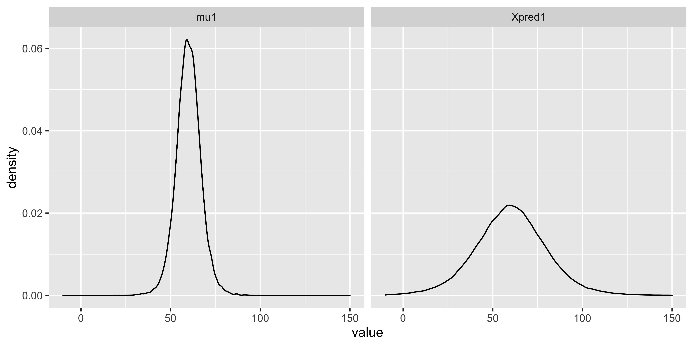
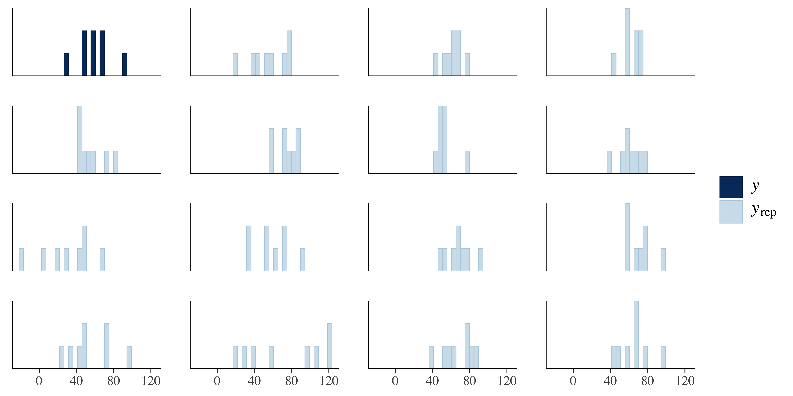

# モデリングの目から見た検定 2；パタメータの世界とデータの世界 {#chapter20}

前回は，二群の平均値差の検定を行うデータ生成モデルを考えました。平均値差の検定には正規分布が仮定されますから，データ生成モデルも正規分布からデータが作られていると考えれば良かったわけです。仮定に忠実に設計図を書き，それに対応した Stan コードを書くと母平均の推定値が出てきます。検定の時も母平均の推定値を使って考えるのですが，検定統計量にしてしまうので実感が湧きにくいところがあったかもしれません。データ生成モデルの場合は，直接パラメータを考えるのでイメージがしやすいという側面がありました。

さらに，MCMC による推定ですから事後分布からの代表値が，実現値として手元のオブジェクトに代入されています。これをつかった計算をすることで，たとえばパラメータの差を計算でき，その分布を考えることができるのでした。
こうした計算は Stan の`generated quantities`ブロックを使うことで，MCMC の結果と同時に考えることもできるのでした。

さて今回も，この`generated quantities`ブロックをつかって，生成量からいろいろ考えてみましょう。

## 事後予測分布

前回，二群のデータ$X_{i,A}$および$X_{i,B}$に対して，次のようなデータ生成モデルを考えました。

$$X_{i,A} \sim N(\mu_A,\sigma), X_{i,B} \sim N(\mu_B,\sigma)$$

このパラメータ$\mu_A,\mu_B,\sigma$の推定値，$\hat{\mu_A},\hat{mu_B},\hat{\sigma}$の分布からの代表値が MCMC によって得られるのでしたね。MCMC サンプルは iteration ごとに 1,2,3\...M 個得られたとすると，その期待値すなわちは，次の式で求めていることと同じです[^1]。

$$\hat{\mu_A}_{eap} = \frac{1}{M}\sum \mu_A^i = \frac{1}{M}(\mu_A^1+\mu_A^2+\cdots+\mu_A^M)$$
$$\hat{\mu_B}_{eap} = \frac{1}{M}\sum \mu_B^i = \frac{1}{M}(\mu_B^1+\mu_B^2+\cdots+\mu_B^M)$$
$$\hat{\sigma}_{eap} = \frac{1}{M}\sum \sigma^i = \frac{1}{M}(\sigma^1+\sigma^2+\cdots+\sigma^M)$$

さて，今回は得られたデータ$X_{i,.}$から$\mu,\sigma$を推定したわけですが，これはいわばデータ生成メカニズムの設定値を見つけたことと同じですね。
例え話で考えるなら，こんな感じです。
ある企業 A が製品 a を量産しているとします。ライバル会社 B が，この製品 a の類似品を作ろうと考えたとします。
そこで B 社は A 社の製品 a を作っている製造機械と同じ型番の機械を購入します。この機械には製品を生成するに当たって幾つかの設定をしなければならないとします。アナログな例えで恐縮ですが，ツマミが 2 つ 3 つ付いていて，それをひねれば何らかの製品ができるといった感じです。でも A 社が製品 a をつくるのに，どういう設定にしているのかはわからない。
そこで製品 a をいくつかサンプルとして入手します。入手したサンプル a1,a2\...と見比べながら，この辺りかな？この辺りかな？とツマミを調節し，サンプル a1,a2\...と同じような製品 b1,b2\...ができるのはこの辺の設定だな，というのを見つけたという感じ。

この例え話を MCMC の用語を使っていうと，入手したサンプル a1,a2\...がデータです。このデータをつくる製造機械がです。機械には設定のツマミがついているんですが，そのツマミはのメタファーになっています。サンプルを参考に，この辺りかな，この辺りかな，とツマミの値を探るステップが MCMC の各段階で，まずは$\mu_A^1,\mu_B^1,\sigma^1$，次にそれからちょっと動かして$\mu_A^2,\mu_B^2,\sigma^2$，またちょっと動かして・・・と 4000 回試すことで「だいたいこのデータを作るための設定はこの辺り」というのが決まってくるわけですね。「この辺り」というのを点推定する場合はやなどを使いますし，幅を持って推定したい場合はで表現するのでした。

ということで，いくつかの手元のデータから，製造メカニズムの設定を手に入れました。このとき B 社はきっと，「じゃあこの推定値をつかって(模造品である)製品をジャンジャン作っていこう」となるでしょう。この推定値から作られる新しい製品(模造品，新しいデータとも言えます)のことを MCMC ではとくにと言います。分布となっているのは，作られる製品も散らばりますので，その散らばり方を分布で考えるからです。

事後予測分布は，点推定値を使って計算することもできます。つまり，データが$X_{i}\sim N(\mu,\sigma)$というメカニズムで作られていて，それから推定値$\hat{\mu},\hat{\sigma}$を得たわけですから，これを使って$X_{new}\sim N(\hat{\mu},\hat{\sigma})$とすれば良いのです。これはただの乱数生成でもありますから，たとえば R で`rnorm(mu,sigma)`とするときに`mu`と`sigma`に推定値を入れてやればいいでしょう。
でも点推定値では決め打ちが過ぎますので，区間推定した上限と下限も入れますか？いや，それならいっそ，MCMC で得られた事後分布からの代表値を全部入れてしまえばいいのではないでしょうか。

それを実現するために,`generated quantities`ブロックを使うといいでしょう。コード[\[stan::20_01\]](#stan::20_01){reference-type="ref"
reference="stan::20_01"}にその例を書いてみました。データやモデルは前回の二群の平均値差の検定と同じものです。

```{#stan::20_01 .c++ language="C++" label="stan::20_01" caption="事後予測分布を作るコード"}
data{
    int<lower=0> N1; // Number of Subjects in Group 1
    int<lower=0> N2; // Number of Subjects in Group 2
    real X1[N1]; // Data in Group 1
    real X2[N2]; // Data in Group 2
}

parameters{
    real mu1;
    real mu2;
    real<lower=0> sig1;
    real<lower=0> sig2;
}

model{
    // likelihood
    X1 ~ normal(mu1,sig1);
    X2 ~ normal(mu2,sig2);
    // prior
    mu1 ~ uniform(0,100);
    mu2 ~ uniform(0,100);
    sig1 ~ cauchy(0,5);
    sig2 ~ cauchy(0,5);
}

generated quantities{
    real Xpred1[N1];
    real Xpred2[N2];
    for(i in 1:N1){
        Xpred1[i] = normal_rng(mu1,sig1);
    }
    for(i in 1:N2){
        Xpred2[i] = normal_rng(mu2,sig2);
    }
}
```

ここで，`generated quantities`には，`normal_rng`という関数が入っています。この`_rng`は確率分布の後ろにつけて，乱数を発生させろという意味です。R でいう`r****`みたいなもんですね。
このコードでは各群と同じサイズだけの事後予測データセットを作っています。まあ同じ$\mu$と$\sigma$からの乱数ですから，データの数だけ作ったりしなくてもいいんですがイメージしやすくするためにそうしてみました。
この$\mu$と`Xpred`を図にしてみたのが図[1.1](#fig::20_01){reference-type="ref"
reference="fig::20_01"}です。

{#fig::20_01
width="12cm"}

この図の左側は$\mu_1$のが，右側には$X_1$のが描かれています。左側は**パラメータの世界**の話であり，右側は**データの世界**の話になっていることに注意してください。

パラメータ$\mu_1$は，EAP で 59.96,95%CI\[48.81,71.22\]となっています。そこからでてくるであろうデータは，25 から 100 弱の幅に分布していますね。平均が 60 であっても，SD が 20 弱ありますから，データのレベルではその散らばる幅が大きくなるのも当然ですよね。でもこれはとても大事なことで，我々は「群間に差があった」となるとその効果について色々考えますが，それはパラメータの話，あるいは**平均因果効果**の話であって，個々のデータではまた事情が違うのです。たとえば，男女差があると言っても平均的な男性，そうでない女性など様々なケースがあるように。たとえば，平均的に 80%成功する手術があると言われても，自分の身に置き換えると生きるか死ぬかは割合の問題ではないように。

また，この事後予測分布の形は，もとのデータの分布の形と似ているかどうかを視覚的に確認するために使われます。図[1.2](#fig::20_02){reference-type="ref"
reference="fig::20_02"}に，事後予測分布ともとのデータのヒストグラムを合わせて表示してみました。事後予測分布は MCMC サンプルの数だけありますが，ここでは一部だけ取り出しています。

{#fig::20_02
width="12cm"}

これを見ることで，もとのデータと事後予測分布の形が似ているかどうかがわかります。もし模倣した機械の設定値が正しいのであれば，手元にある商品サンプルと同じような分布をするデータ分布が得られるはずですね。
視覚的な確認ですから，見て「うーん似てるな，似てないな」というのを見て考えるだけではあります。今回はデータの数が 8 件と少ないので何ともイメージしにくいところですが，データが多くなるとデータの分布の形状で比較することもしやすくなるでしょう。もし分布の形が似ていなければ，購入した製造機械が違うものだったのかもしれない，ということになります。というのも実際のデータ分析の場合は，製造機械(確率分布，モデル)が正しいかどうかはわからないので，それすらも仮定，検証すべき対象だからです。

## データレベルの仮説

の利用方法は他にもあります。
事後予測分布は，確率モデルと推定されたパラメータを利用した「新しいデータの生成」だったわけですが，この新しく生まれるであろうデータについての，データの世界での仮説を考えることができるのです。

帰無仮説検定で扱っていたのは，パラメータの世界の仮説でした。たとえば二群の平均値差の検定について言えば，帰無仮説は$\mu_1 = \mu_2$であり，対立仮説は$\mu_1 \neq \mu_2$です。これはギリシア文字$\mu$を使って書いてあることから明らかな通り，母数の仮説であり，$\bar{X}_1 = \bar{X}_2$のような，データについての仮説ではありませんね。ではデータについての仮説というのはどういうものがあり得るでしょうか？たとえば次のようなものが考えられます。

- 無作為に選んだ統制群のデータと実験群のデータを比べたとき，実験群が統制群を上回っている確率はどれぐらいあるだろうか？

- 無作為に選んだ統制群のデータと実験群のデータの差が，基準点$c$より大きくなる可能性はどれぐらいあるだろうか？

第 1 の点はという指標です。これはパラメータの世界の比較ではなく，実データの比較ですからイメージしやすいのではないでしょうか。たとえば男女差が平均的にはあるとされていたとしても，それはパラメータの違いであって，実際これから新しく出会う男性(女性)が自分より優れている(劣っている)可能性は，と考えた方が実質的な意味がありそうです。性差の話の多くは，平均値差だけでしか議論されませんが，効果量[^2]で考えると小さいことが少なくありません。それでも有意差が検出されてしまうのは，非常に大きなサンプルサイズをとっているから，ということもあったりします。サンプルサイズを大きくとるのは研究者の工夫や努力なのですが，小さな効果を取り上げて針小棒大に騒ぎ立てるのは科学的に良い態度とは言えません。そんな時に優越率で考えてみると，差があると言っても無作為に二群から新しい情報を得た場合の優越率が 50%ちょっとしかない，つまり超えるか超えないかが半々ぐらいですから「何の情報ももたらさない」のと同じこと，ということになったりします。くどいようですが，実データのレベルでの比較になるので，群間の差の表現としてよりわかりやすいということが言えるでしょう。
第 2 の点は，優越率に一定の違いの差$c$を含めて考えるもので，といいます。これもデータレベルでの仮説の 1 つで，たとえば新しいトレーニング方法を使えばタイムが 3 秒小さくなる確率は X%，などということが分かれば具体的にイメージしやすい伝達方法になると思いませんか。

ちなみにこの優越率，閾上率などの指標は古くから指摘されてきていたものであり[^3]，ベイズ推定を使わない，モーメント法による推定でも計算可能な量でした。まぁしかし，このような統計量が実際に使われているケースってほぼ見かけないんですけどね。しかし，これらの指標はベイズ推定を使うことによって，というより乱数による近似計算をすることによって，遥かにイメージしやすくなっています。ここで示された数値はいずれも，`generated quantities`ブロックの中に`if`文をつかって書いてやれば表現できることだからです！

実際に考えてみましょう。これら「条件が成立する確率」については，成立すれば 1，成立しなければ 0 というフラグをたてて MCMC サンプルを生成し，その平均値すなわち相対頻度で考えてやれば良いのでした。

```{#stan::20_02 .c++ language="C++" label="stan::20_02" caption="優越率や閾上率を計算するコード"}
data{
    int<lower=0> N1; // Number of Subjects in Group 1
    int<lower=0> N2; // Number of Subjects in Group 2
    real X1[N1]; // Data in Group 1
    real X2[N2]; // Data in Group 2
    int<lower=0> C; //constant
}

...

generated quantities{
    real Xpred1;
    real Xpred2;
    int<lower=0,upper=1> FLG1;
    int<lower=0,upper=1> FLG2;
    Xpred1 = normal_rng(mu1,sig1);
    Xpred2 = normal_rng(mu2,sig2);
    //probability of dominance
    if(Xpred1 > Xpred2){
        FLG1 = 1;
    }else{
        FLG1 = 0;
    }
    //probability beyond threshold
    if(Xpred1 - Xpred2 > C ){
        FLG2 = 1;
    }else{
        FLG2 = 0;
    }
}
```

コード[\[stan::20_02\]](#stan::20_02){reference-type="ref"
reference="stan::20_02"}は，`generated quantities`ブロックで 2 つの`FLG`変数を用意しています。`FLG1`が優越率，`FLG2`が閾上率のために用意したものです。
このブロックで，推定されたパラメータ`mu1,mu2,sig1,sig2`からそれぞれ生成される二群の「新しいデータ」を作り(`Xpred1,Xpred2`)，成立するかどうかを検証します。
`FLG1`は`if`文の中にあるように，`Xpred1 > Xpred2`が成立すれば 1，しなければ 0 になる数字です。
`FLG2`は，同じくその差分が一定の値`C`を超えていれば成立，超えていなければ不成立というフラグです。ちなみにこの値`C`は`data`ブロックで外部から読み込むことにしてあります。

これと前回のデータを使って推定させてみましょう。

```{#code::20_01 .c++ language="c++" label="code::20_01" caption="優越率，閾上率を推定するコード"}
groupA <- c(30, 50, 70, 90, 60, 50, 70, 60)
groupB <- c(20, 40, 60, 40, 40, 50, 40, 30)
dataSet <- list(X1 = groupA, X2 = groupB, N1 = 8, N2 = 8, C = 3)
#### rstanの場合
sampling1 <- sampling(modelR, dataSet, warmup = 1000, iter = 4000, chains = 4)

### cmdstanrの場合
sampling2 <- modelC$sample(
  data = dataSet,
  chains = 4,
  iter_sampling = 5000,
  iter_warmup = 1000,
  parallel_chains = 4
)
```

::: SCrstan
MCMC の結果出力 out20_01

    Inference for Stan model: ttest06.
    4 chains, each with iter=4000; warmup=1000; thin=1;
    post-warmup draws per chain=3000, total post-warmup draws=12000.

             mean se_mean    sd   2.5%    25%    50%    75%  97.5% n_eff Rhat
    mu1     59.97    0.08  6.84  46.37  55.75  59.97  64.10  73.92  7867    1
    mu2     40.01    0.05  4.60  30.74  37.17  39.99  42.84  49.17  8417    1
    sig1    18.48    0.06  5.37  11.42  14.79  17.50  20.99  31.75  6909    1
    sig2    12.61    0.04  3.65   7.71  10.11  11.91  14.29  21.61  7240    1
    Xpred1  59.92    0.19 20.37  19.06  47.27  59.97  72.43  99.71 11499    1
    Xpred2  40.02    0.13 13.92  12.38  31.39  39.96  48.45  68.53 11690    1
    FLG1     0.80    0.00  0.40   0.00   1.00   1.00   1.00   1.00 11478    1
    FLG2     0.76    0.00  0.42   0.00   1.00   1.00   1.00   1.00 11801    1
    lp__   -51.00    0.02  1.56 -54.91 -51.77 -50.64 -49.85 -49.07  4315    1

    Samples were drawn using NUTS(diag_e) at Wed Oct 13 09:31:15 2021.
    For each parameter, n_eff is a crude measure of effective sample size,
    and Rhat is the potential scale reduction factor on split chains (at
    convergence, Rhat=1).

:::

ここにあるように，優越率は 80%，閾上率は 76%ということになりました。実験群(GroupA)のほうが統制群(GroupB)よりもスコアが高くなる確率が 80%，スコアが 3 点以上大きくなる確率は 76%もあるのですから，実験群の効果は結構おおきいぞ，といったことがわかるようになります。

こうしたデータに基づく仮説は，単位がもとのデータに対応しているから想像しやすく，より実践的な意味を想像しやすいですね。

まとめておきます。
パラメータの世界に関する仮説は，推定されたパラメータはどれぐらいの値なのか，どれぐらいの「差」「違い」があるのかを考えることでした。あるいは，推定されたパラメータはどれぐらいの幅に分布するのか，という差の分布を考えることで，効果の有無の確からしいさを量的に評価できるのでした。
データの世界に関する仮説は，データ生成機がどういうデータを作るのか，ひいてはそれが今のデータと同じ形をしているかを見ることで，モデルが正しいかどうかを検証できます。また未来のデータの分布はどんな形になるのか，という意味では，データという具体的な数字でもって未来予測をできます。

ただしいずれの世界においても注意しておいて欲しいのは，データ生成機すなわち確率モデルが正しい場合であり，これが間違っていると`generated quantities`などで作られる数字も全く意味のないものになってしまう，ということです。もちろん t 検定など帰無仮説検定を行う時も，データが正規分布していなければ意味のない検定結果になるので，「そもそも統計的な仮定が間違ってた」というのでは意味がないのはいずれも同じです。推測統計学は手元の少しのデータから，未知の世界を予測検証するという不良設定問題に対応するためのものですから，仮定や前提が正しいかどうかについては常に敏感でなければなりません。

## パラメータ・リカバリ

そもそもの仮定が間違っていた，というのを考えすぎて何もできなくなっても良くないですから，そこは一旦 OK だとしましょう。
そう考えると，仮定・前提をつけた上での話になりますが，未知の世界や未来を予測できるというのは，とんでもなく強力なツールであるような気がします。株価や競馬の予想ができれば，大儲けできる薔薇色の人生が待っているかも。
ということで，ベイズ推定の勉強にも身が入るというものです。推定を可能にしてくれた MCMC に感謝！

半ば冗談，半ば本気なのですが，Stan や JAGS などの確率的プログラミング言語が登場したおかげで，事後分布の計算が可能に，簡単便利にできるようになったというのは大変ありがたいことです。これのおかげでどんなモデルでも，設計図が書ければ答えが出せちゃう。複雑な確率の式とか微分積分を考えなくても，なんとかなるような気がします。
しかし簡単なツールが出てきたときの常で，ちょっと注意が必要なのですが，MCMC は優秀すぎて正しくない計算式からでも答えが出てしまう，という可能性があるのです。

MCMC がうまく行ったかどうかは，や，などをチェックすればよい，というのは既にお話しした通りです。
しかしここで指摘したいのはそうではなく，これらの MCMC がうまく行っていたとしても，推定結果が正しいとは限らない可能性です。MCMC は「あり得そうな答えの可能性」を大量に出力し，その分布で我々は考えるのですが，その答えの可能性群が全部的外れなところに行ってるかもしれないのです。実際にデータを分析していると感じるのですが，MCMC は大概こみったモデルを考えても答えを出してくれます。とにかく答えてくれる機械が手に入ったとしても，その信憑性をチェックすることを忘れてはいけません。

ではこれをチェックするためにはどうすればよいでしょうか。ひとつは，答えが先にわかっている問題を作って，機械が正解を当てられるかどうかを検証するということが考えられます。
この「わかっている正しい値」を当てることができるのであれば，実際のデータを用いた「わからない値」を推測する方法として有用だということがわかります。正解を当てることができないようであれば，この計算機械は当てにならないので，実際のデータを使っても正しく推測できているとは言えないでしょう。

この検証方法のことをと言います。
実際のデータ分析をする場合は，いきなり未知の答えに推測機をあてがうのではなく，推測機が事前に設定したパラメータをリカバリ(回復)できることを確認してから利用するようにしましょう。
実際の研究実践の場合，その分析手順は，以下のようになります。

1.  データ生成メカニズムを考える(紙とペンによる設計図の作成)

2.  モデルを式で表現する

3.  モデルの式からデータ生成をシミュレーション

4.  Stan でコードを書く

5.  シミュレーションデータを Stan が再現していることを確認する

6.  実際のデータでやってみる

7.  結果の解釈（図による確認も）

ここで第 3 のステップ，仮想データの生成から第 5 のステップ再現の確認が，パラメータリカバリという作業になります。推定したい平均値などのパラメータを事前に仮に入れてみて，その答えが復元できるかどうかを見るのですね。

なんだかまだるっこしい！と思う人もいるかもしれません。自分で設定したパラメタ通りになるのって当たり前じゃないか，何がおもしろいのか？というわけですね。ですが意外と当たり前でないことがあるんです。間違えた答えであれば，実践では役に立ちません。
あるいは，いきなりデータでいいじゃない，固いこと言うなよ，と思う人もいるかもしれません。これが設定ミスの場合は答えを出さない・答えられないという機械であればそれでもいいのかもしれませんが，MCMC は大概なんでも答えてしまうので，いきなりの運用は怖いと思いませんか。
またあるいは，基礎実験とかそのほかの授業でも，今までそんなのやったことないよ，という意見もあるかもしれません。大学の授業で行うような演習・実習は，そもそも効果がはっきりあること，再現する現象であることがある程度確からしいものを選んでやっていますからいいのですが，これから皆さんは研究者の卵として，新しい現象，十分に確認されていない現象を研究対象にすることになります。そのとき，いきなり出てきた結果がどれほど信用できるでしょうか。実際，最近では心理学実験が再現できないケースも数多く指摘されており，その理由のひとつとして統計モデルの乱用(悪用・誤用)にあったことは何度もお伝えしてきた通りです。さらに，ごく微小な効果を偶然検出してしまった，という可能性もあります。事前に推定機の精度がわかっていればこうした問題を回避できるのです。この話はベイズ推定をする場合だけでなく，帰無仮説検定など従来のやり方にも通じ，やの話に直結します。

### 二群の平均値差の例

ここまで扱ってきた，二群の平均値差を検証する例で考えてみましょう。
もともとの設計図(図[\[fig::19_01\]](#fig::19_01){reference-type="ref"
reference="fig::19_01"})がここでも役に立ちます。
データがどういうメカニズムで出てきたかを考えていたわけですから，これを使えばデータ生成を考えることができますね。乱数生成のアプローチはデータを取り始める前にも有用なのです！

今回はパラメータを仮に設定してやることができます。二群の平均とその差を次のように決めてしまいましょう。

```{#code::20_02 .c++ language="c++" label="code::20_02" caption="平均値差の設定"}
mu1 <- 50
diff <- 10
mu2 <- mu1 + diff
sig1 <- 5
sig2 <- 8
```

第一の群の平均は`mu1 <- 50`としています。第二群の平均は`mu2 <- 60`というようにしてもいいのですが，差を考えるという意味を強調するために一旦変数`diff`を作って差の量を定め，それを`mu1`に加えるという方法をとっています。
2 つの群は正規分布に従いますから，それぞれの標準偏差を`sig1,sig2`として設定しました。
ここから仮想データを作ります。データの生成は乱数に従うので，`rnorm`関数の出番です。

```{#code::20_03 .c++ language="c++" label="code::20_03" caption="仮想データの生成"}
set.seed(12345)
N <- 10
X1 <- rnorm(N, mu1, sig1)
X2 <- rnorm(N, mu2, sig2)
```

これで実際に生成された仮想データは次のようになっています。

::: Rscreen
検定の結果 out20_02

    > X1
    [1] 52.92764 53.54733 49.45348 47.73251 53.02944 40.91022 53.15049 48.61908 48.57920 45.40339
    > X2
    [1] 59.07002 74.53850 62.96502 64.16173 53.99574 66.53520 52.90914 57.34738 68.96570 62.38979

:::

ちなみにこの 2 つのデータセット，平均は$\bar{X}_1=49.33528,\bar{X}_2=62.28782$となっています。理論的にはそれぞれ$50,60$であるはずなのですが，乱数による実現値なので少し誤差が出ていますね。
これは実際の研究状況でもある話です。理論的な値と，目の前の実現値というのは必ず少しずれがあるもの。その中で，きちんと理論値を推定できるかどうかが問題なのですから。
さて，このデータを使って分析していきましょう。

```{#code::20_04 .c++ language="c++" label="code::20_04" caption="パラメータリカバリ・検証"}
## t検定(モーメント法による推定と判定)
t.test(X1,X2)
## ベイズ推定(MCMCによるベイズ推定と差の分布)
dataSet <- list(X1 = X1, X2 = X2, N1 = N, N2 = N, C = 3)
modelC <- cmdstanr::cmdstan_model("ttest03.stan")
sampling2 <- modelC$sample(
  data = dataSet,
  chains = 4,
  iter_sampling = 5000,
  iter_warmup = 1000,
  parallel_chains = 4
)
```

まずは t 検定の結果ですが，ここでは$t(14.797)=5.2059,p=0.0001113$で有意差ありと判定されました。実際`diff <- 10`で差がある設定なのですから，正しく判定できて良かったな，というところです。
ベイズ推定の方はどうでしょうか。結果は次のようになりました(ここでは前回のコード[\[stan::19_04\]](#stan::19_04){reference-type="ref"
reference="stan::19_04"}を再利用しました)。

::: SCcmd
MCMC の結果出力 out20_02

     variable   mean median   sd  mad     q5    q95 rhat ess_bulk ess_tail
         lp__ -42.46 -42.11 1.55 1.32 -45.53 -40.67 1.00     8371    10084
         mu1   49.33  49.34 1.45 1.33  46.97  51.66 1.00    14688    10325
         mu2   62.28  62.31 2.39 2.21  58.46  66.11 1.00    15343    11316
         sig1   4.47   4.26 1.17 0.99   3.00   6.68 1.00    15317    11168
         sig2   7.19   6.86 1.82 1.56   4.89  10.56 1.00    16109    12201
         diff -12.95 -12.95 2.77 2.61 -17.45  -8.48 1.00    14763    12136

:::

これを見ると，`mu1 <- 50`と設定したときの EAP 推定値が 49.33，95%CI で\[46.97,
51.66\]ですから，ほぼ正しい点推定値，また確信区間の中に真値を含んでいます。推定はうまく行っている，ということです。
`mu2`についても同様で，真値が 60 であり，EAP 推定値が 62.28，95%CI で\[58.46,
66.11\]です。点推定値は真値から 2 点ほどずれていますが，95%の区間推定にすれば真値を含んでおり，推定はうまく行っているようです。
標準偏差の推定値についても，それぞれうまく行っており，差についても EAP 推定値が-12.95，95%CI で\[-17.45,
-8.48\]です[^4]。確かに確信区間に真値は含んでいるのですが，17.45 は真値 10 から少し外れすぎかな・・・というようなことがわかりますね。

このように，今回の結果をみると概ね正しく推定できていると言えるでしょう。その精度についても「どの程度誤差が生じうるものなのか」が具体的にわかったことと思います。
しかし次のような設定の場合はどうでしょう。

```{#code::20_05 .c++ language="c++" label="code::20_05" caption="仮想データの生成その2"}
mu1 <- 50
diff <- 18
mu2 <- mu1 + diff
sig1 <- 10
sig2 <- 15
N <- 3
```

この設定でデータを作って，推定した結果は次のようなものです(出力[\[SCcmd:out20_03\]](#SCcmd:out20_03){reference-type="ref"
reference="SCcmd:out20_03"})。

::: SCcmd
MCMC の結果出力 out20_03

    variable   mean median    sd   mad     q5    q95 rhat ess_bulk ess_tail
    lp__ -16.13 -15.76  1.71  1.53 -19.46 -14.07 1.00     5639     5637
    mu1   53.94  53.93  4.25  2.91  47.93  60.09 1.00     6785     5153
    mu2   59.14  59.51 12.07  9.86  38.84  78.31 1.00     9304     7539
    sig1   6.17   5.03  4.21  2.27   2.62  13.15 1.00     6960     5468
    sig2  20.27  17.12 11.73  7.08   9.43  41.32 1.00     8842     9680
    diff  -5.20  -5.54 12.82 10.86 -25.50  16.37 1.00     8216     7667

:::

MCMC の収束は問題なく，推定値は出力されていますが，本来$\mu_1=50$であるところが 53.94，95%確信区間は\[47.93
,60.09\]であり，$\mu_2=68$であるべきところに至っては EAP 推定値が 59.14，95%確信区間は\[38.84
,78.31\]です。確信区間はなんとか平均値を挟み込みましたが，38 から 78 までと 40 点も幅がある推定はあまり有効な予測とは言えませんね。差は 18 あるという設定なのですが，EAP 推定値はわずか 5.2 であり，95%確信区間は\[-25.50,
16.37\]です。確信区間にゼロをふくんでいますから，「差がないかも」ということになります。実際，t 検定の結果は帰無仮説を棄却できませんでした($t(2.2337)=0.52828,p=0.6451$)。第二種の誤りを犯してしまっています。

どうしてこんなにうまくいかなかったのでしょうか。今回は正規分布という正しい確率モデルを使っていたのに，です。その答えは明らかに，`N <- 3`という点にあります。つまり，データが 3 件しかないので予測の精度が悪くなったのです。
このように，モデルが正しくても推定精度が十分ではない，あるいは判定をするときに間違った判断をする可能性がある，ということがわかります。推定精度や効果の判定については，サンプルサイズ，データの散らばり(群内分散)，データ間の差の大きさ(群間分散)などの要因が影響してきます。ここで設定値を色々変えてみて，どういう関係にあるのかをみておくのも良いでしょう。

このように仮想データを使ったパラメタリカバリを通じて，推定や検定の精度を設計したりチェックしたりできることがわかりました。
これを踏まえて考えると，前回の例では$N=8$のデータで分析をしましたが，$N=8$だと平均値差を 8〜12 点ほど外した予測をしてしまうかもしれない，ということがわかります。
逆に「5 点差までの推定誤差に収めたい」というような希望があった場合，データは何件ぐらい取れば良いでしょうか？このような問いについても，$N$の設定値を様々に変えてみることで，実験や調査を実際に始める前に予想を立てておくことができます。これがです。例数設計の重要さを確認するとともに，こうした乱数を作るアプローチで簡単に実践できますので，実際の研究の前にはぜひ一度試してみてください。

## 今回のまとめ

生成量をつかうことで，次のような検証をできるのでした。

- 事後予測分布を作ることで，想定した確率モデルが正しかったかどうか検証する。

- 事後予測分布を利用して，優越率や閾上率などデータに基づく仮説を検証する。

さらに，データ生成モデルを応用して，そもそも擬似データをつくることで推定モデルの精度や，どれぐらいのサンプルサイズが必要かといったことを，実践の前に検証できます。

データ生成アプローチと乱数発生技術の組み合わせで，より慎重かつ確実な研究アプローチができることを理解してください。

## 課題

次の計算をする R/Stan コードや回答を記述し，提出してください。なお提出されたコード単体でバグがなく動くことが確認できないものは，未提出扱いになります。コードの書き方などわからないところがあれば，曜日別 TA か小杉までメールで連絡し，指導を受けてください。

##### フライドポテトの研究その 2

あるコンビニチェーンの 2 つのお店 A,B で，それぞれホットスナックのフレンチフライを買ったところ，どうも一方より他方の方が長くて大きい気がした。そこでそれぞれの袋から取り出して長さを測定してみた(単位 cm)。測定結果が表[1.1](#tab::19_01){reference-type="ref"
reference="tab::19_01"}である[^5]。

::: {#tab::19_01}
A 8.4 11.3 8.1 11.2 5.8 6.3 7.1 10.9 7.1 6.5 5.0 3.0 7.2 6.5 6.4 6.4 9.3 8.3

---

B 6.7 7.2 4.2 11.0 7.5 8.9 7.0 8.0 7.2 4.2 6.0 9.0 8.6 9.0 5.0

: 二つの店舗のポテトの長さ
:::

[\[tab::19_01\]]{#tab::19_01 label="tab::19_01"}

このデータを用いて次の問に答えなさい。なおポテトの長さは正規分布に従い，また両群の分布の幅は同じであると仮定します。ちなみに，この数値はサイト上のコードで取得可能です。

1.  店舗 A のポテトの平均が，店舗 B のポテトの平均より長い確率はどれぐらいあるか。

2.  今後，店舗 A で購入するポテトが店舗 B で購入するポテトよりも長い確率はどれぐらいあるか。

3.  今後，店舗 A で購入するポテトが，店舗 B で購入するポテトよりも 2cm 以上ながい確率が 30%あれば店舗 B では買わないようにしようと思う。店舗 B を利用すべきかどうか，推定に基づいて判定してください。

4.  今後，店舗 A で購入するポテトと店舗 B で購入するポテトの長さの違いが 5cm 未満である確率が 80%であれば，家により近い店舗 B を利用してもいいように思う。店舗 B を利用すべきかどうか，推定に基づいて判定してください。

5.  このコンビニチェーンのポテトの長さ平均を，できるだけ正確に推定したいと思う。標準偏差は今回の MAP 推定値を使うこととして，何本ぐらいポテトのサンプルを集めればその 95%確信区間を 0.05cm 以内に収めることができるだろうか。シミュレーション結果に基づき，おおよその数字を答えてください。

[^1]: ここで上つきの数字は MCMC のステップ番号を表しているもので，冪乗の数字ではありません。また M は Stan のデフォルトでは 4000 です。
[^2]: 標準化された平均値差のことでしたね。
[^3]: たとえば@Haebara1987 による優越率の解説は 1987 年の論文です。
[^4]: 生成量は`diff = mu1 - mu2`で作っているので，正負が逆転しているのはご容赦ください。
[^5]: このデータは実際に筆者がコンビニの二つの店舗でポテトを購入し，長さを測定した結果に基づいています。
