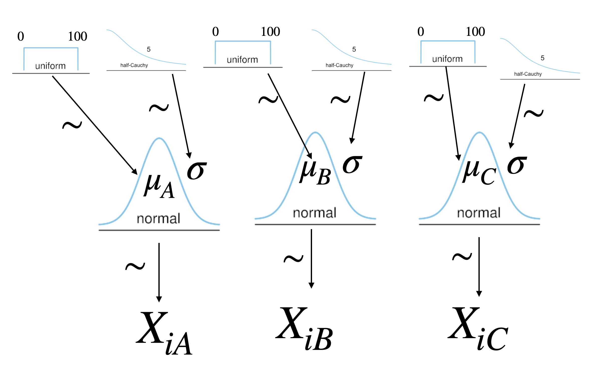
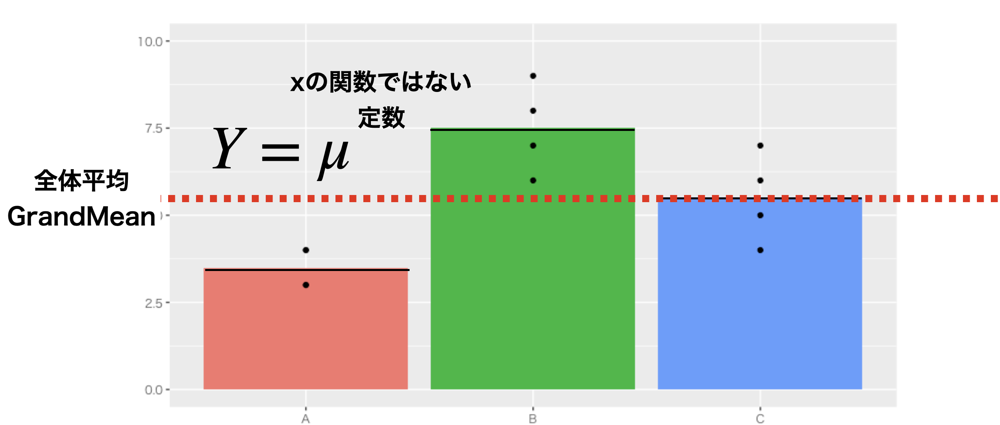
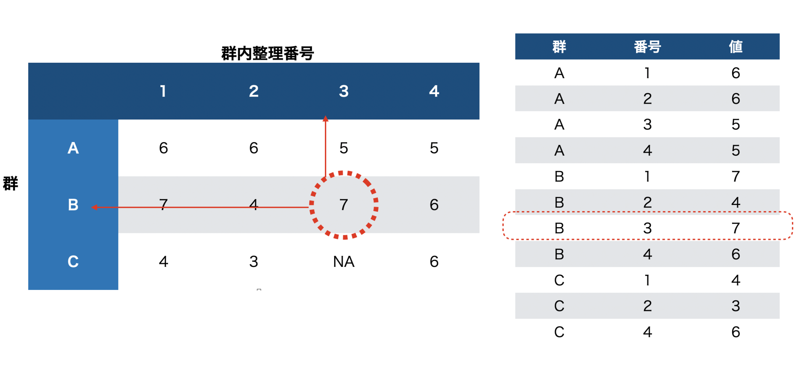

# モデリングの目から見た検定3；多群の平均値差モデル {#chapter21}

## 要因計画モデル

さてここまでは二水準の平均値差を考えるモデルでしたが，ここからそれを三水準に増やしてみましょう。
水準数が多くなるとやといった話になってきます。は要因計画と帰無仮説検定の合わせ技で，効果がある/ないの判定を分散の比をつかって行うことでした[^1]。

今回は要因計画をデータ生成モデルから考え，をすることになります。のようなYes/No判断はせず，平均値や差の大きさを直接見積もることになるのは，二群の時と同じです。

まずは簡単なの話から進めましょう。対応のない二群の時のように，それが三群になるモデルですので，モデルの設計図は非常に単純です(図[1.1](#fig::21_01){reference-type="ref"
reference="fig::21_01"})。

::: center
{#fig::21_01
width="12cm"}
:::

設計図を見れば，コードはそのまま置き換える形でかけますね。設計図の通りに書いてみたコードがCode::[\[stan::21_01\]](#stan::21_01){reference-type="ref"
reference="stan::21_01"}にあります。

``` {#stan::21_01 .c++ language="C++" label="stan::21_01" caption="三群の平均値のコード"}
data{
  int<lower=0> N1;
  int<lower=0> N2;
  int<lower=0> N3;
  real X1[N1];
  real X2[N2];
  real X3[N3];
}

parameters{
  real mu1;
  real mu2;
  real mu3;
  real<lower=0> sig;
}

model{
  // likelihood
  X1 ~ normal(mu1,sig);
  X2 ~ normal(mu2,sig);
  X3 ~ normal(mu3,sig);
  // prior
  mu1 ~ uniform(0,100);
  mu2 ~ uniform(0,100);
  mu3 ~ uniform(0,100);
  sig ~ cauchy(0,5);
}

generated quantities{
  real diff12;
  real diff13;
  real diff23;
  
  diff12 = mu1 - mu2;
  diff13 = mu1 - mu3;
  diff23 = mu2 - mu3;
}
```

最後の`generated quantities`ブロックにあるように，各群の差の分布も計算して出せるようにしてあります。これをみながら，群AとB，AとC，BとCなどどこに差があるのか，その大きさはどれぐらいかということを考えることができます。左の大きさを標準偏差`sig`で割ることで効果量を出すこともできます。

二群の平均値差の時もそうでしたが，検定と違って差の大きさを直接検証できているところがポイントです。また，検定の場合は分析によって有意差が確認できた場合，そのあとへと進むのでした。これは帰無仮説が$H0:\mu_1 = \mu_2 = \mu_3$となっていて，これを否定することから「どこに差があったか」をさらに詳しくみる必要があったからです。この時，統計的検定の繰り返しによってが増えること，すなわち$\alpha = 0.05$と5%
水準で検定していても，検定を繰り返すと5%
を大きく上回る問題が生じるため，有意水準を調節するなど工夫が必要だという話でした[^2]。

ところが，[ベイズ推定の場合はこうした問題が生じません]{.underline}。なぜなら，確率を伴う判断をしていないからです。帰無仮説検定の場合は，「帰無仮説が正しいという条件のもとで」計算された検定統計量($F$値や$t$値)が，帰無仮説の条件下ではどれほど生じやすいかということを考え，その確率$p$値を計算していましたが，この$p$値はパラメータがどこにあるかといった確率ではありません。判断のための指針としての確率に過ぎないのです。一方ベイズ推定する場合，推定されたパラメータのは，パラメータがこの辺りにあるだろう，という確率であり，生成量である差の分布もさの大きさがこれぐらいだろうという範囲，大きさに直接関わる確率です。ですから何%区間で考えてもいいですし，その判断が間違うかどうかの確率というのは問題に含まれないのです[^3]。検定の多重性の問題が生じない，というのは複雑な要因計画を考える場合には非常に助かりますね。

## パラメータの変形と制約

### パラメータの変形

ところで，先ほどは差の分布を`generated quantities`ブロックで表現しましたが，違う表現も可能です。差分も未知なるパラメータと考えて推定するのです。

順を追って説明しましょう。まず，最初の群の平均値を$\mu_1$とします。第二の群平均$\mu_2$は，$\mu_1$と$\delta_1$だけ違う，つまり$\mu_2=\mu_1+\delta_1$と考えるのです[^4]。同様に，第三の群平均$\mu_3$は$\mu_3 = \mu_1+\delta_2$と考えます。こうすると，推定するべきパラメータは$\mu_1,\delta_1,\delta_2$であり，`generated quantities`ブロックを使わなくても，直接差分パラメータを推定できるようになります。これを書いてみたのが，Code::[\[stan::21_02\]](#stan::21_02){reference-type="ref"
reference="stan::21_02"}になります。

``` {#stan::21_02 .c++ language="C++" label="stan::21_02" caption="差分を直接推定するコード"}
...
parameters{
  real mu1;
  real delta1;
  real delta2;
  real<lower=0> sig;
}

model{
  // likelihood
  X1 ~ normal(mu1,sig);
  X2 ~ normal(mu1+delta1,sig);
  X3 ~ normal(mu1+delta2,sig);
  // prior
  mu1 ~ uniform(0,100);
  delta1 ~ normal(0,100);
  delta2 ~ normal(0,100);
  sig ~ cauchy(0,5);
}
```

`data`ブロックに違いはありませんので省略してあります。変更点として，まず`parameters`ブロックで推定するべきパラメータが変わっていることを確認してください。
次に`model`ブロックで，3つのデータがそれぞれ`normal(mu1,sig),normal(mu1+delta1,sig),normal(mu1+delta2,sig)`から出てきているように書き変わっています。正規分布の位置パラメータをずらすことで書き換えているのです。
最後にその下，事前分布の設定ですが，差分$\delta_1,\delta_2$は正負どちらにも出てくる可能性があり，その大きさがわかりませんので，平均を0にした正規分布としてあります。
これで推定した結果は，先ほどの生成量を使った結果と変わりはありません。数式の展開で書き方が変わっただけで，モデルの形は同じだからです。

ここで`transformed parameters`ブロックの紹介をしておきましょう。Code::[\[stan::21_02\]](#stan::21_02){reference-type="ref"
reference="stan::21_02"}は悪くはないのですが，モデルのところ，`normal(mu1+delta1,sigma)`としているのがちょっと美しくないですね。元のコードにあった，`normal(mu2,sigma)`のほうがわかりやすいのに，と思った人もいると思います。まあ今の所，そこまで複雑ではないのでそれほど問題にはならないでしょうが，これからもしパラメータが複雑な構造をするようになったとき，尤度のところはもう少しスッキリ書きたいということも生じてくるでしょう。そういうときに`transformed parameters`ブロックを使います。このブロックは，`parameters`ブロックの次に書くもので，言葉の通りパラメータを変形(トランスフォーム)するためのものです。

これを使って書いたのがCode::[\[stan::21_03\]](#stan::21_03){reference-type="ref"
reference="stan::21_03"}です。

``` {#stan::21_03 .c++ language="C++" label="stan::21_03" caption="パラメータ変換を入れたコード"}
...
parameters{
  real mu1;
  real delta1;
  real delta2;
  real<lower=0> sig;
}

transformed parameters{
    real mu2;
    real mu3;
    mu2 = mu1 + delta1;
    mu3 = mu1 + delta2;
}

model{
  // likelihood
  X1 ~ normal(mu1,sig);
  X2 ~ normal(mu2,sig);
  X3 ~ normal(mu3,sig);
  // prior
  mu1 ~ uniform(0,100);
  delta1 ~ normal(0,100);
  delta2 ~ normal(0,100);
  sig ~ cauchy(0,5);
}
```

ここで注目すべきは，まず`transformed parameters`ブロックで`mu2,mu3`という変数名が宣言され，それが式によって表現されていることです。ここでパラメータ`mu1,\delta1`が`mu2`に変形されていることがわかります。このようにして作られたパラメータであれば，`model`ブロックの中で使ってやることができます。現に，尤度のところが`X2 ~ normal(mu2,sig)`のようにスッキリした形になっていますね。ただし注意すべきは，事前分布のところが変わっていない，ということです。事前分布はパラメータに対しておかれますので，ここで`mu2 ~ uniform(0,100);`などと置くべきではありません。

このように変換することで，コードが多少なりともスッキリしたと思います。面倒だな，と思うかもしれませんが，コードがスッキリすることは自分にとっても誰にとっても「読みやすい」ことにつながります。そして読みやすいコードは，間違い(バグ)があったときに修正しやすいのです。あまりごちゃごちゃしたコードを書くと，問題が生じたときに対応が難しくなりますから，なるべくこうした作法を活用して，コードは単純明快なものにしておくと良いでしょう。

### パラメータの制約

さてここでこのモデルをもう一段階，発展させてみましょう。
今のコードは第一の群，$\mu_1$を基準に，$\mu_2,\mu_3$を構成していました。別に第二，第三の群を基準にしても良かったですよね。つまり基準点は恣意的になっています。
それで悪いということではないのですが，$\mu_1$だけ特別扱いです。そうではない作法として，全体平均$\mu$を考えて，次のように定式化してみましょう。

$$\begin{aligned}
  \mu_1 &=& \mu + \delta_1 \\
  \mu_2 &=& \mu + \delta_2 \\
  \mu_3 &=& \mu + \delta_3\end{aligned}$$
こうすることで，全体平均からの差分としてモデルを表現できます。
ここで全体平均$\mu$はどういう意味があるでしょうか。群の違いを独立変数，結果のスコアを従属変数とした線形モデルの一環として考えると，全体平均は群を通じて変化のない水平線(図[1.2](#fig::21_02){reference-type="ref"
reference="fig::21_02"})という関係を表していることになります。
横一線で群ごとに違いがないのですから，いわばこれはのモデル，すなわちとでもいうべきものです。

あるいは，群ごとの平均値の違いはこの全体平均からの差分で表現されます。この群ごとの違いは，その群に入ったからこそ生じた**効果**であるとも言えます。つまり，$\delta$は効果の大きさなのです。翻ってかんがえると，全体平均は「なんの処置もしなければ理論的にこの値になるはず」という操作なしの状態，天然の状態とでもいえるでしょう。は，被験者をランダムに割り付けることによって，平均的に見れば個別の効果が相殺し合うことを用いています。平均化することで誤差が相殺するので群ごとの比較ができますし，群の平均値が変化したということは，その群に属したことの効果が現れたと考えるわけです。帰無モデルの状態は，この個別の効果を相殺させた状態であることを表しています。

::: center
{#fig::21_02
width="12cm"}
:::

さてこのように考えて，これを数式の形，モデルの形に書き起こしていくことを考えましょう。
ところがこのままだと，未知のパラメータは$\mu,\delta_1,\delta_2,\delta_3$と4つあることになります。今までは$\mu_1,\mu_2,\mu_3$，あるいは$\mu_1,\delta_1,\delta_2$の3つだったのに，です。同じ数式を書き直しただけなのに，パラメータの数が変わるのはおかしいですね。
実はこれには1つ，制約が欠けているのです。今回は全体平均$\mu$からの相対比較になっていますから，$\delta_1+\delta_2+\delta_3=0$という関係が隠れていることになります[^5]。
そこで，この制約をモデルの中に書き込まなければなりません。$\delta_1+\delta_2+\delta_3=0$という式から，変数を移項することでこれを表現します。すなわち$\delta_3 = 0 - (\delta_1+\delta_2)$のようにします。

これを使って書いたのがCode::[\[stan::21_04\]](#stan::21_04){reference-type="ref"
reference="stan::21_04"}です。

``` {#stan::21_04 .c++ language="C++" label="stan::21_04" caption="制約を入れたコード"}
...
parameters{
  real gm;
  real delta1;
  real delta2;
  real<lower=0> sig;
}

transformed parameters{
    real delta3;
    real mu1;
    real mu2;
    real mu3;
    delta3 = 0 - (delta1 + delta2);
    mu1 = gm + delta1;
    mu2 = gm + delta2;
    mu3 = gm + delta3;
}
...
```

このようにすることで，先ほどと等価なモデルを別の形で書き表すことができるようになりました。

ここまでをまとめておきます。三群の平均値差を求めるモデルを，3つの方法で書いてみました。

1.  3つの群平均$\mu_1,\mu_2,\mu_3$を個別に推定するモデル

2.  ある群とそこからの差分，$\mu_1,\delta_1,\delta_2$を推定するモデル

3.  全体平均とそこからの差分，$\mu,\delta_1,\delta_2,\delta_3$を推定するモデル。ただし$\sum \delta = 0$という制約をつける

この方法はいずれも同じ推定結果を返します。第一のモデルの生成量から差分を計算すれば，$\delta_1,\delta_2$を計算したことと同じです。

同じことを異なる方法で実装するのは，生産的でないように思うかもしれません。しかし第3の形式にしておくと，モデルの一般化が容易になります。
すなわち，多群の平均値差の比較をするときに，群の数が変わるたびにコードを書き換える手間がなくなるのです！

## モデルの洗練

ここまで，二群，三群の平均値差を求めるモデルを書いてきました。書き方はわかっているので，比較する群が四群，五群と増えても書き足していくだけでなんとかなりそうです。

しかし，たとえば四群に増えたときに$\delta_1,\delta_2,\delta_3$,五群に増えたときに$...\delta_3,\delta_4$と手作業で増やしていると，N群までふえたときは$...\delta_{N-2},\delta_{N_1}$と何行も書き足していかなければなりません。しかもその度にコンパイルしているようでは，とても面倒なことはすぐに想像がつきます。

そこで，群の数が変わっても同じコードで対応できるように，一般化を目指してコードを改良しましょう。
そのためには，何群の比較なのかを示す群の数を，`data`ブロックで外部から取り込むようにすれば良いでしょう。
その変数を使って差分の数，効果の数を計算してやれば良いのです。たとえば比較する群の数を`G`とすると，全体平均$\mu$と，$G-1$個の差分をパラメータとして推定すれば良いことになります。

その考え方を使って書いたコードは，たとえばCode::[\[stan::21_05\]](#stan::21_05){reference-type="ref"
reference="stan::21_05"}のようになります。

``` {#stan::21_05 .c++ language="C++" label="stan::21_05" caption="群の数を一般化したコード"}
data{
  int<lower=0> Lv;              // 水準数
  int<lower=0> N;               // 各群のサンプルサイズ       
  real X[Lv,N];                 // 変数の値
}

parameters{
  real gm;                      // 全体平均
  real raw_delta[Lv-1];        // 全体からの差。水準数マイナス1個
  real<lower=0> sig;           // 誤差の分散
}

transformed parameters{
  real delta[Lv];            // 差の大きさを作り直す
  real mu[Lv];                // 再構成される群ごとの平均
  
  for(i in 1:(Lv-1)){
    delta[i] = raw_delta[i];    // ほとんどコピー
  }
  
  delta[Lv] = 0 - sum(raw_delta); // 総和が0になるように最後だけ書き換える

  for(i in 1:Lv){
    mu[i] = gm + delta[i];        // 群ごとに再構成
  }
  
}

model{
  // Likelihood
  for(l in 1:Lv){
      for(i in 1:N){
          X[l,i] ~ normal(mu[l],sig);
          
      }
  }
    
  // Prior
  gm ~ uniform(0,100);
  raw_delta ~ normal(0,100);
  sig ~ cauchy(0,5);
}
```

##### コード解説

dataブロック

:   群の数`Lv`，各群のサンプルサイズ`N`,各データ点`X`を入力します。ここで`X`が**二元配列**になっていることに注目してください。`X[1,1]`は第一群の第1番目のデータ，`X[1,2]`は第一群の第2番目のデータ，`X[2,1]`は第二群の第1番目のデータ，同様に`X[i,j]`は第i群の第j番目のデータを表すことになります。この形式は二元配列(2次元の変数セット)になっていると言います[^6]。宣言の時に，上で取り込んだ変数`Lv`や`N`を使うことができます。最大`Lv`個の群，各群`N`人のデータがあるという前提です。

parametersブロック

:   全体平均`gm`と，差分，誤差のSDをパラメータとしています。差分はここでは`raw_delta`とし，上で宣言した`Lv`をつかって`Lv-1`個の要素を持つ配列にしています。`raw_delta`って変な名前，と思うかもしれませんが，この後これを変換して$\delta$を作りますので，作る前の生(raw)の$\delta$という名前にしてみました[^7]。

transformed parametersブロック

:   以後の話をわかりやすくするために，各群の平均`mu`を構成することにします。`mu`の数は水準数と同じ`Lv`です。そして第i群の平均`mu[i]`を作るために，`mu[i]=gm+delta[i]`という書き方をしたいので，水準数と同じ数だけ`delta[i]`を作りたいと思います。もとの`raw_delta`が1,2,\...,Lv-1個ありますので，`delta`もLv-1番目まではそれと同じものをコピーします(`for`文で繰り返し代入していってます。)。そして最後にLv番目の要素を，0からこれまでの要素を全て足した(`sum(raw_delta)`)ものを引くことで作っています。ちなみに`sum`はstanの持っている総和の関数で，配列要素の全てを足し合わせるというものです。こうして`delta`がLv個出来上がりましたので，各水準の平均値を`mu[i]=gm+delta[i]`という数式で一般的に書くことができるようになりました。

modelブロック

:   尤度のところに，群それぞれについて巡回する`for`文，その中で1,2,3\...N人まで巡回する`for`文を組み込んで二重にぐるぐると回しています。事前分布は設定の通りです。

このコードを使って，実際に推定してみましょう。データは表[1.1](#tbl::21_01){reference-type="ref"
reference="tbl::21_01"}のものを使います。

::: center
::: {#tbl::21_01}
  -------- --- --- --- ---
  groupA   6   6   5   5
  groupB   7   4   7   6
  groupC   4   3   4   6
  -------- --- --- --- ---

  : 独立した三群から得られたスコア
:::

[\[tbl::21_01\]]{#tbl::21_01 label="tbl::21_01"}
:::

推定してみましょう(Rコードは[\[code::21_01\]](#code::21_01){reference-type="ref"
reference="code::21_01"},結果は[\[SCrstan:out21_01\]](#SCrstan:out21_01){reference-type="ref"
reference="SCrstan:out21_01"})。
各群の平均値，全体平均からの偏差などが，事後分布として出力されているのがわかると思います。これをみて，たとえば差の事後分布の50%確信区間でみると$\delta_2,\delta_3$はその区間に0を挟んでないので，一定の効果はあるだろうなどと判断できるわけです。もちろん生成量をつかって，ある程度の差がある確率がどのくらいとか，優越率などデータレベルの仮説を立てることも可能です。

``` {#code::21_01 .c++ language="c++" label="code::21_01" caption="三群の平均値の比較"}
Example <- matrix(c(6, 6, 5, 5, 7, 4, 7, 6, 4, 3, 4, 6), ncol = 4, byrow = T)
dataSet <- list(Lv = 3, N = 4, X = Example)
```

::: SCrstan
MCMCの結果出力out21_01

    Inference for Stan model: BetweenAnova.
    4 chains, each with iter=2000; warmup=1000; thin=1; 
    post-warmup draws per chain=1000, total post-warmup draws=4000.

                  mean se_mean   sd   2.5%   25%   50%   75% 97.5% n_eff Rhat
    gm            5.25    0.01 0.40   4.46  5.00  5.25  5.50  6.02  2860    1
    raw_delta[1]  0.23    0.01 0.56  -0.94 -0.12  0.24  0.59  1.31  2688    1
    raw_delta[2]  0.76    0.01 0.57  -0.36  0.41  0.75  1.10  1.92  2432    1
    sig           1.33    0.01 0.38   0.83  1.07  1.26  1.51  2.24  1924    1
    delta[1]      0.23    0.01 0.56  -0.94 -0.12  0.24  0.59  1.31  2688    1
    delta[2]      0.76    0.01 0.57  -0.36  0.41  0.75  1.10  1.92  2432    1
    delta[3]     -0.99    0.01 0.56  -2.08 -1.34 -1.00 -0.65  0.11  3888    1
    mu[1]         5.48    0.01 0.68   4.13  5.04  5.50  5.92  6.81  2779    1
    mu[2]         6.01    0.01 0.69   4.67  5.60  6.00  6.43  7.38  2311    1
    mu[3]         4.26    0.01 0.69   2.86  3.83  4.25  4.67  5.64  3896    1
    lp__         -8.29    0.05 1.69 -12.54 -9.11 -7.91 -7.05 -6.19  1401    1

    Samples were drawn using NUTS(diag_e) at Wed Oct 20 16:04:09 2021.
    For each parameter, n_eff is a crude measure of effective sample size,
    and Rhat is the potential scale reduction factor on split chains (at 
    convergence, Rhat=1).
:::

### データサイズの一般化 {#tidyDataForm}

さてこのモデルは，比較する群の数が増えても外部からデータとして群の数を与えることができますので，毎回コンパイルする必要がありません。やったね！
これで完璧，と言いたいところですが，1つ気になるのはサンプルサイズです。各群のサンプルサイズ$N$をデータとして与えるようになっていますが，たとえばA群は10人，B群は12人，C群は14人と言ったように，群ごとにサンプルサイズが異なるとこのコードでは対応できません。実際に実験をやる場合，各群のサイズを整えて人を集めたいところですが，調査研究などでは群ごとに同じ人数を与えるような調整ができないこともあり，そういう意味ではこのコードではうまく対応できそうにありません。

そこで，群の人数が異なる場合でも対応できるように，さらにこのコードを拡張していきたいと思います。そのためにまず，データをの形に整形しましょう。

先ほどのサンプルデータ(表[1.1](#tbl::21_01){reference-type="ref"
reference="tbl::21_01"})は，$3\times4$の長方形をしていました。これはデータのサイズが整っているからできることで，サイズが変わってしまうと表の中に欠損ができてしまうことになります。
また，たとえばB群の3番目の人の値を見る時，われわれは2行3列目のデータにさっと目が行きますが，機械的には群の情報が行名に，人の群内整理番号が列名にあるので，1つのデータを見る時に行・列それぞれを参照することになります(図[1.3](#fig::21_03){reference-type="ref"
reference="fig::21_03"}左)。ここで「どの群か」「群の中の何番目の人か」という情報はいずれも変数で，人によって変わるものですから，データの持つ情報の1つなのです。データの持つ情報，変数なのに参照先が変わっていることになります。

このデータの情報を全く損なうことなく，縦長に並べ直したのが図[1.3](#fig::21_03){reference-type="ref"
reference="fig::21_03"}の右側です。これは1つの行がそれぞれの観測に対応しています。このような形式にすると，何行目かということを指定するだけで，どの群の何番目の人なのかという情報が手に入ります。またデータの中に欠損があっても，整然データの形にする時にこれは観測に含まれないので，データの一部が欠けることがないという利点があります。

::: center
{#fig::21_03
width="16cm"}
:::

このようなデータ形式にして，これを与える形でデータ分析をするとデータサイズに依存しないコードが書けます。具体的にはCode::[\[stan::21_06\]](#stan::21_06){reference-type="ref"
reference="stan::21_06"}のようにします。

``` {#stan::21_06 .c++ language="C++" label="stan::21_06" caption="整然データに対応したコード"}
data{
  int<lower=0> Lv;                             // 水準数
  int<lower=0> L;                              // データ数
  int<lower=0,upper=Lv> idx[L];                // データのID
  real X[L];                                   // 変数の値
}
...(中略)...
model{
  // Likelihood
  for(l in 1:L){
    X[l] ~ normal(mu[idx[l]],sig);
  }
    
  // Prior
  gm ~ uniform(0,100);
  raw_effect ~ uniform(-100,100);
  sig ~ uniform(0,100000);
}
```

`parameters`ブロックと`transformed parameters`ブロックはCode::[\[stan::21_05\]](#stan::21_05){reference-type="ref"
reference="stan::21_05"}と同じなので省略しました。
まず`data`ブロックをみてください。群の数を`Lv`で入力するのはそのままですが，次にデータの総数`L`を撮るようにしています。図[1.3](#fig::21_03){reference-type="ref"
reference="fig::21_03"}の例で言えば，C群3列目のデータがありませんから，データ長は全部で$L=11$になります。
次にL行のデータがどの群に属するのかを指示するインデックス変数`idx`をL個用意しています。L行目のデータが第何群に属しているのかの数字が入ります。たとえば1行目はA群なので1，5行目(L=5)はB群なので2，と言った数字が入るようになっています。
さいごにデータの値そのものである`X`も，データ長Lと同じだけの1次元配列を用意してやります。

技術的に注目すべきは`model`ブロックの尤度のところで，`for`文がデータ長Lの反復をしているだけです。つまり1,2,3\...,L行目のデータを順に参照していくのです。
そして$l$行目のデータがどの群に属するかは，変数`idx[l]`が指し示してくれますから，`mu[idx[l]]`としてやることで指定できていることになります。`idx[l]`は，$l$行目のデータが属している群の数字が代入されていますから，たとえば1行目(l=1)の場合は`mu[idx[1]] = mu[1]`としていることと同じ，5行目の場合は`mu[idx[5]]=mu[2]`としていることと同じ，ということになります。ここでは[入れ子になった参照]{.underline}が行われています。ちょっとテクニカルですが，この技術を使うと表現力も広がりますので，仕組みをしっかり理解しておいてください。

## パラメータリカバリ

さあ，最後にパラメータリカバリをして，このコードが正しく推定できるか，あるいはどの程度のサンプルサイズがあればどの程度の精度で推定できるのかを検証しておきましょう。

私たちはデータがどのように造られるか，というそのメカニズムの方からアプローチしているわけです。これはリバースエンジニアリングと呼ばれる考え方ですね。そして今から仮想データを作ろうという時も，そのデータ生成モデルをそのまま利用すればいいのです。仮想データの生成は，データ生成メカニズムをリバースエンジニアリングで明らかにしていくアプローチのちょうど正反対，リバース・リバース・エンジニアリングです。

具体的には，たとえば次のようなコード(Code:[\[code::21_02\]](#code::21_02){reference-type="ref"
reference="code::21_02"})でデータを作ることができるでしょう。

``` {#code::21_02 .c++ language="c++" label="code::21_02" caption="リバースエンジニアリング"}
N <- 100
Lv <- 5
gm <- 50
sig <- 3

raw_effect <- runif(Lv - 1, -10, 10)
effect <- c(raw_effect, 0 - sum(raw_effect))
mu <- gm + effect

X <- rnorm(N * Lv, mu, sig)
dat <- data.frame(
  Idx = rep(1:Lv, N * Lv),
  value = X
)

modelC <- cmdstanr::cmdstan_model("BetweenAnova2.stan")
dataSet <- list(Lv = Lv, L = NROW(dat), idx = dat$Idx, X = dat$value)
```

##### コード解説

1行目

:   各群のサンプルサイズNを設定します。各群共通のサイズになります。

2行目

:   水準数です。ここでは5群の平均値の比較をすることにしました。

3行目

:   全体平均の設定です。事前分布に\[0,100\]の一様分布を置いてますから，真ん中ぐらいにしてあげました。

4行目

:   誤差の散らばりを設定します。

6行目

:   水準数$-1$の効果を設定します。手入力でもいいのですが面倒なので，-10から10までの範囲で一様乱数によって生成しました[^8]。

7行目

:   水準数Lvの効果にするため，先ほど作った水準数$-1$の`raw_effect`に`0-sum(raw_effect)`の計算結果をつけくわえています。関数`c`は結合させるcombineという意味です。

8行目

:   各群の平均値です。全体平均に効果を足しています。全体平均は1つの数字，効果は水準数の要素を持つベクトルですから，計算ができないように思えますが，このような場合Rは自動的にサイズ合わせのため値の再利用を行います。つまり，$50+(\delta_1,\delta_2,\delta_3,\delta_4,\delta_5)$を$(50,50,50,50,50)+(\delta_1,\delta_2,\delta_3,\delta_4,\delta_5)$と解釈してくれるのです。

10行目

:   水準数$\times$各群のサイズの乱数を発生させています。乱数は正規分布によるもので，平均やSDは上で指定した通りです。ここでも値の再利用が行われていて，ベクトル`mu`は$\mu_1,\mu_2,\mu_3,\mu_4,\mu_5,\mu_1,\mu_2,....$とくり返して当てはめられていきます。

11-14行目

:   数値を`data.frame`型にくみ上げていってます。`rep`関数は，指定した回数だけ繰り返すもので，ここでは`1:Lv`すなわち1,2,3,4,5という数字をデータサイズ分繰り返していることになります。

16行目

:   ここでは`cmdstanr`パッケージを使ってコンパイルしています。

17行目

:   推定に使うデータセットです。データ長は`data.frame`の長さを返す関数`NROW`を使って与えています。インデックス変数は`dat`オブジェクトの`Idx`変数，データは同じオブジェクトの`value`変数を指定しています。

いかがでしょうか。作ったデータ，オブジェクト，ベクトルなどの意味がわからない場合は，その都度Rでオブジェクト名を入力し，何が格納されているかを確認しながら進めると良いでしょう。
ここで作った仮想データを，先ほどのStanオブジェクトに与えて乱数を生成し，パラメータリカバリがどの程度の精度でできるかを考えてみてください。サンプルサイズや誤差の大きさなどを変えながら確認してみると良いでしょう。

## 課題

今回は，基本課題と発展課題の2つを用意します。基本課題は必須ですが，応用課題は提出者に加点されるだけで必須ではありません(提出しなかったからと言って減点されることもありません)。

##### 基本；整然データに対応した多群比較のコードを書く

最後に紹介した，整然データに対応した多群比較のコードを書き，パラメータリカバリのコードとデータを使って正しく動くかどうか確認してください。作ったStanファイルやRコードを提出してください。

##### 発展；自分のデータを使って分析する

基礎実験1や基礎実験2など，他の授業でとったいくつかの群の平均値を比較するようなデータを用意し，今回のモデルを適用して平均値の比較を行なってください。特にそのようなデータセットを持っていない場合は，こちらから提供するサンプルデータを使ってください。

[^1]: 忘れた人は，データ解析基礎のテキストに戻って確認してください。

[^2]: お前は何をいってるんだ，と思った人は，データ解析基礎のテキストに戻って確認しておいてください。大雑把に解説しますと，5%水準というのは一回の判断で間違いが含まれる可能性を5%にしましょう，という判定基準のことでしたが，二回判定を繰り返すと$1-(0.95^2)=0.0975$と9.75%水準になってしまうということでした。3群の平均値を比べるときは，3箇所比較する必要があり，t検定を3回も繰り返すと5%水準で亡くなる，という問題です。

[^3]: もっとも，全て研究者の仮定したモデルのもとで，という話ではありますから，その仮定が間違っていたら全部意味のない数字である，ということにはなるかと思います。とはいえ，帰無仮説検定もデータが正規分布に従うという仮定で行うのですから，これについてはどっこいどっこい，というところでしょうか。

[^4]: ここで$\delta$はデルタと読む，ギリシア文字の$d$のことです。先ほどは生成量として`diff`と書いていましたが，ここでは未知のパラメータなのでギリシア文字に書き換えました。

[^5]: もしこれが$=0$にならなければ，全体平均の計算に矛盾が生じますよね。全体平均$\mu$は，$\mu = \frac{1}{3}(\mu_1+\mu_2+\mu_3)$ですから，$\mu = \frac{1}{3}(\mu+\delta_1+\mu+\delta_2+\mu+\delta_3) =\frac{1}{3}(3\mu + \sum \delta_j) = \frac{1}{3}3\mu + \frac{1}{3}\sum \delta_j$となり，最初の項が$\frac{1}{3}3\mu = \mu$ですから，第二の項は$\frac{1}{3}\sum \delta_j = 0$でないと計算があいません！

[^6]: 行列でもいいじゃないか，と思われるかもしれません。それでも結構です。Stanは行列の時，`real`ではなく`matrix`で宣言することができます。しかしこのように`real`型にしておいて，後ろのカッコで配列の次元を表現すると，何次元でも拡張することができるので今回はそのようにしました。

[^7]: 変数名は任意ですので，小杉の命名法がわかりにくいなあと思ったら，自分で好きな変数名にしてもらって構いませんよ。その場合は，以後全ての変数を読み替えてくださいね。

[^8]: 一様乱数の関数は，Rでは`runif`です。
