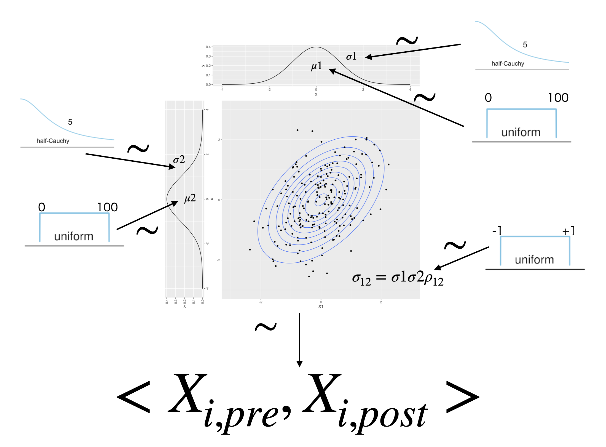
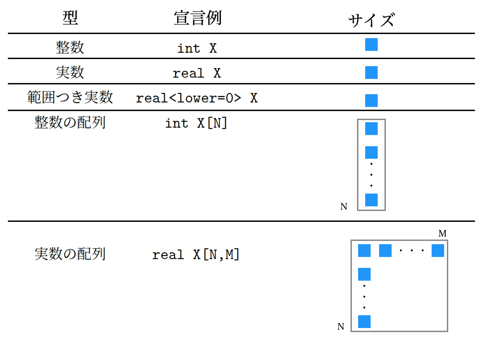
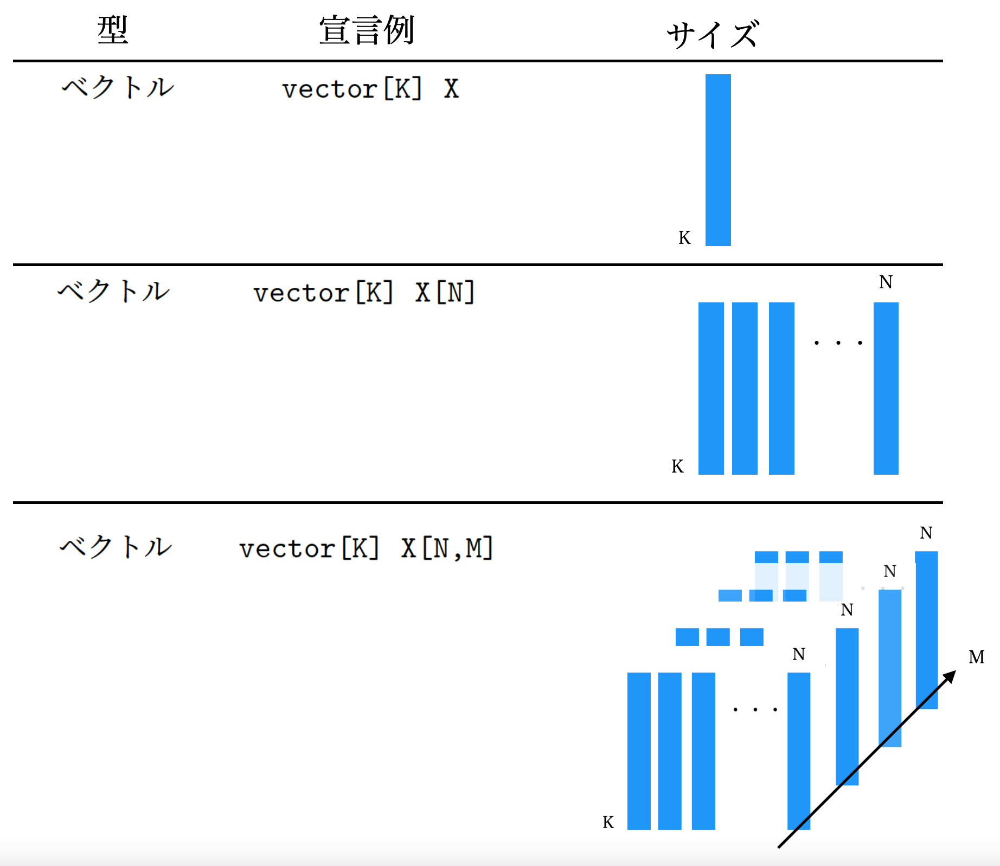
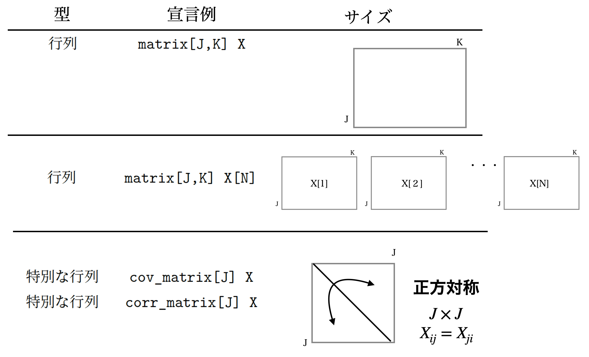
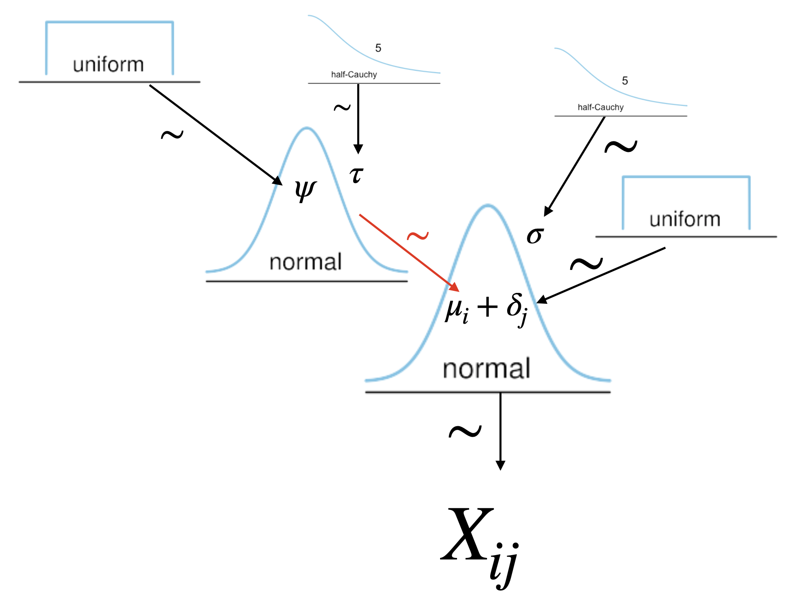

# モデリングの目から見た検定 4；対応のある群の比較 {#chapter22}

## 対応のある群

### 多次元正規分布

ここまでは**群間要因(Between
Design)**のモデリングをしてきましたが，今回は**群内要因(Within
Design)**のモデリング的アプローチになります。

Within モデルは別名として，**反復測定(Repeated
Measure)**と呼ばれることがあり，とくに二群の場合は**対応のある t 検定(Paired
t-test)**と言ったりします。同じ人から 2 回データを取って，その変化をみる**事前・事後デザイン(Pre-post
Design)**がその典型例です。2 回以上とる場合もあるので，その場合は反復測定とよばれるわけです。

この場合のデータ生成モデルは，何が違うのでしょうか。**群間要因**の t 検定は別名**独立した二群の**t 検定と呼ばれるように，2 つの群のデータがバラバラに出てきているのですが，今回は**対応のある二群**ですから，独立してないということになります。独立していない，つまり関係がある。データ分析上は，2 つのデータに相関がある場合を考える必要があります。同じ人の事前・事後のデータであれば，当然変化のもとになる「その人」という共通要因があるわけで，同じ人からデータを得ていますから当然相関していることを前提に考えなければなりません。

統計モデル上，独立した二群であれば別々の正規分布からデータが出てきていると考えますが，今回は 1 つの分布から 2 つのデータが出てきていることになります。ここで使うのは**二次元正規分布(Two-Dimensional
Norma
Distribution)**，さらに群の数が多い場合に一般化した**多次元正規分布(Multidimensional
Normal Distribution)**あるいは**多変量正規分布(Multivariate Normal
Distribution)**と呼ばれる分布を使います。この正規分布の特徴は，それぞれの変数(次元)に注目すれば正規分布なのですが，各次元に相関関係があることを組み込まなければなりません。

これまでの 1 次元の正規分布は，平均(位置)$\mu$と標準偏差(幅)$\sigma$で特徴付けられました。多次元の正規分布も，各次元について平均と標準偏差があります。平均も複数の次元のセットになっているので，平均ベクトル$\bm{\mu}$として表現することになります。標準偏差もベクトルで考える必要がありますし，さらに全ての組み合わせにおける相関関係がありますので，分散共分散行列$\bm{\Sigma}$を考えることになります。丁寧に数式で表現すると，1 次元正規分布に従う確率変数は次のように書きます。

$$X \sim Normal(\mu, \sigma)$$

これに対して多次元正規分布に従う確率変数ベクトル$\bm{X}$は次のように書きます。

$$\bm{X} \sim MultiNormal(\bm{\mu}, \bm{\Sigma})$$

この分散共分散行列の中身を見てみますと，次のようになっています。

$$
\bm{\Sigma} = \begin{pmatrix} \sigma_{1}^2 & \sigma_{12} & \cdots & \sigma_{1m} \\
                                \sigma_{21} & \sigma_2^2 & \cdots & \sigma_{2m} \\
                                \vdots & \vdots & \ddots & \vdots \\
                                \sigma_{m1} & \sigma_{m2} & \cdots & \sigma_{m}^2 \end{pmatrix}
$$

この行列の**対角(diagonal)**要素には分散$\sigma_j^2$があり，非対角要素には共分散$\sigma_{jk}$が入っている**正方対称行列**になっていますね[^1]。またこうしてみると，変数 j の分散$\sigma_j^2$は j と j の共分散，すなわち$\sigma_{jj}$であることもわかりやすいですね。ところでこれを考えることでどこに相関の要素が入っているのでしょう？改めて，分散や共分散，相関係数の定義式から考えてみたいと思います。

$$
\begin{aligned}
    \mbox{分散} &:& \sigma_{j}^2 = \frac{1}{n}\sum (x_{ij} -\bar{x_j})^2 \\
    \mbox{共分散} &:& \sigma_{jk} = \frac{1}{n}\sum (x_{ij} - \bar{x_j})(x_{ik} - \bar{x_k}) \\
    \mbox{相関} &:& \rho_{jk} = \frac{\sigma_{jk}}{\sigma_j\sigma_k} \end{aligned}
$$

この関係から逆に，共分散$\sigma_{jk}$は次のように表すことができます。

$$\sigma_{jk} = \sigma_j \sigma_k \rho_{kj}$$

ということで，共分散の式は分布の幅を表す標準偏差と，相関係数から出来上がっていることがわかりましたね。

### 対応のあるデータの生成モデル

ではこれを使ってモデルの設計図を書いてみましょう。設計図は図[1.1](#fig::22_01){reference-type="ref"
reference="fig::22_01"}のようになるでしょう。

::: center
{#fig::22_01
width="12cm"}
:::

あとはこれを使ってコードを書くだけです。
この時のポイントは，データの渡し方にあります。

### ベクトル型とマトリックス型

2 次元正規分布に従うデータは，必ず 2 つセットになっています。1 回の観測で 2 つの数字を持つものです。
これを Stan で表現するときには，変数を`vector`型で表現しておく必要があります。今回の場合は`vector[2] mu;`などとします。これで`mu`という変数が 2 つセットで準備されることになります。
これまで同じ変数名で複数のデータを持つ場合，たとえば`real mu[2]`のようにしていましたが，なぜ今回もこの形式，つまり**配列**にしないのか，と思われるかもしれません。配列でも 2 つの数字を扱ったりすることは可能なのですが，ベクトル型にしておく利点が別にあります。ベクトルにはベクトルを使った演算がありますが，Stan にはベクトルや行列専用の関数がありますので，変数をベクトルで宣言しておいてやるとこれらの関数を使って高速化できるのです。

また Stan には，`matrix`型という行列の型もあります。`matrix[N,M] X;`のように宣言してやると，サイズ$N \times M$の行列変数 X が 1 つ用意されます。`matrix[N,M] X[L];`のように宣言すると，サイズ$N \times M$の行列変数 X を L 個用意することになります。他にも特殊な型として，`cov_matrix`型とか`corr_matrix`型などがあります。これらは正方行列ですから，サイズの指定は 1 つでよく，たとえば`cov_matrix[2]`とすれば$2 \times 2$の正方行列を用意したことになります。Stan における変数や配列の型について，@松浦 201610 を参考にまとめたものを表[1.1](#tbl:22_01){reference-type="ref"
reference="tbl:22_01"}に，イメージ図を図[1.2](#fig:22_03){reference-type="ref"
reference="fig:22_03"},[1.3](#fig:22_04){reference-type="ref"
reference="fig:22_04"},[1.4](#fig:22_05){reference-type="ref"
reference="fig:22_05"}に示します。

::: {#tbl:22_01}
型の例 宣言例 解説

---

       整数            `int X`                            整数ひとつ
       実数            `real X`                           実数ひとつ

範囲つき実数 `real<lower=0> X` 0 より大きい数字の入る X
整数の配列 `int X[N]` N 個の整数
実数の配列 `real X[N,M]` $N\times M$個の実数からなる 2 次元配列
実数の配列 `real X[N,M,L]` $N\times M\times L$個の実数からなる 3 次元配列
ベクトル `vector[K] X` 長さ K のベクトルひとつ
ベクトル `vector[K] X[N]` 長さ K のベクトルが N 個
ベクトル `vector[K] X[N,M]` 長さ K のベクトルが$N\times M$個
行列 `matrix[J,K] X` サイズ$J\times K$の行列がひとつ
行列 `matrix[J,K] X[N]` サイズ$J\times K$の行列が N 個
特別な行列 `cov_matrix[J] X` サイズ$J\times J$の正方対称行列がひとつ
特別な行列 `corr_matrix[J] X` 対角が 1 のサイズ$J\times J$の正方対称行列がひとつ

: Stan の配列と型
:::

[\[tbl:22_01\]]{#tbl:22_01 label="tbl:22_01"}

{#fig:22_03
width="12cm"}

{#fig:22_04
width="12cm"}

{#fig:22_05
width="14cm"}

これを踏まえて，今回の対応のある二群のコード例を見てみましょう(Code::[\[stan::22_01\]](#stan::22_01){reference-type="ref"
reference="stan::22_01"})。

```{#stan::22_01 .c++ language="C++" label="stan::22_01" caption="対応ある二群のデータ生成モデル"}
data{
  int N;
  vector[2] X[N];
}

parameters{
  vector[2] mu;
  real<lower=0> sd1;
  real<lower=0> sd2;
  real<lower=-1,upper=1> rho;
}

transformed parameters{
  cov_matrix[2] SIG;
  SIG[1,1] = sd1 * sd1;
  SIG[1,2] = sd1 * sd2 * rho;
  SIG[2,1] = sd2 * sd1 * rho;
  SIG[2,2] = sd2 * sd2;
}

model{
  X ~ multi_normal(mu,SIG);
  //prior
  mu[1] ~ uniform(0,100);
  mu[2] ~ uniform(0,100);
  rho ~ uniform(-1,1);
  sd1 ~ cauchy(0,5);
  sd2 ~ cauchy(0,5);
}
```

##### コード解説

data ブロック

: サンプルサイズ N のデータですが，ペアになっている数字なので`vector[2]`で宣言した変数 X を N 個用意しています。

parameters ブロック

: パラメータとして，平均をベクトル，標準偏差や相関係数はスカラで宣言しています。標準偏差や相関係数の範囲指定にも注意してください。

transformed parameters ブロック

: 各標準偏差，相関係数を使って分散共分散行列 SIG を構成しています。わかりやすくするために，各要素について書き下して書いています。

model ブロック

: 尤度はデータベクトルが多次元正規分布関数`multi_normal`から出てきていることを示しています。多次元正規分布関数の引数は，ベクトルと行列です。

この書き方ですと，三群に拡張した時に大変になるのは目に見えていますね。こんな時のために，ベクトルと行列用関数をつかって書いておく方法があります。
Code::[\[stan::22_02\]](#stan::22_02){reference-type="ref"
reference="stan::22_02"}には，多次元にまで拡張したコードを示しています。

```{#stan::22_02 .c++ language="C++" label="stan::22_02" caption="コードの一般化"}
data{
  int N;
  int K;
  vector[K] X[N];
}

parameters{
  vector[K] mu;
  vector<lower=0>[K] sds;
  corr_matrix[K] rho;
}

transformed parameters{
  cov_matrix[K] SIG;
  SIG = quad_form_diag(rho,sds);
}

model{
  X ~ multi_normal(mu,SIG);
  //prior
  mu[1] ~ uniform(0,100);
  mu[2] ~ uniform(0,100);
  rho ~ lkj_corr(1);
  sds ~ cauchy(0,5);
}
```

##### コード解説

data ブロック

: データのサイズ K も外侮から指定できる変数とし，それを使ってサイズ K のベクトル X を N 個用意しています。

parameters ブロック

: パラメータとして，平均と標準偏差をベクトルで，相関係数も行列として宣言しました。標準偏差ベクトルの範囲指定の方法に注意してください。

transformed parameters ブロック

: Stan の関数`quad_form_diag`を使って分散共分散行列を作成しました。この関数は，正方行列$\bm{X}$とベクトル$\bm{v}$から，$diag(\bm{v}) \bm{X} diag(\bm{v})$という計算をするものです。ここで`diag`は k 個の要素を対角項に持つ$k \times k$の対角行列を作ることを意味します。今回の例で具体的に説明しましょう。ここでの正方行列は相関行列で，ベクトルは標準偏差を要素に持つ`sds`ですから，

$$
\begin{pmatrix}\sigma_1&0\\0&\sigma_2\end{pmatrix}\begin{pmatrix}1&\rho_{12}\\\rho_{12}&1\end{pmatrix}\begin{pmatrix}\sigma_1&0\\0&\sigma_2\end{pmatrix} =
        \begin{pmatrix} \sigma_1 & \sigma_1\rho_{12}\\ \sigma_2\rho_{12} & \sigma_2\end{pmatrix}\begin{pmatrix}\sigma_1 & 0\\ 0 & \sigma_2\end{pmatrix} =
        \begin{pmatrix}\sigma_1^2 & \sigma_1\sigma_2\rho_{12} \\ \sigma_1\sigma_2\rho_{12} & \sigma_2^2\end{pmatrix}
$$

となり，分散共分散行列が構成されていることがわかりますね。

model ブロック

: 注目すべきポイントは相関行列の事前分布です。相関行列の事前分布には，Stan では`lkj_corr`という関数を使うのが一般的で，この引数が 1 になっているのは無情報分布であることを意味しています。

このコードで推定される平均値，`mu`ベクトルの 2 つの要素が，事前・事後の平均値に該当します。ですからこの差分を計算すれば「平均的にどれぐらい変化があったか」という**平均因果効果**を見積もったことになります。この差分については，**生成量**のブロックで算出しても構いません。もちろんその差分から標準化した効果の大きさを算出することもできますし，パラメータについての仮説，事後予測などデータについての仮説など，様々に検証できることはこれまでの通りです。

## ID をもったデータ構造

さてでは今回の乱数生成機の精度を検証するために，パラメータリカバリをしてみましょう。

仮想データの作り方は，データ生成モデルの裏返しです。2 群の平均値差を検証するためのデータでしたら，次のようにして作ることができます。

```{#code::22_03 .c++ language="c++" label="code::22_03" caption="対応ある二群の仮想データ"}
mu <- c(50,50)
sd1 <- 10
sd2 <- 5
rho <- 0.7
SIG <- matrix(ncol=2,nrow=2)
SIG[1,1] <- sd1 * sd1
SIG[2,2] <- sd2 * sd2
SIG[1,2] <- sd1 * sd2 * rho
SIG[2,1] <- sd1 * sd2 * rho
N <- 100
library(MASS)
X <- mvrnorm(N,mu,SIG)
# Stanに与えるデータセット
dataSet <- list(N=N, X=X)
```

ここでは二群の平均をいずれも 50，標準偏差を 10 と 5 にし，相関係数を 0.7 としたサンプルを 100 個作ることにしました。発生させる乱数は`MASS`パッケージの`mvrnorm`関数を使います。この関数は，発生させるサンプルサイズと，平均ベクトル，分散共分散行列を引数に取ります。これを使って推定させた結果の例が[\[SCrstan:out22_01\]](#SCrstan:out22_01){reference-type="ref"
reference="SCrstan:out22_01"}になります。

::: SCrstan
MCMC の結果出力 out22_01

     variable    mean  median    sd   mad      q5     q95 rhat ess_bulk ess_tail
     lp__     -455.32 -455.00  1.59  1.43 -458.38 -453.38 1.00     9279    13139
     mu[1]      49.77   49.77  0.99  0.98   48.14   51.39 1.00    12611    13820
     mu[2]      50.14   50.13  0.50  0.50   49.31   50.97 1.00    13346    13980
     sd1         9.78    9.74  0.69  0.69    8.71   10.99 1.00    14092    13430
     sd2         4.98    4.96  0.35  0.34    4.44    5.60 1.00    13651    13238
     rho         0.69    0.69  0.05  0.05    0.59    0.77 1.00    14525    13920
     SIG[1,1]   96.09   94.77 13.77 13.40   75.89  120.73 1.00    14092    13430
     SIG[2,1]   33.79   33.27  6.00  5.87   24.95   44.44 1.00    11555    10843
     SIG[1,2]   33.79   33.27  6.00  5.87   24.95   44.44 1.00    11555    10843
     SIG[2,2]   24.96   24.62  3.57  3.41   19.72   31.37 1.00    13651    13238

:::

中央値による点推定値(MED 推定値)を見ると，ほぼ真の値の通りになっていますね。

ところで，今回与えたデータ X は行列の形をしています。一行が 2 つの数字を持つペアになっているのですが，これは**整然データ**の形にはなっていませんね。
整然データであれば，次のようなデータセットになっているはずです(R の出力[\[RS:out22_01\]](#RS:out22_01){reference-type="ref"
reference="RS:out22_01"})。

::: Rscreen
対応ある二群の仮想データ・整然版 out22_01

    # A tibble: 200 × 3
          ID name  value
       <int> <chr> <dbl>
     1     1 pre    45.1
     2     1 post   45.8
     3     2 pre    45.1
     4     2 post   51.2
     5     3 pre    52.4
     6     3 post   53.7
     7     4 pre    46.8
     8     4 post   48.6
     9     5 pre    45.5
    ...

:::

このようなデータ形式に対応できるように，Stan のコードを書き直してみましょう。ポイントは，個体識別インデックスと，事前・事後を表す変数のインデックスの両方を準備する，というところにあります。

まず R から与えるデータの方から考えましょう。整然データの形に並び替えるのに加えて，事前・事後といった水準を表す変数も数字で与えなければなりません。先の例 Code::[\[code::22_04\]](#code::22_04){reference-type="ref"
reference="code::22_04"}では`pre`,`post`となっていたところを，pre=1,post=2 と置き換えた別の変数を用意しました。

```{#code::22_04 .c++ language="c++" label="code::22_04" caption="対応ある二群の仮想データ・整然版"}
...
X <- mvrnorm(N, mu, SIG)
tidy_data <- X %>%
  as.data.frame() %>%  as_tibble() %>%
  rename(pre = V1, post = V2) %>%
  rowid_to_column("ID") %>%
  pivot_longer(-ID) %>%
  mutate(cond = if_else(name == "pre", 1, 2))
```

##### コード解説

2 行目

: 真値の設定をして，行列 X を作っています。

3 行目

: X を加工して，`tidy_data`という変数に作り替えます。加工のプロセスは下記の通りです。

4 行目

: `data.frame`型を経て`tibble`型に変形します[^2]。

5 行目

: この段階で，変数名が`V1,V2`となっていますが，わかりやすくするために`pre,post`に書き換えました。

6 行目

: 行番号を`ID`という変数名を持つものに変えています。

7 行目

: `ID`をキーに，横長だったデータを縦長に(tidy に)変換する関数です。

8 行目

: 縦長になった変数(Code::[\[code::22_04\]](#code::22_04){reference-type="ref"
reference="code::22_04"}はこの段階の出力です)から，`name`変数の値が`pre`であるものを 1 に，そうでないものを 2 にした新しい変数`cond`を作りました。

このコードでどういうデータセットができたのか，R のコンソールで`tidy_data`として確認すると良いでしょう。1 つ 1 つのステップを確認したい場合は，途中で止めて一歩ずつ進むのも手です。

さて Stan にデータセットを与えるときは，このデータセットから 1.データ全体の長さ，2.被験者の数，3.被験者 ID，4.そのデータがどの水準なのかを示す識別子，5.実際の値を取り出して渡すことになります。
続いて Stan コードの例を見てみましょう。

```{#stan::22_03 .c++ language="C++" label="stan::22_03" caption="整然データ対応番"}
data{
  int L;
  int N;
  int<lower=0,upper=N> IDindex[L];
  int<lower=1,upper=2> Condition[L];
  real val[L];
}

transformed data{
  vector[2] pairX[N];
  for(l in 1:L){
    pairX[IDindex[l],Condition[l]] = val[l];
  }
}
...(中略)...
model{
  pairX ~ multi_normal(mu,SIG);
  //prior
  mu[1] ~ uniform(0,100);
  mu[2] ~ uniform(0,100);
  rho ~ uniform(-1,1);
  sd1 ~ cauchy(0,5);
  sd2 ~ cauchy(0,5);
}
```

##### コード解説

data ブロック

: 1.データ全体の長さ`L`，2.被験者の数`N`，3.被験者 ID`IDindex`，4.そのデータがどの水準なのかを示す識別子`Condition`，5.実際の値`val`を与えています。最後の 3 つはデータ長と同じサイズです。

transformed data ブロック

: データを変形する`transformed data`ブロックの登場です。ここではペアとしての情報がある`vector`型にした変数を作っています。その変数`pairX`は，N 人分の情報があり，それぞれ要素番号 1,2 がベクトルの要素に対応しています。ここでも入れ子になった識別子を使っていて，`pairX[IDindex[l],Condition[l]]`は l 行目の個人`IDindex[l]`，l 行目の条件`Condition[l]`から，たとえば
`IDindex[l]＝15`，`Condition[l]=2`であれば 15 番目の人の事後の値`pairX[15,2]`を値として代入する，ということをしています。

model ブロック

: 作った`pairedX`というベクトルに対して多次元正規分布からのデータを与えています。

少しややこしくなったように思えますが，データの構造が複雑化すると整然データの方がスッキリすることの方が一般的です。コードをよく読んで，どのような動きをするのかイメージをしっかり掴むようにしましょう。

## 個人差と変化量のモデルへ

さて，コードは随分と複雑になってきましたが，やっていることは「事前・事後で変化はあるか」ということだけです。それなのに多次元正規分布が出てくるなんて，面倒ですねえ！
もう少し簡単な表現はできないものでしょうか。たとえば事前+効果=事後のように。

もちろん可能です。むしろその方が自然なモデリングと言えるかもしれないですね。ただその時，事前・事後が同一人物であることを忘れてはいけません。小杉の事前の状態+効果=山田の事後の状態，では意味がわからないからです。
記号を使って書くと，$X_i^{pre}+effect = X_i^{post}$のように，添字$i$で同じ個人であることを明記しておく必要があります。

これを踏まえて，少し話を拡張した 3 水準モデルを考えてみましょう。たとえば次のようなカバーストーリーはいかがでしょう。

> 臨床心理学者がある介入法をつかってメンタルケアに取り組んでいます。
> 4 人のクライアントにこの手法を適用し，抑うつ度が改善されていくかどうかチェックし，この介入法に効果があるのかどうかを検証したいと思っています。

::: {#tbl::22_02}
ID 1 期 2 期 3 期

---

1 10 5 9
2 9 4 5
3 4 2 3
4 7 3 5

: 介入時期とスコアの推移
:::

[\[tbl::22_02\]]{#tbl::22_02 label="tbl::22_02"}

チェックの結果が表[\[tbl:22_02\]](#tbl:22_02){reference-type="ref"
reference="tbl:22*02"}のようになっていて，ここの数字が抑うつ度スコア(低ければ低いほど健康)だと思ってください。
記号で書く時のノーテーション(表記法)は，値$X*{ij}$が$i$さんの第$j$期のスコア，ということにしたいと思います。

これを使って毎回の変化の大きさを見積もりたいと思います。前回やった，多水準モデルのことを参考に見ていきましょう。ポイントは，前回は全体平均からの差分で効果を考えていたところが，今回は個人差があるので個人ごとの平均$\mu_i$を基準におくところです。

最初の人のスコア，$X_{11}=10,X_{12}=5,X_{13}=9$はそれぞれ，その人の平均$\mu_i$から考えて，$\mu_1+\delta_1,\mu_1+\delta_2,\mu_1+\delta_3$となるはずだと考えましょう。理論通りにならない誤差を含めて考えれば，先ほどの表[1.2](#tbl::22_02){reference-type="ref"
reference="tbl::22_02"}は表[\[tbl:22_03\]](#tbl:22_03){reference-type="ref"
reference="tbl:22_03"}のようになっているはずなのです。

::: {#tbl::22_03}
ID 1 期 2 期 3 期

---

1 $X_{11}\sim N(\mu_1+\delta_1,\sigma)$ $X_{12}\sim N(\mu_1+\delta_2,\sigma)$ $X_{13}\sim N(\mu_1+\delta_3,\sigma)$
2 $X_{21}\sim N(\mu_2+\delta_1,\sigma)$ $X_{22}\sim N(\mu_2+\delta_2,\sigma)$ $X_{23}\sim N(\mu_2+\delta_3,\sigma)$
3 $X_{31}\sim N(\mu_3+\delta_1,\sigma)$ $X_{32}\sim N(\mu_3+\delta_2,\sigma)$ $X_{33}\sim N(\mu_3+\delta_3,\sigma)$
4 $X_{41}\sim N(\mu_4+\delta_1,\sigma)$ $X_{42}\sim N(\mu_4+\delta_2,\sigma)$ $X_{43}\sim N(\mu_4+\delta_3,\sigma)$

: 介入時期とスコアのモデル式
:::

[\[tbl::22_03\]]{#tbl::22_03 label="tbl::22_03"}

つまり，$X_{ij}\sim N(\mu_i+\delta_j,\sigma)$ですね。個人のベースライン$\mu_i$に，各時期の効果$\delta_j$が加わったものを中心に，正規分布に従う誤差を纏ってデータになる，という考え方です。
ただしここでも注意が必要で，パラメータがいろいろありますが，効果は相対的なもの，すなわち$\delta_1+\delta_2+\delta_3=0$という総和ゼロの制約を考える必要があります。実質的には自由度 2，すなわち$\delta_3=0-(\delta_1+\delta_2)$となることを忘れないでください。

そしてもう 1 つ大事なことが。$\mu_i$は人によって違う個人差成分ですが，この散らばりも正規分布に従うものとして考えることができますね。すなわち平均と散らばりをもった集合体が従う分布としての正規分布です。この平均を$\psi$，標準偏差を$\tau$として[^3]，

$$\mu_i \sim N(\psi,\tau)$$

と考えることにしましょう。これを設計図に書き込んだのが，図[1.5](#fig::22_02){reference-type="ref"
reference="fig::22_02"}です。

::: center
{#fig::22_02
width="12cm"}
:::

このように，相関があることを個人$i$に紐づけられた変数として表現し，個人差からの差分として対応のあるモデルを考えることができます。
ここで，個人差に関係なく影響を与えている効果のことを**固定効果(Fixed
Effect)**と呼び，個人差のように交換可能な要素のことを**変量効果(Random
Effect)**と呼びます。またず[1.5](#fig::22_02){reference-type="ref"
reference="fig::22_02"}に示されているように，データ生成分布の中に個人差の分布が入れ子になって含まれていますね。このようなデータは階層モデルといい，とくに今回のように線形な階層モデルは**階層線形モデル(Hierarchical
Linear
Model)**とよばれます。この展開については，次回以降にお話しすることになるでしょう。

ではこのモデルを実装していきましょう。設計図に沿えば Stan コードは書けるはずです。ここには Stan に与える R のコード例を用意しましたので，自分なりのコードを書いて検証してみてください[^4]。

```{#code::22_03 .c++ language="C++" label="code::22_03" caption="整然データ対応番"}
dat_raw <- data.frame(ID = 1:4,
                      period1 = c(10,9,4,7),
                      period2 = c(5,4,2,3),
                      period3 = c(9,5,3,5))
# 整然データにする
tidy_dat <- dat_raw %>%
  pivot_longer(-ID) %>%
  mutate(name = as.factor(name) %>% fct_relevel("period1","period2")) %>%
  mutate(cond = as.numeric(name))
```

## 課題

Code::[\[code::22_03\]](#code::22_03){reference-type="ref"
reference="code::22_03"}を参考にしながら，表[1.2](#tbl::22_02){reference-type="ref"
reference="tbl::22_02"}の事例を検証するための Stan コードを書いてください。作った Stan ファイルや R コードを提出してください。

[^1]:
    これら行列の要素や名称については，第[\[chapter6\]](#chapter6){reference-type="ref"
    reference="chapter6"}章でやったことを思い出してください。

[^2]: `tibble`型にする必要は別にありません。著者の趣味です。`tibble`型は`data.frame`型の拡張版で表示した時に変数の型などがわかりやすいという利点があります。`matrix`型からいきなり`tibble`型に変更すると警告が出るので，一旦`data.frame`型を経由しました。
[^3]: $\psi$はギリシア文字でプサイと読みます。$\tau$も同じくギリシア文字でタウと読みます。
[^4]: これに限らず，コードに正しい書き方はありません。自分なりの書き方で結構です。判断すべきは正しく機能するかどうかであって，書き方はあくまでも一例にすぎません。
