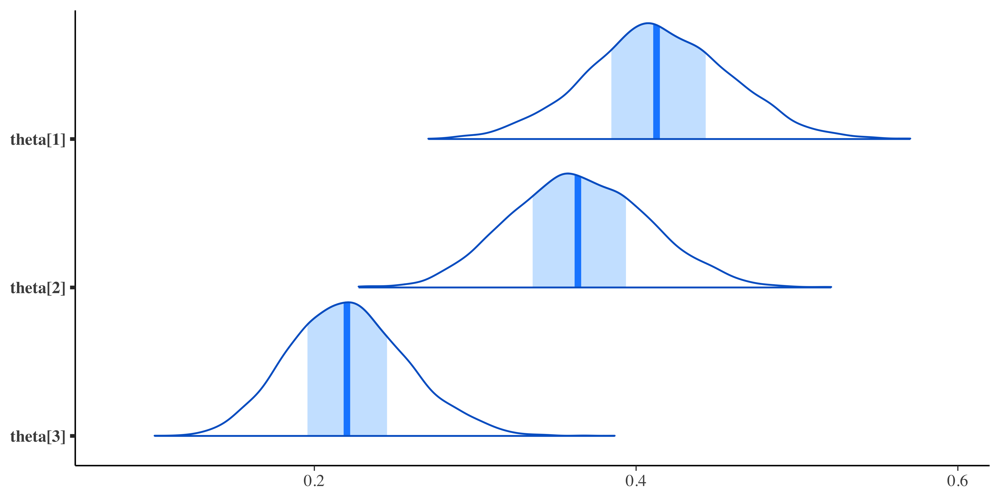
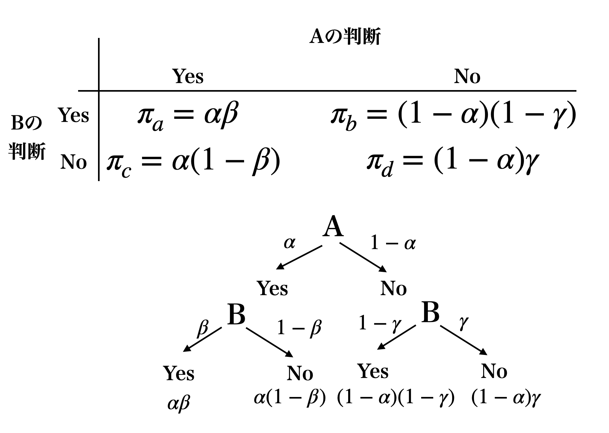

# モデリングの目から見た検定 5；カテゴリカル分布をつかって {#chapter23}

ここまで様々なモデルを使って，パラメータ間あるいはデータの間の差を検討するということを考えてきました。ここで差分を計算できているということは，数値が**連続的**であったということもできます。いいかるならば，**間隔尺度水準**以上の尺度水準で得られたデータに対する検証だったわけです。

ところがデータの種類によっては**順序尺度水準**や**名義尺度水準**でしか得られないこともあります。試験に合格したのか，失敗したのか。男性か，女性か。47 都道府県のどこ出身なのか。あるいはたとえば，正解率や成功率，相対的な比率などでデータが現されたり考えたりすることもあります。比率は連続的な数字ではありますが，$\frac{X}{Y}$のように数え上げによる度数の比較ですから，元は**離散的**な，質や種類を区別するための数字による(度数に該当するかどうか)情報だと言えるでしょう。たとえば比率のデータに対して t 検定のような分析をするのは適切ではなく[^1]，カテゴリカルな分布を考えて検証する必要があります。

また，複数のカテゴリカル変数の組み合わせによって**クロス集計表(cross-tabulation
table)**あるいは**分割表(contingency
table)**を利用することもあります。男性の X 割が A 党に，女性の Y 割が B 党に投票した，といった表は，性別$\times$支持政党のクロス集計表ですが，これを見ることで性別による支持政党の偏りがあるのかないのか，といったことがわかります。クロス集計表は社会科学的なデータにも多く見られ，カテゴリカルな性質の組み合わせについての情報を提供してくれます。この組み合わせに偏りがあるのかないのか，と言ったことを考える際にも，確率モデルとしてはカテゴリカルな分布を必要とします。

## 離散的な分布 {#DiscreteDistibutions}

それでは代表的な離散変数についての確率分布を見ていきましょう。離散分布の場合，確率関数は密度 density ではなく，質量 mass，つまり**確率質量関数(Probability
Mass
Function)**と呼ばれることに注意してください。カテゴリーの中に含まれるかどうか，どれぐらいの量がそこに含まれているかということを直接表しているからです。

##### ベルヌーイ分布

離散的な分布の基本は**ベルヌーイ分布(Bernoulli
Distribution)**です。この分布から出てくる数字は 0 か 1 であり，確率$\theta$で 1 が，$1-\theta$で 0 が出る分布です。たった 2 つの状態しか区分しませんが，正答と誤答，賛成と反対，男性と女性，生と死など様々なもののメタファーとして利用できるため，応用範囲はむしろ広いと言えるでしょう。パラメータは$\theta$ひとつですので，わかりやすいですね。Stan での関数は`bernoulli`と書き[^2]で，`y ~ bernoulli(theta);`
のように使います。

今後出てくることになりますが，ロジスティック関数と組み合わせて使うことが多い分布です。ロジスティック関数は，連続的な数字を 0 から 1 の範囲に変換する関数で，変換したものをベルヌーイ分布のパラメータにする合わせ技が非常に便利だからです。たとえば学力などは正規分布すると考えられ，$-\infty$から$\infty$の値を取りうることになりますが，その能力を反映してテストに正答するか誤答するか，ということを考えると学力$\theta$をロジスティック関数にいれた($logistic(\theta)$)ものをベルヌーイ分布にいれる(`X ~ bernoulli(logistic(theta))`)からです。この合わせ技はよく使われるので，Stan では`bernoulli_logit`という関数があるほどです。

##### 二項分布

パラメータ$\theta$をもつベルヌーイ分布に従うコイントスを$N$回やったときに，何回表が出るか，というときに使うのが**二項分布(Binomial
Distribution)**です。10 問中何問正解するかとか，N 個提示した刺激のうち覚えていたのはいくつかとか，N 回シュートして入ったのは何回かといった，割合や比率に関係する分布です。パラメータは$N$と$\theta$の 2 つあり，Stan での関数は`binomial`です。`y ~ binomial(N, theta);`のように書きます。

##### カテゴリカル分布

ベルヌーイ分布や二項分布はコイントスの「表」のことしか考えていませんでした(裏は「表ではない」という考え方)。これに対してカテゴリカル分布はサイコロの出目のように，1,2,3,4,5,6 のどれが出るか，という多段階の乱数発生を考える分布です。こん関数のパラメータはサイズ$K$のベクトルで，たとえばサイコロの場合は$\bm{\theta}=(1/6,1/6,1/6,1/6,1/6,1/6)$のようになります。Stan での関数は`categorical`と書き，使う時は`y ~ categorical(theta);`のようにします。このとき`theta`はベクトルで宣言されていなければなりません。

##### 多項分布

カテゴリカル分布と似ているようですが，この分布は$N$回サイコロを降った時の各出目の回数であり，1 が$k_1$回，2 が$k_2$回，$\cdots$，6 が$k_6$回出た，というようにカウントしたものを出力します。ABO 型の血液分類で，サンプルの中に A 型が何人，B 型が何人・・というときに，この母比率を推定する時は多項分布のパラメータを推定する，ということになります。二項分布の多変量版だと考えてもいいかもしれません[@松浦 201610]。この分布に与えるパラメータはベクトル$\bm{\theta}$であり，Stan では`y ~ multinomial(theta);`のように使います。総数 N はデータベクトル$\bm{y}$の要素の総和($N=\sum_{i=1}^K y_i$)ですから指定しなくても構いません。ここで注意すべきは，`theta`はサイズ K のベクトルであり，全ての要素を足し合わせると 1 になる必要があります。Stan では合計 1 のベクトル専用の型があり，それは`simplex`と呼ばれます。

## $\chi^2$検定

カテゴリカルなデータ，度数分布などをどうやって研究の時に使うのか，具体的な例とともに見ていきましょう。ベイズ推定の話に入る前に，帰無仮説検定の話から先に考えてみたいと思います。

表[1.1](#tbl:23_01){reference-type="ref"
reference="tbl:23_01"}には，3 つの携帯電話キャリアのユーザ数をとある大学で調査した例です。合計 123 名から回答を得て，それぞれ 51 名，45 名，27 名ということが判明しました。

::: {#tbl:23_01}
キャリア A 社 D 社 S 社 合計

---

観測度数 51 45 27 123
期待度数 41 41 41

: 携帯キャリア調査
:::

[\[tbl:23_01\]]{#tbl:23_01 label="tbl:23_01"}

これを見て「A 社は多いね，学生人気だね」などと解釈してもいいのですが，これでは推測統計学の域を出ていませんね。違うサンプルを対象にすれば違う度数になる可能性があるからです。そこで推測統計学的な発想をします。

ここで検証したいのは「どこかのカテゴリが多く，どこかのカテゴリは少ない」，つまり「散らばりに偏りがある」ということです。
逆に考えると帰無仮説が出てきます。つまり「散らばりに偏りはない」が帰無仮説であり，対立仮説は「偏りがある」ということになります。
散らばりに偏りがない，という帰無仮説の世界の元では，期待度数は総数を均等に割った値になるはずです。表[1.1](#tbl:23_01){reference-type="ref"
reference="tbl:23_01"}には**期待度数(Expected
frequency)**という行を設けました。ちなみに得られたデータそのものは**観測度数(Observerd
frequency)**と言います。

今回のデータが帰無仮説の元ではどれぐらいあり得ない数字だったのでしょうか。これを考えるために，$\chi^2$値を計算します。$\chi$はギリシア文字のカイであり，$x$(エックス)とは違うので注意してください。$\chi^2$値はカイと読みます。この値は次のように計算します。

$$\chi^2 = \sum \frac{(O_i - E_i)^2}{E_i}$$

ここで$\O_i$は観測度数，$E_i$は期待度数です。今回の場合は次のような数字になります。

$$\chi^2 = \frac{(51-41)^2}{41} + \frac{(45-41)^2}{41} + \frac{(27-41)^2}{41} = 2.439+0.390+4.780=7.609$$

計算式から明らかなように，期待度数からのずれの大きさを表現していますから，期待通り＝帰無仮説通りであればこの値は 0 になります。
今回は$\chi^2=7.609$ですが，この統計量がどれぐらい出てきやすいかということは，自由度 2 の$\chi^2$分布をつかって検証できます。ここでの自由度は選択カテゴリ数$-1$です[^3]。自由度 2 の$\chi^2$分布から 7.609 という実現値が出てくる確率は$p=0.022$で 5%より小さいですから[^4]，統計的に有意な偏りがある，と判断できます。

$\chi^2$は偏りを検証するための数字です。今回は均等である，という帰無仮説から算出しましたが，母集団比率が事前にわかっているのであればそれを用いて，手元のサンプルがどれぐらい偏っているかを検証するということも可能です。たとえば日本人の血液型はおよそ A 型が 40%，O 型 30%，B 型 20%，AB 型 10％といわれていますから，期待度数をこの比率で割り振るとサンプルが偏っていたかどうかの検証になります[^5]。他にも(比率によらず)理論的な度数がわかっていることがあれば，どれぐらい合致しているかを検証できます[^6]。

また同様のロジックで，クロス集計表の検定を行うこともできます。クロス集計表の場合は**独立性の検定**と呼ばれることもあります。偏りがあれば関係がある，独立ではないということですね。

例として，表[1.2](#tbl:23_02){reference-type="ref"
reference="tbl:23_02"}には，先ほどの携帯キャリア調査の結果に男女の区別もつけてみました。これを見て「男性は D 社が好きで，女性は A 社が好き」といった偏りがあると判断できるかどうかを検証できます。

::: {#tbl:23_02}
キャリア A 社 D 社 S 社 合計

---

     男性      21     30     13     49
     女性      30     15     14     74
     合計      51     45     27    123

: 携帯キャリア調査と性別の関係
:::

[\[tbl:23_02\]]{#tbl:23_02 label="tbl:23_02"}

各セルの期待度数は行の周辺度数$\times$列の周辺度数$\div$総度数で計算でき，各観測度数から期待度数を引いて二乗したものを，さらに期待度数で割ったものを足し合わせることで$\chi^2$にするのは同じです。これが(行の数$-1$)$\times$(列の数$-1$)の自由度をもつ$\chi^2$分布に従いますので，今回は$\chi^2=6.4326,df=2,p=0.0401$であることから有意(に偏っている)，と判断できます[^7]。これは**分散分析**の時と同様に，どこかに偏りがあるという全体的な傾向を示しただけであることに注意が必要です。

このようにして度数の検定を行うことができます。これに対して，データ生成メカニズムを考える場合は，ある比率に沿って度数が出てきていると考えますから，もっと直接的に母比率の検定を考えることができますし，MCMC によるアプローチを使うと「どこが，どの程度大きいと言えるか」，といったことについても検証できます。次にその方法を見ていきましょう。

## カテゴリカル分布のモデリング

ではまず，表[1.1](#tbl:23_01){reference-type="ref"
reference="tbl:23_01"}にあげた携帯キャリア調査の結果を，データ生成モデルから考えてみましょう。
設計図にするまででもない感じで，51:45:27 というデータの比率から考えられる，母比率ベクトル$\bm{\pi} = \{ \pi_1,\pi_2,\pi_3 \}$を考え，そこからデータベクトル$\bm{y}$が多項分布に従って出てくる，と考えるわけです。

Stan のコードは Code::[\[stan::23_01\]](#stan::23_01){reference-type="ref"
reference="stan::23_01"}のようになります。ポイントは特殊なベクトル`simplex`で$\bm{\pi}$を宣言しているところでしょうか。またデータベクトルは`vector[K] X;`としたいところですが，モデルからいってここは`int`型である必要があり，型指定をしたベクトルというのがないので，配列にしました。

```{#stan::23_01 .c++ language="C++" label="stan::23_01" caption="多項分布からのデータ生成モデル"}
data{
    int K;
    int X[K];
}

parameters{
    simplex[K] pi;
}

model{
    X ~ multinomial(pi);
}
```

これを次のような R コードで実行してみましょう(Code:[\[code::22_01\]](#code::22_01){reference-type="ref"
reference="code::22_01"})

```{#code::22_01 .c++ language="c++" label="code::22_01" caption="多項分布のパラメータ推定"}
# rstanの場合
model <- rstan::stan_model("categorical1.stan")
fit <- sampling(model,
  data = list(K = 3, X = c(51, 45, 27))
)
# cmdstanrの場合
model <- cmdstanr::cmdstan_model("categorical1.stan")
fit <- model$sample(
  data = list(K = 3, X = c(51, 45, 27)),
  chains = 4,
  parallel_chains = 4,
  refresh = 500
)
```

構造も何もないモデルですから，推定はすぐに終わると思います。$51:45:27 = 0.4146:0.3658:0.2195$ですから，ほぼ標本分布と同じような形で事後分布が推定されました(図[1.1](#fig::23_01){reference-type="ref"
reference="fig::23_01"})。

::: center
{#fig::23_01
width="12cm"}
:::

これで終わり，といったらそれまでなのですが，仮説検定のように考えてみましょう。三社それぞれが均等に選ばれている，つまり$\pi_1=\pi_2=\pi_3$というのはあり得そうにないですが(ピッタリ一致するはずはない)，たとえば

- A 社よりも D 社の方が好まれている

- S 社よりも D 社の方が好まれている

- D 社が最も好まれている

といった仮説は生成量を使って検証できそうです。1 つ目は$\pi_1 > \pi_2$，2 つ目は$\pi_2 > \pi_3$が成立する割合から考えれば良いからです。
3 つ目の仮説はこの 2 つと同じじゃないか，と思うかもしれませんが，正確には$\pi_2 > \pi_1$かつ$\pi_2>\pi_3$という両方の可能性が成立していること，と考える必要があります。こうした「A かつ B」のような命題は**連言命題**といいます。

これを検証する生成量の作り方は，次のようになります。他にもいろいろ考えられそうですね。

```{#stan::23_02 .c++ language="C++" label="stan::23_02" caption="多項分布からのデータ生成モデル"}
...前略...
generated quantities{
    int<lower=0,upper=1> FLG1;
    int<lower=0,upper=1> FLG2;
    int<lower=0,upper=1> FLG3;

    if(pi[1] > pi[2]){ FLG1 = 1; } else { FLG1 = 0; }
    if(pi[2] > pi[3]){ FLG2 = 1; } else { FLG2 = 0; }
    if(pi[2] > pi[1] && pi[2] > pi[3]){ FLG3 = 1; } else { FLG3 = 0; }
}
```

### 対応のない二変数の場合

続いてクロス表の検定に行きましょう。表[1.2](#tbl:23_02){reference-type="ref"
reference="tbl:23_02"}にあるように，携帯キャリアの選び方と性別の関係をみたいと思います。
男性と女性は独立したカテゴリですから，先ほどの多項分布モデルが 2 つ同時にあることと同じです。

男性は 21:30:13 という観測度数が得られていますが，これは$\bm{\pi_M} = c(\pi_1^M,\pi_2^M,\pi_3^M)$という母比率を持っており，また女性は 30:15:14 という観測度数から，$\bm{\pi_F} = c(\pi_1^F,\pi_2^F,\pi_3^F)$という母比率だったのではないか，と推測することになります。

「男性と女性とで携帯キャリアの選択率に違いがあるか」ということが検証したい命題になるかと思いますが，何を持って違いがあるとするか，ということを厳密に考えて生成量を作らなければなりません。たとえば，

- 男性は女性よりも A 社を好む$\to \pi_1^M > \pi_1^F$

- S 社は女性の方が多く選んでいる$\to \pi_3^M < \pi_3^F$

- 男性は D 社が一番好きで女性は A 社が一番好き$\to \pi_2^M > \pi_1^M$
  かつ$\pi_2^M > \pi_3^M$かつ$\pi_1^F > \pi_2^F$かつ$\pi_1^F > \pi_3^F$

というように考えられます。とくに 3 番目の命題は，「一番好き」というのを「他のどの群と比べても大きいという条件が同時に成り立っている」と考える必要がありますし，「男性は・・・で，女性は・・・」というときの「で」を論理的には「かつ」，確率的には「同時に」という意味で捉えないといけないところがポイントです。

このように，生成変数を使うとさまざまな仮説を検証することが可能です。集計表に関するデータは，官公庁が公開しているものなどを含め，身の回りのさまざまなところで目にできます。これらの資料を見た時に，標本統計量だけでなく母比率にまで思いを馳せて，検証可能な仮説を色々考えてみると良いでしょう[^8]。

ところでこの生成量を使った連言命題の検証については，今回のデータから考えられる事後分布に依存していることを忘れないようにしてください。今回のデータから言える「命題が成立する確率」は，事前分布とデータに基づいている結果ですから，「仮説が正しい確率」とまで言い切るのは危険です。あくまでもモデルに基づく推定であることを忘れないようにしましょう。

## $\kappa$係数の算出

先ほどのクロス集表の例では，男性と女性という独立した群から作られていましたので，2 つの母集団を別々に考えることができました。しかしたとえば，「法案 A,B それぞれに対して賛成か反対か」といった調査をした場合には，「A にも B にも賛成」「A には賛成，B には反対」「A には反対，B には賛成」「A にも B にも反対」という$2\times 2$のクロス集計表が得られますが，これは一人の人間が 2 つの質問に答えていますので**対応のある**データになります。対応のあるデータの場合は，先ほどと同じように独立した確率分布を考えるわけには行きません。

また「ある病院にいったら健康だと診断されたが，別の病院に行ったら異常が発見された」とか，「ある専門家の見立てでは問題のある行動といわれたが，別の専門家の見立てでは問題ないといわれた」，「ある映像を見て判断する課題で，審査者 A と B の判断が一致したりしなかったりする」といったシーンを考えてみてください。これらのシーンでは，$2\times2$のクロス集計表が表[1.3](#tbl:23_03){reference-type="ref"
reference="tbl:23_03"}のようになっていると考えられます。ここでは Yes/No としてありますが，Hit/Miss でも健康/異常でもいいのですが，ともかく 2 つの判断が合致したかどうか，ということが問題になるシーンです。

::: {#tbl:23_03}
A

---

             Yes   No

B Yes a c  
 No b d  
 n

: 対応のあるカテゴリ判断
:::

[\[tbl:23_03\]]{#tbl:23_03 label="tbl:23_03"}

このような時も，行と列の判断が独立しているとは言えません。むしろどの程度重複しているかのほうが問題になるわけです。こういったときは，判断が一致した程度を**カッパ係数(kappa
coefficient)**で表現できます[^9]。この係数は，観測された一致度，すなわち
$$p_o = \frac{( a + d )}{n}$$ と，偶然の一致度
$$p_e = \frac{(a+b)}{n}\frac{(a+c)}{n} + \frac{(b+d)}{n}\frac{(c+d)}{n} = \frac{(a+b)(a+c)+(b+d)(c+d)}{n^2}$$
から，次のように計算されます[^10]。 $$\kappa = \frac{p_o-p_e}{1-p_e }$$
この式の分子は「合致した割合から偶然の一致をひいたもの」であり，分母は「偶然ではない割合」になっていることから，一致の程度を表す指標として考えられるのです。この$\kappa$係数は-1 から+1 の範囲の値を取ります。

このように，2 つの群わけが独立ではない場合の確率はどう考えればいいでしょうか。$a:b:c:d$を$\pi_1:\pi_2:\pi_3:\pi_4$と考えるのでは 4 つのセルが独立だと考えていることになってしまいます。
そうではなく，順番にまず A が確率$\alpha$で Yes と判断する，ということを考えましょう。No と判断する確率は$1-\alpha$です。次に B の判断ですが，A が Yes と判断した時に B が Yes と判断する確率を$\beta$としましょう。また A が No と判断した時に B も No と判断する確率を$\gamma$と考えます。

そうすると，両者が Yes と答える確率$\pi_a = \alpha\beta$，A が No で B が Yes と答える確率$\pi_b = (1-\alpha)\beta$，A が Yes で B が No と答える確率$\pi_c = \alpha(1-\gamma)$，両者が No と答える確率$\pi_d = (1-\alpha)\gamma$のようにあらわすことがで切るようになります(図[1.2](#fig:23_02){reference-type="ref"
reference="fig:23_02"})。$\kappa$係数はこれら$\pi_a$〜$\pi_d$の組み合わせで計算できますから，生成量を使えば算出できますね。

::: center
{#fig:23_02
width="12cm"}
:::

それではこれをコードにしていきましょう。確率ですから，変数の範囲は 0 から 1 に制限し，事前分布もこの範囲の一様分布にしています。

```{#stan::23_03 .c++ language="C++" label="stan::23_03" caption="$\kappa$係数を計算するモデル"}
data{
  int Y[4];
}

parameters{
  real<lower=0,upper=1> alpha;
  real<lower=0,upper=1> beta;
  real<lower=0,upper=1> gamma;
}

transformed parameters{
  simplex[4] Pi;
  Pi[1] = alpha * beta;
  Pi[2] = (1-alpha) * (1-gamma);
  Pi[3] = alpha * (1-beta);
  Pi[4] = (1-alpha) * gamma;
}

model{
  Y ~ multinomial(Pi);
  alpha ~ uniform(0,1);
  beta ~ uniform(0,1);
  gamma ~ uniform(0,1);
}

generated quantities{
  real po;
  real pe;
  real kappa;
  po = Pi[1] + Pi[4];
  pe = (Pi[1]+Pi[2])*(Pi[1]+Pi[3]) + (Pi[2]+Pi[4])*(Pi[3]+Pi[4]);
  kappa = (po-pe)/(1-pe);
}
```

カテゴリカルな分布はこのように度数に関するモデルを考えることができますし，この分布を応用して潜在的な変数がカテゴリカル分布に従うと考えると，分類わけを表現することもできます。さまざまな応用例が思いつくのではないでしょうか。

## 課題

次の 2 つの課題について，考察を導くための計算をする R/Stan コードとともに，回答を提出してください。Rmd ファイルでの提出が望ましいですが，メモやコメントアウト，Word ファイル，Google ドキュメントなどでの提出も可とします。なお提出されたコード単体でバグがなく動くことが確認できないものは，未提出扱いになります。コードの書き方などわからないところがあれば，曜日別 TA か小杉までメールで連絡し，指導を受けてください。

##### 多項分布と連言命題

とある棒状のお菓子にはさまざまな味のバリエーションがあるが，コーンポタージュ味，チーズ味，めんたい味，野菜サラダ味，たこ焼き味あたが人気上位に入るらしい。そこで実験を行なって，最も美味しい味に投票してもらったところ，コーンポタージュ味が 105 票，チーズ味が 80 票，めんたい味が 75 票，野菜サラダ味が 60 票，たこ焼き味が 45 票であった。この時，次の仮説を検証するコードを書き，考察してください。

- コーンポタージュ味がチーズ味よりも好まれているといえるかどうか

- コーンポタージュ味がめんたい味よりも好まれているといえるかどうか

- コーンポタージュ味が他のどの味よりもこのまれてるといえるかどうか

##### 一致率の判断

新型コロナウイルスに対するスピード臨床検査が開発された。新型コロナに罹っていることがわかっている 40 名のうち，新しいスピード検査法では 34 名を陽性と判断できたが，6 名はコロナであると判断できなかった。また新型コロナに罹っていないことがわかっている 200 名の，新しいスピード検査法では 190 名はコロナでないと正しく判断できたが，10 名はコロナであると間違って判断してしまった。この検査法のデータから一致率を計算し，新しいスピード臨床検査法が有用であるといえるかどうか，事後分布に基づいて考察してください[^11]。

[^1]: t 検定は正規分布するデータを前提にしている検定方法・確率分布であり，比率のデータはとうてい正規分布とは考えられないからです。正規分布の定義域は$-\infty$から$\infty$なのに対し，比率は$0$から$1$でしかないことからも明らかです。
[^2]:
    対数尤度で書く場合は`bernoulli_lpmf`となります。lpmf は log
    probability mass function の略です。

[^3]: 合計数が 123 と決まっていますから，最初の二つのカテゴリに入る数字が決まれば残りの一つは自動的に決まります。自由に値が変えられるのは二つまでなのです。
[^4]: この値は R で`1-pchisq(7.609,df=2`とすることで得られます。もっと直接的にするなら，`chisq.test(c(51,45,27))`とすると$\chi^2$検定が実行されます。
[^5]: 母比率の検定と言います。
[^6]:
    **適合度**の検定といいます。モデルフィットの指標としても使われ，たとえば第[\[chapter13\]](#chapter13){reference-type="ref"
    reference="chapter13"}で説明した**構造方程式モデリング**の指標などでも用いられています。

[^7]: この計算は`chisq.test(matrix(c(21,30,13,30,15,14),ncol=3,byrow=T))`で算出しました。
[^8]: たとえばテレビのバラエティ番組や情報番組においても，該当アンケート結果についてコメンテータが色々物申すことが少なくありません。「エビフライのしっぽは食べるのか，残すのか」とか「焼き鮭の皮は食べるのか残すのか」といった些細なことについて，無作為抽出とは思えないような該当インタビューをし，僅差でも多数派を勝者と見立てて騒ぎ立てる様をみる度に，筆者は「せめてちゃんと検定，推定してから結論づけるべきだ」と思い，常々腹立たしく感じていました。しかし妻に「そういう些細なことを，僅差でも大袈裟にいうことで，お茶の間に盛り上がる話題を提供しているのであって，学術報告ではない」と諭されたことがあって，なるほどそういうものかと納得した次第です。
[^9]: カッパ係数は河童ではなく，ギリシア文字の k にあたる$\kappa$です。
[^10]: A が Yes と判断する割合$\times$B が Yes と判断する割合を，A が No と判断する割合$\times$B が No と判断する割合に足している数字が$p_e$です。割合(=確率)の積なので二つの条件が偶然に一致する割合を，Yes-Yes のケースと No-No のケースで算出し，合わせたものと理解すればいいでしょう。
[^11]: この課題は@Lee201709 の Pp.59,練習問題 5.3.1 を参考にしています
