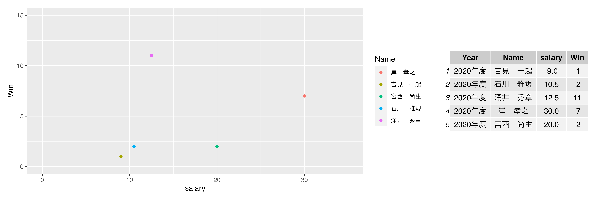
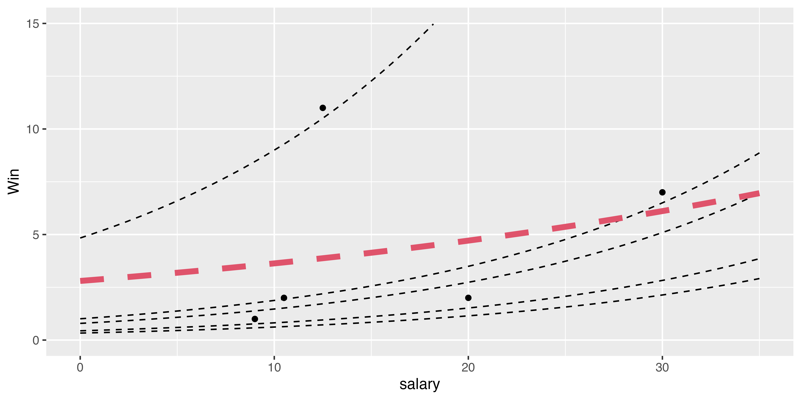
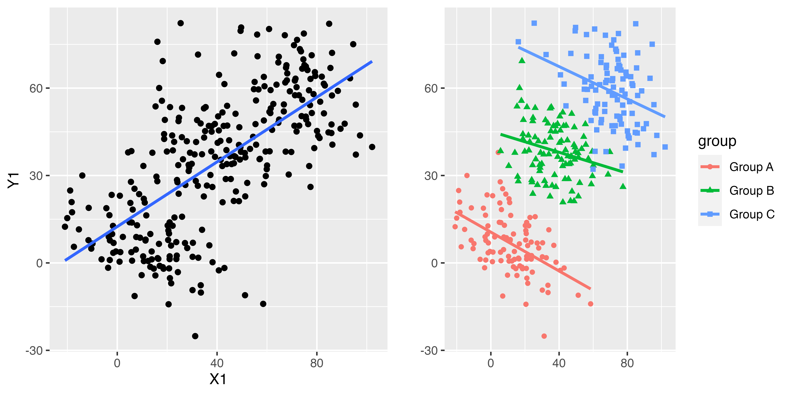
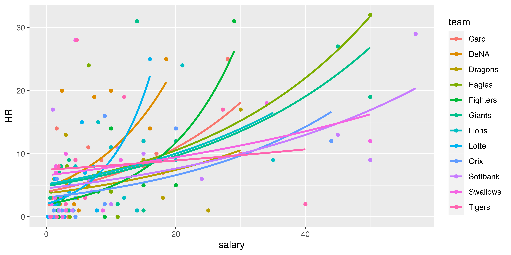
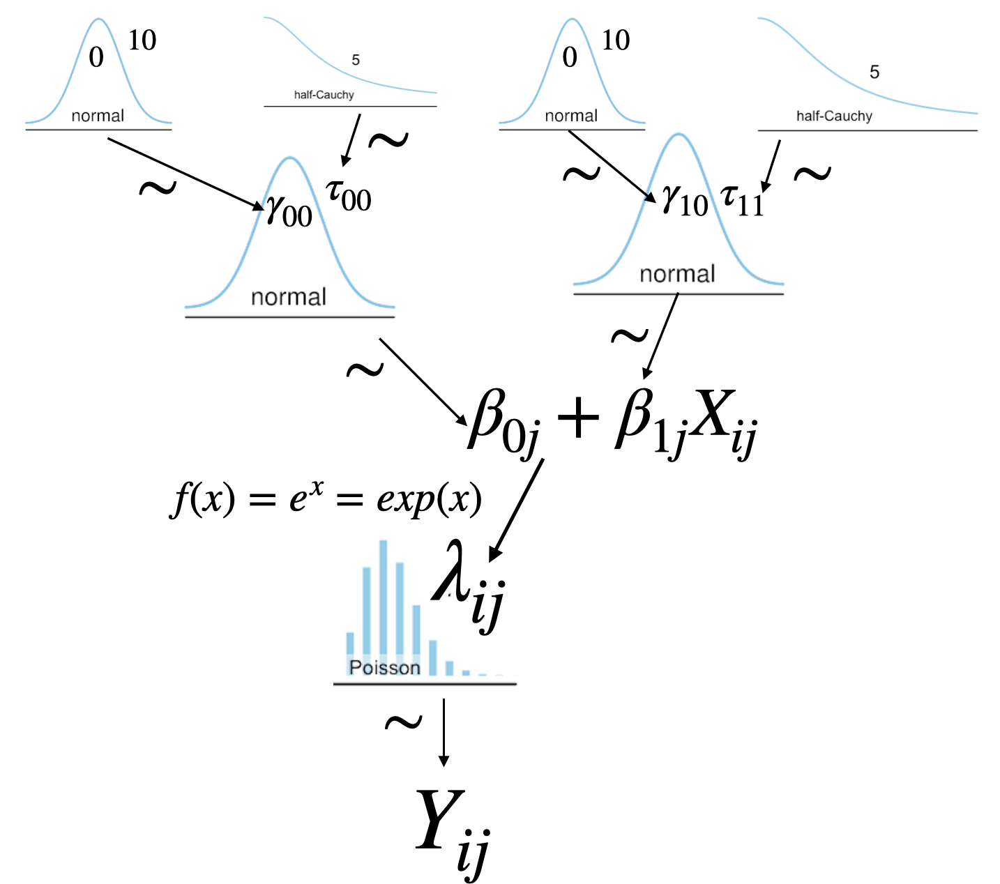

# 階層線形モデル {#chapter25}

前回は**一般線形モデル**から，**一般化線形モデル**へ，すなわち正規分布以外の確率分布を扱えるモデルへと展開しました。今回はさらにモデルを展開し，**一般化線形混合モデル(Generalized
Linear Mixed
Model;GLMM)**へと展開していきます。混合 mixed という言葉があるように，複数の確率分布の混ぜ合わせが含まれることが，GLMM の特徴です。

とはいえ，皆さんは既に第[\[chapter22\]](#chapter22){reference-type="ref"
reference="chapter22"}でこの問題を扱っています。Within 計画・多水準のモデルがそれに当たります。Within 計画のモデルでは，個人差$\mu_i$に効果$\delta_j$が加わるという形でモデルを形成しました。ここで個人差$\mu_i$も正規分布に従うものと考えていました。個人差が従う正規分布，誤差が従う正規分布が混じりあってデータになりますから，これも Mix
されたモデルと考えることができるのです。

ただしこの時は，いずれも正規分布のモデルでした。このモデルを正規分布以外のデータに対応させたい，それが今回のモデルになります。

## 一般化線形混合モデル

線形モデルを正規分布以外のモデルに対応させるためには，確率分布のパラメータの形にあうように**リンク関数(link
function)**で接続してやる必要があるのでした。たとえばベルヌーイ分布の場合，線形モデルは次のような確率の比(**オッズ**)を表すものと考えます。
$$\log\left(\frac{\theta}{1-\theta}\right) =  \beta_0 + \beta_1 X$$
このリンク関数の逆関数を考えてやると，
$$\theta = \frac{1}{1+exp(-(\beta_0+\beta_1 X))}$$
となり，**ロジスティック関数**と呼ばれるこの変換を通じて$0 \le \theta \le 1$の範囲に入るようにしてから，**ベルヌーイ分布**に入れてやるのでしたね。

**リンク関数**と**逆リンク関数**，この違いがちょっとわかりにくいかもしれません。基本となる線形モデルは$\beta_0 + \beta_1 X$ですので[^1]，これが確率分布とセットになる方がリンク関数です。あるいは，線形モデルを変えてしまう方が逆リンク関数だ，と考えてください。

リンク関数の例をもう 1 つ。**ポアソン分布(Poisson
distribution)**という離散分布があります[^2]。これは 0 以上の整数を取る**カウント変数**に使われる関数です。たとえば野球選手のホームランの数，たとえば青年期における親友の数や交際経験の人数，記憶実験で思い出せた単語の数などは，負の数をとることも小数点を持った実数になることもありません。こうした数を数えるような変数が従うのがポアソン分布ですが，これのパラメータ$\lambda$は正の実数です。ということは，線形モデルで算出される値を必ず正の数にしなければなりませんから，逆リンク関数は$\exp$
を使うことになります[^3]。

$$\lambda = \exp(\beta_0 + \beta_1 X)$$
$$\log(\lambda) = \beta_0 + \beta_1X$$

ですから，リンク関数は$\log$になります。

表[1.1](#tbl::25_01){reference-type="ref"
reference="tbl::25_01"}に確率分布，逆リンク関数，リンク関数の関係をまとめました。さらに Stan ではそれぞれの確率分布に加え，リンク関数とセットになった関数が既に用意されています。`transformed parameters`ブロックで逐一変換しなくても，この関数を使うと`model`ブロックで直接線形モデルを書き込むことができますので，便利です。ここで線形モデルで表されるものを$\mu,\theta,\lambda$などさまざまなギリシア文字を使っていますが，このギリシア文字の違いにとくに意味はありません。一般的に正規分布の**位置母数**には$\mu$が，ベルヌーイ分布のそれには$\theta$が，ポアソン分布のそれには$\lambda$が使われることが多く，その慣例に習っただけです。いずれも確率分布の中心的な位置を表す母数であるということだけが重要です。また正規分布のところを見ると，リンク関数も逆リンク関数も同じ形をしていることがわかります。こうした**恒等式**で済んだので複雑なことを考える必要がなかったんですね。

::: {#tbl::25_01}
確率分布 逆リンク関数 リンク関数 Stan の専用関数

---

      正規分布                $\mu = \beta_0 + \beta_1 X$                                 $\beta_0 + \beta_1X=\mu$                           `normal`

ベルヌーイ分布 $\theta = \frac{1}{1+exp(-(\beta_0+\beta_1X))}$ $\beta_0 + \beta_1 X = \log\left(\frac{\theta}{1-\theta}\right)$ `bernoulli_logit`
ポアソン分布 $\lambda = \exp(\beta_0 + \beta_1 X)$ $\beta_0 + \beta_1X = \log(\lambda)$ `poisson_log`

: 確率分布とリンク関数の関係
:::

[\[tbl::25_01\]]{#tbl::25_01 label="tbl::25_01"}

では一般化線形モデルに「個人差」を混合するモデルを考えてみましょう。ここでは前の章でも扱った野球のデータを例に説明します。
図[1.1](#fig:25_01){reference-type="ref"
reference="fig:25_01"}には 2020 年に 5000 万円以上の年俸をもらっている一流選手 5 名の年俸(単位は千万円)と勝利数の関係を表しています。年俸が高いと勝ち星が増える，という関係にあると考えてモデルを組みます。
線形モデルですから，勝ち星を$Y_i$，年俸を$X_i$として$\hat{Y_i} = \beta_0 + \beta_1 X_i$という関係を考えます。とはいえ，2020 年度の関係は図示されていますが，選手の年俸というのはそれまでの業績によるところも大きく，そもそも個人差があり得るところです。そこで個人差$\mu_i$を考えて，$\hat{Y_i} = \beta_0 + \beta_1 X_i + \mu_i$とした線形モデルを考えましょう。また，勝利数は 0 以上の整数しか取りませんから，これはポアソン分布に従うと考えられます。そこでポアソン分布に合わせるために，逆リンク関数を使って$\lambda = \exp(Y_i) = \exp(\beta_0 + \beta_1 X_i + \mu_i)$とした上で，$Y_i \sim poisson(\lambda_i)$という確率モデルに入れることにしましょう。このモデルの設計図は図[1.2](#fig:25_02){reference-type="ref"
reference="fig:25_02"}のようになります。

::: center
{#fig:25_01
height="10cm"}
:::

::: center
{#fig:25_02
width="12cm"}
:::

それではこれをもとに，GLMM をやってみましょう。実行するための Stan のコードはコード[\[stan::25_01\]](#stan::25_01){reference-type="ref"
reference="stan::25_01"}のようになります。

```{#stan::25_01 .c++ language="C++" label="stan::25_01" caption="個人差を含んだポアソン回帰モデル"}
data{
  int L;
  real X[L];
  int Y[L];
}

parameters{
  real beta0;
  real beta1;
  real mu[L];
}

model{
  // model
  for(l in 1:L){
    Y[l] ~ poisson_log(beta0 + (beta1 * X[l]) + mu[l]);
  }
  // prior
  beta0 ~ normal(0,10);
  beta1 ~ normal(0,10);
  mu ~ normal(0,10);
}
```

##### コード解説

data ブロック

: データ長 L と，独立変数 X，従属変数 Y を宣言しています。ポアソン分布に従う確率変数ですので従属変数は`int`型にしてあります。

parameters ブロック

: 線形モデルの係数と個人差$\mu_i$を人数分用意しました。

model ブロック

: モデル尤度のところは`poisson_log`を使っているので，線形のコードをそのまま書き込むことができています。事前分布は正規分布にしました。

これを R で呼び出すコードは Code::[\[code::25_01\]](#code::25_01){reference-type="ref"
reference="code::25_01"}の通りです。少しテクニカルなコードになっていますので自分で書けなくても構いませんが[^4]，各ステップで何をしているか読めるようになっておくといいでしょう[^5]。

```{#code::25_01 .c++ language="c++" label="code::25_01" caption="ポアソン回帰のコード"}
baseball <- read_csv("baseballDecade.csv")

dat <- baseball %>%
  filter(position == "投手") %>%
  filter(salary > 5000) %>%
  group_by(Name) %>%
  nest() %>%
  mutate(
    n = purrr::map_dbl(data, ~ NROW(.)),
    FLG = purrr::map_lgl(data, ~ anyNA(.$Win))
  ) %>%
  filter(n == 10) %>%
  filter(!FLG) %>%
  unnest(data) %>%
  select(Year, Name, salary, Win)

  dat.tmp <- dat %>%
  dplyr::filter(Year == "2020年度") %>%
  mutate(salary = salary / 1000) %>%
  mutate(ID = as.factor(Name)) %>%
  mutate(ID = as.numeric(ID))

dataSet <- list(
  L = NROW(dat.tmp),
  X = dat.tmp$salary,
  Y = dat.tmp$Win,
  idIndex = dat.tmp$ID
)

model_pois <- cmdstanr::cmdstan_model("glm_poisson.stan")
fit <- model_pois$sample(
  data = dataSet,
  chains = 4,
  parallel_chains = 4,
  iter_warmup = 1000,
  iter_sampling = 3000
)
```

##### コード解説

1 行目

: ファイルからデータを読み込みます。このデータファイル`baseballDecade.csv`には野手，投手の 10 年分のデータが入っています。

3-15 行目

: 最初のブロックとして，データの加工・変改を行い，それを`dat`オブジェクトに格納します。

    4行目

    :   フィルターをかけて，投手だけのデータに絞り込みます。

    5行目

    :   サラリーが5000(万円)以上のデータに絞り込みます。

    6行目

    :   選手名でグルーピングします。10年分のデータがあるわけですから，1人につき最大10件のレコードがあります。

    7行目

    :   `nest`関数でグループ化変数に沿ってデータを畳み込みます。引数をとくに指定しなければ，変数は全て`data`という変数名に含まれます。この段階でデータフレームは出力[\[RS:out25_01\]](#RS:out25_01){reference-type="ref"
        reference="RS:out25_01"}のようになっています。`nest`関数のイメージを図[1.3](#fig:25_03){reference-type="ref"
        reference="fig:25_03"}に示しました。

    8行目

    :   畳み込まれたデータセットを使って，そのデータの行数(何年分のデータがあるか[^6])，勝利数情報の欠損値の有無を作る変数[^7]を作っています。

    9行目

    :   フィルターをかけて，データの行数`n`が10のものだけを抜き出します。つまり10年間ずっと登板している一流の選手だけに絞ったのです。

    10行目

    :   フィルターをかけて，欠損値がないデータだけに絞っています。

    11行目

    :   畳み込みを解除します。

    12行目

    :   年度，選手名，年俸，勝利数だけ変数をセレクトして取り出します。

17-21 行目

: このブロックでは Stan で使うためにさらに一時的なデータ加工をし，`dat.tmp`オブジェクトに格納しています。

    18行目

    :   フィルターをかけて2020年度のデータだけにします。

    19行目

    :   年俸のデータは数字が大きいので，1000万円単位にします。分析の際，数字が大きすぎると計算がオーバーフローしてしまうことがありますから，適当な単位にしておくことは実践上の有効なテクニックの1つです。

    20行目

    :   名前の変数は文字型ですが，そのままStanに渡すことはできないので，Factor型にした`ID`という変数に作り替えます。

    21行目

    :   先ほど作った`ID`はFactor型ですが，Stanでは質的な違いを表す数字だけあれば良いので，数字型に変形します。

18-23 行目

: Stan に与えるためのデータセットにするブロックです。

25-32 行目

: cmdstanr でサンプリングするためのコードです。rstan の場合は`sampling`関数を使うことになります。

::: Rscreen
データをグループ化変数でネストする out25_01

    # A tibble: 295 × 2
    # Groups:   Name [295]
       Name       data
       <chr>      <list>
     1 永川　勝浩 <tibble [3 × 16]>
     2 前田　健太 <tibble [5 × 16]>
     3 シュルツ   <tibble [1 × 16]>
     4 大竹　寛   <tibble [8 × 16]>
     5 横山　竜士 <tibble [2 × 16]>
     6 ジオ       <tibble [2 × 16]>
     7 バリントン <tibble [5 × 16]>
     8 藤川　球児 <tibble [7 × 16]>
     9 久保　康友 <tibble [7 × 16]>
    10 小林宏     <tibble [1 × 16]>
    # … with 285 more rows

:::

::: center
{#fig:25_03
width="12cm"}
:::

さて，このコードを実行し，結果からモデルを図にしたのが図[1.4](#fig:25_04){reference-type="ref"
reference="fig:25_04"}です。図中の赤い転線は，$+\mu_i$をおかずに 5 人全体を混ぜ合わせたときのポアソン回帰です。個人差を表す項目を追加することで，より個々のデータに沿った回帰プロットが実践できていることがわかると思います。

::: center
{#fig:25_04
width="12cm"}
:::

今回は個人差$\mu_i$だけを考えましたが，たとえば野球の弾の規定が変わってピッチャーが有利になる年とそうでない年があったとか，登板する球場のサイズによって有利不利がある，といったさまざまな個別事情に対し，それを表す変数の項を付加することで，よりデータの詳細を細かくモデルに組み込んでいくことができます。線形モデルは**線形である**という制限から逃げることはできませんが，確率分布や個別の事情を組み込むことで，より上手く個々のデータの特徴を表現できるようになることが，イメージできたのではないでしょうか。

## ネストされたデータ

さて先ほど，`nest`関数を使ってデータをネストするという例を見ました。

ネストとは「入れ子にする」という意味で，マトリョーシカのようにデータフレームの中のデータフレーム，データフレームの中のデータフレームの中のデータフレーム，というように，同じ形のものを入れていくイメージです。
このネストされたデータは，別名**階層性**を持ったデータだ，ということができます。

たとえば今回の野球データの場合，選手はどこかのチームの一員ですから，チームという上位階層の中に選手がいることになります。野球チームは 12 球団ありますが，それぞれセ・リーグ，パ・リーグに分かれて戦います[^8]。つまりリーグという上位階層があるわけです。

逆に，チーム傘下の選手も，年間 140 試合ぐらいありますから，試合ごとに調子が良かったり悪かったりするでしょう。試合の中でも，野球は 9 回のターン制バトルですから，毎回の活躍というのがあるかもしれません。すなわち，ある選手の中に試合や回がネストされていると考えることもできます。私たちはデータのある側面で区切ってみていることになります。

こうしたデータの階層性は，何も野球選手のデータだけではありません。たとえば調査研究を行う場合，ある小学校でデータをとったというときに，児童は学年でネストされ，学校でネストされ，地区でネストされ，市区町村でネストされ，都道府県でネストされている，ということになります。もちろん 1 つの小学校だけでデータを取るのであれば比較検証はできませんが，ある程度規模が大きくなってくると何らかの階層的な情報を持っていると考えるべきでしょう。

またあるいは，心理学の実験のような少人数からしかデータを得ないという場合であっても，条件 A で n 回試行，条件 B で m 回試行する，といった Within デザインの場合は**反復測定(repeated
measure)**であり，これも被験者ごとに各データがネストされている，と考えることができるわけです。Within データの場合は個人差を考え，GLMM で個人差以外の要因もモデルに組み込むことができるようになったわけですから，データの階層性について考えないわけにはいきません。

何がそんなに問題なのでしょうか。図[1.5](#fig:25_06){reference-type="ref"
reference="fig:25_06"}をみてください。左右にあるのは同じデータの分布ですが，左側は階層の区別をしない場合で，右側はその区別をした場合です。線形回帰の直線を引いておきましたが，これを見ると明らかなように階層性を考えなければ，私たちは正の相関があるデータだと判断してしまうでしょう。しかし右側，群ごとに区別してモデルを書いてみると，回帰直線は全て右下がり，つまり負の相関があるデータだったことがわかります。階層性や群ごとの特徴を無視して分析してしまうと，結果が真逆になってしまう可能性を孕んでいるわけです。

::: center
{#fig:25_06
width="12cm"}
:::

**データは図にする**ことの重要性は何度指摘してもしすぎることはないと思いますが，ことほど左様にデータの持っている性質はなるべく丁寧に見定めなければなりません。そして階層に区分して分析する必要があるのであれば，モデルもそのようにレベルアップさせなければなりません。そこで出てくるのが**階層線形モデル(Hierarichal
Linear Model)**です。

## 階層線形モデル {#階層線形モデル}

**階層線形モデル**は，ネストされたデータに対して群ごとの特徴を記述できるよう，線形モデルを拡張したものです。

野球の例で考えてみましょう。階層化せずにデータを眺めて，「グラウンドにはゼニが落ちてるんだ」とばかりに，たくさん年俸をもらっているバッターはホームランを打つし，ピッチャーは勝利数を稼ぐ，という傾向を分析したいとします。年俸が説明変数で，成績が従属変数になるモデルですね[^9]。しかし，ソフトバンクや読売巨人のように，資本力のある親会社のもとでの球団であればそういう傾向もあるかもしれませんが，広島カープのような市民球団[^10]ではそこまで大盤振る舞いできるほどではないよ，といった球団ごとの差異があるかもしれません。

年俸が成績に影響する，というのが全体的な傾向としてあり，影響の程度は群ごとの特徴が多少入り込む，というこの状況をモデルで表現することを考えましょう。
変数の影響力の大きさは，$\beta_0,\beta_1$などの回帰係数で表現されます。全体的な傾向はこれで表現できるとして，個別の効果はこの係数が群$j$ごとに違っている，ということになります。この群ごとの違いを，群平均からの差異で表現しましょう。

球団$j$に属するプレイヤー$i$の成績を$Y_{ij}$と表現したとします。データ全体としては，$\hat{Y_{ij}} = \beta_{0j} + beta_{1j} X_{ij}$なのですが，ここでたとえば切片$\beta_{0j}$に群$j$ごとの効果があるとすれば，$\beta_{0j} = \gamma_{00} + u_{0j}$のように，切片の平均$\gamma_{00}$と，切片に加わる群の効果$u_{0j}$という，**係数を説明する線形モデル**を想定することと同じです。切片だけでなく傾き$\beta_{1j}$の方も，$\beta_{1} = \gamma_{10} + u_{1j}$と線形モデルで考えましょう。個人差$\u_{.j}$は平均$0$の正規分布に従うと考えます。ここで全体的な傾向，すなわち個人差の平均である$\gamma_{00},\gamma_{10}$のことを**固定効果(Fixed
Effect)**といい，個別の効果$u_{0j},u_{1j}$のことを**変量効果(Random
Effect)**と呼ぶことがあります。

式を整理するとこうなります。 $$\begin{array}{lll}
    \hat{Y_{ij}} &=& \beta_{0j} + \beta_{1j} X_{ij} \\
    \beta_{0j} &=& \gamma_{00} + u_{0j} \\
    \beta_{1j} &=& \gamma_{10} + u_{1j} \\ &&\\
    \begin{pmatrix} u_{0j} \\ u_{1j} \end{pmatrix} &\sim& MN \left( \begin{pmatrix} 0\\0\end{pmatrix},\begin{pmatrix} \tau_{00} & \tau_{01} \\ \tau_{10} & \tau_{11} \end{pmatrix} \right )
\end{array}$$

あらまあ。何だか訳がわからなくなりそうですね。いやもちろん，じっくり考えればお分かりいただけると信じていますが，直感的にわかりにくいかもしれません。そこで同じことを違う角度から説明してみたいと思います。

階層性のあるデータとはいえ，たかだか 12 球団ですから，12 回ぐらいの繰り返し分析は頑張ればできますよね。実際それをやったのが図[1.6](#fig:25_07){reference-type="ref"
reference="fig:25*07"}にあります。えっへん。
この結果を解釈するときは，球団ごとにバラバラの分析をしていることと同じですから，12 球団ごとの切片$\beta*{0j}$と傾き$\beta\_{1j}$が出てきます。ちょっと面倒ですが，データがそういうものなんだから仕方ありません。

::: center
{#fig:25_07
width="12cm"}
:::

でもこれが，12 球団ではなく，100 球団，1000 球団あったらどうしますか。1000 個の切片と傾きをずらーっと数表に並べられても，目が痛くなりますね。辛いだけです。せっかく大量のデータを手に入れているのに，分析結果を細かくみてくれなかったら悲しい。かといって「で，結局どういうことなの」と言われた時に，「えー，第 1 球団の切片と傾きは・・・で，第 2 球団の切片と傾きは・・・で，第 998 球団の切片と傾きは・・・」と読み上げることもないでしょう。ではどうするか。
傾きと切片の平均と SD で報告するんではないでしょうか。傾きの平均はこれぐらいです，球団による違いは$pm$これぐらいでます，といえば，1000 球団の情報を要約して言えることになります。
それが$\u_{0j} \sim N(0,\tau_{0})$や$\u_{1j} \sim N(0,\tau_{1})$が言っていることなんですね。散らばりの平均は$\gamma_{00},\gamma_{10}$であり，それが$\tau_0,\tau_1$ぐらい散らばりますよ，ということです。

これは見方を変えると，階層線形モデルを使う場合は，階層性をまとめる必要があるかどうかを考えてからでも構わないということです。12 球団しかなくて，それぐらいならじっくりみましょうというのであれば，無理に階層モデルにする必要はありません。また 100 球団，1000 球団ある世界であっても，ほとんど球団ごとの違いがないようであれば，全部まとめて分析してしまっても構いません。階層線形モデルで表現する場合は，ネストされているデータに一定の傾向はあるものの，考慮する必要がある程度に散らばりがある場合，ということになります[^11]。

またさらに別の角度から考えてみましょう。今度はこの線形モデルの，設計図を書いてみるのです。図[1.7](#fig:25_08){reference-type="ref"
reference="fig:25_08"}にそれを書いてみました。

::: center
{#fig:25_08
width="12cm"}
:::

図[1.7](#fig:25_08){reference-type="ref"
reference="fig:25*08"}では，話を簡単にするために係数の共分散を想定しない($\tau*{10}=\tau\_{01}=0$)，1 次元正規分布から係数が来ているモデルにしています。
これをみると，

1.  データはポアソン分布からきている；$Y_{ij} = poisson(\lambda_{ij})$

2.  ポアソン分布は線形モデルから逆リンク関数で接続されてきている；$\lambda_{ij} = exp(\beta_{0j}+\beta_{1j}X_{ij})$

3.  線形モデルの切片が別の分布からきている；$\beta_{0j}\sim N(\gamma_{00},\tau_{00})$

4.  線形モデルの傾きも別の分布からきている；$\beta_{1j}\sim N(\gamma_{10},\tau_{11})$

5.  $\gamma_{00}$がどういう数字かわからないので，確率分布(事前分布)でそのわからなさを表現；$\gamma_{00} \sim N(0,10)$

6.  $\gamma_{10}$がどういう数字かわからないので，確率分布でそのわからなさを表現；$\gamma_{10} \sim N(0,10)$

7.  $\tau_{00}$がどういう数字かわからないので，確率分布(事前分布)でそのわからなさを表現。SD なので cauchy 分布にしてみた；$\tau_{00} \sim cauchy(0,5)$

8.  $\tau_{11}$がどういう数字かわからないので，確率分布(事前分布)でそのわからなさを表現。SD なので cauchy 分布にしてみた；$\tau_{11} \sim cauchy(0,5)$

という順番で読み解くことができます。
データに分布を仮定する，これがベイズ推定のスタートでしたが，仮定された分布のパラメータに，線形モデルという数学的**構造**が入っています。このパラメータに数式を入れることを**モデリング(modeling)**というわけです。そしてそのモデルに含まれている未知数(パラメータ)に，さらに別の分布が入っています。分布に分布が入っているから，混合 mix しているわけです。しかもこの混合加減は，上に上にとレベルが上がっていきますので，階層的なモデリングになっています。パラメータのパラメータは，**ハイパーパラメータ(Hyper
parameter)**と呼んだりします。かっこいい。

さて，これをみればわかるように，階層線形モデルは，12 の球団にある違いに正規分布というカバーをかけ，平均とそこからの散らばりという形で表現することでもあります。このように，係数たちに正規分布というカバーを上からかけると，12 球団バラバラで推定した時よりも，その係数が少し小さくなることがあります。上位階層の正規分布の平均値に，少し引っ張られて推定されてしまうわけです。これを係数の**縮小(shrinkage)**と言います。そうした問題はありますが，事前分布や階層性のおかげで，下位レベルの推定値が安定して算出できることにもなります。

さあ設計図が書けたら，もうコードに落とすことはできますね。
ポアソン分布を使った階層線形モデルのコード例を Code::[\[stan::25_02\]](#stan::25_02){reference-type="ref"
reference="stan::25_02"}に挙げておきます。

```{#stan::25_02 .c++ language="C++" label="stan::25_02" caption="階層ポアソン回帰モデル"}
data{
  int L;
  int G;
  int Gindex[L];
  real X[L];
  int Y[L];
}

parameters{
  real beta0[G];
  real beta1[G];
  real gamma0;
  real gamma1;
  real<lower=0> tau0;
  real<lower=0> tau1;
}

transformed parameters{
  real<lower=0> lambda[L];
  for(l in 1:L){
    lambda[l] = exp(beta0[Gindex[l]] + (beta1[Gindex[l]] * X[l]));
  }
}

model{
  // model
  for(l in 1:L){
    Y[l] ~ poisson(lambda[l]);
  }

  for(g in 1:G){
    beta0[g] ~ normal(gamma0,tau0);
    beta1[g] ~ normal(gamma1,tau1);
  }

  //prior
  gamma0 ~ normal(0,10);
  gamma1 ~ normal(0,10);
  tau0 ~ cauchy(0,5);
  tau1 ~ cauchy(0,5);
}
```

##### コード解説

data ブロック

: データは整然データの形で渡します。データの長さ L，説明変数 X，被説明変数 Y の他に，群の数 G，どの群に属するのかを表すインデックス変数 G\[L\]を用意しています。

parameters ブロック

: 群の数だけ係数$\beta_0,\beta_1$が必要です。加えて，これら切片と傾きの平均値$\gamma$と散らばり$\tau$を用意しています。

transformed parameters ブロック

: `poisson_log`を使ってもいいのですが，話をわかりやすくするために一旦$\lambda_{ij}$を作っています。係数`beta0[g]`のグループを表す`g`のところは，L 行目のデータの所属先を表すインデックス，`Gindex[l]`で代入しています。`beta1`についても同様です。

model ブロック

: データの各行は，行ごとの線形モデルで推定されますのでスッキリしたものです。`beta0[g]`や`beta1[g]`はハイパーパラメータを持つ上位の正規分布にカバーされています。パラメータの事前分布は設計図通りです。

これを使って，年俸でホームランの数を予測する階層線形モデルを推定させましょう。結果を出力[\[RS:out25_02\]](#RS:out25_02){reference-type="ref"
reference="RS:out25_02"}に示してあります。

::: Rscreen
ハイパーパラメータの推定値 out25_02

    Varname    EAP    MED    MAP     SD    L95    L50    U50    U95  Rhat
    <chr>    <dbl>  <dbl>  <dbl>  <dbl>  <dbl>  <dbl>  <dbl>  <dbl> <dbl>
    1 gamma0  1.44   1.45   1.44   0.121  1.20   1.37   1.52   1.68    1.00
    2 gamma1  0.0461 0.0458 0.0459 0.0103 0.0264 0.0395 0.0523 0.0679  1.00
    3 tau0    0.368  0.351  0.328  0.113  0.199  0.288  0.427  0.637   1.00
    4 tau1    0.0327 0.0311 0.0287 0.0102 0.0179 0.0257 0.0379 0.0571  1.00

:::

これをみると，12 球団全体で考えると，平均的に年俸が 1000 万上がると$exp(0.0461)=1.047179$，つまり 1 本ホームランが増えるわけですね。ただ年俸の効果は球団ごとの違いがありますから，$\pm1$SD の範囲だと係数は$0.0461+0.0327=0.0788$から$0.0461-0.0327=0.0134$までぶれることがあるようです[^12]。それよりは切片，平均 4000 万ではありますが，2900 万から 6000 万までの差がありますので，やはりどの球団に属するかの方が効果が大きいかなあ，と思ったりもするわけです。

最後にこの結果をプロットしてみました。球団ごとの 50%確信区間も合わせてプロットしてあります。これをみると傾きや切片の球団ごとの違いがイメージしやすくなるかと思います。

::: center
{#fig:25_09
width="12cm"}
:::

今日は分布を混ぜるというところから，線形モデルを階層的に組み上げていくことを説明してみました。数式的には難しいように感じるかもしれませんが，設計図を書いてコードにできれば，分析イメージは掴めるのではないでしょうか。
データがどういうところから出てきて，どういう潜在的な影響があるのか，個人差や群の差はどの程度あるのか，といった状況に応じて，モデルを柔軟にカスタマイズしていくことができます。よりデータに適切なモデルへ，より柔軟で複雑な表現を目指すことは，とてもクリエイティブで楽しいことではありませんか！

## 課題

以下のモデルを分析する R/Stan コードを提出してください。結果の解釈などを，スクリプトのコメントアウトや別添ファイルなどで提供してもらえるとなお良いです。もちろん Rmd ファイルでの提出であれば完璧です。なお提出されたコード単体でバグがなく動くことが確認できないものは，未提出扱いになります。コードの書き方などわからないところがあれば，曜日別 TA か小杉までメールで連絡し，指導を受けてください。

##### 個人差を入れたモデルを考えてみよう

野球のデータで，野手の長打率を年俸で予測するモデルに個人差を入れたモデルを考えてみましょう。今回，長打率は安打数`Hit`のうち，ホームランの本数`HR`から考える割合とします。割合情報の分析ですので，二項分布で表現できます。二項分布の確率$\theta$の線形モデルに個人差を入れ，分析してみましょう。コード[\[stan::25_01\]](#stan::25_01){reference-type="ref"
reference="stan::25_01"}が参考になるはずです。

##### 階層線形モデルのコードを書いてみよう

野球のデータで，年俸でピッチャーの勝利数を予測する階層線形モデルを考えてみましょう。12 球団の平均や，球団ごとの散らばりはどれぐらいになるでしょうか。ピッチャーの勝利数はポアソン分布に従うと考えられますので，コード[\[stan::25_02\]](#stan::25_02){reference-type="ref"
reference="stan::25_02"}が参考になるでしょう。データ加工のコードは伴走サイトで提供しますが，ご自身でコードを書いても一向に構いません。

[^1]:
    より正確に，より一般的にいうと，説明変数は複数あっても構いませんから，$\beta_0 + \beta_1 X_1 + \beta_2 X_2 \cdots \beta_n X_n$と書く方がいいのかもしれませんし，もちろんベクトルを使って$\bm{X\beta}$とすればいいでしょう。この時，係数ベクトル$\bm{\beta}$には切片項$\beta_0$
    も含まれていることを思い出してください。また，説明変数が複数になった場合は，**交互作用(interaction)**項を考えることもありますが，本書では簡略化のために含めずに考えています。

[^2]: 後学のためにきちんと定義式を書いておくと，変数 X が k の値を取る確率を$P(X=k)=\frac{\lambda^l e^{-\lambda}}{k!}$とした分布です。ここで$e$はいつもの**ネイピア数**であり，$k!$の$!$は階乗を表す記号です。
[^3]:
    この関数はよく出てきますから周知のことと思いますが，$exp(x)=e^x$
    でこの$e$もいつものネイピア数です。この関数で x が負の数になっても，$x^{-1}=\frac{1}{x}$という指数計算の決まりがありますから，結果が負になることはありません。

[^4]: コードの書き方は単一の正解というものがありません。ここに書いてあるのは著者流のやり方だというだけであって，同じ結果が出るのであれば別のコードの書き方であっても構いません。今回のこのコードはサイトで配布しています。
[^5]: パイプ演算子`%>%`を使って変換プロセスをつなげて言ってますが，その途中でデータがどのように加工されているか知りたい場合，`%>% print %>%`と`print`関数を挟むといいでしょう。ステップごとのデータの変形プロセスがよくわかると思います。
[^6]: ここで`data`とあるのはまとめられたミニ・データフレーム全体を引数にしています。それに対して`NROW`という関数をあてがうことで行数を数えています。`NROW`関数の引数は`.`ですが，これは`map`関数の第一引数全体を再度参照するときの略記号です。`purrr::map`というのは`purrr`パッケージの`map`関数で，同じ関数操作を繰り返し行うときに使います。
[^7]: `purrr::map`の使い方は先ほどと同じで，`.$Win`は`data$Win`と同じ意味です。`anyNA`は NA があるかどうかを`TRUE/FALSE`で返す関数です。
[^8]:
    セントラル・リーグ Central League とパシフィック・リーグ Pacific
    League の略であり，セ・リーグには巨人(Giants)，阪神(Tigers)，広島東洋カープ(Carp)，中日(Dragons)，ヤクルト(Swallows)，DeNA(Baystars)が含まれます。パ・リーグにはソフトバンク(Hawks)，西武(Lions)，日本ハム(Fighters)，ロッテ(Marines)，オリックス(Buffaloes)，楽天(Eagles)からなります。2021 年現在のチーム名であり，かつては大洋ホエールズとか，阪急ブレーブスとか，南海ホークスなどのチームがありました。

[^9]: ちょっと待って，逆じゃないか，と思った人もいるかもしれません。つまり成績がいいから年俸が高くなるのでは，ということですよね。その場合は，ある年$X$の年俸が翌年$X+1$年の成績を予測する，という形にデータを変えなければなりません。今回は年度ごとの年俸と成績からなるデータセットになっていますから，年俸が成績に影響する，という仮説になっています。
[^10]: 広島カープは戦後復興の名目で公的資金が投入されて作られた球団であり，その意味で市民の資本から作られた球団と言えるでしょう。現在も，特定の親会社はなく複数の企業が連携して運営するスタイルをとっています。
[^11]:
    これも分散分析的発想で，群内の類似性と群間の類似性の比率から，十分に大きな群間変動があるようなら階層モデルにするべき，と判断する基準があります。この比率のことを**級内相関(Intra-Class
    Coefficients)**と言います。詳しくは@清水 201705 を参考にしてください。

[^12]: 傾き$\beta_1$の平均が$\gamma_1$，標準偏差が$\tau_1$であり，それぞれの EAP 推定値を見ています。$\gamma_1$の SD，0.0103 は推定値の振れ幅，すなわち標準誤差ですのでご注意ください。
