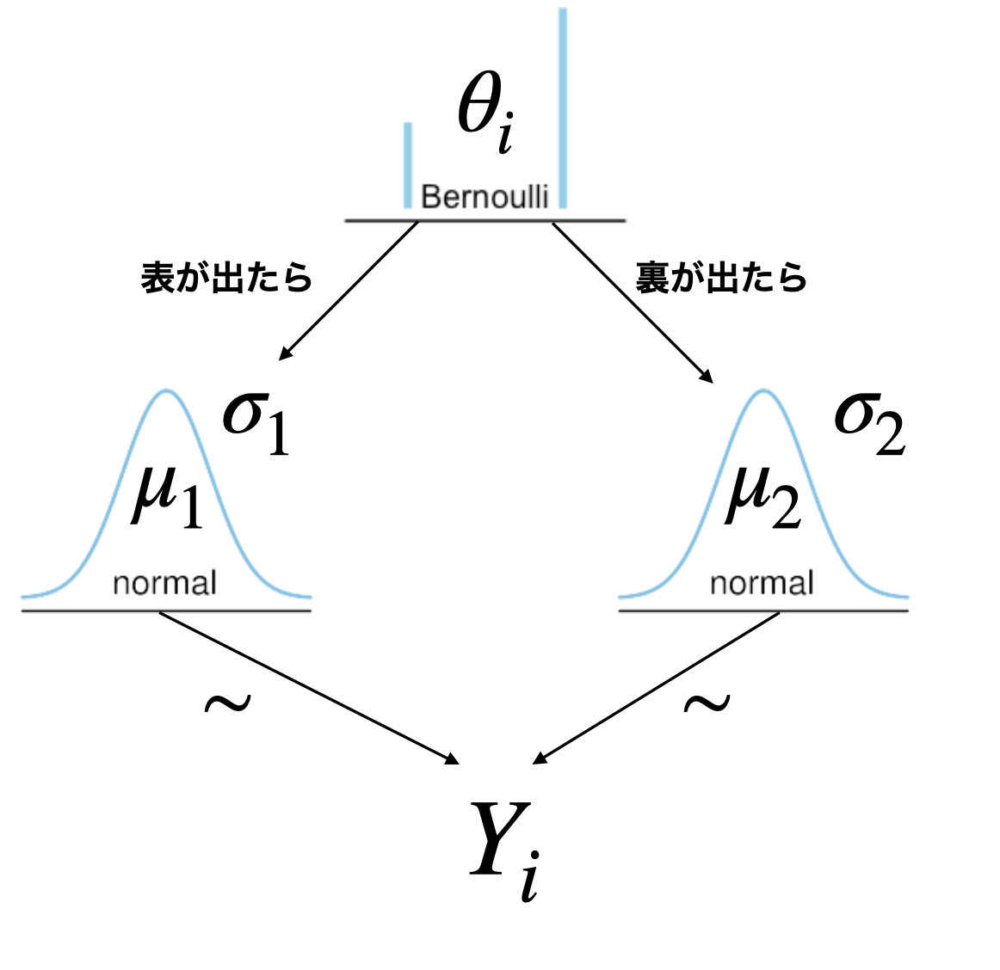
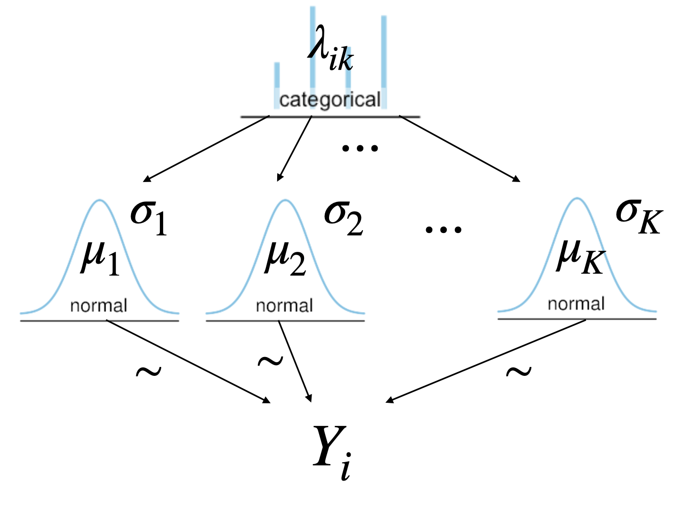
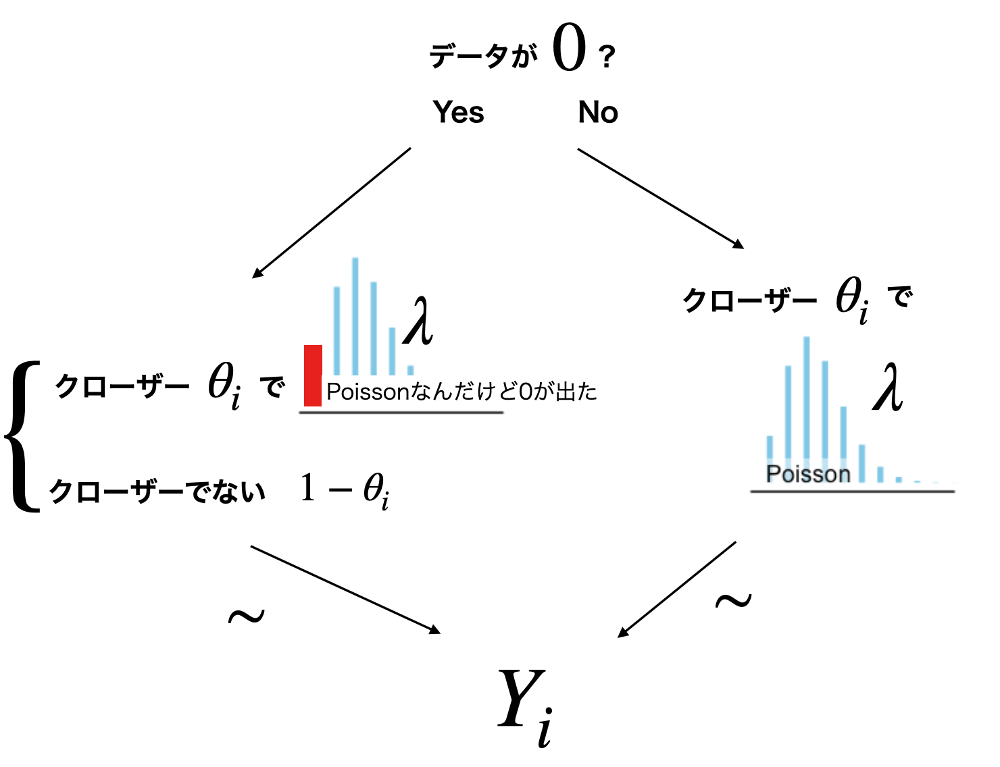
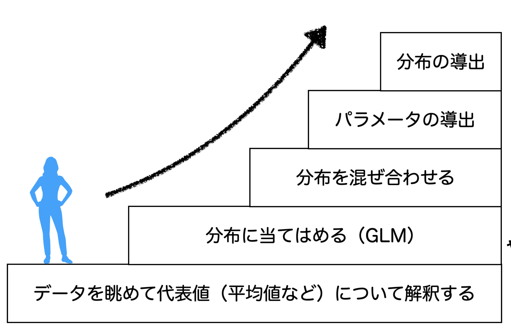

# 混合分布モデル {#chapter26}

さて LM$\to$GLM$\to$GLMM$\to$HLM と，線形モデルを展開させてきました。後半の GLMM や HLM では分布を混ぜるということをしてきたわけですが，今回も分布を混ぜるモデルについて見ていきたいとおもいます。

今回の分布の混ぜ方は，パラメータの構造が複雑化するのではなく，そもそも違うパラメータの分布が混ざり合っているというパターンです。具体的な例から見ていきましょう。

## 混合分布モデル {#混合分布モデル}

図[1.1](#fig:26_01){reference-type="ref"
reference="fig:26_01"}を見てください。これは野球選手データから Tigers の年俸をヒストグラムにしたものです。年俸のデータはそのままだと左に歪んでいるので，対数をとったものを表示しています。

::: center
{#fig:26_01
width="12cm"}
:::

ヒストグラムを見ると，どうも 2 つの山があるように見えますね。赤いラインは密度のカーブを書いたものですが，これはどう見ても 2 つのピークを持っています。
このようなデータに対して，正規分布のモデルを当てはめるのはおかしなことです。**正規分布**はご存知の通りベルカーブ，すなわちピークは 1 つ(単峰)で，両裾になだらかに下がっていくものですから，このデータと違う形になっていることは間違いありません。

赤い密度カーブの方が暗示するように，この分布は 2 つの正規分布が混じり合って出てきているのではないか，と思われます。つまり，出どころや種類の違う分布があるわけです。
これまで分析してきたデータは，基本的に同じ分布からデータが出てきたと考えられてきたわけですが，そうでもない分布の場合はどうするか，という問題です。

こうしたモデルを考えるのが**混合分布モデル**と呼ばれるものです。ここでは複数の正規分布を混ぜ合わせた**正規混合モデル(normal
mixture model)**を扱います。

データが複数の出自を持つという時に，その違いを示す変数が明確なのであれば困ることはありません。たとえば男性と女性で分布が違うとか，東日本と西日本で分布が違うという既有知識があって，それがデータに含まれていれば，その変数でデータセットを分割して階層モデルにすれば良いだけです。しかし今回のように，阪神の選手という意味で同じ種類のメンバーであるはずなのに，データの表れ方が違う場合，「この 2 つの分布に分かれる潜在的な変数は何か」ということを探す必要があります。
言い換えれば，データの表面的な特徴からグルーピングをしなければなりません。これはデータの類似性だけを用いて，外的基準を持たずして分類する，**クラスタリング(Clustering)**という分析方法と関係します。
そこで少し寄り道になりますが，クラスタリングの手法について見ておきましょう。

### クラスタリングいろいろ

クラスタリングという分析方法は，先に述べたように別の変数(外的基準)を使わずに[^1]，データの分類を行う方法です。分類は科学の基本で，まず同じものか違うものか，何が同じで何を違うものと考えるか，ということが全てのスタートになります。クラスタリングではこれをデータから行う必要があり，データの類似性をもとに分類することが基本です。

データの**類似度**あるいは同じことですが**非類似度**を表す指標の基本は**距離(distance)**です。距離と聞くと普通は 2 点間を直線で結んだ**ユークリッド距離(Eucredian
distance)**を想像されると思いますが，実は距離には他にもいろいろな種類があります(詳しくは第[\[chapter15\]](#chapter15){reference-type="ref"
reference="chapter15"},Pp.を参照)。たとえば**相関係数**も絶対値を取ればデータの類似度を表す距離情報の一種と考えることができます。この距離を使って，距離が短い＝類似している＝同じクラスター，という考え方から分類していくことになります。

こうした分類，クラスタリングの手法はいくつかあって，大きく分けると**階層的クラスタリング(hierarchal
clustering)**と**非階層的クラスタリング**の二種類に分かれます。階層的というのは HLM の発想と同じで，クラスターが積み重なっていくようなイメージです。たとえば要素$\{a,b,c,d,e\}$をクラスタリングする時，距離が近いものを使ってまず$\{a\},\{b,c\},\{d,e\}$と分割したとします。次に$\{b,c\}$を 1 つの新しいデータ点だと考えて，$a$と$\{b,c\}$，$\{b,c\}$と$\{d,e\}$の距離を考え，近い方をさらに次のクラスターにまとめます。すなわち$\{a,\{b,c\}\},\{d,e\}$というようにです。それをさらに上位階層でまとめ$\{a,\{b,c\},\{d,e\}\}$と全てが 1 つのクラスターにまとめられたら終わり，とより包括的なクラスターへ，より上位のクラスターへとまとめていくのが階層的クラスタリングという手法です。この方法で分類した例を図[1.2](#fig:26_02){reference-type="ref"
reference="fig:26_02"}に示します。

::: center
{#fig:26_02
width="12cm"}
:::

階層的クラスタリングは，階層が上がる時にクラスター化されたもの同士の距離をどう考えるかによって，いくつかの方法があります。先ほどの例ではまず$\{b,c\}$が 1 つのクラスターになりましたが，これを$A$とすると，$a$と$A$の距離をどう考えるか，がいろいろあるわけです。大文字の$A$の方は，2 つの要素から合成されたもの($A=\{b,c\})$ですから，$a$と$b$の距離を取るのか，$a$と$c$の距離を取るのか，はたまた$b,c$の平均的な値と$a$との距離を取るのか等々，基準が必要なわけです。複数の要素を持つクラスター同士の距離の考え方として，その最大値を取る**最大距離法**，最小値を取る**最小距離法**だけでなく，データの重心を取る**セントロイド法**，平均を取る**平均法**，クラスター内分散とクラスター間分散の差が最小となるように取る**ウォード法(Ward's
method)**などがあります[^2][^3]。最後のウォード法は弁別後の結果がわかりやすいため，よく用いられます。

一方，階層的でないクラスター分析で有名なのが**K-平均法(k-means 法)**です。これは変数間の距離に$k$個の基準点をランダムに置き，その点に近いものをクラスターとします。次に作られたクラスターの重心を新しい基準点として，再度分類します。それの重心を次の基準点とアップデートして再分類$\cdots$と繰り返して，分類結果が変わらなくなる前で何度も反復するのです。だいたい数回の反復で分類できること，データのサイズが大きくても効率よく部類できることからよく利用される方法の 1 つです。最初に幾つのクラスターに分類するか，明確な基準がないことが欠点でしたが，その後のモデルの展開でクラス数の適合度などを算出して適切なクラス数を求めるようになりました。

クラスター分析のもう 1 つの分類基準が，クラスターの境界強度によるものです。**ハードクラスタリング(Hard
clustering)**では，ある個体がどのクラスターに含まれるかがはっきりしています。この個体はクラスター A，この個体はクラスター B，と決められたらそれで決まりです。これに対して**ソフトクラスタリング(Soft
clustering)**は，ある個体がクラスター A に含まれる確率が XX%，クラスター B に含まれる確率が YY%，のように分類が確率的で固定的ではない方法です。

このように，データの特徴から分類をしていくクラスター分析はいろいろな手法があるのですが，今回扱う混合分布モデルはモデルに基づいたクラスタリング，Model
based
clustering とも呼ばれる手法です。すなわち，各個体が潜在的な正規分布のどちらに含まれる可能性があるか，その確率を考えながらソフトに分類していく非階層的な方法になります。

### 混合分布モデルの考え方

混合分布モデルの考え方は，アルクラスターに含まれるかどうかが確率的に決まるというものです。たとえばコイントスをして，表が出たらクラスター A，裏が出たらクラスター B，というように分類するようなものです。コイントスはベルヌーイ分布に下がいますから，確率$\theta$でクラスター A，確率$1-\theta$でクラスター B，と言っていることと同じです(図[1.3](#fig:26_03){reference-type="ref"
reference="fig:26_03"})。

::: center
{#fig:26_03
width="12cm"}
:::

もちろん 3 つ以上のクラスターに分類することもあるでしょう。この場合は**カテゴリカル分布**($\to$PP.を参照)に従う確率変数$z$を考えることになります。

データが K 個の正規分布，いずれかから得られていると考えるとしましょう。ここで各正規分布はそれぞれの位置母数$\mu_k$とスケール母数$\sigma_k$を持っているとします。個々のデータ$i$がどの正規分布からきているかを表す混合確率$\lambda_{ik}$を考えると，$\lambda_{ik} \ge0$で$\sum_{k=1}^K \lambda_{ik} = 1$になります。つまり，$i$ごとの K-simplex ベクトルを考えることになります。
個々のデータ$Y_i$の出自は，$z[i] \sim Categorical(\lambda_{i})$で決まり，データ$Y_i \sim N(\mu_{z[i]},\sigma_{z[i]})$からきている，と考えることになります(図[1.4](#fig:26_04){reference-type="ref"
reference="fig:26_04"})。

::: center
{#fig:26_04
width="12cm"}
:::

データ生成メカニズムの設計図は図[1.3](#fig:26_03){reference-type="ref"
reference="fig:26_03"}，[1.4](#fig:26_04){reference-type="ref"
reference="fig:26_04"}の通りです。具体的なプログラミングに進む前に，イメージをしっかり掴んでおきましょう。
これらの設計図の一番上にある，どのクラスターからデータが出てくるかを確率的に決めるというところがポイントです。ですがこのモデルを実装できるようになれば，データ発生の条件分岐を確率モデルで表現できるようになるのです。
確率$\theta$で左，$1-\theta$で右のルートを取る，というように，データが出てくるメカニズムの背後に潜在的な条件を設定できますから，分析の可能性がグッと広がることになります。
実践的にはたとえばマーケティングにおいて，顧客がどういうクラスター(主婦層，独身者，大家族 etc\...)に属するかはわかりませんが，買い物の傾向から分類するというようなことができます。あるいは心理学的なシーンでも，潜在的に異なる種類(抑うつ傾向があるタイプ，ないタイプなど)が，反応傾向の違いから読み取れるようになるかもしれません。

クラスター分析はデータから分類するので，分類後にそれがどう言った変数と関係しているのか，あるいは分類されたクラスターにはどういう特徴があるのかを探索することが一般的です。それでもデータだけから分類できるのは魅力的な手法であると言っていいでしょう。

## ターゲット記法と周辺化消去

さてこの条件分岐をどのようにコードに書いていくか，というところに話を進めましょう。ここで新しく，2 つの技術を導入する必要があります。1 つはターゲット記法，もう一つは**周辺化消去(marginalizing)**です。

### ターゲット記法

これまで Stan で，確率変数に従う分布の記法は$\sim$を使って表現していました。すなわち，コード[\[stan::26_01\]](#stan::26_01){reference-type="ref"
reference="stan::26_01"}のような書き方です。

```{#stan::26_01 .c++ language="C++" label="stan::26_01" caption="sampling記法"}
for(i in 1:N){
    Y[i] ~ normal(mu,sigma);
}
```

これと同じ動きをする，別の表記方法があります。それが**ターゲット記法**というもので，コード[\[stan::26_02\]](#stan::26_02){reference-type="ref"
reference="stan::26_02"}のように書きます。

```{#stan::26_02 .c++ language="C++" label="stan::26_02" caption="target記法"}
for(i in 1:N){
    target += normal_lpdf( Y[i] | mu, sigma);
}
```

何やら奇妙な書き方に見えますが，順番に見て行きましょう。まず右辺？の`noraml`が`norma_lpdf`になっているところに注目してください。ここで lpdf は log
probability density
function，すなわち対数確率密度関数という意味です。`normal`というのがついていますから，正規分布の対数確率密度関数ということになりますね。ちなみに離散変数の場合は**確率密度(probability
density)**ではなく**確率質量(probability
mass)**になりますから，lpmf，すなわち log probability mass
function(対数確率質量関数)になります。具体的には，`bernoulli_lpmf`とか`poisson_lpmf`となりますので注意してください。

さて対数確率密度関数ってのがなぜ出てきたのでしょうか。ここで**尤度(likelihood)**のことを思い出してほしいのですが，尤度とはデータが確率分布から出てくるときの尤もらしさ，出てきやすさのような指標なのでした。確率分布はパラメータがわかっている時にデータが出てくる確率を記述する関数ですが，同じ関数でパラメータが未知，データが既知の場合(多くの研究シーンはこちらですが)に，それを尤度関数とよぶのでした。データが得られた時の尤度を計算し，その尤度が最も大きくなるところをパラメータの推定値とするのが**最尤推定法(Maximum
likelihood
method)**であり，尤度を使って事後分布を算出，事後分布の形から推定値を考えるのが**ベイズ推定法(Bayesian
inference
method)**なのでしたね。つまり MCMC で計算するにはデータ全体の尤度を考えているのです。そしてデータ全体尤度は各データ点の尤度の総積$\prod$で考える必要がありますが，確率の掛け算は数字が小さくなるので**対数尤度(log-likelihood)**の総和で計算するのでした。

具体的に書くと，データ$\bm{Y}=Y_1,Y_2,Y_3$がパラメータ$\theta$のベルヌーイ分布から出てきている場合，データの尤度は
$$L(\bm{Y}|\theta) = \prod_{i=1}^3 bernoulli(Y_i|\theta) = bernoulli(Y_1|\theta) \times bernoulli(Y_2|\theta ) \times bernoulli(Y_3|\theta)$$
であり，対数尤度は
$$LL(\bm{Y}|\theta) = \sum_{i=1}^3 \log(bernoulli(Y_i|\theta)) = \log(bernoulli(Y_1|\theta))+\log(bernoulli(Y_2|\theta))+\log(bernoulli(Y_3|\theta))$$
となるわけです。ここで$bernoulli(Y|\theta)$の縦棒$\mid$は，$\theta$が与えられた時の$Y$の出る確率，という条件付き確率の記号になります。

プログラミング的には，$Y_1,Y_2,\cdots,Y_n$は`for(i in 1:N){ ~ }`という形で 1 から N までの繰り返し計算を意味しますから，コード[\[stan::26_01\]](#stan::26_01){reference-type="ref"
reference="stan::26_01"}や[\[stan::26_02\]](#stan::26_02){reference-type="ref"
reference="stan::26_02"}でやっていることは，各データ点についての対数尤度を足し合わせて行っている作業そのものを意味しています。

ここでターゲット記法にある`+=`ですが，これはプログラミング独特の表記方法で，数学表記ではありません。プログラミングでは代入を使って，たとえば変数 A に 1 を加えたものを新しい A とする(上書きする)，ということを`A = A + 1`と表記できます。この`+=`はこうした上書きを一言で書く記号で，この A の例だと`A += 1`とすれば 1 を加えて上書き，と同じ意味になります。
これを踏まえてターゲット記法を見ると，`target += normal_lpdf( Y[i] | mu, sigma)`ですから，`target = target + normal_lpdf( Y[i] | mu, sigma)`としていることと同じです。つまり，対数尤度を足しあげて行ってね，ということを明示的に書いていることになります。`target`は足し合わされたもの，というだけで「目標はこれ」を意味するぐらいの予約語だと思ってください。

サンプリング記法とターゲット記法は，書き方が違えど同じ働きをするのですからどちらでもいいじゃないか，と思うかもしれませんが，ターゲット記法でないと表現できないようなことがあるので，このような代替手法が用意されているのだと思ってください。ターゲット記法でないと表現できないようなこと，というのはもちろん今回の，分布を混ぜ合わせる時がそれです[^4]。

### 周辺化消去

さてここまでさまざまな問題を解決してくれた Stan ですが，Stan には離散型のパラメータを扱うことができない，という欠点があります[^5]。
今回は$z[i] \sim Categorical(\lambda_{i})$と，どの目が出たかというパラメータが離散的ですから，このままではコード化できません。ではどうするか。仕方がないので，「起こりうる可能性を全て数え上げて考える」という方法を取ることにします。
最終的な事後分布は対数尤度関数を足し合わせたものになりますから，条件分岐したルート全てについて対数尤度関数を考えて，それを足し合わせてやれば良いのです。

簡単な例として図[1.3](#fig:26_03){reference-type="ref"
reference="fig:26_03"}にあるような，2 つの正規分布モデルを考えてみましょう。コイントスで表が出れば$N(Y_i \mid \mu_1,\sigma_1)$，裏が出れば$N(Y_i \mid \mu_2,\sigma_2)$のルートに行けば良いのです。表が出る確率は$\theta$ですから，表が出るルートを通ってデータ$Y_i$が出てくる確率は$\theta \times N(Y_i\mu_1,\sigma_1)$になります。同じく裏が出るルートを通ってデータが出てくる確率は，$(1-\theta) \times N(Y_i \mid \mu_2,\sigma_2)$ということになります。

ですから，最終的にデータ$Y_i$が出てくる確率は$\theta \times N(Y_i \mid \mu_1,\sigma_1) + (1-\theta) \times N(Y_i\mid\mu_2,\sigma_2)$だ，ということができるわけです。

さて，これらは確率をそのまま使った表現になっていますが，Stan の中では対数で考えるのでした。つまり表が出るルートの対数尤度は
$$\log(\theta) + \log(N(Y_i\mid\mu_1,\sigma_1))$$
ですし，裏が出るルートもまた同様に$\log$をとって考える必要があります。対数を取ると積が和になるので，$\times \to +$に変わっていることに注意してください。

ところがこの表ルート，裏ルートは足し合わせないといけません。対数をとったものを直接足し合わせるわけにはいきませんから，対数尤度をただの尤度に戻す，つまり$\log$の逆関数である$\exp$関数を通す必要があります。ややこしいですが，
$$\exp\left( \log(\theta) + \log(N(Y_i\mid\mu_1,\sigma_1)) \right) + \exp\left( \log(1-\theta) + \log(N(Y_i\mid\mu_2,\sigma_2)) \right)$$
が尤度であり，これの対数をとったものを`target`に加える必要があるのです。

このように，$\exp$を通して，足し合わせ($\sum$)て，さらにその$\log$をとるという作業をひとまとめにした関数が，Stan にはあります。それが`log_sum_exp`関数です。
この関数は，`log_sum_exp(x,y)`とすると$\log(exp(x)+exp(y))$という操作をします。この関数に渡すものがベクトルであれば，

$$\verb|log_sum_exp|\left( \begin{pmatrix} x_1\\x_2\\ \vdots \\ x_n \end{pmatrix} \right) = \log\left(\sum_{i=1}^n exp(x_i) \right)$$
という操作をすることになります。

これを使って混合分布モデルの実装をしていきましょう。

### 混合分布モデルのコード

先ほどの，Tigers における選手の年俸分布を 2 つの正規分布から出てきているもの，と考えてコード化したものは，Code[\[stan::26_03\]](#stan::26_03){reference-type="ref"
reference="stan::26_03"}のようになります。

```{#stan::26_03 .c++ language="C++" label="stan::26_03" caption="混合正規モデル"}
data {
  int<lower=1> K;
  int<lower=1> L;
  real Y[L];
}

parameters {
  simplex[K] theta[L];
  ordered[K] mu;
  real<lower=0> sigma[K];
}

transformed parameters{
  vector[K] lp[L];
  for (l in 1:L) {
    for (k in 1:K) {
      lp[l,k] = log(theta[l,k])+ normal_lpdf(Y[l]|mu[k],sigma[k]);
    }
  }
}

model{
  for(l in 1:L){
    target+=log_sum_exp(lp[l]);
  }
  sigma ~ cauchy(0,5);
  mu ~ normal(0,10);
}

generated quantities{
  vector[K] prob_class[L];
  int<lower=1,upper=K> pred_class[L];
  for(l in 1:L){
    prob_class[l] = softmax(lp[l]);
    pred_class[l] = categorical_rng(prob_class[l]);
  }
}
```

##### コード解説

data ブロック

: クラスター数 K，データ長 L，アウトカム変数 Y を宣言しています。

parameters ブロック

: 合計が 1 になる K の長さを持つベクトルである，`simplex`型ベクトルを，データ数だけ用意します。また，K 個の正規分布からデータが出てきているのですから，平均と標準偏差も K 個用意します。ここで大事なポイントとして，平均$\mu$が`ordered`型としてあるところです。このベクトルは，要素$\mu_1>\mu_2>\cdots>\mu_k$と，要素が大きさの順に並んでいることです。このような制約をかけておかないと，K 個の正規分布がどの位置にあるのか判然としな苦なるという問題が生じます。たとえばあるチェインで$\mu_1>\mu_2$となっていて，データ$X_k$が 1 番目の正規分布から出てきていると考えられたとしましょう。しかし別のチェインで$\mu_1<\mu_2$となっていれば，$X_k$は平均値が大きい方から出てきているのですから，こちらのチェインでは 2 番目の正規分布から出てきたものとして，MCMC サンプルが進むことになります。複数のチェインから得られた MCMC サンプルは最終的に統合されますから，このようになっていると$X_k$は正規分布 1 からも 2 からも同じように出てきていることになります。各チェインでは正しくサンプリングできているのですが，チェインごとに分布のラベルが違うので，統合すると訳がわからなくなる，この問題をとくに**ラベルスイッチング(Label
Switching)**問題といい，混合分布モデルではよく生じる問題なのです。そこで分布の位置母数に順番の制約を入れて，ラベルの変動を止める必要があります。

transformed parameters ブロック

: 長さ K のベクトルをデータの数 L だけ用意した`lp`変数を作りました。これは log-probability の略でこのような名前にしましたが，任意の名前で結構です。l 行目のデータがクラスター k に含まれる可能性は，$\theta_{lk} \times N(Y[l]\mid\mu_k,\sigma_k)$ですから，それの対数をとった形で表現しています。

model ブロック

: モデル尤度のところは，対数$\to$ $\exp$関数で確率の形 $\to$
ベクトルの要素を全て足し合わせる $\to$
$\log$をとって対数尤度にする，という計算をまとめて`log_sum_exp`関数で行い，それを全て`target`に追加していくという方法で書いています。事前分布のところは普通のサンプリング記法で書きました。ちなみに$\mu,\sigma$はそれぞれ K 個ずつありますが，Stan は添字の省略を許してくれます。

generated quantities ブロック

: 久しぶりに生成量ブロックの登場です。ここでは分析結果を使って，l 行目のデータが結局何番目の正規分布から出てきたのかを逆算して出しています。まず，対数尤度で表現されている K 個の要素を持つベクトルを，確率の形に計算したものを`preb_class`変数にしています。ここで使われている`softmax`という関数は，
$$softmax(x) = \frac{exp(x)}{\sum_{k=1}^K exp(x_k)}$$
という計算をするものです。分母はベクトルの総和で分子がその要素ですから，要するに各クラスに入る確率を表すベクトルになっている訳です。これを使って`pred_class`変数を作っています。今回のデータから予想される所属クラスなので，K 面サイコロを振った出目という形で表現します。`categorical_rng`はカテゴリカル分布からの乱数発生で，その発生確率が先ほどの`prob_class`になっているので，この乱数で出た目が予測されるクラスということです。

これを実行するための R コードをコード[\[code::26_01\]](#code::26_01){reference-type="ref"
reference="code::26_01"}に用意しました。

```{#code::26_01 .c++ language="c++" label="code::26_01" caption="混合分布モデルのコード"}
dat <- read_csv("baseballDecade.csv")
dat.tmp <- dat %>%
  filter(position != "投手") %>%
  filter(Games > 50) %>%
  filter(team == "Tigers") %>%
  mutate(salary.log = log(salary)) %>%
  dplyr::select(salary.log, Name) %>%
  rowid_to_column("ID")

dataSet <- list(K = 2, L = NROW(dat.tmp), Y = dat.tmp$salary.log)
model <- cmdstanr::cmdstan_model("latent.stan")
fit <- model$sample(data = dataSet, chains = 4, parallel_chains = 4)
```

##### コード解説

1 行目

: データファイル`baseballDecade.csv`を読み込みます。

2-8 行目

: 分析用のデータに加工しています。

    3行目

    :   フィルターをかけてデータを野手だけのものにします。

    4行目

    :   フィルターをさらにかけて，50試合場出ている選手に限定します。

    5行目

    :   チームがTigersの選手だけに絞っています。

    6行目

    :   年俸のデータは歪んでいるので，対数をとって正規分布の形に近似させました[^6]。

    7行目

    :   使う変数だけに絞っています。

    8行目

    :   行番号を`ID`という変数名にして追加しました

10 行目

: データセットを作っています。

11 行目

: cmdstan でコンパイルしています。rstan パッケージを使う場合は rstan のコンパイル関数を使ってください。

12 行目

: cmdstan のサンプリング関数です。rstan パッケージを使う場合は rstan のサンプリング関数を使ってください。

推定した結果を見てみましょう。私の環境では出力[\[SCrstan:out26_01\]](#SCrstan:out26_01){reference-type="ref"
reference="SCrstan:out26_01"}のようになりました。

::: SCrstan
推定結果 out26_01

        Inference for Stan model: latent-202111261425-1-5e881d.
    4 chains, each with iter=2000; warmup=1000; thin=1;
    post-warmup draws per chain=1000, total post-warmup draws=4000.

             mean se_mean   sd 2.5%  25%  50%  75% 97.5% n_eff Rhat
    mu[1]    7.63    0.00 0.11 7.41 7.55 7.63 7.70  7.84   920    1
    mu[2]    9.71    0.01 0.29 9.16 9.49 9.72 9.97 10.15   453    1
    sigma[1] 0.66    0.00 0.06 0.54 0.61 0.65 0.70  0.79  1706    1
    sigma[2] 0.75    0.01 0.24 0.38 0.53 0.77 0.94  1.19   454    1

:::

対数をとった時の平均値が 7.63 と 9.71 ですから，指数関数を入れて読み直せば$\exp(7.63)=2059.05,\exp(9.71)=16481.6$となります。2000 万円クラスの選手と，1 億 6500 万円クラスの選手の 2 つのグループに分かれることが見て取れますね。
事後予測分布から，所得平均の高い「超一流」選手と「一般的」な選手とに分けて分布を色分けしてみました(図[1.5](#fig:26_10){reference-type="ref"
reference="fig:26_10"})。データから，この選手がどちらのクラスに所属しているかも想像できるところがおもしろいですね。

::: center
{#fig:26_10
width="12cm"}
:::

## ゼロ過剰ポアソン分布モデル {#ZIpoisson}

さて，異なる分布の混ぜ合わせ，離散確率分布による条件分岐の例として，もう 1 つ別の例を示しましょう。次の図[1.6](#fig:26_05){reference-type="ref"
reference="fig:26_05"}を見てください。

::: center
{#fig:26_05
width="12cm"}
:::

これは投手のセーブ数の度数分布です。野球は 9 回のターン制で，1 回の最初から投げる投手は先発投手と言います。先発投手が 9 回まで投げ切れればいいのですが，疲労も溜まるし戦術によっては投手の打席に代打を投入することもあります。投手が降板した場合は，次の投手が代わって続きから投げますが，「勝っている試合で後半まできたので，最後の 1，2 回は確実に勝ち逃げできるようにしたい」というときに投入されるのが抑え(クローザー)と呼ばれる投手です。最近のプロ野球は分業が進んでいますから，先発投手が完投することは少なく，100 球程度で交代し，中継ぎ--抑えと投手リレーしていくのが一般的な戦術です。さて，先発投手は最初から出てきて 6，7 回まで投げますから(途中でボロボロに打たれたり怪我で降板などがなければ，ですが)，毎日のように登板することはなく，一度登板すると 3，4 日休んで次の試合にでる，ということになります。日本プロ野球は年間 140 試合近くありますが，通年で 2-30 回も登板することはありません。一方，抑えの投手は最後の 8，9 回を投げる程度で，しかも負けている試合などでは出番がありません。必然的に中 4 日の休憩なども入りませんから，試合数はたくさん出ることができます。そして抑えに成功するとセーブポイントというのがつきますが，このセーブポイントは優秀なクローザーであれば数十ポイント取ることができる訳です。

さて，図[1.6](#fig:26_05){reference-type="ref"
reference="fig:26_05"}にあるようにこのセーブポイントを見てみますと，ほとんどの投手がゼロになっています。以下データをみますと，1 セーブが 53 人，2 セーブが 26 人・・・となって，20〜40 セーブある投手が 10 人弱ずつぐらいいる，という分布をしています。これは先ほども言った分業制のせいで，先発投手にセーブポイントがつくことはありませんし，先発投手は 1 チームに 10 人弱ぐらいは揃えているでしょうから，投手全体で見るとセーブポイントは 0 の人が多いのです。

このセーブポイント，0 以上の整数を取りますからポアソン分布に従うと考えられるのですが，ポアソン分布のパラメータ$\lambda$をどう変えても(図[1.7](#fig:26_06){reference-type="ref"
reference="fig:26_06"})，こんな形にはなりません。

::: center
{#fig:26_06
width="12cm"}
:::

そこで混合分布です。まずセーブ数が 0 かどうかを考えます。セーブ数 0 というのは，そもそもクローザーではないか，クローザーなのに 0 セーブポイントのへっぽこか，の二択です。セーブ数が 0 でない限り，ポアソン分布からセーブ数が生成される，と考えるのです。設計図のイメージは図[1.8](#fig:26_07){reference-type="ref"
reference="fig:26_07"}の通りです。

::: center
{#fig:26_07
width="12cm"}
:::

このモデルがちょっと特殊なのは，ご覧の通り 0 というデータの値一箇所に極端な偏りがあるところです。この分布のことを**ゼロ過剰ポアソン(Zero-Inflated
Poisson)**といいます。

注意してほしいのですが，ポアソン分布から 0 の度数が出てくることもあり得ます。逆に考えると，データ$Y_i=0$であれば，これはクローザーでないからそうなっているのか，クローザーなのにヘッポコでセーブ数がつかなかったのかのどちらか，という判断をしなければならないということです。つまり，データからの分岐を考えることになります。クローザーかどうかは確率$\theta$で決まるとして，$\theta$ならクローザー，$1-\theta$ならクローザーじゃないとすると，

$$
\left\{ \begin{array}{cc} \mbox{データが0ではない}&\to \theta \times Poisson(Y_i\mid\lambda)\\
                              \mbox{データが0だ}&\to 1-\theta \mbox{ or } \theta \times Poisson(0\mid\lambda) \end{array} \right.
$$

このデータが 0 のときに生成メカニズムが条件分岐していますから，ここに`log_sum_exp`関数を入れる必要があります。
$$\verb|log_sum_exp| \begin{pmatrix} \log(1-\theta) \\ \log(\theta) + \verb|poisson_lpmf|(0\mid\lambda)\end{pmatrix}$$
このことを念頭において，コードを書いてみましょう(コード[\[stan::26_04\]](#stan::26_04){reference-type="ref"
reference="stan::26_04"})。

```{#stan::26_04 .c++ language="C++" label="stan::26_04" caption="ゼロ過剰ポアソン分布"}
data{
  int L;
  int Y[L];
}

parameters{
  real<lower=0,upper=1> theta;
  real<lower=0> lambda;
}

model{
  for(l in 1:L){
    if(Y[l]==0){
      target += log_sum_exp(log(1-theta),log(theta)+poisson_lpmf(0|lambda));
    }else{
      target += log(theta) + poisson_lpmf(Y[l]|lambda);
    }
  }
}
```

##### コード解説

data ブロック

: データ長 L，アウトカム変数 Y を宣言しています。

parameters ブロック

: クローザーかどうかを決める$\theta$と，ポアソン分布のパラメータ$\lambda$がパラメータです。

model ブロック

: データの中で，プログラミング言語としての`if`文による条件分岐が出てきています[^7]。データが 0 であれば，クローザーでないか，ポアソン分布からゼロが出ているかです。そうでなければ，確率$\theta$経由でのポアソン分布です。

これを実行するための R コードはコード[\[code::26_02\]](#code::26_02){reference-type="ref"
reference="code::26_02"}のようになります。

```{#code::26_02 .c++ language="c++" label="code::26_02" caption="ゼロ過剰ポアソンモデルのコード"}
dat.tmp <- dat %>%
  dplyr::filter(position == "投手") %>%
  dplyr::filter(Games > 50) %>%
  dplyr::select(Save)

model <- cmdstan_model("ziPoisson.stan")
dataSet <- list(L = NROW(dat.tmp), Y = dat.tmp$Save)
fit <- model$sample(
  data = dataSet,
  chains = 4,
  parallel_chains = 4
)
```

推定した結果を見てみましょう。私の環境では出力[\[SCcmd:out26_02\]](#SCcmd:out26_02){reference-type="ref"
reference="SCcmd:out26_02"}のようになりました。

::: SCcmd
推定結果 out26_02

    # A tibble: 3 × 10
      variable      mean    median     sd    mad        q5       q95  rhat ess_bulk ess_tail
      <chr>        <dbl>     <dbl>  <dbl>  <dbl>     <dbl>     <dbl> <dbl>    <dbl>    <dbl>
    1 lp__         -2214.    -2214.  1.01   0.682    -2216.    -2213  1.00    2011.    2641.
    2 theta        0.605     0.605   0.0261 0.0262   0.562     0.647  1.00    3434.    2748.
    3 lambda        14.7      14.7   0.260  0.266    14.2      15.1   1.00    3420.    2560.

:::

これを見ると，6 割の確率でクローザー判定され，クローザーであれば$\lambda=14.7$ぐらいのポアソン分布でデータが生成されるということですね。
事後予測分布のように，この確率モデルで出てくるデータを図[1.9](#fig:26_08){reference-type="ref"
reference="fig:26_08"}に示してみました。単一の分布では表現できないモデル化ができているのではないでしょうか。

::: center
{#fig:26_08
width="12cm"}
:::

もっとも，今回は 1，2 回セーブポイントがついている人のところをうまく表現できませんでした。しかしコードを書き換えることで，セーブ数 0 の先発投手と，本職のクローザーに加え，セーブ数が一桁ぐらいの中継ぎ投手の三種類に分割する，ということもできるでしょう。

ここでみた分布の混ぜ方は，たとえば「お店に初来店した人とリピーターの来店数」とか，「20 歳までの恋愛経験の数」のようなデータがあったときに，その特徴から分割してモデルを調整できます。研究のシーンでも，たとえば「質問紙で何も考えずにどちらとも言えないと答える人と，ちゃんと考えてどちらとも言えないに丸をつけた人」というように回答者のバイアスを除去してその特徴を考えるなど[^8]，積極的な分析をできるのです。

さらに言えば，このポアソン分布の$\lambda$に線形モデルを入れて，ゼロ過剰ポアソン回帰分析にすることだってできますね。
たとえばクローザーのセーブ数が年俸によって説明される，というモデルにするなら，コード[\[stan::26_05\]](#stan::26_05){reference-type="ref"
reference="stan::26_05"}のようにすれば良いのです。

```{#stan::26_05 .c++ language="C++" label="stan::26_05" caption="ゼロ過剰ポアソン回帰"}
data{
  int L;
  int Y[L];
  real X[L];
}

parameters{
  real<lower=0,upper=1> theta;
  real beta0;
  real beta1;
}

transformed parameters{
  real<lower=0> lambda[L];
  for(l in 1:L){
    lambda[l] = exp(beta0 + beta1 * X[l]);
  }
}

model{
  for(l in 1:L){
    if(Y[l]==0){
      target += log_sum_exp(log(1-theta),log(theta)+poisson_lpmf(0|lambda[l]));
    }else{
      target += log(theta) + poisson_lpmf(Y[l]|lambda[l]);
    }
  }
}
```

これは一般化線形モデルの応用ですから，ポアソン分布に限らず使える技であることは，すぐにお分かりいただけることと思います。

データの分布や特徴を考えて，それにあった分析モデルを作っていくのは，モデラーとしての階段を一歩登ったことになります。図[1.10](#fig:26_09){reference-type="ref"
reference="fig:26_09"}には統計分析家の成長ステップの模式図を描いてみました[^9]。最初はデータの記述や線形モデルの当てはめなど，得られたデータに振り回されるような形でモデルを作り上げてきましたが，今回のように分布を混ぜ合わせると，さらにその表現力が豊かになることが実感できたのではないでしょうか。図にあるように，確率モデルのパラメータが心理事象の(数学的)記述から導出され，それがデータと合致する可動かで検証するようになれれば，さらにもう一段階研究のレベルが上がることになるでしょう。最終的には，心理学理論の方から新しい確率分布が導出される日が来るかもしれませんね。

::: center
{#fig:26_09
width="12cm"}
:::

## 課題

以下のモデルを分析する R/Stan コードを提出してください。結果の解釈などを，スクリプトのコメントアウトや別添ファイルなどで提供してもらえるとなお良いです。もちろん Rmd ファイルでの提出であれば完璧です。なお提出されたコード単体でバグがなく動くことが確認できないものは，未提出扱いになります。コードの書き方などわからないところがあれば，曜日別 TA か小杉までメールで連絡し，指導を受けてください。

##### 混合分布モデル {#混合分布モデル-1}

今回は阪神 Tigers のデータセットで行ったが，他の球団ではどうだろうか。別の球団データの年俸(対数をとったもの)のヒストグラムを描き，混合分布モデルが適用できそうなものを見つけたら，実際に当てはめて推定してみましょう。

##### ゼロ過剰ポアソン回帰モデル

セーブポイントが年俸で説明できるとしたゼロ過剰ポアソン回帰を実行してみましょう。年俸データは標準化して単位を整えておくと良いでしょう。

[^1]: 機械学習の文脈では，こうした基準となる変数を置かずに分析する手法のことを**教師なし学習**，と呼びます。
[^2]: 厳密に書くと，クラスター P に含まれる要素と重心との距離の二乗和を$E(P)$とすると，二つのクラスター P,Q を併合して作られる新しいクラスター T を考えた時，$E(T)-E(P)-E(Q)$を P,Q の距離と考える方法です。
[^3]: R では標準関数`hclust`で階層的クラスター分析ができ，ウォード法を使うときは`method='ward.D2'`とします。この`.D2`には言われがあって，かつては`ward.D`でウォード法の指定ができたのですが，この関数にバグが含まれていることが判明，修正版を`ward.D2`としたのです。R は無償のフリーソフトウェアですから，バグが含まれているなんてやっぱり使い物にならない！という批判もあるのですが，オープンなソフトウェアであるからこそソースコードが誰にでも見られて指摘することができ，よくなっていくものでもあります。バグがあったこと，それを自浄作用でフィックスしたことを記録するために，`2`を残すことになりました。プロプライエタリな商用ソフトの場合，間違いがあってもこっそり修正して，同じ関数名で提供されてしまえば，ユーザは分析が間違っていたことに気づくことすらできません。科学技術に関するソフトウェアはオープンであるべきだ，という R の思想がここに現れていると言えるでしょう。
[^4]: そのほかにもターゲット記法は，サンプリング記法では省略されている事後対数確率も記録するという特徴があり，ブリッジサンプリングによる事後対数尤度の計算などにはこちらの表記が必要になってきます。もっとも非常に専門的なことなので，ここでは条件分岐の際に必要な記法，と割り切っていただいても構いません。
[^5]: JAGS という確率プログラミング言語でしたら，これは可能です。
[^6]: データを変形させずに確率分布の方で対応するのがよい，と常々話をしてきましたが，ここではデータを変形させています。実は左に歪んだような分布は対数正規分布というのがあり，そこからのデータ生成を考えても良いのですが，対数正規分布はデータの対数が従う正規分布というだけなので，データの方を変えてしまった方が説明しやすいのです。比率や度数など，データの生成メカニズムがそもそも違うばあいは，データを変換せずに使うのが正しいやり方です。
[^7]:
    プログラミングでの条件分岐については第[\[chapter16\]](#chapter16){reference-type="ref"
    reference="chapter16"},Pp.でやりましたね。忘れた人は戻って再確認しましょう。

[^8]: この場合は中点の 3 が多い，というようなケースでしょうから，3 過剰正規分布とでも言えば良いでしょうか。応用例として@shimizu2018 などがあります。
[^9]: この図は東北大学大学院文学研究科の浜田宏先生が，専修大学社会知性開発研究センター主催の研究会(2019.2.26 開催，於専修大学サテライトキャンパス)にてご講演いただいた際の，資料をもとに作図したものです。
